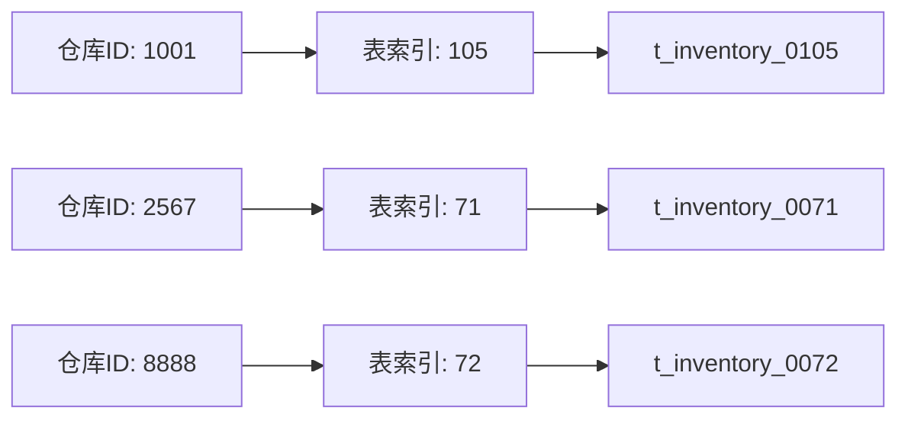
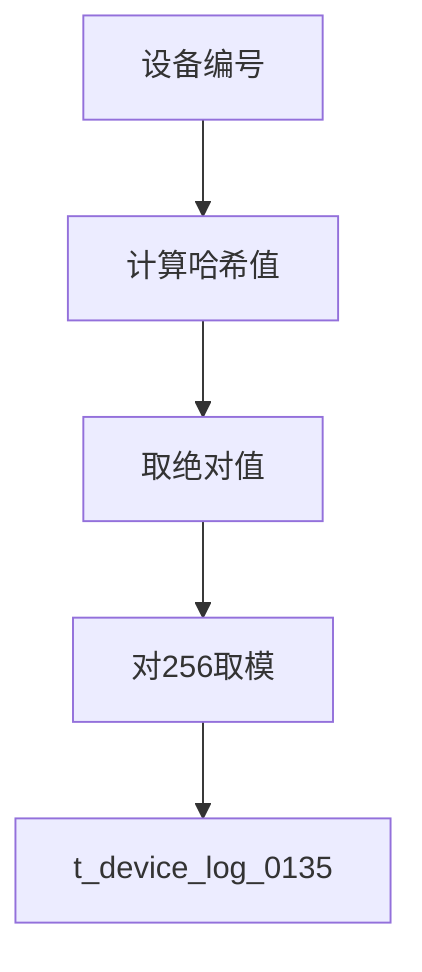
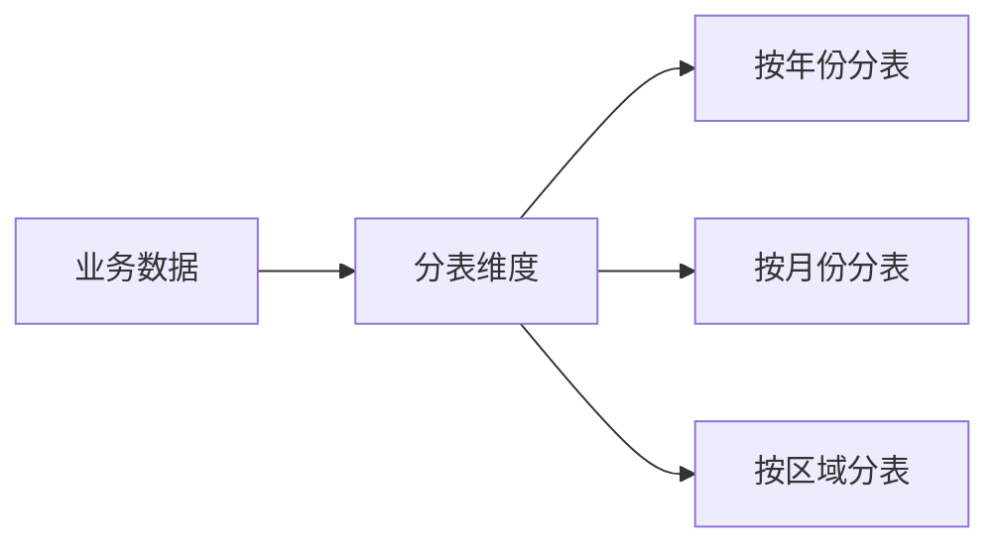
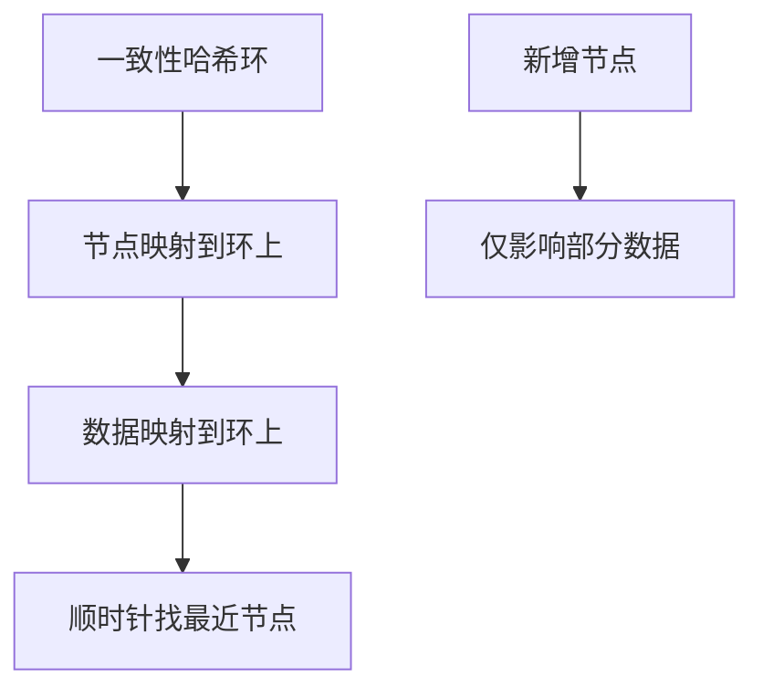
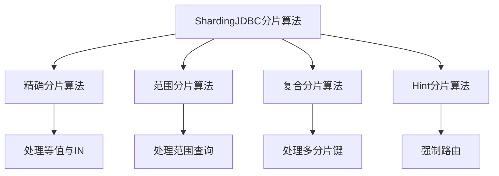
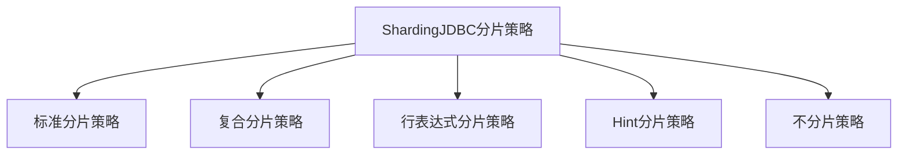
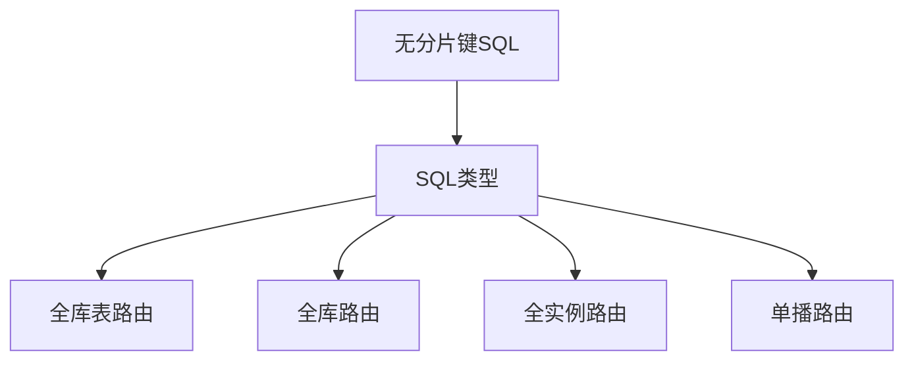

# 分片算法与ShardingJDBC路由策略

## 分表算法核心原则

分表算法的本质是将数据路由到具体的物理表。无论选择何种算法,都必须保证:**同一分表字段值经过算法处理后,结果必须唯一且不可变**。

假设对product表分成128张表,分表结果应为:product_0000、product_0001、product_0002...product_0126、product_0127

## 常见分表算法详解

### 直接取模算法

最简单直接的分表方式,适用于分表字段为整数类型的场景。

**算法原理:**

```java
// 示例:库存记录表分128张表
public String getTableName(Long warehouseId) {
    int tableIndex = (int)(warehouseId % 128);
    return "t_inventory_" + String.format("%04d", tableIndex);
}
```

**适用场景:**

- 分表字段为数值型ID
- 数据分布相对均匀
- 简单高效,计算开销小



### 哈希取模算法

当分表字段为字符串类型时,先计算哈希值,再对分表数取模。

**算法实现:**

```java
// 示例:设备记录表按设备编号分表
public String getTableName(String deviceCode) {
    // 注意:Java hashCode可能返回负数
    int hash = deviceCode.hashCode();
    int tableIndex = Math.abs(hash) % 256;
    
    return "t_device_log_" + String.format("%04d", tableIndex);
}
```

**关键注意点:**

Java的hashCode()方法可能返回负数,需要取绝对值:

```java
// 错误示例
int tableIndex = deviceCode.hashCode() % 256;  // 可能得到负数

// 正确示例
int tableIndex = Math.abs(deviceCode.hashCode()) % 256;
```



### 按关键字分表

根据业务特征字段直接分表,常见于时间维度或地域维度。

**时间维度分表:**

```java
// 示例:日志表按月份分表
public String getTableName(Date logTime) {
    SimpleDateFormat sdf = new SimpleDateFormat("yyyyMM");
    String monthStr = sdf.format(logTime);
    
    return "t_access_log_" + monthStr;
}
```

生成的表名如:t_access_log_202401、t_access_log_202402

**地域维度分表:**

```java
// 示例:门店数据按大区分表
public String getTableName(String regionCode) {
    return "t_store_" + regionCode.toLowerCase();
}
```

生成的表名如:t_store_east、t_store_west、t_store_south



**适用场景:**

- 数据归档需求明确(如按月归档)
- 查询通常带时间范围或地域条件
- 便于数据生命周期管理

### 一致性哈希算法

专门为解决扩容问题设计的算法,能在节点变化时最小化数据迁移量。

**核心思想:**

将哈希值空间组织成一个首尾相接的环(0 ~ 2^32-1),数据和节点都映射到环上,数据顺时针寻找最近节点存储。



**扩容优势:**

假设原有4个节点,扩容到8个节点时:

- 传统取模:几乎所有数据需要重新路由迁移
- 一致性哈希:平均只需迁移50%数据

**代码示例:**

```java
// 简化的一致性哈希实现
public class ConsistentHash {
    private TreeMap<Long, String> ring = new TreeMap<>();
    private int virtualNodes = 150;  // 虚拟节点数
    
    // 添加物理节点
    public void addNode(String nodeName) {
        for (int i = 0; i < virtualNodes; i++) {
            String virtualNodeName = nodeName + "#" + i;
            long hash = hash(virtualNodeName);
            ring.put(hash, nodeName);
        }
    }
    
    // 获取数据应该路由的节点
    public String getNode(String key) {
        long hash = hash(key);
        Map.Entry<Long, String> entry = ring.ceilingEntry(hash);
        
        // 如果没有找到,返回环上第一个节点
        if (entry == null) {
            entry = ring.firstEntry();
        }
        
        return entry.getValue();
    }
    
    private long hash(String key) {
        return MurmurHash.hash64(key);
    }
}
```

## ShardingJDBC分片策略

ShardingJDBC将分片策略抽象为"分片算法 + 分片键"的组合,提供了丰富的内置支持。

### 四种分片算法



#### 精确分片算法

处理SQL中的等值查询(=)和IN查询。

```java
// 实现精确分片算法
public class ProductPreciseShardingAlgorithm implements PreciseShardingAlgorithm<Long> {
    
    @Override
    public String doSharding(Collection<String> availableTargetNames, 
                            PreciseShardingValue<Long> shardingValue) {
        Long productId = shardingValue.getValue();
        int tableIndex = (int)(productId % 128);
        
        String targetTable = "t_product_" + String.format("%04d", tableIndex);
        
        if (availableTargetNames.contains(targetTable)) {
            return targetTable;
        }
        
        throw new IllegalArgumentException("Table not found: " + targetTable);
    }
}
```

#### 范围分片算法

处理SQL中的范围查询（BETWEEN AND、`>`、`<`等）。

```java
// 实现范围分片算法
public class ProductRangeShardingAlgorithm implements RangeShardingAlgorithm<Long> {
    
    @Override
    public Collection<String> doSharding(Collection<String> availableTargetNames,
                                        RangeShardingValue<Long> shardingValue) {
        Range<Long> range = shardingValue.getValueRange();
        Set<String> result = new HashSet<>();
        
        // 根据范围计算涉及的表
        Long lowerBound = range.lowerEndpoint();
        Long upperBound = range.upperEndpoint();
        
        for (long id = lowerBound; id <= upperBound; id++) {
            int tableIndex = (int)(id % 128);
            String tableName = "t_product_" + String.format("%04d", tableIndex);
            result.add(tableName);
        }
        
        return result;
    }
}
```

#### 复合分片算法

支持多个分片键的复杂场景,应用开发者需自行处理多键之间的逻辑关系。

```java
// 复合分片:同时基于产品ID和仓库ID
public class ProductWarehouseComplexShardingAlgorithm 
        implements ComplexKeysShardingAlgorithm<Long> {
    
    @Override
    public Collection<String> doSharding(Collection<String> availableTargetNames,
                                        ComplexKeysShardingValue<Long> shardingValue) {
        
        Collection<Long> productIds = shardingValue.getColumnNameAndShardingValuesMap()
                                                    .get("product_id");
        Collection<Long> warehouseIds = shardingValue.getColumnNameAndShardingValuesMap()
                                                      .get("warehouse_id");
        
        Set<String> result = new HashSet<>();
        
        // 自定义复合逻辑
        for (Long productId : productIds) {
            for (Long warehouseId : warehouseIds) {
                long combinedKey = productId ^ warehouseId;  // 异或组合
                int tableIndex = (int)(combinedKey % 256);
                result.add("t_inventory_" + String.format("%04d", tableIndex));
            }
        }
        
        return result;
    }
}
```

#### Hint分片算法

通过编程方式强制指定路由目标,绕过SQL解析。

```java
// Hint分片使用示例
HintManager hintManager = HintManager.getInstance();

// 强制路由到指定表
hintManager.addTableShardingValue("t_product", 15);

// 执行查询,将路由到 t_product_0015
List<Product> products = productMapper.queryByCondition(condition);

hintManager.close();
```

### 五种分片策略



#### 标准分片策略

单分片键,支持=、IN、BETWEEN AND操作。

**配置示例:**

```yaml
spring:
  shardingsphere:
    rules:
      sharding:
        tables:
          t_product:
            actual-data-nodes: db0.t_product_$->{0..127}
            table-strategy:
              standard:
                sharding-column: product_id
                sharding-algorithm-name: product-inline
        sharding-algorithms:
          product-inline:
            type: INLINE
            props:
              algorithm-expression: t_product_$->{product_id % 128}
```

#### 行表达式分片策略

**最常用的策略**,通过Groovy表达式配置,无需编写Java代码。

**配置示例:**

```yaml
# 库存表按仓库ID模8分表
sharding-algorithms:
  inventory-inline:
    type: INLINE
    props:
      algorithm-expression: t_inventory_$->{warehouse_id % 8}
```

表达式`t_inventory_$->{warehouse_id % 8}`会生成:t_inventory_0 到 t_inventory_7

**适用场景:**

- 简单的取模分表
- 快速配置,维护成本低

#### 复合分片策略

**项目中使用频率高**,支持多分片键场景。

**应用场景:**基因法中同时使用业务ID和订单号分片

```java
// 配置复合分片
@Bean
public ShardingRuleConfiguration shardingRuleConfig() {
    ShardingRuleConfiguration config = new ShardingRuleConfiguration();
    
    ShardingTableRuleConfiguration tableConfig = 
        new ShardingTableRuleConfiguration("t_order", "db0.t_order_$->{0..255}");
    
    // 复合分片策略
    ComplexShardingStrategyConfiguration strategyConfig = 
        new ComplexShardingStrategyConfiguration("order_id,customer_id", "orderComplexAlgorithm");
    
    tableConfig.setTableShardingStrategy(strategyConfig);
    config.getTableRuleConfigs().add(tableConfig);
    
    return config;
}
```

#### Hint分片策略

需要明确指定物理表时使用,场景包括:

- 数据修复,直接操作某个物理表
- 性能优化,已知数据位置时跳过路由计算
- 灰度验证,指定部分表执行新逻辑

## 避免数据倾斜的分片设计

### 选择高散列性分片键

前文已详细讨论,核心是选择数据分布均匀的字段。

### 复合分片

对可能产生热点的字段,叠加时间或其他维度二次分散:

```java
// 针对热点客户的复合分片
public int calculateShard(Long customerId, CustomerType type, Date createTime) {
    
    if (type == CustomerType.VIP && isHotCustomer(customerId)) {
        // VIP大客户:叠加日期分片
        long dateFactor = DateUtils.truncate(createTime, Calendar.DAY_OF_MONTH).getTime();
        return (int)((customerId + dateFactor) % 512);
    } else {
        // 普通客户:仅基于ID
        return (int)(customerId % 512);
    }
}
```

### 虚拟分片

在物理分片基础上增加虚拟层,平滑数据分布:

```java
// 虚拟分片配置
private static final int VIRTUAL_SHARDS = 1000;
private static final int PHYSICAL_SHARDS = 128;

public String getPhysicalTable(Long recordId) {
    // 虚拟分片
    int virtualShard = (int)(recordId % VIRTUAL_SHARDS);
    
    // 映射到物理分片
    int physicalShard = virtualShard % PHYSICAL_SHARDS;
    
    return "t_record_" + String.format("%04d", physicalShard);
}
```

即使某些ID段密集,经过虚拟分片也能较均匀分布。

## ShardingJDBC无分片键查询

当SQL不包含分片键时,ShardingJDBC如何处理?

### 广播路由机制

ShardingJDBC的路由引擎会根据SQL类型采用不同广播策略:



### DML全库表路由示例

逻辑表t_order对应物理表:t_order_00, t_order_01, t_order_02, t_order_03

执行SQL:

```sql
SELECT * FROM t_order WHERE customer_name = 'Alice';
```

实际执行:

```sql
SELECT * FROM t_order_00 WHERE customer_name = 'Alice'
UNION ALL
SELECT * FROM t_order_01 WHERE customer_name = 'Alice'
UNION ALL
SELECT * FROM t_order_02 WHERE customer_name = 'Alice'
UNION ALL
SELECT * FROM t_order_03 WHERE customer_name = 'Alice'
```

**性能影响:**

- 需要扫描所有物理表
- 网络开销和计算资源消耗大
- 应尽量避免生产环境使用

**解决方案:**

1. 查询条件必须包含分片键
2. 非分片键查询转移到ES等搜索引擎
3. 建立冗余的多维度分表
