# 分布式数据库核心原理与选型实践

## 分布式数据库概述

当业务数据量达到亿级甚至更高规模时，传统的关系型数据库往往难以满足性能和扩展性需求。分布式数据库（也称为NewSQL）应运而生，它在保留SQL接口的同时，提供了分布式系统的高可用和水平扩展能力。

### 主流分布式数据库产品

目前业界主流的分布式数据库产品主要包括：

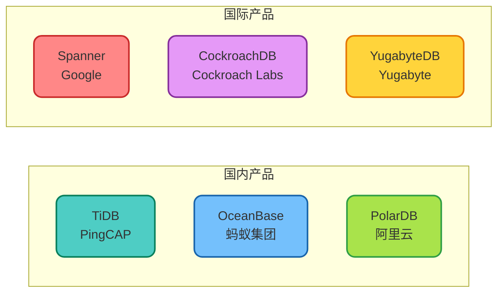

这些产品各有特色，但核心目标一致：在保证数据一致性的前提下，提供近乎无限的水平扩展能力。

## 分布式数据库的核心优势

### 性能表现对比

分布式数据库在不同数据规模下的性能表现有所差异：

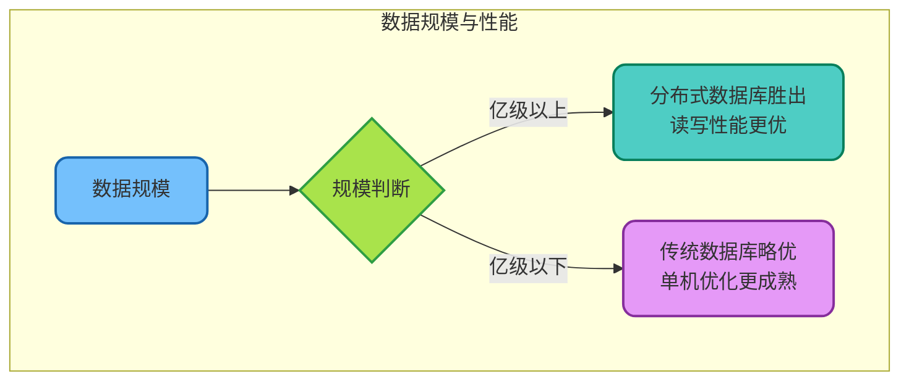

**关键性能指标：**

| 指标 | 传统数据库（MySQL） | 分布式数据库（TiDB） |
|------|-------------------|---------------------|
| 单表容量 | 建议2000万以内 | 无明显上限 |
| 写入TPS | 数千级别 | 数万级别（可水平扩展） |
| 读取QPS | 数万级别 | 数十万级别（可水平扩展） |
| 响应延迟 | 毫秒级 | 毫秒级（略高于单机） |

### 高可用与容错能力

分布式数据库通过多副本机制保障数据安全：

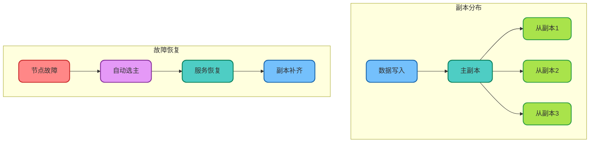

**容错机制的核心要点：**

- **多副本冗余**：数据默认存储3份，分布在不同机器甚至机房
- **自动故障转移**：节点故障时自动进行主从切换，无需人工介入
- **数据自愈能力**：故障恢复后自动补齐缺失的副本数据

### 水平扩展能力

分布式数据库的核心特性在于近乎线性的水平扩展能力：

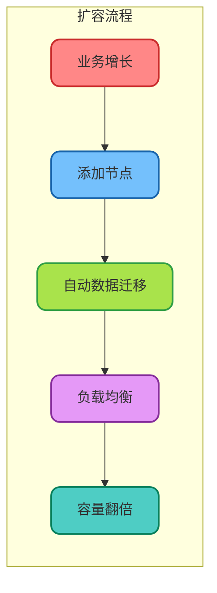

以电商促销场景为例，展示扩容的业务价值：

```java
/**
 * 电商大促场景下的容量规划示例
 * 展示分布式数据库的弹性扩展能力
 */
public class CapacityPlanningExample {
    
    // 日常运营配置：3节点集群
    private static final int NORMAL_NODES = 3;
    private static final int NORMAL_TPS = 10000;
    
    // 大促期间配置：9节点集群
    private static final int PEAK_NODES = 9;
    private static final int PEAK_TPS = 30000;
    
    /**
     * 计算扩容后的理论吞吐量
     */
    public int calculateCapacity(int nodeCount) {
        // 分布式数据库近乎线性扩展
        // 扩展效率约为85%~95%
        double scaleFactor = 0.9;
        return (int) (NORMAL_TPS * (nodeCount / (double) NORMAL_NODES) * scaleFactor);
    }
    
    /**
     * 大促扩容决策
     */
    public void scaleForPromotion(double expectedTrafficMultiplier) {
        int requiredTps = (int) (NORMAL_TPS * expectedTrafficMultiplier);
        int requiredNodes = (int) Math.ceil(requiredTps / (NORMAL_TPS / (double) NORMAL_NODES));
        
        System.out.printf("预期流量倍数: %.1f, 需要节点数: %d%n", 
            expectedTrafficMultiplier, requiredNodes);
    }
}
```

## 传统数据库的扩展困境

在深入了解分布式数据库之前，有必要理解传统数据库面临的扩展瓶颈。

### MySQL的应对策略与局限

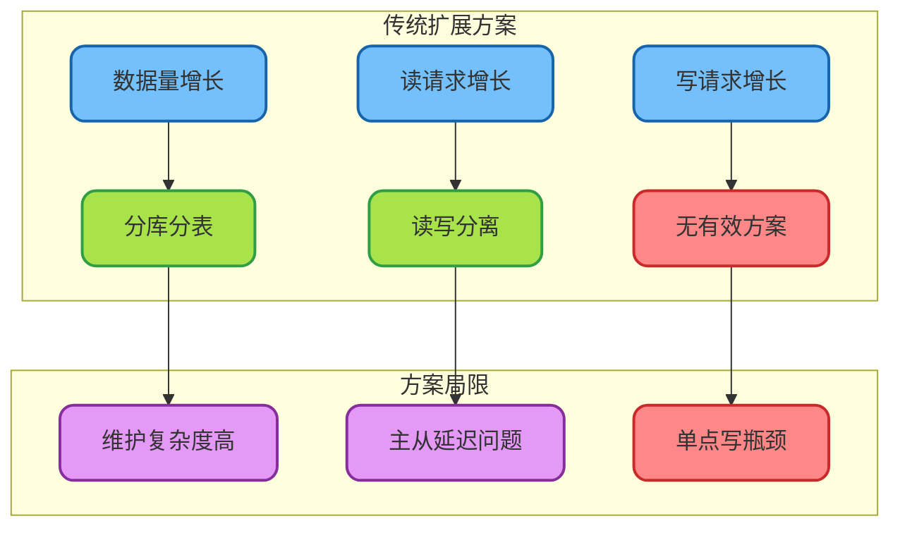

### 读写分离的隐患

读写分离虽能提升读性能，但存在以下问题：

```java
/**
 * 读写分离场景下的数据一致性问题示例
 * 以物流系统订单状态查询为例
 */
@Service
public class LogisticsOrderService {
    
    @Autowired
    private OrderRepository orderRepository;
    
    /**
     * 更新订单物流状态（写主库）
     */
    @Transactional
    public void updateDeliveryStatus(Long orderId, String status) {
        orderRepository.updateStatus(orderId, status);
        // 写入主库成功
    }
    
    /**
     * 查询订单状态（读从库）
     * 存在主从延迟导致的数据不一致问题
     */
    public String queryOrderStatus(Long orderId) {
        // 从库可能还未同步最新数据
        // 导致用户看到的状态与实际不符
        return orderRepository.findStatusById(orderId);
    }
    
    /**
     * 强制读主库方案（牺牲读扩展能力）
     */
    @Master // 强制路由到主库
    public String queryOrderStatusFromMaster(Long orderId) {
        return orderRepository.findStatusById(orderId);
    }
}
```

**读写分离的主要痛点：**

1. **主从复制延迟**：写后立即读可能读到旧数据，需要强制读主库
2. **架构感知成本**：应用层需要感知主从拓扑，增加开发复杂度
3. **主从切换成本**：需要额外的高可用组件管理主从切换
4. **写入瓶颈不变**：从库只能分摊读压力，写入TPS受限于单机

## 分布式数据库的技术架构

以TiDB为代表，解析分布式数据库的核心架构设计。

### 整体架构

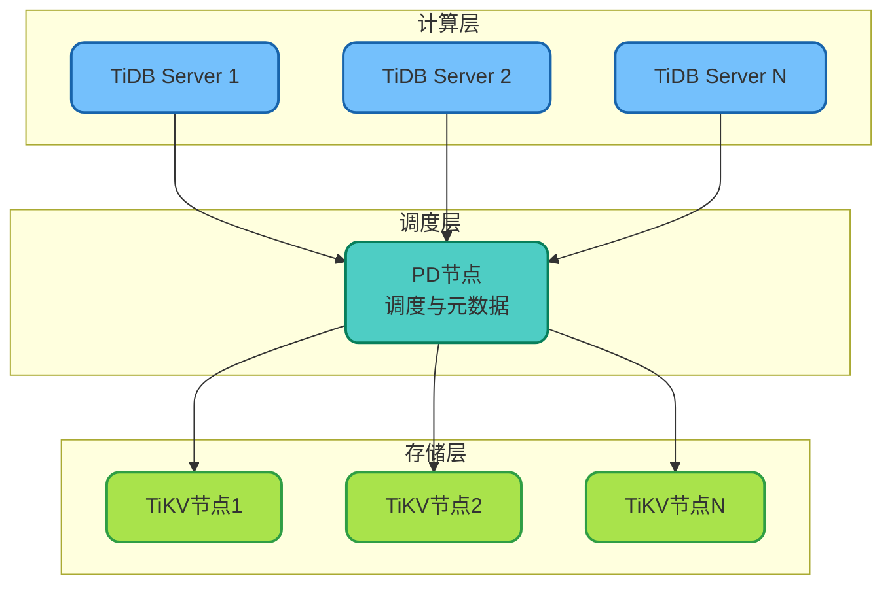

**各组件职责：**

| 组件 | 职责 | 特点 |
|------|------|------|
| TiDB Server | SQL解析、执行计划生成 | 无状态，可水平扩展 |
| PD节点 | 集群调度、时间戳分配 | 核心控制面，Raft保障高可用 |
| TiKV节点 | 数据存储、事务处理 | 基于LSM树，支持MVCC |

### 数据分片机制

分布式数据库采用自动分片策略管理海量数据：

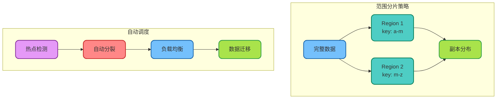

**分片管理的核心能力：**

- **自动分裂**：当Region数据量超过阈值时自动分裂为多个小Region
- **热点迁移**：检测到热点数据后自动迁移，避免单节点过载
- **负载均衡**：保证各节点数据分布均匀，充分利用集群资源

### 分布式时钟与事务

分布式环境下的时间同步是保障事务正确性的关键：

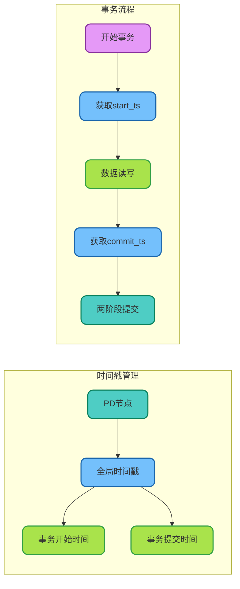

不同产品采用不同的时钟方案：

| 产品 | 时钟方案 | 特点 |
|------|---------|------|
| TiDB | 中心化时间戳服务（PD） | 实现简单，单点压力大 |
| Spanner | TrueTime（原子钟） | 硬件保障，精度极高 |
| CockroachDB | 混合逻辑时钟（HLC） | 无中心化依赖 |

## HTAP：混合事务分析处理

现代分布式数据库普遍支持HTAP（Hybrid Transactional/Analytical Processing），在同一套系统中同时支持事务处理和分析查询。

### OLTP与OLAP的融合

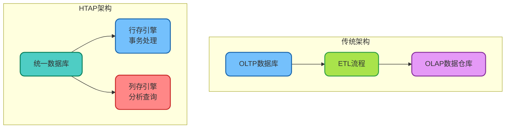

**HTAP的业务价值：**

以连锁零售门店分析为例：

```java
/**
 * HTAP场景下的实时分析示例
 * 连锁零售门店销售分析
 */
@Service
public class RetailAnalyticsService {
    
    @Autowired
    private JdbcTemplate jdbcTemplate;
    
    /**
     * 实时销售数据写入（OLTP）
     */
    @Transactional
    public void recordSale(SaleRecord record) {
        String sql = "INSERT INTO sales (store_id, product_id, quantity, amount, sale_time) " +
                     "VALUES (?, ?, ?, ?, ?)";
        jdbcTemplate.update(sql, record.getStoreId(), record.getProductId(), 
            record.getQuantity(), record.getAmount(), record.getSaleTime());
    }
    
    /**
     * 实时销售分析（OLAP）
     * 无需ETL，直接在事务数据上进行分析
     */
    public List<StorePerformance> analyzeStorePerformance(LocalDate date) {
        String sql = """
            SELECT 
                store_id,
                COUNT(*) as transaction_count,
                SUM(amount) as total_revenue,
                AVG(amount) as avg_transaction
            FROM sales
            WHERE DATE(sale_time) = ?
            GROUP BY store_id
            ORDER BY total_revenue DESC
            """;
        return jdbcTemplate.query(sql, new StorePerformanceMapper(), date);
    }
    
    /**
     * 商品销售趋势分析
     */
    public List<ProductTrend> getProductTrend(Long productId, int days) {
        String sql = """
            SELECT 
                DATE(sale_time) as sale_date,
                SUM(quantity) as daily_quantity,
                SUM(amount) as daily_revenue
            FROM sales
            WHERE product_id = ?
              AND sale_time >= DATE_SUB(NOW(), INTERVAL ? DAY)
            GROUP BY DATE(sale_time)
            ORDER BY sale_date
            """;
        return jdbcTemplate.query(sql, new ProductTrendMapper(), productId, days);
    }
}
```

## 分布式数据库的局限性

尽管分布式数据库优势明显，但在某些场景下仍存在不足。

### 事务隔离级别的权衡

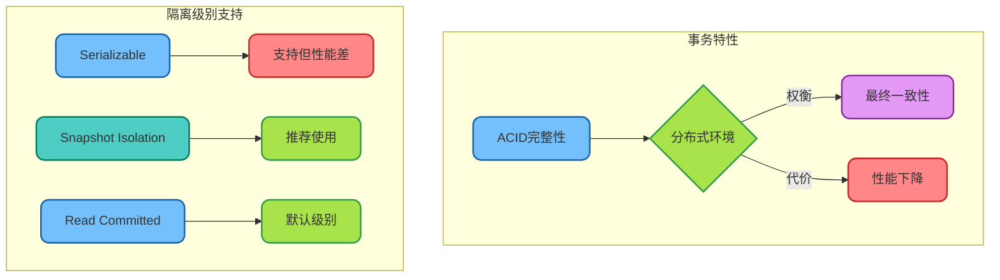

### 主要局限性总结

| 局限性 | 详细说明 | 应对策略 |
|--------|---------|---------|
| 部署成本高 | 最小集群需要3-5台机器 | 小型项目继续使用单机数据库 |
| 自增ID不连续 | 分布式环境无法保证连续 | 使用业务无关的分布式ID |
| 复杂SQL支持有限 | 部分MySQL特有语法不支持 | 预先进行兼容性测试 |
| 延迟略高 | 跨节点协调增加延迟 | 对延迟敏感场景需评估 |

### 生产环境的注意事项

```java
/**
 * 分布式数据库使用注意事项示例
 * 以库存扣减场景为例
 */
@Service
public class InventoryService {
    
    /**
     * 库存扣减 - 需要注意事务超时设置
     * 分布式事务可能比单机事务耗时更长
     */
    @Transactional(timeout = 30) // 适当延长超时时间
    public boolean deductStock(Long skuId, int quantity) {
        // 分布式数据库的乐观锁更新
        int affected = inventoryMapper.deductWithVersion(skuId, quantity);
        
        if (affected == 0) {
            // 版本冲突，重试或返回失败
            throw new OptimisticLockException("库存扣减冲突，请重试");
        }
        return true;
    }
    
    /**
     * 批量查询 - 注意数据量控制
     * 避免跨多个Region的大范围扫描
     */
    public List<Inventory> batchQuery(List<Long> skuIds) {
        if (skuIds.size() > 1000) {
            throw new IllegalArgumentException("单次查询数量不能超过1000");
        }
        return inventoryMapper.selectByIds(skuIds);
    }
}
```

## 技术选型决策指南

### 场景适配矩阵

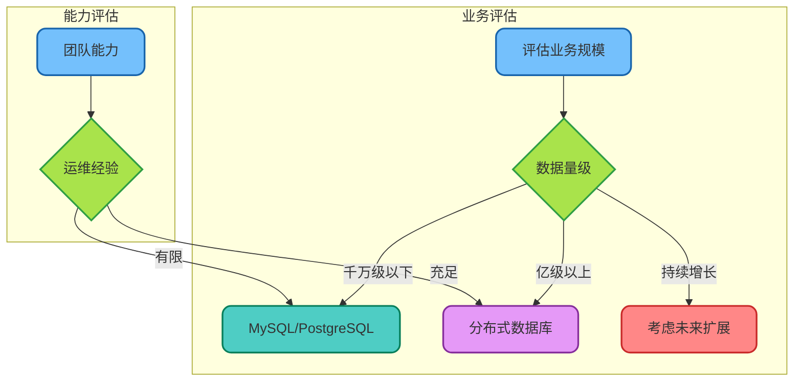

### 选型检查清单

在决定是否引入分布式数据库之前，建议对照以下清单进行评估：

**必要性评估：**
- [ ] 当前数据量是否超过亿级？
- [ ] 是否存在明显的写入瓶颈？
- [ ] 分库分表维护成本是否已不可接受？
- [ ] 是否有HTAP实时分析需求？

**可行性评估：**
- [ ] 团队是否具备分布式系统运维能力？
- [ ] 是否有足够的硬件资源（至少3台服务器）？
- [ ] 现有应用是否能接受API变更？
- [ ] 是否能接受短期内性能可能下降？

### 迁移策略建议

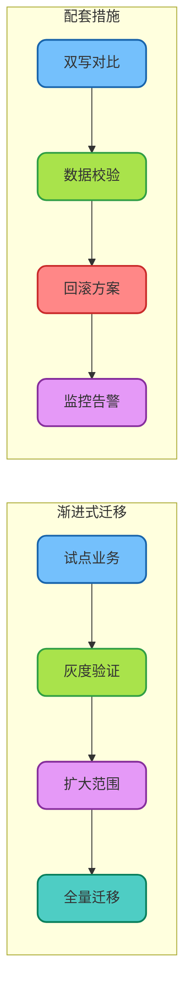

## 延伸阅读

如果希望深入了解分布式数据库的技术原理，以下论文和资料值得参考：

**经典论文：**
- **Spanner论文**：《Spanner: Google's Globally-Distributed Database》- 分布式数据库的开山之作
- **TiDB论文**：《TiDB: A Raft-based HTAP Database》- HTAP架构的典型实现
- **逻辑时钟**：Leslie Lamport的《Time, Clocks, and the Ordering of Events in a Distributed System》

**实践资源：**
- TiDB官方文档和培训课程（免费）
- OceanBase开发者社区
- 各云厂商的分布式数据库白皮书

分布式数据库是技术发展的必然趋势，随着数据量的持续增长，掌握这项技术将成为后端工程师的必备技能。
