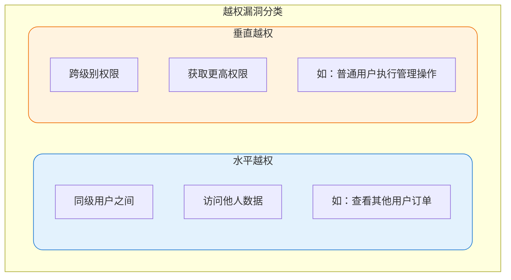
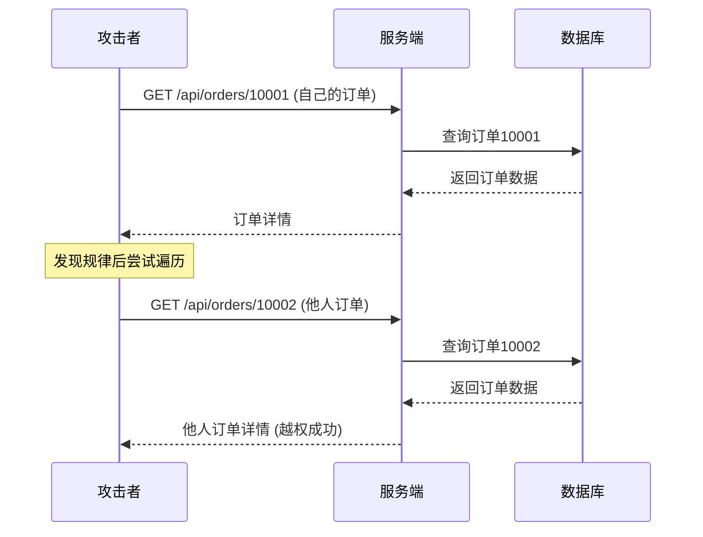
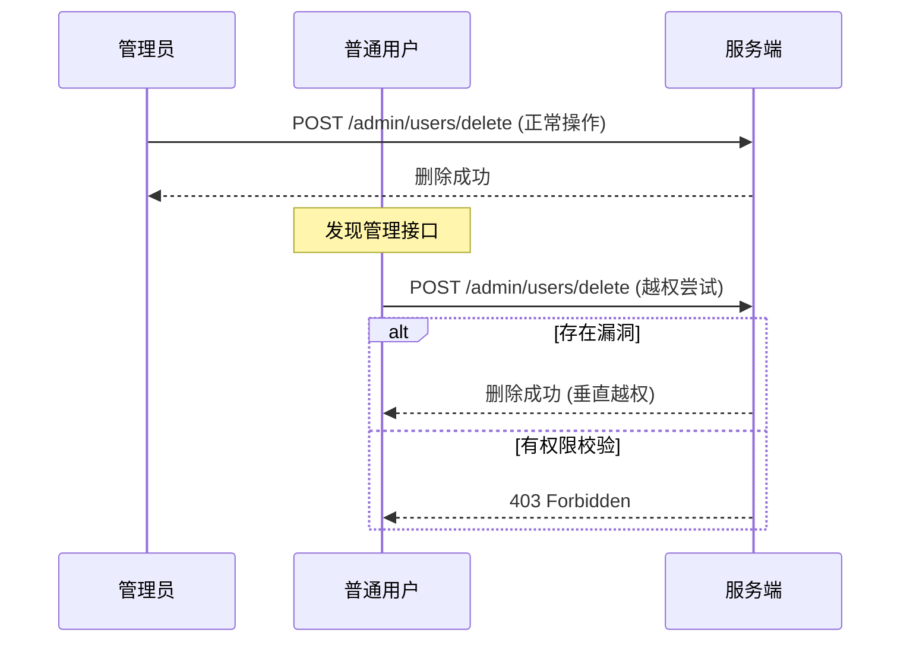
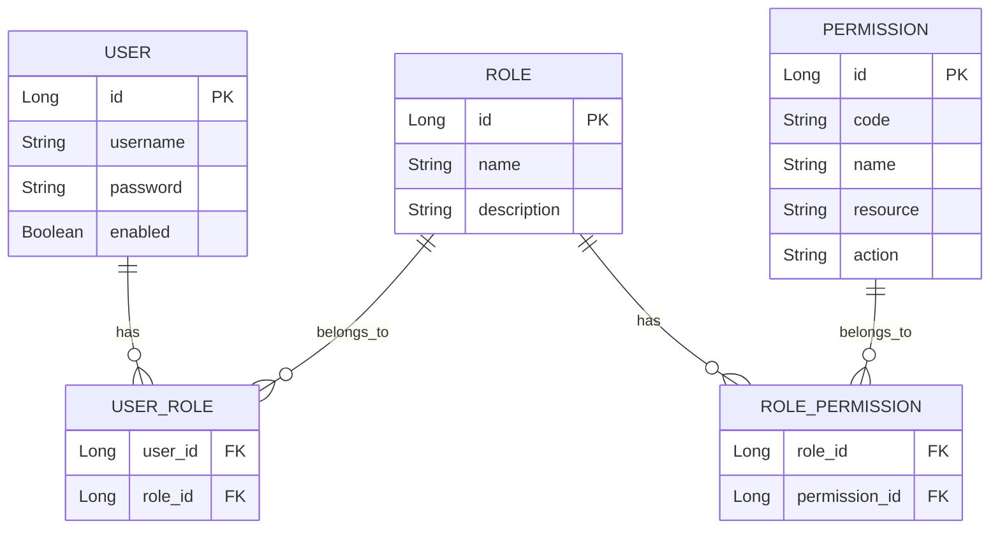
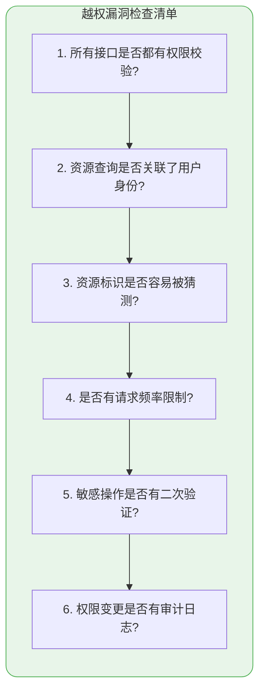

## 越权漏洞概述

越权漏洞是Web应用中最常见的安全问题之一，指用户能够访问或操作超出其权限范围的资源。根据越权方向的不同，可分为水平越权和垂直越权两种类型。



## 水平越权攻击

### 攻击原理

水平越权是指攻击者访问与自己具有相同权限等级的其他用户的资源。最典型的场景是通过修改请求参数中的资源标识（如用户ID、订单号）来获取他人数据。

### 攻击场景示例

假设有一个电商平台的订单查询接口：

```
GET /api/orders/10001
```

如果系统仅根据URL中的订单号查询数据，攻击者只需修改订单号即可尝试获取其他用户的订单信息：

```
GET /api/orders/10002
GET /api/orders/10003
...
```

若订单号使用自增ID生成，攻击者可以轻松遍历获取大量订单数据。



### 防护方案

#### 方案一：强制关联用户身份

最有效的防护方式是在查询时强制关联当前用户身份，而非信任前端传递的用户标识：

```java
@RestController
@RequestMapping("/api/orders")
public class OrderController {
    
    @Autowired
    private OrderService orderService;
    
    /**
     * 安全的订单查询接口
     * 从Session中获取用户ID，而非请求参数
     */
    @GetMapping("/{orderId}")
    public ResponseEntity<OrderVO> getOrder(
            @PathVariable Long orderId,
            HttpSession session) {
        
        // 从Session获取当前登录用户ID
        Long currentUserId = (Long) session.getAttribute("userId");
        if (currentUserId == null) {
            return ResponseEntity.status(HttpStatus.UNAUTHORIZED).build();
        }
        
        // 查询时强制关联用户ID
        Order order = orderService.findByIdAndUserId(orderId, currentUserId);
        if (order == null) {
            return ResponseEntity.notFound().build();
        }
        
        return ResponseEntity.ok(OrderVO.fromEntity(order));
    }
}

@Repository
public interface OrderRepository extends JpaRepository<Order, Long> {
    
    /**
     * 查询订单时必须匹配用户ID
     */
    @Query("SELECT o FROM Order o WHERE o.id = :orderId AND o.userId = :userId")
    Order findByIdAndUserId(@Param("orderId") Long orderId, 
                            @Param("userId") Long userId);
}
```

#### 方案二：资源标识加密混淆

使用加密或编码技术使资源标识难以被猜测和遍历：

```java
@Service
public class IdObfuscationService {
    
    private final Sqids sqids;
    
    public IdObfuscationService() {
        // 使用自定义字符表，确保每个应用实例生成的编码不同
        SqidsOptions options = new SqidsOptions();
        options.setAlphabet("TGEpuRNDVtYvISsh34jz5c1db8eoPin6CJUgQwMAmLK9Farl2fW0OyHxqXkBZ7");
        options.setMinLength(8);
        this.sqids = new Sqids(options);
    }
    
    /**
     * 编码ID，加入时间戳使每次编码结果不同
     */
    public String encode(Long id) {
        long timestamp = System.currentTimeMillis() / 1000;
        return sqids.encode(Arrays.asList(id, timestamp));
    }
    
    /**
     * 解码获取原始ID
     */
    public Long decode(String encodedId) {
        List<Long> decoded = sqids.decode(encodedId);
        if (decoded.isEmpty()) {
            throw new IllegalArgumentException("无效的资源标识");
        }
        return decoded.get(0);
    }
}
```

使用编码后的标识进行接口访问：

```java
@GetMapping("/orders/{encodedOrderId}")
public ResponseEntity<OrderVO> getOrder(
        @PathVariable String encodedOrderId,
        HttpSession session) {
    
    Long orderId = idObfuscationService.decode(encodedOrderId);
    Long currentUserId = (Long) session.getAttribute("userId");
    
    Order order = orderService.findByIdAndUserId(orderId, currentUserId);
    // ... 后续处理
}
```

#### 方案三：请求频率限制

限制单用户在单位时间内的请求次数，增加遍历攻击成本：

```java
@Component
public class RequestRateLimitInterceptor implements HandlerInterceptor {
    
    @Autowired
    private RedisTemplate<String, String> redisTemplate;
    
    private static final int MAX_REQUESTS_PER_MINUTE = 60;
    
    @Override
    public boolean preHandle(HttpServletRequest request, 
                            HttpServletResponse response, 
                            Object handler) {
        
        String userId = getCurrentUserId(request);
        String endpoint = request.getRequestURI();
        String key = String.format("rate_limit:%s:%s", userId, endpoint);
        
        Long count = redisTemplate.opsForValue().increment(key);
        if (count == 1) {
            redisTemplate.expire(key, 1, TimeUnit.MINUTES);
        }
        
        if (count > MAX_REQUESTS_PER_MINUTE) {
            response.setStatus(HttpServletResponse.SC_TOO_MANY_REQUESTS);
            return false;
        }
        
        return true;
    }
}
```

## 垂直越权攻击

### 攻击原理

垂直越权是指低权限用户通过某些手段执行了高权限用户才能进行的操作。例如普通用户执行管理员功能、一般员工访问高级管理接口等。

### 攻击场景示例

系统后台提供了用户管理接口，正常情况下只有管理员可以访问：

```
POST /admin/users/delete
Content-Type: application/json

{"userId": 12345}
```

如果后端仅依赖前端隐藏管理入口而未进行权限校验，攻击者可以直接构造请求调用管理接口：



### 防护方案

#### 基于RBAC的权限控制

实现完善的基于角色的访问控制（Role-Based Access Control）：

```java
/**
 * 权限注解
 */
@Target({ElementType.METHOD, ElementType.TYPE})
@Retention(RetentionPolicy.RUNTIME)
public @interface RequireRole {
    String[] value();
}

/**
 * 权限校验拦截器
 */
@Component
public class RbacInterceptor implements HandlerInterceptor {
    
    @Autowired
    private UserService userService;
    
    @Override
    public boolean preHandle(HttpServletRequest request, 
                            HttpServletResponse response, 
                            Object handler) throws Exception {
        
        if (!(handler instanceof HandlerMethod)) {
            return true;
        }
        
        HandlerMethod handlerMethod = (HandlerMethod) handler;
        RequireRole requireRole = handlerMethod.getMethodAnnotation(RequireRole.class);
        
        if (requireRole == null) {
            requireRole = handlerMethod.getBeanType().getAnnotation(RequireRole.class);
        }
        
        if (requireRole == null) {
            return true;
        }
        
        // 获取当前用户角色
        Long userId = (Long) request.getSession().getAttribute("userId");
        Set<String> userRoles = userService.getUserRoles(userId);
        
        // 检查是否拥有所需角色
        for (String role : requireRole.value()) {
            if (userRoles.contains(role)) {
                return true;
            }
        }
        
        response.setStatus(HttpServletResponse.SC_FORBIDDEN);
        response.getWriter().write("{\"error\": \"权限不足\"}");
        return false;
    }
}
```

在Controller中使用权限注解：

```java
@RestController
@RequestMapping("/admin/users")
@RequireRole("ADMIN")  // 类级别权限要求
public class AdminUserController {
    
    @PostMapping("/delete")
    @RequireRole({"ADMIN", "SUPER_ADMIN"})  // 方法级别权限要求
    public ResponseEntity<Void> deleteUser(@RequestBody DeleteUserRequest request) {
        userService.deleteUser(request.getUserId());
        return ResponseEntity.ok().build();
    }
    
    @GetMapping("/list")
    @RequireRole("ADMIN")
    public ResponseEntity<List<UserVO>> listUsers() {
        return ResponseEntity.ok(userService.getAllUsers());
    }
}
```

#### 权限数据模型设计



#### 最小权限原则

配置权限时应遵循最小权限原则，只授予用户完成工作所需的最低权限：

```java
@Configuration
public class RbacConfiguration {
    
    @Bean
    public RoleHierarchy roleHierarchy() {
        RoleHierarchyImpl hierarchy = new RoleHierarchyImpl();
        // 定义角色层级关系
        hierarchy.setHierarchy(
            "ROLE_SUPER_ADMIN > ROLE_ADMIN\n" +
            "ROLE_ADMIN > ROLE_MANAGER\n" +
            "ROLE_MANAGER > ROLE_USER"
        );
        return hierarchy;
    }
}
```

## 综合防护最佳实践

### 防护策略对比

| 越权类型 | 核心问题 | 关键防护措施 |
|---------|---------|-------------|
| 水平越权 | 资源归属校验缺失 | 强制关联用户身份、ID混淆加密 |
| 垂直越权 | 权限校验不完善 | RBAC权限控制、接口级鉴权 |

### 安全检查清单



### 安全编码规范

1. **永远不信任客户端数据**：用户身份从服务端Session获取，不从请求参数读取
2. **实施纵深防御**：多层权限校验，即使一层被绕过也有其他层保护
3. **使用声明式权限控制**：通过注解或配置统一管理权限，避免分散的硬编码
4. **记录安全审计日志**：所有敏感操作都要留痕，便于事后追溯
5. **定期安全测试**：使用自动化工具和人工渗透测试发现潜在漏洞
