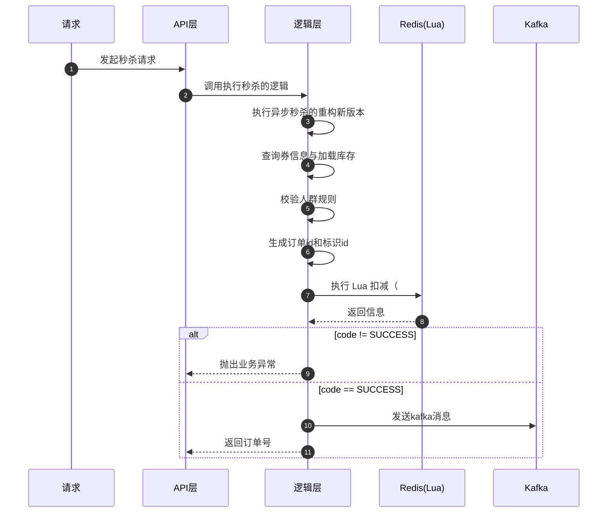

import PaidCTA from '@site/src/components/PaidCTA';

# 异步秒杀的可靠性重构升级

:::info plus 版本专属
此章节是黑马点评 Plus 版本中专有的内容，而在整套文档中将普通版本和 Plus 版本都融合在了一起，让大家更方便的学习。
:::

### 前提概要
在 [秒杀优化](/hmdp-plus/basic/seckill-optimization) 章节中，讲到了使用异步秒杀的思路来优化秒杀：

+ 先在 Redis 中扣减库存，然后将信息发送到 Redis 的 Streams 中
+ 当项目启动时，会有个线程不断地从 Redis 的 Streams 中取出消息然后在数据中生成订单

这种异步执行的设计确实比之前全都同步执行的效率要搞得多，但是带来的问题也会不少

## 一、背景与旧方案问题
请求侧用 Redis + Lua 判断资格并扣减库存，异步侧用 Redis Streams 拉取消息、创建订单。存在隐患

### 1.1 Redis 宕机/主从切换
+ **复制滞后：** 最近一次扣减在主库完成，但从库未复制；主从切换后该次扣减丢失，造成库存回跳与“一人一单”集合不一致
+ **stream backlog 丢失：** failover 或重建 group 导致 backlog 消息不可达

### 1.2 消费与确认的脆弱性
+ **消费后宕机丢单：** 从 streams 取出消息、尚未入库时服务宕机，如果没有完备的 pending 恢复与重放策略，订单就丢失；同时在故障窗口内发生 trim/切换也会放大丢失概率
+ **pending 恢复不完善：** 启动后未先处理 pending 队列，异常路径才补偿，导致积压消息长期未落库

### 1.3 线程与事务问题
+ 阻塞队列驻内存、不持久；跨线程执行导致 Spring 事务上下文失效

### 1.4 一致性与对账不足
+ Redis 与 DB 的扣减与订单状态缺少一致性与补偿闭环

## 二、Plus 版本对异步秒杀完全重构
升级使用 Kafka 作为消息管道，资格判定仍由 Redis+Lua 原子完成，但引入双重一致性、记录操作、幂等、对账，显著提升可靠性：

#### 1）消息可靠性
Kafka 持久化日志与副本，支持重放与监控生态；消费成功后再提交位点，避免“消费后宕机丢单”

#### 2）原子资格判定
Lua 在同槽位键上原子执行库存与一人一单校验与扣减，并记录 trace 日志

#### 3）最终一致性与幂等
消费端以消息 UUID 幂等，数据库扣减与订单落库失败会触发 Redis 回滚，保持 Redis 与 DB 最终一致

#### 4）对账与观察性
扣减/恢复统一写入对账日志，便于核对与补偿，避免丢单与库存错乱

#### 5）自动补发
取消成功后，从订阅 ZSET 中选取“最早未购用户”自动补发资格，提升资源利用率

#### 6）生命周期管理
缓存 TTL 按活动结束时间动态计算，清理临时键与日志

## 三、秒杀重构后的详细分析
### 3.1 流程概要

### 3.2 实现的代码

<PaidCTA />