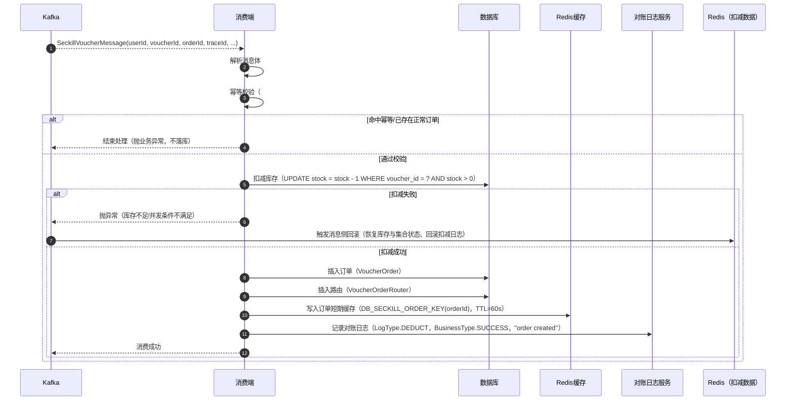

import PaidCTA from '@site/src/components/PaidCTA';

# 如何在异步消费中可靠地生成订单

:::info plus 版本专属
此章节是黑马点评 Plus 版本中专有的内容，而在整套文档中将普通版本和 Plus 版本都融合在了一起，让大家更方便的学习。
:::

在上一章节中，讲解了 重构后的异步秒杀优惠券的流程，更加全面和严谨的验证逻辑，以及在 Lua 中执行扣减和关键信息的记录，然后发送到 Kafka 的过程。

本章节，将会讲解消费 Kakfa 的完整流程，包括：消费延迟怎么办？消费失败怎么办？消费成功后如何记录？

## 一、消费成功的执行流程
我们先讲解消费成功的情况，当此流程清楚后，剩下的各种失败，以及补偿的机制会更加容易的理解了。

首先依旧是使用 MQ 的组件来进行消费 Kafka 消息的，这样可以更加方便的成功执行和各种失败的执行情况，此组件也是使用了大量的设计模式和技巧来进行拆分设计的，关于此组件的详细讲解，可以跳转到：[Kafka 消费者抽象组件详细指南](/hmdp-plus/components/kafka-consumer)

那就让我们来到 MQ 组件的消费入口，从这里开始进行讲解

### 流程图

### 代码实现

<PaidCTA />

