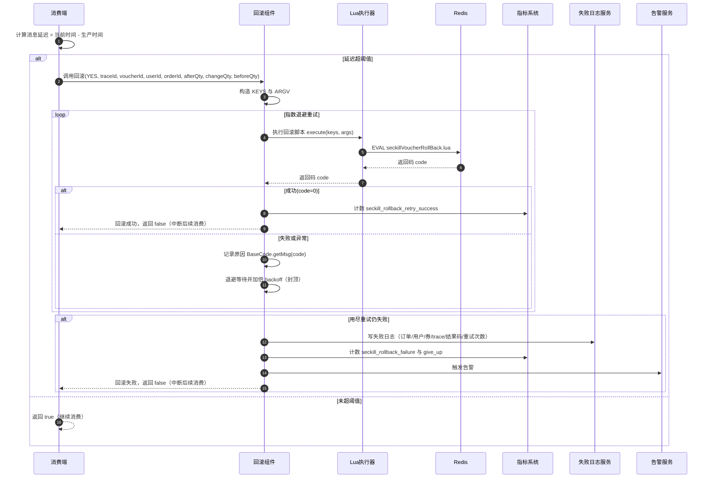

import PaidCTA from '@site/src/components/PaidCTA';

# 异步消费超时的最佳处理方案

:::info plus 版本专属
此章节是黑马点评 Plus 版本中专有的内容，而在整套文档中将普通版本和 Plus 版本都融合在了一起，让大家更方便的学习。
:::

在上一章节中，讲解了 消费 Kakfa 消息后，成功生成订单的完整流程，还包括了：tb_voucher_order、tb_voucher_order_router、tb_voucher_reconcile_log 的表结构和作用。

在本章节将会详细讲解，消费消息超时异常情况发生时，应该如何处理？

## 一、消费超时的执行流程
首先依旧是使用 MQ 的组件来进行消费 Kafka 消息的，这样可以更加方便的成功执行和各种失败的执行情况，此组件也是使用了大量的设计模式和技巧来进行拆分设计的，关于此组件的详细讲解，可以跳转到：[Kafka 消费者抽象组件详细指南](/hmdp-plus/components/kafka-consumer)

### 流程图

那就让我们来到 MQ 组件的消费前置入口，从这里开始进行讲解

### 1.1 方法职责
在消费链路开始前做“延迟过滤”：如果消息从生产到消费的延迟超过阈值，直接丢弃该消息、回滚 Redis 中的扣减数据，并记录对账日志；否则允许继续消费

### 1.2 执行流程
#### 1）计算消息延迟

<PaidCTA />