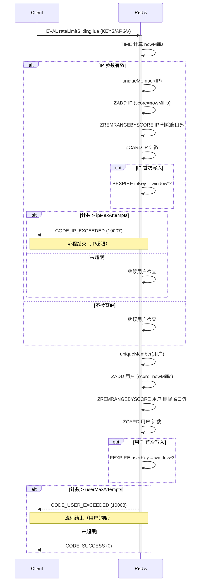

import PaidCTA from '@site/src/components/PaidCTA';

# 高并发下的限流守卫-滑动窗口

:::info plus 版本专属
此章节是黑马点评 Plus 版本中专有的内容，而在整套文档中将普通版本和 Plus 版本都融合在了一起，让大家更方便的学习。
:::

在上一章节中，讲解了如何使用动态令牌桶来对 IP、用户 进行实现限流的功能，那么本章节将讲解如何运用滑动窗口的方式来实现。

让我们来到执行限流功能的入口处：

### 流程图


### 可视化流程
```text
IP维度（窗口=5s，上限=3）
时间轴: 0s    1s    2s    3s    4s    5s    6s
        |-----|-----|-----|-----|-----|-----|-----
事件:    A✓          B✓     C✓    D✗                 E✓ F✓ G✗

解释: 窗口[0–5s]内 A,B,C=3 次；第 D 为第4次 → 超限拒绝
5.1s 时窗口滚动为[0.1–5.1]，计数 B,C,D=3 → E 通过；F=4 次 → 仍在滚动后计数≤3 前通过；G 再次超过 → 拒绝
```
```text
用户维度（窗口=60s，上限=5）
时间轴: 0s            10s           20s           30s           40s           50s           60s
        |-------------|-------------|-------------|-------------|-------------|-------------|-------------|
事件:    U1✓  U2✓  U3✓  U4✓  U5✓  U6✗                                        U7✓

解释: 60s 内已有 5 次 → U6 超限拒绝；60s 滚动后计数降至 ≤5 → U7 通过
```

## 一、滑动窗口的实现

<PaidCTA />