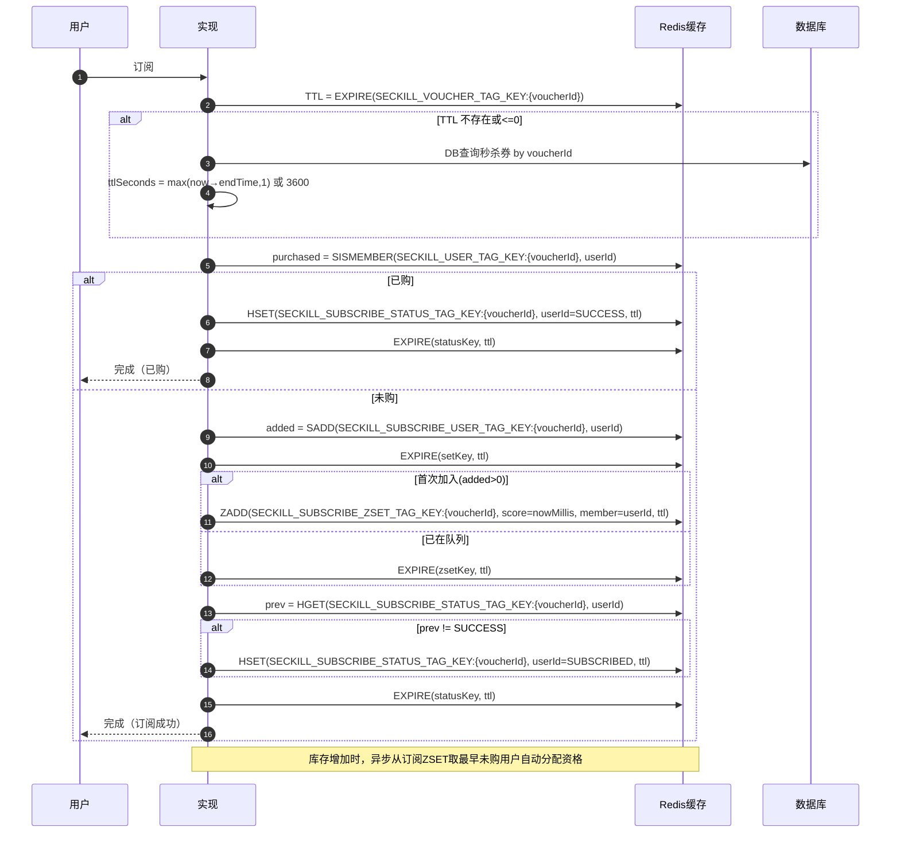

import PaidCTA from '@site/src/components/PaidCTA';

# 无库存订阅与到券通知全流程

:::info plus 版本专属
此章节是黑马点评 Plus 版本中专有的内容，而在整套文档中将普通版本和 Plus 版本都融合在了一起，让大家更方便的学习。
:::

当店铺中的优惠券库存为 0，并且此用户还没有优惠券时，会提醒用户添加“到券提醒”的功能：

让有其他的人将已领取的优惠券取消或者商家新增库存后，就会把设置了到券提醒的用户来领取优惠券。

并且领取的用户是有**公平性**的，也就是**先来的用户会先领取到**。

本章节将会详细的讲解此功能的实现流程

## 一、“到券提醒”功能解析
### 流程图

### 代码实现

<PaidCTA />