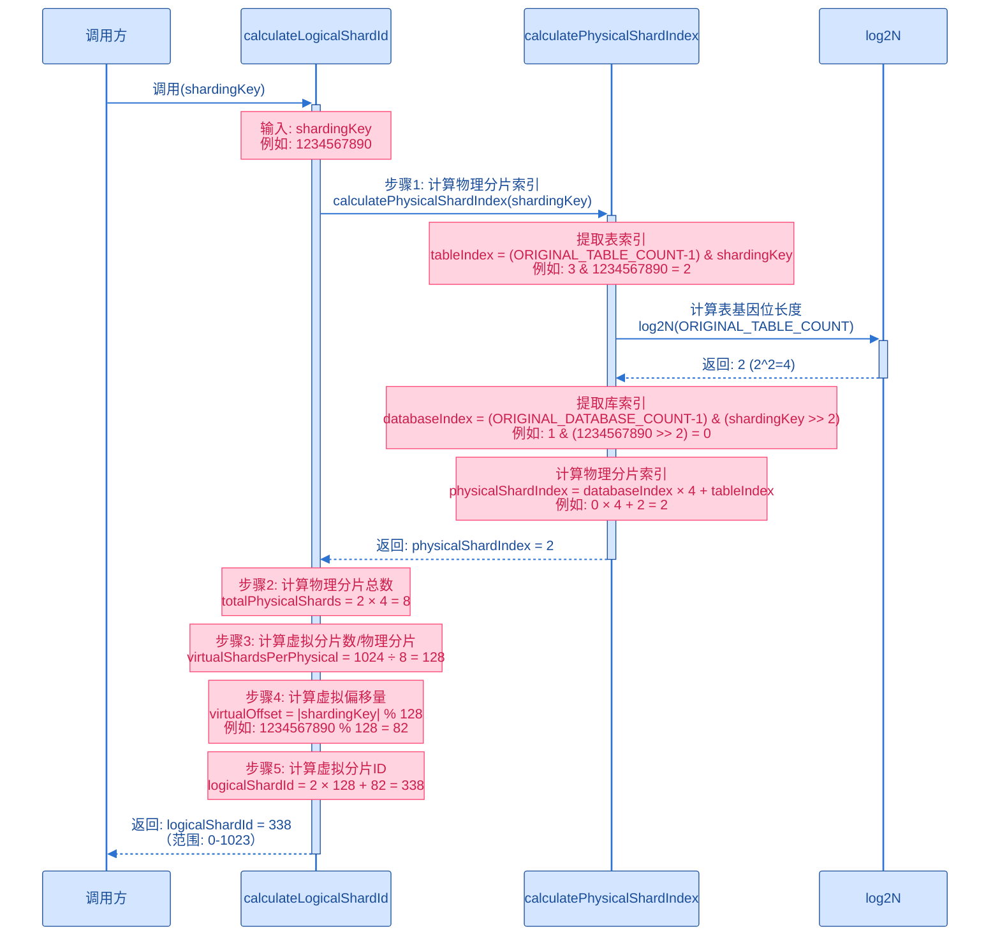

import PaidCTA from '@site/src/components/PaidCTA';

# 虚拟分片路由的执行原理

本章节将详细讲解在使用虚拟分片路由来进行分库分表后，新的分库算法和分表算法，以及虚拟节点的执行过程

## 一、分库算法
**位置：** `com.damai.shardingsphere.algorithm.DatabaseOrderVirtualShardingAlgorithm`

**说明**：此算法适用于所有使用相同分片键（order_number、user_id）的表，包括：订单表（d_order）

后续如何修改 Shardingsphere 的配置，也可以应用到 **购票人订单表（d_order_ticket_user）** 和 **订单记录表 （d_order_ticket_user_record）**

```java
public class DatabaseOrderVirtualShardingAlgorithm implements ComplexKeysShardingAlgorithm<Long> {
    
    @Override
    public void init(Properties props) {
        // 无需初始化
    }
    
    @Override
    public Collection<String> doSharding(Collection<String> allActualSplitDatabaseNames, 
                                         ComplexKeysShardingValue<Long> complexKeysShardingValue) {
        //返回的真实库名集合
        List<String> actualDatabaseNames = new ArrayList<>();
        //查询中的列名和值
        Map<String, Collection<Long>> columnNameAndShardingValuesMap = 
                complexKeysShardingValue.getColumnNameAndShardingValuesMap();
        
        // 无条件查询 → 返回所有库
        if (CollectionUtil.isEmpty(columnNameAndShardingValuesMap)) {
            return allActualSplitDatabaseNames;
        }
        
        // 获取分片键
        
        //order_number条件的值
        Collection<Long> orderNumberValues = columnNameAndShardingValuesMap.get("order_number");
        //user_id条件的值
        Collection<Long> userIdValues = columnNameAndShardingValuesMap.get("user_id");
        
        Long shardingKey = null;
        //如果是order_number查询
        if (CollectionUtil.isNotEmpty(orderNumberValues)) {
            shardingKey = orderNumberValues.stream().findFirst()
                    .orElseThrow(() -> new DaMaiFrameException(BaseCode.ORDER_NUMBER_NOT_EXIST));
        } else if (CollectionUtil.isNotEmpty(userIdValues)) {
            //如果是user_id查询
            shardingKey = userIdValues.stream().findFirst()
                    .orElseThrow(() -> new DaMaiFrameException(BaseCode.USER_ID_NOT_EXIST));
        }
        //如果order_number或者user_id的值存在
        if (Objects.nonNull(shardingKey)) {
            //通过路由管理器获取物理分片
            //这里通过SpringUtil的工具类获取是因为ShardingSphere相关的类无法通过Spring注入
            PhysicalShard physicalShard = SpringUtil.getBean(VirtualShardingRouteManager.class)
                    .route(shardingKey);
            
            if (Objects.nonNull(physicalShard)) {
                // 返回目标数据库
                String targetDatabase = physicalShard.getDatasourceName();
                for (String actualSplitDatabaseName : allActualSplitDatabaseNames) {
                    //将所有的分库名和得到的分库索引进行匹配
                    if (actualSplitDatabaseName.contains(targetDatabase)) {
                        actualDatabaseNames.add(actualSplitDatabaseName);
                        break;
                    }
                }
            }
            return actualDatabaseNames.isEmpty() ? allActualSplitDatabaseNames : actualDatabaseNames;
        }
        return allActualSplitDatabaseNames;
    }
}
```

## 二、分表算法
**位置：** `com.damai.shardingsphere.algorithm.DatabaseOrderVirtualShardingAlgorithm`

**说明**：此算法适用于所有使用相同分片键（order_number、user_id）的表，包括：订单表（d_order）

后续如何修改 Shardingsphere 的配置，也可以应用到 **购票人订单表（d_order_ticket_user）** 和 **订单记录表 （d_order_ticket_user_record）**

```java
public class TableOrderVirtualShardingAlgorithm implements ComplexKeysShardingAlgorithm<Long> {
    
    
    @Override
    public void init(Properties props) {
        // 无需初始化
    }
    
    @Override
    public Collection<String> doSharding(Collection<String> allActualSplitTableNames, 
                                         ComplexKeysShardingValue<Long> complexKeysShardingValue) {
        //返回的真实表名集合
        List<String> actualTableNames = new ArrayList<>();
        //查询中的列名和值
        Map<String, Collection<Long>> columnNameAndShardingValuesMap = 
                complexKeysShardingValue.getColumnNameAndShardingValuesMap();
        
        //无条件查询 → 返回空（由分库算法决定）
        if (CollectionUtil.isEmpty(columnNameAndShardingValuesMap)) {
            return actualTableNames;
        }
        
        //获取分片键
        //order_number条件的值
        Collection<Long> orderNumberValues = columnNameAndShardingValuesMap.get("order_number");
        //user_id条件的值
        Collection<Long> userIdValues = columnNameAndShardingValuesMap.get("user_id");
        
        Long shardingKey = null;
        //如果是order_number查询
        if (CollectionUtil.isNotEmpty(orderNumberValues)) {
            shardingKey = orderNumberValues.stream().findFirst()
                .orElseThrow(() -> new DaMaiFrameException(BaseCode.ORDER_NUMBER_NOT_EXIST));
        } else if (CollectionUtil.isNotEmpty(userIdValues)) {
            //如果是user_id查询
            shardingKey = userIdValues.stream().findFirst()
                .orElseThrow(() -> new DaMaiFrameException(BaseCode.USER_ID_NOT_EXIST));
        }
        
        if (Objects.nonNull(shardingKey)) {
            // 通过路由管理器获取物理分片
            PhysicalShard physicalShard = SpringUtil.getBean(VirtualShardingRouteManager.class)
                    .route(shardingKey);
            
            if (physicalShard != null) {
                // 获取逻辑表名（ShardingSphere提供）
                String logicTableName = complexKeysShardingValue.getLogicTableName();
                // 根据逻辑表名生成完整的物理表名
                // 例如：逻辑表 t_order → 物理表 d_order_0
                String fullTableName = physicalShard.getFullTableName(logicTableName);
                
                actualTableNames.add(fullTableName);
            }
            return actualTableNames.isEmpty() ? allActualSplitTableNames : actualTableNames;
        }
        return allActualSplitTableNames;
    }
}
```

### 分库分表算法特点
会发现无论是分库算法还是分表算法，都会把分片键（订单编号 或 用户id）交给 `VirtualShardingRouteManager` 来进行路由计算，获取到实际的库和表。

所以这个`VirtualShardingRouteManager`肯定是重点内容！

## 三、虚拟分片计算流程图
在 `VirtualShardingRouteManager`进行分库分表路由的时候，核心其实是调用了`calculateLogicalShardId`的方法来获取到虚拟分片
，这里用流程图展示出来，可以更直观的理解

### 流程图

```mermaid
flowchart TD
    Start([开始 calculateLogicalShardId])
    
    Input(输入 shardingKey)
    
    Step1(步骤1 调用 calculatePhysicalShardIndex)
    
    SubStart([子方法开始])
    
    Sub1(计算表索引<br/>tableIndex = TABLE_COUNT-1 & shardingKey)
    
    Sub2(计算表基因位长度<br/>tableGeneLength = log2N)
    
    Sub3(计算库索引<br/>databaseIndex = DB_COUNT-1 & shardingKey >> geneLength)
    
    Sub4(计算物理分片索引<br/>physicalShardIndex = dbIndex × TABLE_COUNT + tableIndex)
    
    SubEnd([子方法返回 physicalShardIndex])
    
    Step2(步骤2 计算物理分片总数<br/>totalPhysicalShards = DB_COUNT × TABLE_COUNT = 8)
    
    Step3(步骤3 计算虚拟分片数<br/>virtualShardsPerPhysical = 1024 ÷ 8 = 128)
    
    Step4(步骤4 计算虚拟偏移量<br/>virtualOffset = abs shardingKey % 128)
    
    Step5(步骤5 计算虚拟分片ID<br/>logicalShardId = physicalIndex × 128 + offset)
    
    Output(返回 logicalShardId 范围 0-1023)
    
    End([结束])
    
    Start --> Input --> Step1 --> SubStart --> Sub1 --> Sub2 --> Sub3 --> Sub4 --> SubEnd --> Step2 --> Step3 --> Step4 --> Step5 --> Output --> End
    
    style Start fill:#e1f5ff,stroke:#1a4d99,stroke-width:2px
    style End fill:#e1f5ff,stroke:#1a4d99,stroke-width:2px
    style SubStart fill:#fff4e1,stroke:#ff9800,stroke-width:2px
    style SubEnd fill:#fff4e1,stroke:#ff9800,stroke-width:2px
    style Step1 fill:#ffd4e0,stroke:#ff4573,stroke-width:2px
    style Sub1 fill:#ffe8ee,stroke:#ff4573,stroke-width:2px
    style Sub2 fill:#ffe8ee,stroke:#ff4573,stroke-width:2px
    style Sub3 fill:#ffe8ee,stroke:#ff4573,stroke-width:2px
    style Sub4 fill:#ffe8ee,stroke:#ff4573,stroke-width:2px
    style Step2 fill:#d4e6ff,stroke:#1a4d99,stroke-width:2px
    style Step3 fill:#d4e6ff,stroke:#1a4d99,stroke-width:2px
    style Step4 fill:#d4e6ff,stroke:#1a4d99,stroke-width:2px
    style Step5 fill:#d4e6ff,stroke:#1a4d99,stroke-width:2px
    style Output fill:#e1ffe1,stroke:#4caf50,stroke-width:2px
    style Input fill:#f5f5f5,stroke:#666,stroke-width:2px
```


### 时序图


## 四、VirtualShardingRouteManager 的结构

<PaidCTA />