# 分库分表扩容迁移流程图
此章节是将扩容过程中，如何将数据迁移新表、更新虚拟分片路由表、清除旧表数据的每个步骤整理成了流程图中

⚠️**核心策略说明：**  
本扩容方案使用 **用户ID** 而非订单号来计算虚拟分片ID，确保同一用户的所有订单保持在同一张表中。

原因：

+ 订单号虽然包含用户ID基因位，但 `orderNumber % 128 ≠ userId % 128`
+ 如果按订单号判断，同一用户的订单会被分散到不同表
+ 使用用户ID判断，保证数据聚合性和查询性能

关于每个步骤的代码以及详细讲解，可以跳转到：[虚拟分片的分库分表扩容流程解析](/damai/damai-pro/sharding/virtual/expand/analyse)

### 1. 总体流程图
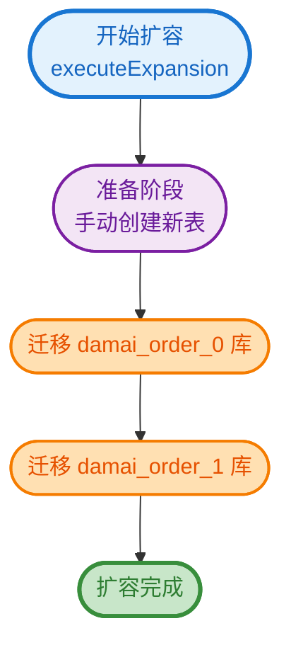

### 2. 单库迁移流程
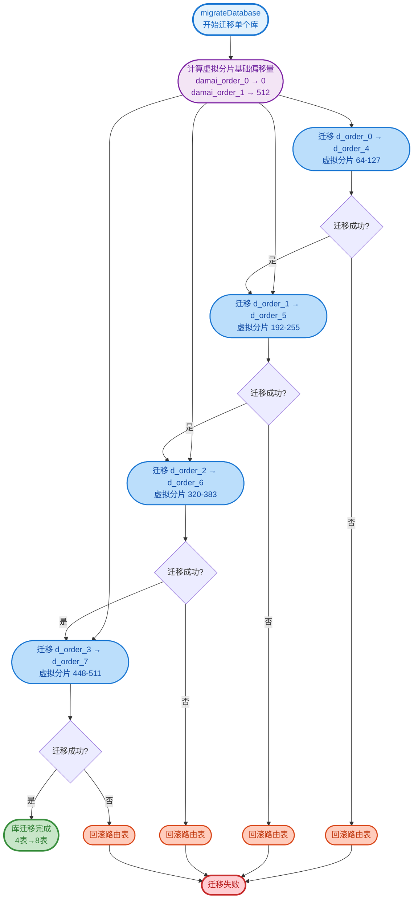

### 3. 单表迁移详细流程
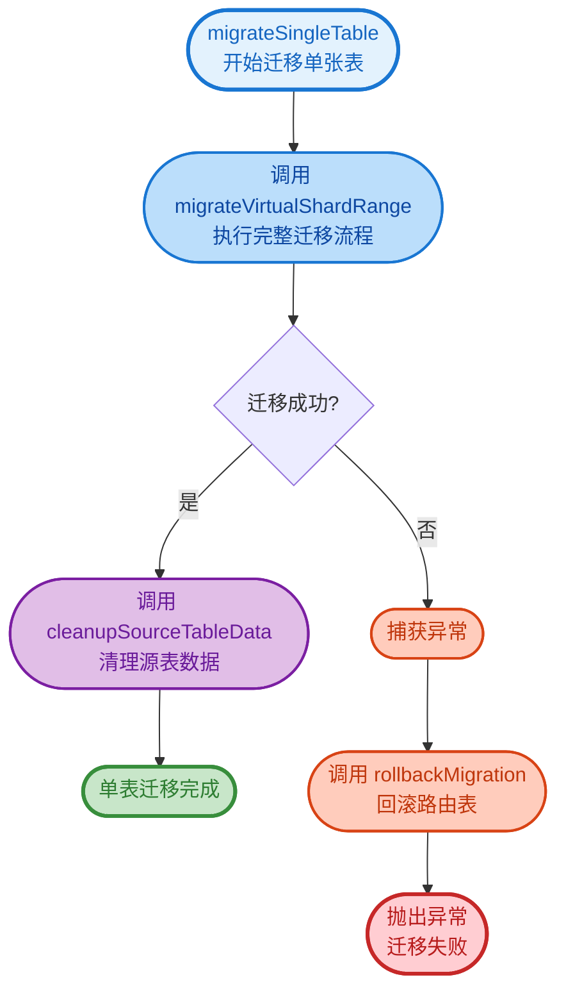

### 4. 完整迁移流程（核心）
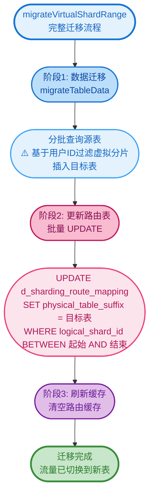

### 5. 数据迁移详细流程
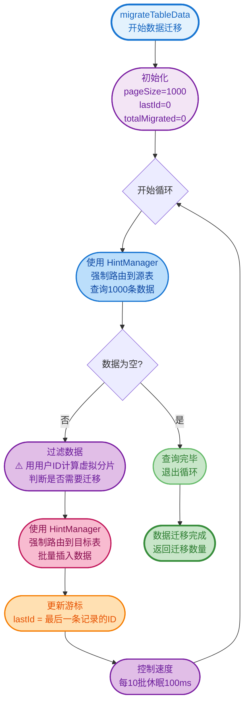

### 6. HintManager 强制路由机制

### 7. 虚拟分片路由原理
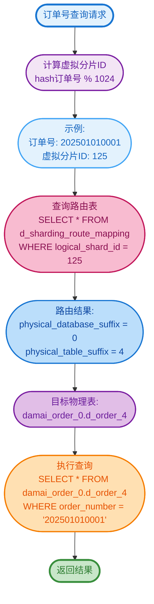

### 8. 路由表更新过程
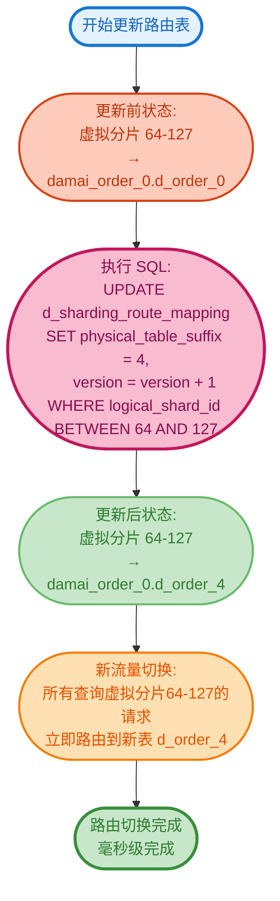

### 9. 数据清理流程
```mermaid
flowchart TD
    Start([cleanupSourceTableData<br/>开始清理源表]) --> Init([初始化<br/>pageSize=1000<br/>lastId=0<br/>totalDeleted=0])
    
    Init --> Loop{开始循环}
    
    Loop --> Query([使用 HintManager<br/>强制路由到源表<br/>查询1000条数据])
    
    Query --> Check{数据为空?}
    
    Check -->|是| EndLoop([清理完毕<br/>退出循环])
    
    Check -->|否| Filter([过滤数据<br/>⚠️ 用用户ID计算虚拟分片<br/>判断是否需要删除])
    
    Filter --> Delete([使用 HintManager<br/>强制路由到源表<br/>批量物理删除])
    
    Delete --> UpdateCursor([更新游标<br/>lastId = 最后一条记录的ID])
    
    UpdateCursor --> Sleep([控制速度<br/>每10批休眠100ms])
    
    Sleep --> Loop
    
    EndLoop --> Success([数据清理完成<br/>返回删除数量])
    
    style Start fill:#e3f2fd,stroke:#1976d2,stroke-width:3px,color:#1565c0
    style Success fill:#c8e6c9,stroke:#388e3c,stroke-width:3px,color:#2e7d32
    style Init fill:#f3e5f5,stroke:#7b1fa2,stroke-width:2px,color:#6a1b9a
    style EndLoop fill:#c8e6c9,stroke:#66bb6a,stroke-width:2px,color:#2e7d32
    style Query fill:#bbdefb,stroke:#1976d2,stroke-width:2px,color:#0d47a1
    style Filter fill:#e1bee7,stroke:#7b1fa2,stroke-width:2px,color:#6a1b9a
    style Delete fill:#ffccbc,stroke:#d84315,stroke-width:2px,color:#bf360c
    style UpdateCursor fill:#ffe0b2,stroke:#f57c00,stroke-width:2px,color:#e65100
    style Sleep fill:#e1bee7,stroke:#7b1fa2,stroke-width:2px,color:#6a1b9a
```

### 10. 异常回滚流程
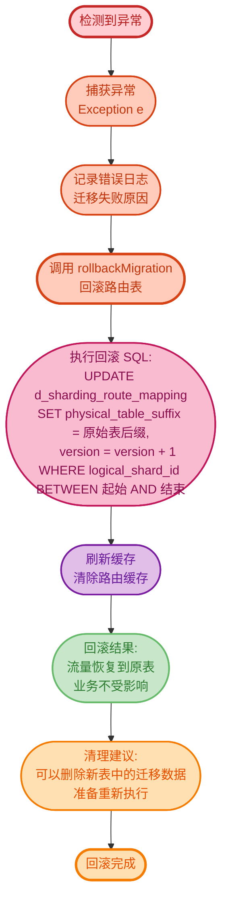

### 11. 完整扩容时序图
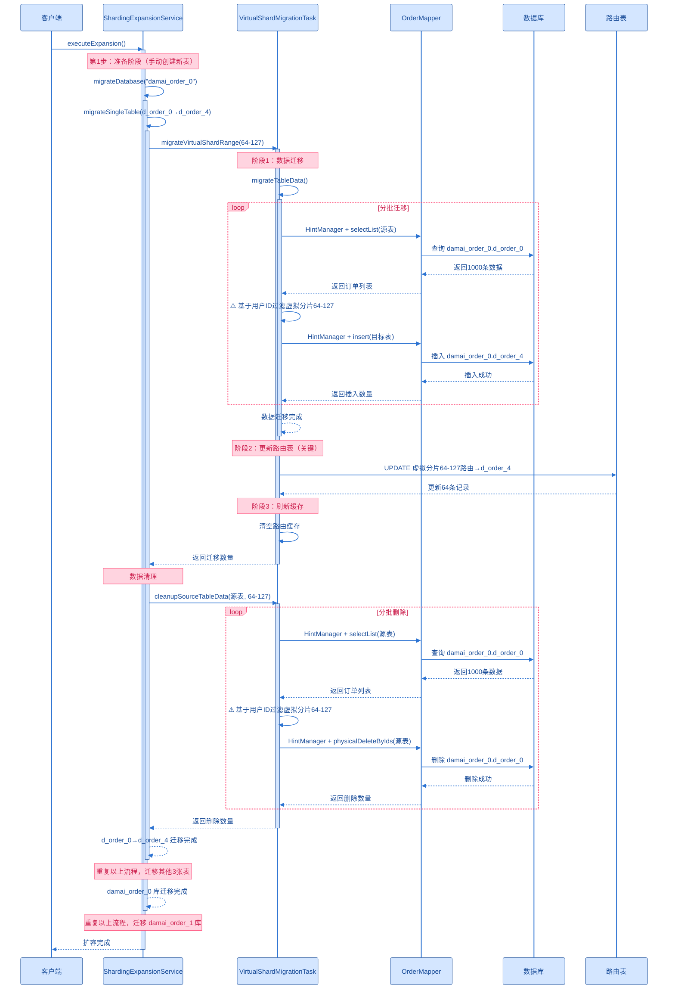

### 12. 虚拟分片分配图
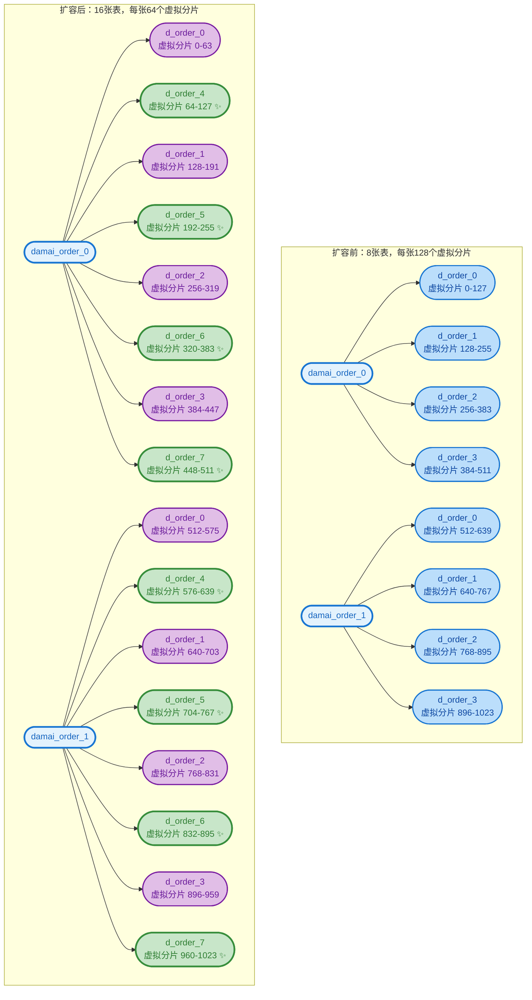

### 颜色说明
+ 🔵 **浅蓝色 (#e3f2fd)**：开始节点、输入节点
+ 🟢 **浅绿色 (#c8e6c9)**：成功节点、完成节点
+ 🔴 **浅红色 (#ffcdd2)**：失败节点、异常节点
+ 🟣 **浅紫色 (#f3e5f5, #e1bee7)**：初始化节点、处理节点、计算节点
+ 🔵 **蓝色 (#bbdefb)**：查询操作、数据库读取
+ 🌸 **粉色 (#f8bbd0, #fce4ec)**：数据插入、路由更新
+ 🟠 **浅橙色 (#ffe0b2)**：游标更新、控制节点
+ 🔴 **橙红色 (#ffccbc)**：删除操作、回滚节点

