# MCP（Model Context Protocol）详解

import VipInline from '@site/src/components/VipInline';

## 一、MCP 是什么？
**MCP（Model Context Protocol，模型上下文协议）** 是由 Anthropic 公司推出的一个**开源标准协议**，用于连接 AI 应用程序与外部系统。

> 官方定义：MCP is an open-source standard for connecting AI applications to external systems.
>
> 官方文档：[https://modelcontextprotocol.io](https://modelcontextprotocol.io)
>

### 用一个比喻来理解
**官方比喻：MCP 就像 AI 应用的 USB-C 接口**

就像 USB-C 为各种电子设备提供了标准化的连接方式一样，MCP 为 AI 应用程序连接外部系统提供了标准化的方式。

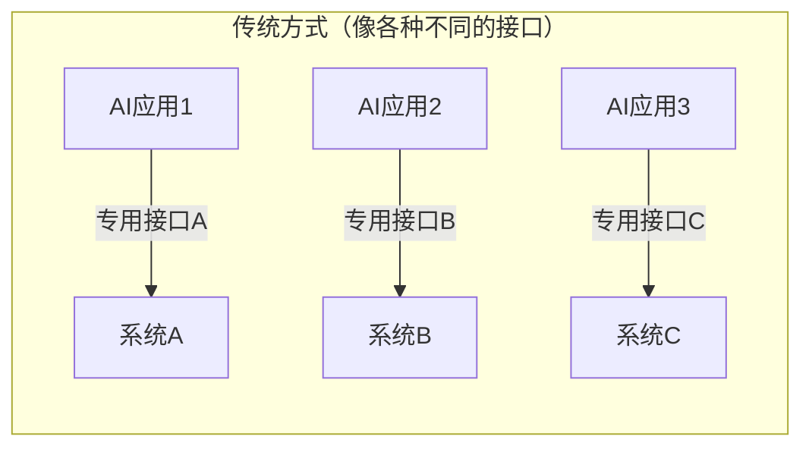

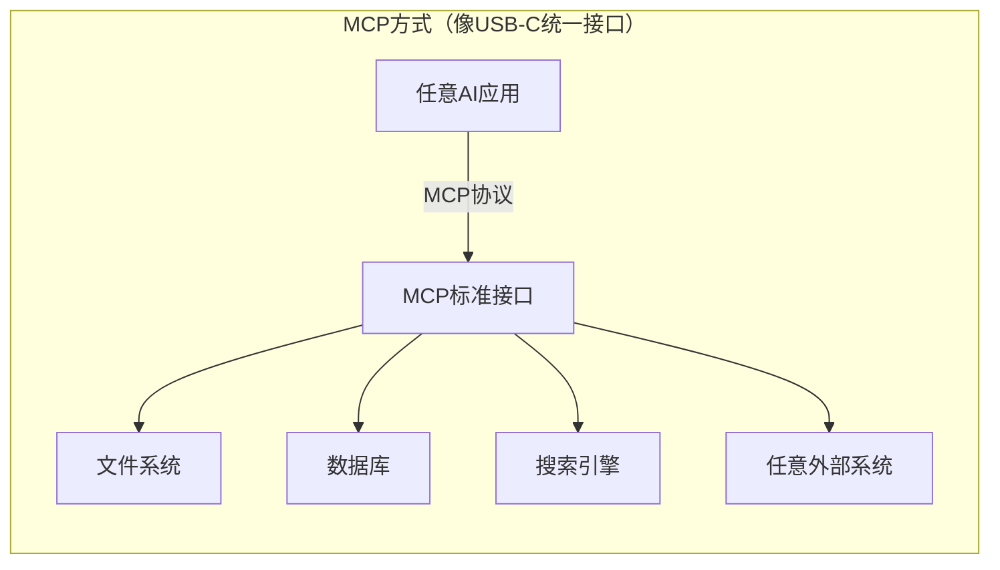

### 另一个比喻
+ **AI 模型**就像一个非常聪明的"大脑"，它懂很多知识，能回答各种问题
+ 但这个"大脑"**被关在一个房间里**，它看不到外面的世界，也无法操作任何东西
+ **MCP** 就像是给这个房间装了一扇"窗户"和一双"手"，让 AI 能够：
    - 👀 **看到**外部世界的真实数据（文件、数据库、API等）
    - 🤚 **操作**外部系统（读写文件、调用服务等）

---

## 二、MCP 能做什么？
根据官方文档，MCP 可以实现以下能力：

| 场景 | 说明 |
| --- | --- |
| 📅 **个人助理** | AI 代理可以访问你的 Google 日历和 Notion，成为更个性化的 AI 助手 |
| 🎨 **设计转代码** | Claude Code 可以使用 Figma 设计稿生成完整的 Web 应用 |
| 📊 **企业数据分析** | 企业聊天机器人可以连接组织内的多个数据库，用户可以通过对话分析数据 |
| 🖨️ **3D 设计制造** | AI 模型可以在 Blender 中创建 3D 设计并通过 3D 打印机打印出来 |
| 📁 **文件操作** | AI 可以读写本地文件、管理目录结构 |
| 🔍 **网络搜索** | AI 可以调用搜索引擎获取实时信息 |


---

## 三、MCP 核心架构
### 3.1 架构总览
MCP 采用典型的**客户端-服务器架构**：

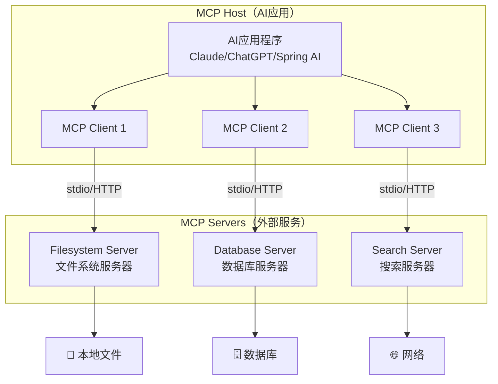

### 3.2 核心参与者
MCP 架构中有三个关键参与者：

| 参与者 | 英文 | 说明 | 本项目中对应 |
| --- | --- | --- | --- |
| **主机** | MCP Host | 协调和管理多个 MCP 客户端的 AI 应用程序 | Spring Boot 应用 |
| **客户端** | MCP Client | 维护与 MCP 服务器的连接，获取上下文 | `McpSyncClient` |
| **服务器** | MCP Server | 提供上下文数据和工具的程序 | `@modelcontextprotocol/server-filesystem` |


### 3.3 协议分层
MCP 协议分为两层：

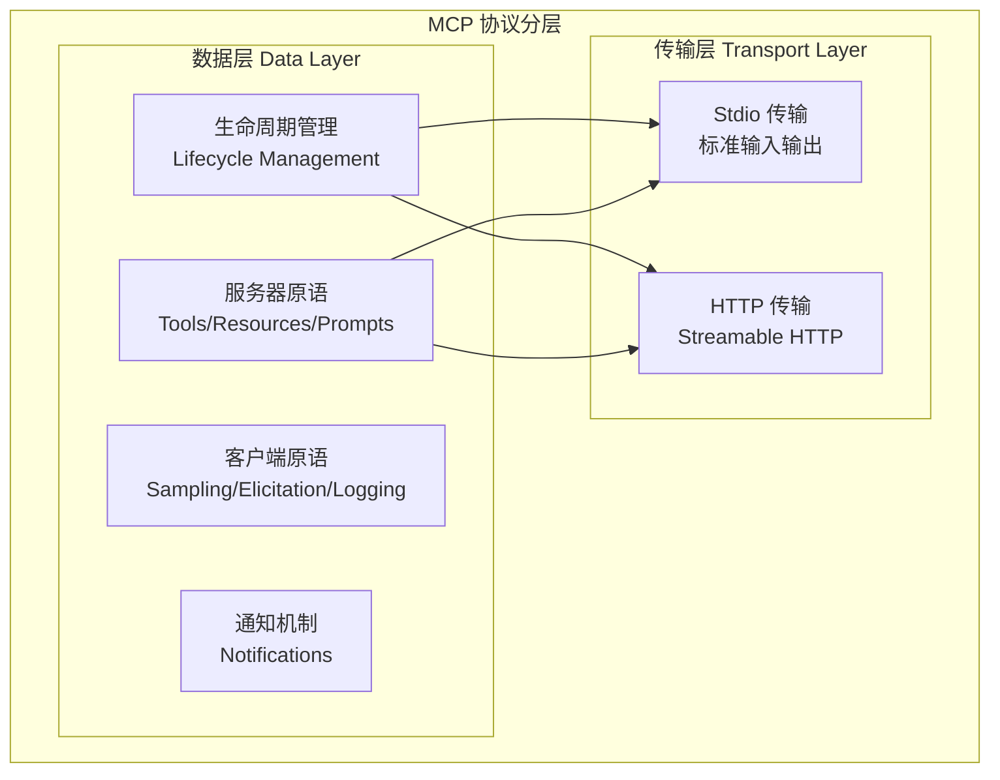

| 层次 | 说明 | 关键技术 |
| --- | --- | --- |
| **数据层** | 定义客户端与服务器之间的消息结构和语义 | JSON-RPC 2.0 |
| **传输层** | 定义客户端与服务器之间的通信机制 | stdio / Streamable HTTP |


### 3.4 核心原语（Primitives）
**原语是 MCP 中最重要的概念**，它们定义了客户端和服务器可以互相提供的能力。

#### 服务器原语（服务器提供给客户端的）
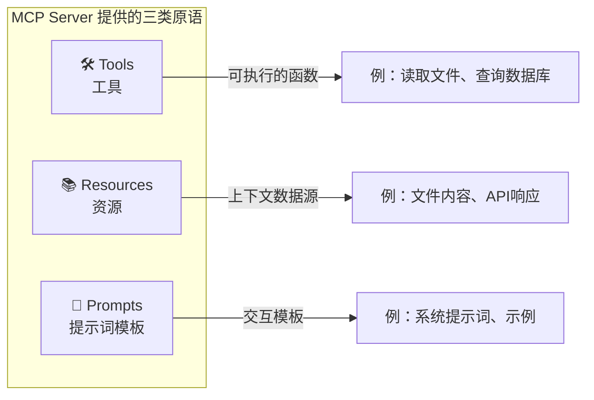

| 原语 | 英文 | 说明 | 示例 |
| --- | --- | --- | --- |
| **工具** | Tools | AI 可以调用的可执行函数 | `read_file`、`write_file`、`search_files` |
| **资源** | Resources | 提供上下文信息的数据源 | 文件内容、数据库记录 |
| **提示词** | Prompts | 可重用的交互模板 | 系统提示词、few-shot 示例 |


---

## 四、为什么需要 MCP？
### 4.1 AI 的天生局限
传统的 AI 大模型有以下**先天不足**：

| 局限性 | 说明 |
| --- | --- |
| **知识截止** | 训练数据有截止日期，不知道最新信息 |
| **无法访问实时数据** | 不能查询数据库、读取文件 |
| **无法执行操作** | 不能创建文件、调用 API |
| **信息可能过时** | 回答可能基于旧数据 |


### 4.2 MCP 的价值（来自官方文档）
根据官方文档，不同角色可以从 MCP 中获得不同的价值：

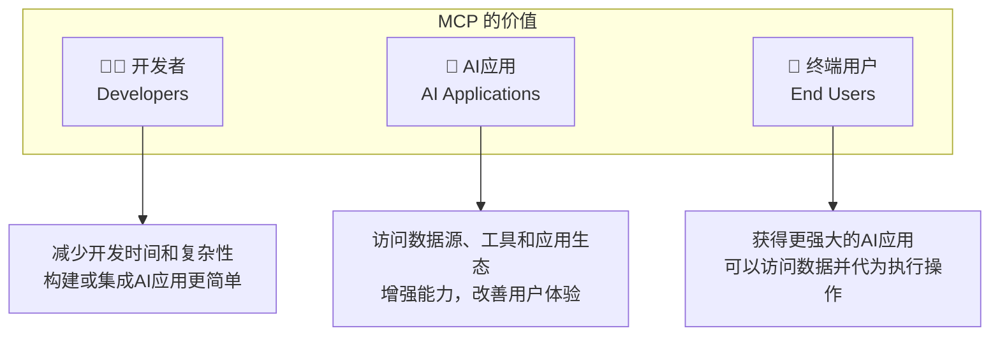

| 角色 | MCP 的价值 |
| --- | --- |
| **开发者** | 减少构建或集成 AI 应用时的开发时间和复杂性 |
| **AI 应用** | 获得访问数据源、工具和应用程序的生态系统，增强能力并改善终端用户体验 |
| **终端用户** | 获得更强大的 AI 应用程序，可以访问您的数据并在必要时代您执行操作 |


### 4.3 有无 MCP 的对比
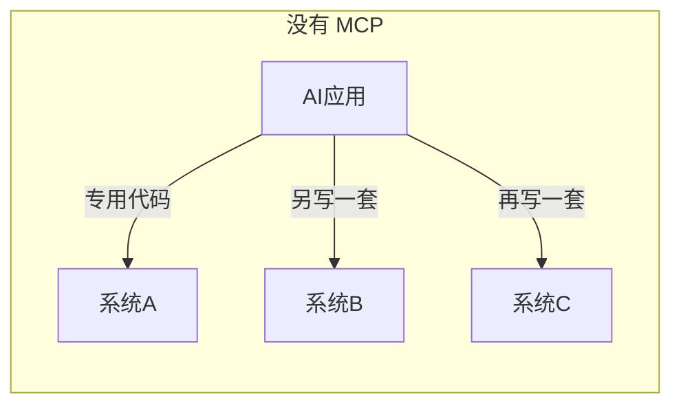

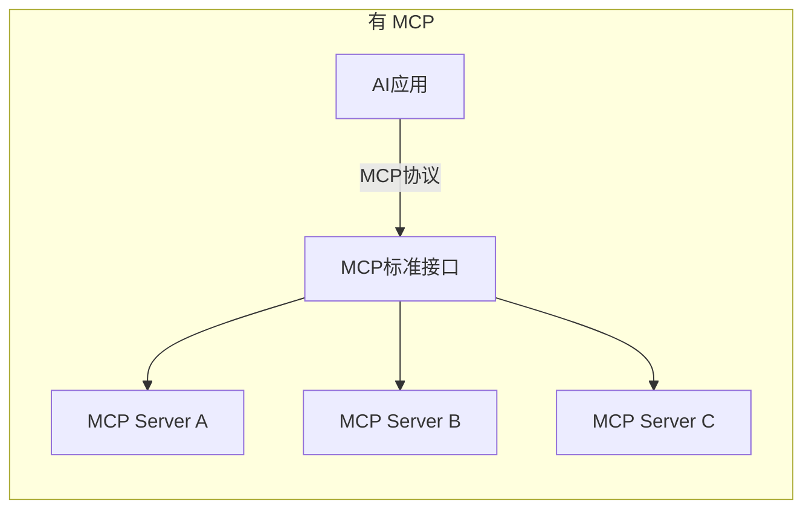

| 对比项 | 没有 MCP | 有 MCP |
| --- | --- | --- |
| **集成方式** | 每个工具写专用代码 | 统一协议，即插即用 |
| **更换模型** | 需要重写集成代码 | 无需修改 |
| **安全控制** | 自己实现 | 协议内置 |
| **工具生态** | 无 | 有大量现成的 MCP Server |
| **维护成本** | 高 | 低 |


---

## 五、本项目实战示例
### 5.1 引入依赖
```xml
<!-- MCP Client - 用于调用外部MCP服务 -->
<dependency>
    <groupId>org.springframework.ai</groupId>
    <artifactId>spring-ai-starter-mcp-client</artifactId>
</dependency>
```

### 5.2 项目配置
首先在项目的配置文件中，要指定集成 MCP 的配置，`mcp-servers.json`：

<!-- 这是一张图片，ocr 内容为：项目 APPLICATION.YAML 8 SPRING: COMMON 28 AI: CONFIG DEEPSEEK: 49 53 OPTIONSH CONSTANTS MODEL:DEEPSEEK-CHAT 54 COTROLLER 55 MCP: CHATTYPEHISTORYCONL CLIENT: 56 PROGRAMCONTROLLER STDIO: 57 SIMPLE CHATCONTROLLER SERVERS-CONFIGURATION: CLASSPATH:MCP-SERVERS.JSON 58 DTO 59 EASY-ES: ENTITY #默认为TRUE,若为FALSE则认为不启用本框架 09 ENUMS ENABLE:TRUE 61 ES.MAPPER #ES的连接地址,必须含端口 62 MAPPER ADDRESS:127.0.0.1:9200 63 MYBATISPLUS #账号,若无则可省略此行配置 64 SERVICE USERNAME:ELASTIC 65 TEST #密码,若无则可省略此行配置 99 UTILS 67 PASSWORD:ELASTIC VO GLOBAL-CONFIG: 68 DAMAIAIAPPLICATION DB-CONFIG: 69 RESOURCES #索引前缀 70 DATUM INDEXPREFIX:DAMAI 71 META-INF.SPRING 72 MYBATIS-PLUS: APPLICATION.YAML 73 MAPPER-LOCATIONS:CLASSPATH:MAPPER/*.XML LOG4J2.XML GLOBAL-CONFIG: 74 {MCP-SERVERS.JSON DB-CONFIQ: 75 TARGET -->


在`mcp-servers.json`中，集成了 MCP Filesystem 服务器，配置如下：

```json
{
  "mcpServers": {
    "filesystem": {
      "command": "npx",
      "args": [
        "-y",
        "@modelcontextprotocol/server-filesystem",
        "/Applications/java/idea_work_my/gitee/damai-ai"
      ]
    }
  }
}
```

**配置说明：**

| 字段 | 值 | 说明 |
| --- | --- | --- |
| `command` | `npx` | 使用 npx 运行 npm 包 |
| `-y` | - | 自动确认安装 |
| `@modelcontextprotocol/server-filesystem` | - | 官方文件系统 MCP 服务器 |
| 最后一个参数 | 项目路径 | **允许 AI 访问的目录范围**（安全控制） |


### 5.3 代码实现
org.javaup.ai.config.McpClientConfig

```java
@Configuration
public class McpClientConfig {

    /**
     * 将MCP客户端的工具注册为ToolCallbackProvider
     * 这样ChatClient就可以使用MCP服务器提供的工具了
     */
    @Bean
    public ToolCallbackProvider mcpToolCallbackProvider(List<McpSyncClient> mcpSyncClients) {
        return new SyncMcpToolCallbackProvider(mcpSyncClients);
    }
}
```

org.javaup.ai.cotroller.SimpleChatController

```java
@RestController
@RequestMapping("/simple")
public class SimpleChatController {

    @Resource
    private ChatClient chatClient;

    @Resource
    private ToolCallbackProvider mcpToolCallbackProvider;


    @RequestMapping(value = "/chat", produces = "text/html;charset=utf-8")
    public Flux<String> chat(@RequestParam("prompt") String prompt) {
        return chatClient.prompt()
                .user(prompt)
                .stream()
                .content();
    }

    /**
     * 使用MCP工具的聊天接口
     * MCP Filesystem服务器让AI能够操作文件系统（AI本身做不到的事情）：
     * 示例问题：
     * "帮我读取项目根目录下的pom.xml文件内容"
     */
    @RequestMapping(value = "/chat/mcp", produces = "text/html;charset=utf-8")
    public Flux<String> chatWithMcp(@RequestParam("prompt") String prompt) {
        return chatClient.prompt()
                .user(prompt)
                // 注入MCP工具
                .toolCallbacks(mcpToolCallbackProvider)
                .stream()
                .content();
    }
}
```

### 5.4 和 AI 对话，调用 MCP 的功能
在浏览器中，输入：

```latex
http://localhost:6089/simple/chat/mcp?prompt=帮我读取项目根目录下的pom.xml文件内容
```

让 AI 执行 MCP 的读取目录功能，结果：

<!-- 这是一张图片，ocr 内容为：团 LOCALHOST:6089/SIMPLE/CHAT/MCPROMPT-帮我该取项目根目录下的POM.XML文件内容 STESTE O MOVIE 口 STARIE  口 GLTHUBLGITEE 口 BQ BQ BQ ATESTESTESTE APOLLE 口 LEAM 口工具 口 口前堵 口GITHUB 山 口 媒体 JENKDNSJAPOLLO 现来转领范区项目恒目类下的PNANXMANXHA弱.直充江教育有一下面的目来.我后找到EONZM 发N XH.让该先意有一个项目夜的短河,路后我到PONAMANAM.我R 缘成功使取了项目领取了的,PONANT,这件A弹,让我为您分析一下这个项目的原置货用的原置货用,(和项目在本作息一种项目名预测项一月,"""""四日,OFLBDP 这是一个功能主商的AL(欧用项目,支持系种), IN I COBSSESSSSSSSIBRO), UN文码施力 (F2F, WERD 在阳运输310889999 提卷,现目使用了度新的SCHARAST350和SA100.是一个提供代的(1现代代的(1应用开发经济,预对这个项目的取进口照明整项进一步公司 吗? -->


能看到 AI 确实分析除了pom.xml的文件内容

### 5.5 代码架构图
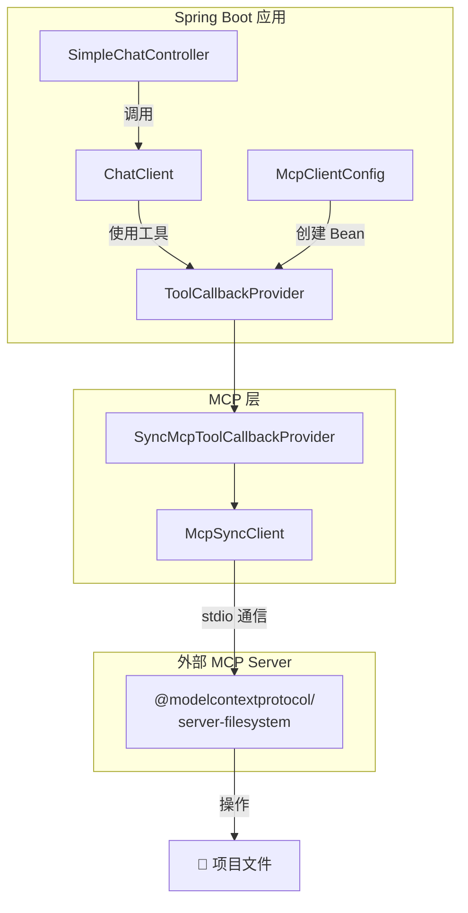

---

## 六、两个接口的区别
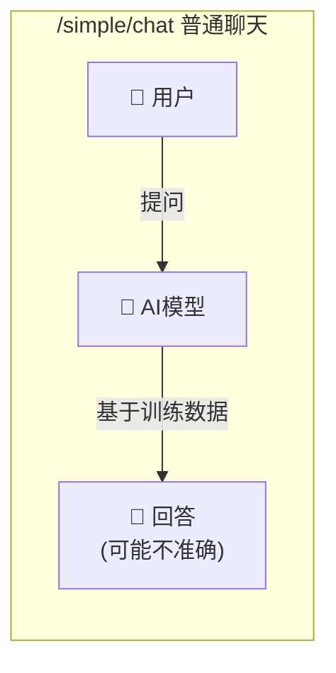

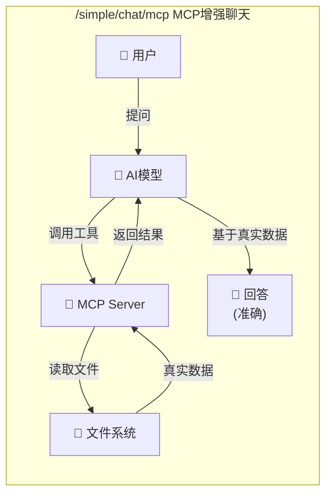

| 对比项 | `/simple/chat` | `/simple/chat/mcp` |
| --- | --- | --- |
| **数据来源** | AI 训练数据 | 真实文件系统 |
| **准确性** | 可能编造 | 真实准确 |
| **能力** | 只能回答 | 可以执行操作 |
| **文件读取** | ❌ | ✅ |
| **文件创建** | ❌ | ✅ |
| **目录列表** | ❌ | ✅ |
| **文件搜索** | ❌ | ✅ |


---

## 七、实际使用演示
### 7.1 启动项目
确保你的环境满足：

+ Node.js（npx 命令需要）
+ Java 17+
+ 项目正常启动（端口 6089）

### 7.2 测试对比
#### 场景1：询问项目文件内容
**普通接口（/simple/chat）：**

```bash
curl "http://localhost:6089/simple/chat?prompt=帮我读取pom.xml文件内容"
```

返回结果：AI 会**编造**一个 pom.xml 的内容，或者说它无法访问文件。

**MCP 接口（/simple/chat/mcp）：**

```bash
curl "http://localhost:6089/simple/chat/mcp?prompt=帮我读取pom.xml文件内容"
```

返回结果：AI 会**真实读取** `/Applications/java/idea_work_my/gitee/damai-ai/pom.xml` 文件，并返回实际内容！

#### 场景2：查看项目目录结构
```bash
curl "http://localhost:6089/simple/chat/mcp?prompt=列出src/main/java目录下的所有文件和文件夹"
```

AI 会通过 MCP 调用文件系统，返回**真实的目录结构**。

#### 场景3：搜索代码文件
```bash
curl "http://localhost:6089/simple/chat/mcp?prompt=在项目中搜索所有包含MCP关键字的Java文件"
```

AI 会搜索项目目录，找到所有包含 "MCP" 的 `.java` 文件。

#### 场景4：创建文件
```bash
curl "http://localhost:6089/simple/chat/mcp?prompt=在项目根目录创建一个hello.txt文件，内容是Hello MCP"
```

AI 会**真实创建**这个文件！

---

## 八、MCP 完整工作流程
### 8.1 请求处理流程
以用户请求"帮我读取pom.xml文件内容"为例：

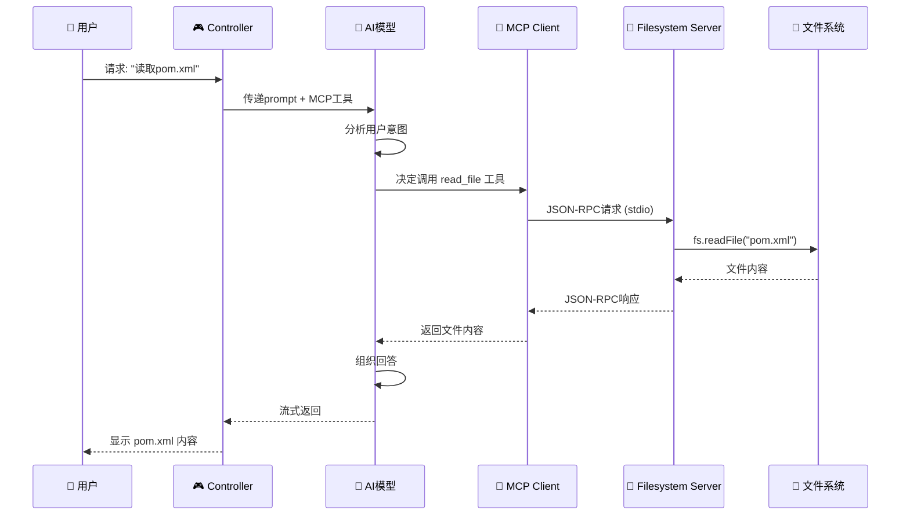

### 8.2 工具发现与调用流程
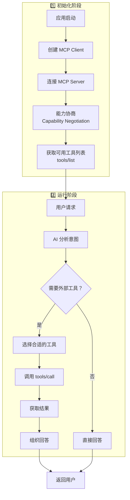

### 8.3 MCP Filesystem Server 提供的工具
| 工具名 | 功能 | 示例 |
| --- | --- | --- |
| `read_file` | 读取文件内容 | 读取 pom.xml |
| `write_file` | 写入文件内容 | 创建新文件 |
| `list_directory` | 列出目录内容 | 查看 src 目录 |
| `create_directory` | 创建目录 | 创建新文件夹 |
| `move_file` | 移动文件 | 重命名或移动 |
| `search_files` | 搜索文件 | 查找 .java 文件 |
| `get_file_info` | 获取文件信息 | 查看文件大小、时间 |


---

## 九、常见问题
### Q1: MCP 和 Function Calling 有什么区别？
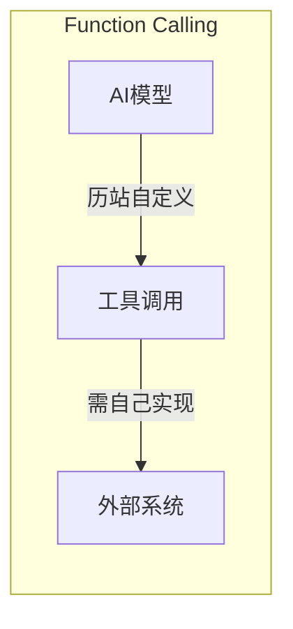

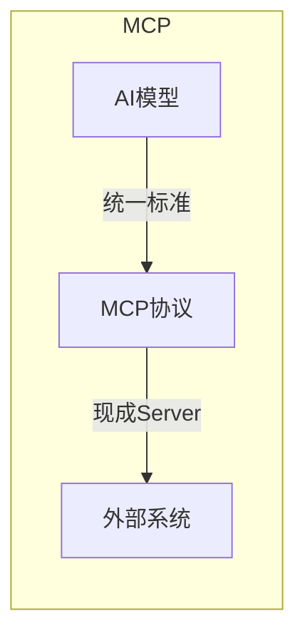

| 特性 | Function Calling | MCP |
| --- | --- | --- |
| **定义方** | 各 AI 厂商自定义 | 开放标准协议 |
| **通用性** | 仅限特定模型 | 跨模型通用 |
| **工具实现** | 需要自己写代码 | 有大量现成服务器 |
| **通信方式** | HTTP/内部调用 | stdio/HTTP (标准化) |
| **生态系统** | 无 | 有丰富的 MCP Server 生态 |


### Q2: 为什么用 stdio 而不是 HTTP？
MCP 支持两种传输方式：

| 传输方式 | 适用场景 | 优势 |
| --- | --- | --- |
| **stdio** | 本地 MCP Server | 🚀 低延迟、🔒 更安全、🎯 更简单 |
| **Streamable HTTP** | 远程 MCP Server | 🌐 网络访问、🔑 支持OAuth |


### Q3: 这个 MCP 服务器安全吗？
安全！因为：

1. **目录隔离**：只能访问配置中指定的目录
2. **无网络暴露**：MCP 服务器不监听任何端口
3. **权限继承**：继承运行用户的文件权限

### Q4: 如何添加更多 MCP Server？
修改 `mcp-servers.json` 配置文件：

```json
{
  "mcpServers": {
    "filesystem": {
      "command": "npx",
      "args": ["-y", "@modelcontextprotocol/server-filesystem", "/your/path"]
    },
    "memory": {
      "command": "npx",
      "args": ["-y", "@modelcontextprotocol/server-memory"]
    }
  }
}
```

### Q5: 官方提供了哪些 MCP Server？
| Server | 功能 | npm 包名 |
| --- | --- | --- |
| Filesystem | 文件系统操作 | `@modelcontextprotocol/server-filesystem` |
| Memory | 知识图谱存储 | `@modelcontextprotocol/server-memory` |
| Sequential Thinking | 复杂问题推理 | `@modelcontextprotocol/server-sequential-thinking` |
| Playwright | 浏览器自动化 | `@playwright/mcp` |
| MongoDB | 数据库操作 | `mongodb-mcp-server` |


## 十、总结
### MCP 的核心价值
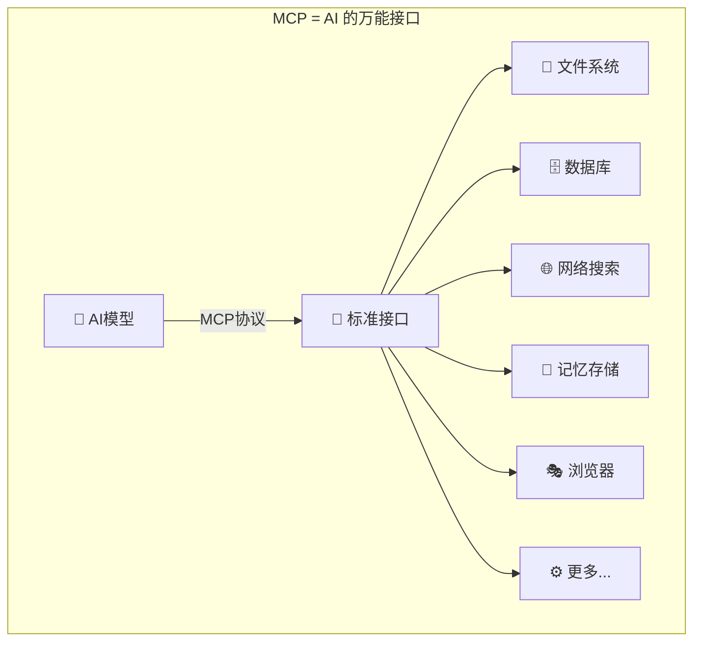

### 参考资料
+ **官方文档**：[https://modelcontextprotocol.io](https://modelcontextprotocol.io)
+ **官方 GitHub**：[https://github.com/modelcontextprotocol](https://github.com/modelcontextprotocol)
+ **官方 Servers 仓库**：[https://github.com/modelcontextprotocol/servers](https://github.com/modelcontextprotocol/servers)
+ **Spring AI 文档**：[https://docs.spring.io/spring-ai](https://docs.spring.io/spring-ai)

<VipInline />