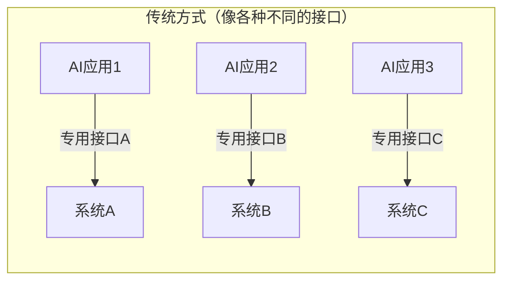
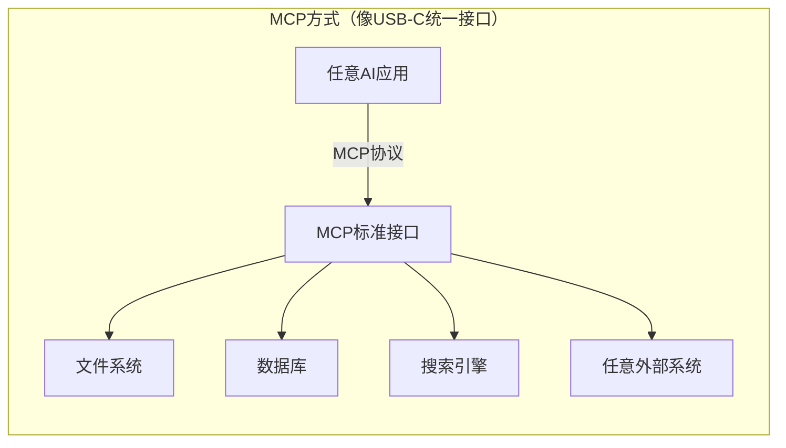

# MCP（Model Context Protocol）详解

import VipInline from '@site/src/components/VipInline';

## 一、MCP 是什么？
**MCP（Model Context Protocol，模型上下文协议）** 是由 Anthropic 公司推出的一个**开源标准协议**，用于连接 AI 应用程序与外部系统。

> 官方定义：MCP is an open-source standard for connecting AI applications to external systems.
>
> 官方文档：[https://modelcontextprotocol.io](https://modelcontextprotocol.io)
>

### 用一个比喻来理解
**官方比喻：MCP 就像 AI 应用的 USB-C 接口**

就像 USB-C 为各种电子设备提供了标准化的连接方式一样，MCP 为 AI 应用程序连接外部系统提供了标准化的方式。

### 另一个比喻
+ **AI 模型**就像一个非常聪明的"大脑"，它懂很多知识，能回答各种问题
+ 但这个"大脑"**被关在一个房间里**，它看不到外面的世界，也无法操作任何东西
+ **MCP** 就像是给这个房间装了一扇"窗户"和一双"手"，让 AI 能够：
    - 👀 **看到**外部世界的真实数据（文件、数据库、API等）
    - 🤚 **操作**外部系统（读写文件、调用服务等）

<VipInline />
