# 项目采集维度的升级

数据采集系统采用**多维度渐进式采集策略**，通过时间维度和业务维度的组合，实现从细粒度到粗粒度的数据统计。系统会利用 Kafka 实现自动完成维度升级，确保数据在不同维度下的完整性和准确性。

## 维度说明

**时间维度（DateType）**
- **日（DAY）**：按天统计数据
- **周（WEEK）**：按周统计数据
- **月（MONTH）**：按月统计数据
- **年（YEAR）**：按年统计数据

**业务维度（VideoDimensionType）**
- **视频（VIDEO）**：单个视频维度的数据采集
- **视频分类（VIDEO_TYPE）**：视频分类维度的数据汇总
- **父级视频分类（PARENT_VIDEO_TYPE）**：顶层分类维度的数据汇总

## 升级策略

系统采用"**时间维度优先，业务维度递进**"的升级策略：

1. **时间维度升级**：在同一业务维度下，时间维度按 `日 → 周 → 月 → 年` 的顺序逐级升级
2. **业务维度升级**：当时间维度达到"年"时，升级业务维度并将时间重置为"日"，业务维度按 `视频 → 视频分类 → 父级视频分类` 的顺序升级
3. **终止条件**：当达到 `年 + 父级视频分类` 时，表示所有维度组合的数据采集完成

## 完整升级路径

整个升级过程会经历 **3个业务维度 × 4个时间维度 = 12次采集**：

| 阶段 | 业务维度 | 时间维度升级路径 |
|------|---------|----------------|
| 第1轮 | 视频 | 日 → 周 → 月 → 年 |
| 第2轮 | 视频分类 | 日 → 周 → 月 → 年 |
| 第3轮 | 父级视频分类 | 日 → 周 → 月 → 年 ✓ |

## 流程图

以下时序图展示了维度升级的完整循环过程，从初始维度（日 + 视频）开始，通过 Kafka 消息驱动，不断采集数据并升级维度，直到达到最高维度（年 + 父级视频分类）为止。

```mermaid
%%{init: {'theme':'base', 'themeVariables': { 'primaryColor':'#d4e6ff','primaryTextColor':'#1a4d99','primaryBorderColor':'#1a4d99','lineColor':'#2c73d2','secondaryColor':'#ffd4e0','secondaryTextColor':'#cc1f4d','secondaryBorderColor':'#ff4573','tertiaryColor':'#ffe8ee','tertiaryTextColor':'#cc1f4d','tertiaryBorderColor':'#ff4573','noteBkgColor':'#ffd4e0','noteTextColor':'#cc1f4d','noteBorderColor':'#ff4573','actorBkg':'#d4e6ff','actorBorder':'#1a4d99','actorTextColor':'#1a4d99','actorLineColor':'#2c73d2','signalColor':'#2c73d2','signalTextColor':'#1a4d99','labelBoxBkgColor':'#ffd4e0','labelBoxBorderColor':'#ff4573','labelTextColor':'#cc1f4d','loopTextColor':'#cc1f4d','activationBorderColor':'#1a4d99','activationBkgColor':'#d4e6ff','sequenceNumberColor':'#ffffff'}}}%%
sequenceDiagram
    participant S as 数据采集系统
    participant U as 维度升级处理器
    participant K as Kafka消息队列
    
    Note over S: 初始维度：日 + 视频
    S->>S: 采集数据并保存
    S->>U: 请求维度升级
    U->>U: 检查是否已达最高维度?
    
    alt 未达最高维度
        U->>U: 执行维度升级
        Note over U: 日→周→月→年<br/>逐级升级时间维度
        U->>K: 发送升级后的维度消息
        K-->>S: 消费消息，用新维度采集
        Note over S: 新维度：周 + 视频
        S->>S: 采集数据并保存
        S->>U: 请求维度升级
        U->>U: 升级维度
        Note over U: 周→月
        U->>K: 发送消息
        K-->>S: 触发采集
        Note over S: 新维度：月 + 视频
        S->>S: 采集数据并保存
        S->>U: 请求维度升级
        U->>U: 升级维度
        Note over U: 月→年
        U->>K: 发送消息
        K-->>S: 触发采集
        Note over S: 新维度：年 + 视频
        S->>S: 采集数据并保存
        S->>U: 请求维度升级
        U->>U: 升级维度
        Note over U: 时间到达年维度后<br/>升级业务维度<br/>视频→视频分类<br/>时间重置为日
        U->>K: 发送消息
        K-->>S: 触发采集
        Note over S: 新维度：日 + 视频分类
        S->>S: 采集数据并保存
        S->>U: 请求维度升级
        Note over U: 继续时间维度升级<br/>日→周→月→年
        U->>K: 持续升级...
        Note over S: 新维度：年 + 视频分类
        S->>S: 采集数据并保存
        S->>U: 请求维度升级
        U->>U: 升级维度
        Note over U: 视频分类→父级视频分类<br/>时间重置为日
        U->>K: 发送消息
        K-->>S: 触发采集
        Note over S: 新维度：日 + 父级视频分类
        S->>S: 采集数据并保存
        S->>U: 请求维度升级
        Note over U: 继续时间维度升级<br/>日→周→月→年
        U->>K: 持续升级...
        Note over S: 最终维度：年 + 父级视频分类
        S->>S: 采集数据并保存
        S->>U: 请求维度升级
        U->>U: 检查已达最高维度！
    end
    
    alt 已达最高维度
        U->>S: 停止升级
        Note over S,K: 本轮采集完成
    end
```

## 关键特性

- ✅ **自动化升级**：通过 Kafka 消息机制实现维度自动升级，无需人工干预
- ✅ **数据完整性**：确保每个维度组合的数据都被完整采集
- ✅ **渐进式汇总**：从细粒度到粗粒度，逐步构建多层次的数据视图
- ✅ **循环终止控制**：通过最高维度检查机制，避免无限循环

## 实现类

核心实现位于 `UpgradeDimensionDataChainHandler` 类中：
- `handler()` - 维度升级处理入口
- `doUpgradeDimension()` - 执行维度升级并检查终止条件
- `upgradeDimensionParam()` - 维度升级核心逻辑