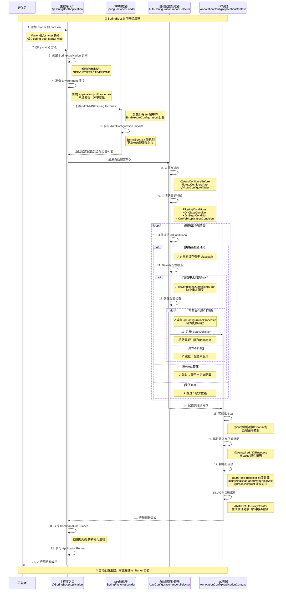

# SpringBoot Starter 自动装配的深度解析

# 一、痛点回顾：传统 Spring 项目的繁琐配置

还记得那些年我们配置 Spring 项目的场景吗？

想要搭建一个最基础的 Web 应用，你需要在 Maven 的 `pom.xml` 中添加一大堆依赖。打开文件，你会看到这样的画面：

```xml
<!-- Spring 核心容器 -->
<dependency>
    <groupId>org.springframework</groupId>
    <artifactId>spring-core</artifactId>
    <version>5.3.20</version>
</dependency>

<!-- Spring 上下文 -->
<dependency>
    <groupId>org.springframework</groupId>
    <artifactId>spring-context</artifactId>
    <version>5.3.20</version>
</dependency>

<!-- Spring MVC -->
<dependency>
    <groupId>org.springframework</groupId>
    <artifactId>spring-webmvc</artifactId>
    <version>5.3.20</version>
</dependency>

<!-- Servlet API -->
<dependency>
    <groupId>javax.servlet</groupId>
    <artifactId>javax.servlet-api</artifactId>
    <version>4.0.1</version>
</dependency>

<!-- 日志框架 -->
<dependency>
    <groupId>ch.qos.logback</groupId>
    <artifactId>logback-classic</artifactId>
    <version>1.2.11</version>
</dependency>

<!-- Jackson JSON 处理 -->
<dependency>
    <groupId>com.fasterxml.jackson.core</groupId>
    <artifactId>jackson-databind</artifactId>
    <version>2.13.3</version>
</dependency>
```

这还只是冰山一角！你还需要：

- 手动配置 `DispatcherServlet`
- 编写 `web.xml` 或 Java Config 配置类
- 配置视图解析器、静态资源处理器
- 设置消息转换器
- 配置异常处理器

**更糟糕的是版本兼容性问题**：Spring 5.3.20 应该搭配哪个版本的 Jackson？Servlet API 用 3.1 还是 4.0？一个版本选错，运行时就会抛出各种诡异的异常。

这种开发模式就像**手工作坊**——每次搭建项目都要从头做一遍重复劳动，效率低下且容易出错。

# 二、Starter 登场：SpringBoot 的杀手锏功能

SpringBoot 团队敏锐地意识到了这个痛点，于是提出了革命性的解决方案：**Starter（启动器）**。

## 2.1 什么是 Starter？

用最简单的话说：**Starter 就是一个预打包的依赖集合 + 自动配置方案**。

它就像从手工作坊升级到了现代化自动工厂：
- **原料仓库**：打包好所有需要的依赖 JAR
- **生产流水线**：自动完成 Bean 的装配和配置
- **质检标准**：确保所有组件版本互相兼容

## 2.2 实际效果对比

还是以 Web 应用为例，使用 Starter 后，你只需要在 `pom.xml` 中添加：

```xml
<dependency>
    <groupId>org.springframework.boot</groupId>
    <artifactId>spring-boot-starter-web</artifactId>
</dependency>
```

**仅此一行**！你会发现：

1. **版本号消失了**：SpringBoot 通过依赖管理机制统一控制版本
2. **依赖数量骤减**：一个 Starter 内部已经包含了所有必需的传递依赖
3. **配置文件不见了**：绝大部分配置都通过自动装配完成

这就是 Starter 的魔力所在。

## 2.3 Starter 解决的核心问题

| 传统方式的痛点               | Starter 的解决方案                         |
| ---------------------------- | ------------------------------------------ |
| 依赖管理混乱，版本冲突频发   | 统一依赖管理，官方测试过的版本组合         |
| 配置分散在多个文件，难以维护 | 集中在 `application.yml`，遵循约定优于配置 |
| 需要深入了解框架才能正确配置 | 开箱即用的默认配置，降低学习曲线           |
| 项目搭建耗时长，重复劳动多   | 秒级启动，专注业务开发                     |

# 三、揭秘黑盒：自动装配机制完全解析

Starter 能够"开箱即用"，核心秘密在于 SpringBoot 的 **自动装配（Auto-Configuration）** 机制。让我们逐层剥开这个黑盒。

## 3.1 启动入口：@SpringBootApplication 注解

每个 SpringBoot 项目的启动类都有这个注解：

```java
@SpringBootApplication
public class Application {
    public static void main(String[] args) {
        SpringApplication.run(Application.class, args);
    }
}
```

这个注解是一个组合注解，核心成员包括：

```java
@Target(ElementType.TYPE)
@Retention(RetentionPolicy.RUNTIME)
@Configuration
@EnableAutoConfiguration  // ← 自动装配的开关
@ComponentScan
public @interface SpringBootApplication {
    // ...
}
```

关键就是 `@EnableAutoConfiguration`，它会触发整个自动装配流程。

## 3.2 配置类的发现机制

### SpringBoot 2.x 的方式

在 SpringBoot 2.x 中，框架会读取所有 JAR 包中的 `META-INF/spring.factories` 文件。

典型的 `spring.factories` 内容：

```properties
# 键是固定的接口类型，值是具体的实现类列表
org.springframework.boot.autoconfigure.EnableAutoConfiguration=\
  com.example.autoconfigure.RedisAutoConfiguration,\
  com.example.autoconfigure.KafkaAutoConfiguration,\
  com.example.autoconfigure.DataSourceAutoConfiguration
```

SpringBoot 启动时会扫描类路径下所有这样的文件，收集所有声明的自动配置类。

### SpringBoot 3.x 的改进

SpringBoot 3.x 废弃了 `spring.factories` 方式，改为更清晰的文件结构：

文件路径：`META-INF/spring/org.springframework.boot.autoconfigure.AutoConfiguration.imports`

文件内容（每行一个配置类）：

```text
com.example.autoconfigure.RedisAutoConfiguration
com.example.autoconfigure.KafkaAutoConfiguration
com.example.autoconfigure.DataSourceAutoConfiguration
```

**优势**：
- 结构更清晰，不同类型的扩展点使用不同的文件
- 性能更好，解析速度更快
- 支持注释，方便维护

## 3.3 条件化装配：智能决策系统

SpringBoot 不会无脑加载所有配置类，而是通过**条件注解**进行智能筛选。

### 常用条件注解

```java
// 示例：Redis 自动配置类
@Configuration
@ConditionalOnClass(RedisOperations.class)  // 类路径存在 RedisOperations 时才生效
@EnableConfigurationProperties(RedisProperties.class)  // 启用配置属性绑定
public class RedisAutoConfiguration {
    
    @Bean
    @ConditionalOnMissingBean(name = "redisTemplate")  // 用户未自定义时才创建
    public RedisTemplate<Object, Object> redisTemplate(
            RedisConnectionFactory connectionFactory) {
        RedisTemplate<Object, Object> template = new RedisTemplate<>();
        template.setConnectionFactory(connectionFactory);
        return template;
    }
    
    @Bean
    @ConditionalOnProperty(
        name = "spring.redis.client-type", 
        havingValue = "lettuce", 
        matchIfMissing = true  // 配置缺失时也匹配
    )
    public LettuceConnectionFactory lettuceConnectionFactory(RedisProperties properties) {
        // ...
    }
}
```

### 条件注解速查表

| 注解                         | 作用                         | 示例                                                         |
| ---------------------------- | ---------------------------- | ------------------------------------------------------------ |
| `@ConditionalOnClass`        | 类路径存在指定类时生效       | `@ConditionalOnClass(DataSource.class)`                      |
| `@ConditionalOnMissingClass` | 类路径不存在指定类时生效     | `@ConditionalOnMissingClass("com.mongodb.client.MongoClient")` |
| `@ConditionalOnBean`         | 容器中存在指定 Bean 时生效   | `@ConditionalOnBean(DataSource.class)`                       |
| `@ConditionalOnMissingBean`  | 容器中不存在指定 Bean 时生效 | `@ConditionalOnMissingBean(RedisTemplate.class)`             |
| `@ConditionalOnProperty`     | 配置文件存在指定属性时生效   | `@ConditionalOnProperty(name="app.feature.enabled")`         |
| `@ConditionalOnExpression`   | SpEL 表达式为 true 时生效    | `@ConditionalOnExpression("${app.cache.size} > 100")`        |

## 3.4 配置属性绑定：类型安全的配置管理

SpringBoot 通过 `@ConfigurationProperties` 实现配置属性的类型安全绑定：

```java
@ConfigurationProperties(prefix = "spring.datasource")
public class DataSourceProperties {
    private String url;
    private String username;
    private String password;
    private String driverClassName = "com.mysql.cj.jdbc.Driver";  // 默认值
    private int maxPoolSize = 10;
    
    // getters and setters
}
```

在 `application.yml` 中配置：

```yaml
spring:
  datasource:
    url: jdbc:mysql://localhost:3306/mydb
    username: root
    password: secret
    max-pool-size: 20
```

SpringBoot 会自动将配置文件的值绑定到 `DataSourceProperties` 对象，支持：
- 类型转换（String → int、boolean 等）
- 复杂对象嵌套
- 集合类型（List、Map）
- 配置验证（结合 `@Validated` 和 JSR-303 注解）

## 3.5 完整流程图示

```
应用启动
    ↓
@SpringBootApplication 触发
    ↓
@EnableAutoConfiguration 生效
    ↓
扫描 META-INF/spring.factories 或 AutoConfiguration.imports
    ↓
收集所有自动配置类（可能上百个）
    ↓
逐个评估条件注解（@ConditionalOnXxx）
    ↓
满足条件的配置类被加载
    ↓
创建并注册 Bean 到 Spring 容器
    ↓
绑定配置属性（@ConfigurationProperties）
    ↓
应用启动完成，功能可用
```

# 四、实战演练：从零构建一个生产级 Starter

理论讲完，我们来动手实践。假设我们要开发一个**短信发送服务的 Starter**，支持阿里云和腾讯云两种实现。

## 4.1 项目结构设计

```
sms-spring-boot-starter/
├── pom.xml
├── src/
│   ├── main/
│   │   ├── java/
│   │   │   └── com/example/sms/
│   │   │       ├── autoconfigure/
│   │   │       │   ├── SmsAutoConfiguration.java        # 自动配置类
│   │   │       │   ├── SmsProperties.java               # 配置属性
│   │   │       │   ├── AliyunSmsConfiguration.java      # 阿里云配置
│   │   │       │   └── TencentSmsConfiguration.java     # 腾讯云配置
│   │   │       ├── service/
│   │   │       │   ├── SmsService.java                  # 服务接口
│   │   │       │   ├── AliyunSmsServiceImpl.java        # 阿里云实现
│   │   │       │   └── TencentSmsServiceImpl.java       # 腾讯云实现
│   │   │       └── exception/
│   │   │           └── SmsException.java                # 自定义异常
│   │   └── resources/
│   │       └── META-INF/
│   │           └── spring/
│   │               └── org.springframework.boot.autoconfigure.AutoConfiguration.imports
```

## 4.2 核心代码实现

### 1. 配置属性类

```java
@ConfigurationProperties(prefix = "sms")
@Data
public class SmsProperties {
    
    /**
     * 短信服务提供商：aliyun 或 tencent
     */
    private String provider = "aliyun";
    
    /**
     * 访问密钥 ID
     */
    private String accessKeyId;
    
    /**
     * 访问密钥
     */
    private String accessKeySecret;
    
    /**
     * 短信签名
     */
    private String signName;
    
    /**
     * 短信模板 ID
     */
    private String templateCode;
    
    /**
     * 是否启用短信服务
     */
    private boolean enabled = true;
    
    /**
     * 连接超时时间（毫秒）
     */
    private int connectTimeout = 5000;
    
    /**
     * 读取超时时间（毫秒）
     */
    private int readTimeout = 10000;
}
```

### 2. 服务接口与实现

```java
public interface SmsService {
    /**
     * 发送短信
     * @param phoneNumber 手机号
     * @param params 模板参数
     * @return 是否发送成功
     */
    boolean sendSms(String phoneNumber, Map<String, String> params);
}

@Slf4j
public class AliyunSmsServiceImpl implements SmsService {
    
    private final SmsProperties properties;
    
    public AliyunSmsServiceImpl(SmsProperties properties) {
        this.properties = properties;
        log.info("初始化阿里云短信服务，签名：{}", properties.getSignName());
    }
    
    @Override
    public boolean sendSms(String phoneNumber, Map<String, String> params) {
        log.info("通过阿里云发送短信到：{}", phoneNumber);
        // 实际调用阿里云 SDK
        try {
            // AliyunSmsClient.send(...)
            return true;
        } catch (Exception e) {
            log.error("短信发送失败", e);
            throw new SmsException("短信发送失败", e);
        }
    }
}

@Slf4j
public class TencentSmsServiceImpl implements SmsService {
    
    private final SmsProperties properties;
    
    public TencentSmsServiceImpl(SmsProperties properties) {
        this.properties = properties;
        log.info("初始化腾讯云短信服务，签名：{}", properties.getSignName());
    }
    
    @Override
    public boolean sendSms(String phoneNumber, Map<String, String> params) {
        log.info("通过腾讯云发送短信到：{}", phoneNumber);
        // 实际调用腾讯云 SDK
        try {
            // TencentSmsClient.send(...)
            return true;
        } catch (Exception e) {
            log.error("短信发送失败", e);
            throw new SmsException("短信发送失败", e);
        }
    }
}
```

### 3. 自动配置类

```java
@Configuration
@EnableConfigurationProperties(SmsProperties.class)
@ConditionalOnProperty(prefix = "sms", name = "enabled", havingValue = "true", matchIfMissing = true)
@Slf4j
public class SmsAutoConfiguration {
    
    @Configuration
    @ConditionalOnProperty(prefix = "sms", name = "provider", havingValue = "aliyun", matchIfMissing = true)
    static class AliyunSmsConfiguration {
        
        @Bean
        @ConditionalOnMissingBean(SmsService.class)
        public SmsService aliyunSmsService(SmsProperties properties) {
            log.info("自动装配阿里云短信服务");
            return new AliyunSmsServiceImpl(properties);
        }
    }
    
    @Configuration
    @ConditionalOnProperty(prefix = "sms", name = "provider", havingValue = "tencent")
    static class TencentSmsConfiguration {
        
        @Bean
        @ConditionalOnMissingBean(SmsService.class)
        public SmsService tencentSmsService(SmsProperties properties) {
            log.info("自动装配腾讯云短信服务");
            return new TencentSmsServiceImpl(properties);
        }
    }
}
```

### 4. 注册自动配置

在 `META-INF/spring/org.springframework.boot.autoconfigure.AutoConfiguration.imports` 中添加：

```text
com.example.sms.autoconfigure.SmsAutoConfiguration
```

## 4.3 使用 Starter

### 1. 引入依赖

```xml
<dependency>
    <groupId>com.example</groupId>
    <artifactId>sms-spring-boot-starter</artifactId>
    <version>1.0.0</version>
</dependency>
```

### 2. 配置文件

```yaml
sms:
  enabled: true
  provider: aliyun  # 或 tencent
  access-key-id: YOUR_ACCESS_KEY_ID
  access-key-secret: YOUR_ACCESS_KEY_SECRET
  sign-name: 我的网站
  template-code: SMS_123456789
  connect-timeout: 5000
  read-timeout: 10000
```

### 3. 业务代码中使用

```java
@RestController
@RequestMapping("/api/auth")
public class AuthController {
    
    @Autowired
    private SmsService smsService;  // 自动注入
    
    @PostMapping("/send-code")
    public Result sendVerifyCode(@RequestParam String phone) {
        Map<String, String> params = new HashMap<>();
        params.put("code", generateCode());
        
        boolean success = smsService.sendSms(phone, params);
        return success ? Result.ok() : Result.fail("发送失败");
    }
}
```

**完全零配置**，直接注入使用！

## 4.4 高级特性：配置提示

为了让 IDE 提供配置文件的智能提示，可以添加元数据文件：

`META-INF/spring-configuration-metadata.json`

```json
{
  "groups": [
    {
      "name": "sms",
      "type": "com.example.sms.autoconfigure.SmsProperties",
      "sourceType": "com.example.sms.autoconfigure.SmsProperties"
    }
  ],
  "properties": [
    {
      "name": "sms.provider",
      "type": "java.lang.String",
      "description": "短信服务提供商，可选值：aliyun、tencent",
      "defaultValue": "aliyun"
    },
    {
      "name": "sms.access-key-id",
      "type": "java.lang.String",
      "description": "访问密钥 ID"
    },
    {
      "name": "sms.enabled",
      "type": "java.lang.Boolean",
      "description": "是否启用短信服务",
      "defaultValue": true
    }
  ]
}
```

这样在 IDEA 或 VSCode 中编辑 `application.yml` 时就会有智能提示和文档说明。

# 五、版本差异：SpringBoot 2.x 与 3.x 的关键变更

| 对比维度     | SpringBoot 2.x              | SpringBoot 3.x                                               |
| ------------ | --------------------------- | ------------------------------------------------------------ |
| 配置文件路径 | `META-INF/spring.factories` | `META-INF/spring/org.springframework.boot.autoconfigure.AutoConfiguration.imports` |
| 文件格式     | 键值对（Properties 格式）   | 每行一个类名（纯文本）                                       |
| 是否支持注释 | 不支持                      | 支持（`#` 开头的行）                                         |
| 多个配置类   | 用逗号或反斜杠换行连接      | 每行一个类                                                   |
| 性能         | 需解析 Properties 格式      | 直接按行读取，更快                                           |

# 六、官方 Starter 生态全景图

SpringBoot 官方提供了丰富的 Starter 家族，覆盖了几乎所有常见场景。

## 6.1 Web 开发类

| Starter                          | 用途                | 核心组件                       |
| -------------------------------- | ------------------- | ------------------------------ |
| `spring-boot-starter-web`        | MVC Web 应用        | Spring MVC + Tomcat            |
| `spring-boot-starter-webflux`    | 响应式 Web 应用     | Spring WebFlux + Reactor Netty |
| `spring-boot-starter-jersey`     | JAX-RS Web 应用     | Jersey                         |
| `spring-boot-starter-websocket`  | WebSocket 支持      | Spring WebSocket               |
| `spring-boot-starter-thymeleaf`  | Thymeleaf 模板引擎  | Thymeleaf                      |
| `spring-boot-starter-freemarker` | Freemarker 模板引擎 | Freemarker                     |

## 6.2 数据访问类

| Starter                                  | 用途              | 核心组件                    |
| ---------------------------------------- | ----------------- | --------------------------- |
| `spring-boot-starter-data-jpa`           | JPA 持久化        | Spring Data JPA + Hibernate |
| `spring-boot-starter-data-jdbc`          | JDBC 访问         | Spring Data JDBC            |
| `spring-boot-starter-data-redis`         | Redis 缓存        | Spring Data Redis + Lettuce |
| `spring-boot-starter-data-mongodb`       | MongoDB 文档库    | Spring Data MongoDB         |
| `spring-boot-starter-data-elasticsearch` | 搜索引擎          | Spring Data Elasticsearch   |
| `spring-boot-starter-jdbc`               | 原生 JDBC         | HikariCP 连接池             |
| `spring-boot-starter-jooq`               | JOOQ 类型安全查询 | JOOQ                        |

## 6.3 消息队列类

| Starter                        | 用途              | 核心组件       |
| ------------------------------ | ----------------- | -------------- |
| `spring-boot-starter-amqp`     | RabbitMQ 消息队列 | Spring AMQP    |
| `spring-boot-starter-kafka`    | Kafka 流处理      | Spring Kafka   |
| `spring-boot-starter-activemq` | ActiveMQ 消息队列 | ActiveMQ       |
| `spring-boot-starter-artemis`  | Artemis 消息队列  | Apache Artemis |

## 6.4 安全与监控类

| Starter                             | 用途          | 核心组件               |
| ----------------------------------- | ------------- | ---------------------- |
| `spring-boot-starter-security`      | 安全认证授权  | Spring Security        |
| `spring-boot-starter-oauth2-client` | OAuth2 客户端 | Spring Security OAuth2 |
| `spring-boot-starter-actuator`      | 生产监控      | Spring Boot Actuator   |
| `spring-boot-starter-validation`    | 数据校验      | Hibernate Validator    |

## 6.5 其他常用类

| Starter                       | 用途         | 核心组件             |
| ----------------------------- | ------------ | -------------------- |
| `spring-boot-starter-aop`     | 面向切面编程 | Spring AOP + AspectJ |
| `spring-boot-starter-cache`   | 缓存抽象     | Spring Cache         |
| `spring-boot-starter-mail`    | 邮件发送     | JavaMail             |
| `spring-boot-starter-quartz`  | 定时任务     | Quartz Scheduler     |
| `spring-boot-starter-logging` | 日志框架     | Logback + SLF4J      |
| `spring-boot-starter-test`    | 测试支持     | JUnit 5 + Mockito    |

## 6.6 第三方生态

除了官方 Starter，社区也贡献了大量优秀的第三方 Starter：

- `mybatis-spring-boot-starter`：MyBatis ORM 框架
- `pagehelper-spring-boot-starter`：分页插件
- `druid-spring-boot-starter`：Druid 数据库连接池
- `knife4j-spring-boot-starter`：增强版 Swagger 文档
- `sa-token-spring-boot-starter`：轻量级权限框架

**命名规范**：
- 官方 Starter：`spring-boot-starter-{name}`
- 第三方 Starter：`{name}-spring-boot-starter`

# 七、最佳实践与踩坑指南

## 7.1 自定义 Starter 的最佳实践

### 1. 命名规范

遵循社区约定：`{project}-spring-boot-starter`

❌ **错误命名**：
- `spring-boot-starter-myproject`（与官方命名冲突）
- `mystarter`（没有明确的语义）

✅ **正确命名**：
- `myproject-spring-boot-starter`
- `mycompany-redis-spring-boot-starter`

### 2. 模块拆分

建议将 Starter 拆分为两个模块：

```
myproject-spring-boot-starter/        # 依赖聚合模块（仅 POM）
myproject-spring-boot-autoconfigure/  # 自动配置逻辑模块
```

**好处：**

- 用户可以选择性引入自动配置
- 便于在不同版本间复用自动配置逻辑

示例 `pom.xml`：

```xml
<!-- myproject-spring-boot-starter 的 pom.xml -->
<dependencies>
    <!-- 自动配置模块 -->
    <dependency>
        <groupId>com.example</groupId>
        <artifactId>myproject-spring-boot-autoconfigure</artifactId>
    </dependency>
    
    <!-- 核心业务模块 -->
    <dependency>
        <groupId>com.example</groupId>
        <artifactId>myproject-core</artifactId>
    </dependency>
    
    <!-- 可选依赖 -->
    <dependency>
        <groupId>com.some.library</groupId>
        <artifactId>some-library</artifactId>
        <optional>true</optional>
    </dependency>
</dependencies>
```

### 3. 配置属性的设计

- 提供合理的默认值
- 使用层次化的配置结构
- 添加 JSR-303 校验注解

```java
@ConfigurationProperties(prefix = "myproject")
@Validated
public class MyProjectProperties {
    
    /**
     * 是否启用
     */
    private boolean enabled = true;
    
    /**
     * 服务端点配置
     */
    private Endpoint endpoint = new Endpoint();
    
    /**
     * 连接池配置
     */
    private Pool pool = new Pool();
    
    @Data
    public static class Endpoint {
        @NotBlank(message = "服务地址不能为空")
        private String url;
        
        @Min(1)
        @Max(65535)
        private int port = 8080;
    }
    
    @Data
    public static class Pool {
        @Min(1)
        private int minSize = 5;
        
        @Min(1)
        private int maxSize = 20;
        
        @Min(1000)
        private long maxWaitMillis = 30000;
    }
}
```

### 4. 条件注解的合理使用

```java
@Configuration
@ConditionalOnClass(MyService.class)  // 确保类路径存在
@ConditionalOnProperty(
    prefix = "myproject", 
    name = "enabled", 
    havingValue = "true", 
    matchIfMissing = true  // 配置缺失时默认启用
)
@EnableConfigurationProperties(MyProjectProperties.class)
public class MyProjectAutoConfiguration {
    
    @Bean
    @ConditionalOnMissingBean  // 允许用户覆盖
    public MyService myService(MyProjectProperties properties) {
        return new MyServiceImpl(properties);
    }
    
    @Bean
    @ConditionalOnBean(DataSource.class)  // 依赖其他 Bean
    @ConditionalOnMissingBean
    public MyDataService myDataService(DataSource dataSource) {
        return new MyDataServiceImpl(dataSource);
    }
}
```

## 7.2 常见坑点与解决方案

### 坑点 1：循环依赖

**问题**：自动配置类之间相互依赖导致启动失败

```java
// 错误示例
@Configuration
public class ConfigA {
    @Bean
    public ServiceA serviceA(ServiceB serviceB) {  // 依赖 ServiceB
        return new ServiceA(serviceB);
    }
}

@Configuration
public class ConfigB {
    @Bean
    public ServiceB serviceB(ServiceA serviceA) {  // 依赖 ServiceA
        return new ServiceB(serviceA);
    }
}
```

**解决方案**：
- 使用 `@Lazy` 注解延迟加载
- 重新设计依赖关系
- 使用 `ObjectProvider<T>` 替代直接注入

```java
@Bean
public ServiceA serviceA(ObjectProvider<ServiceB> serviceBProvider) {
    return new ServiceA(serviceBProvider.getIfAvailable());
}
```

### 坑点 2：自动配置不生效

**排查步骤**：

1. 检查 `AutoConfiguration.imports` 文件是否正确配置
2. 开启 Debug 日志查看条件评估结果

```yaml
logging:
  level:
    org.springframework.boot.autoconfigure: DEBUG
```

3. 使用 Actuator 的 `/conditions` 端点查看

```xml
<dependency>
    <groupId>org.springframework.boot</groupId>
    <artifactId>spring-boot-starter-actuator</artifactId>
</dependency>
```

访问：`http://localhost:8080/actuator/conditions`

### 坑点 3：版本冲突

**问题**：引入多个 Starter 导致依赖版本冲突

**解决方案**：

1. 使用 Maven 的依赖管理

```xml
<dependencyManagement>
    <dependencies>
        <dependency>
            <groupId>org.springframework.boot</groupId>
            <artifactId>spring-boot-dependencies</artifactId>
            <version>3.2.0</version>
            <type>pom</type>
            <scope>import</scope>
        </dependency>
    </dependencies>
</dependencyManagement>
```

2. 使用 `<exclusions>` 排除冲突依赖

```xml
<dependency>
    <groupId>com.example</groupId>
    <artifactId>some-starter</artifactId>
    <exclusions>
        <exclusion>
            <groupId>org.slf4j</groupId>
            <artifactId>slf4j-log4j12</artifactId>
        </exclusion>
    </exclusions>
</dependency>
```

3. 使用 Maven 命令查看依赖树

```bash
mvn dependency:tree -Dverbose
```

### 坑点 4：配置属性不生效

**常见原因**：

1. 忘记添加 `@EnableConfigurationProperties`
2. 配置文件语法错误（YAML 缩进）
3. 配置属性名称不匹配（驼峰 vs 短横线）

**解决方案**：

SpringBoot 支持松散绑定，以下写法都有效：

```yaml
# 短横线分隔（推荐）
my-project:
  access-key-id: xxx

# 驼峰命名
myProject:
  accessKeyId: xxx

# 下划线分隔
my_project:
  access_key_id: xxx
```

对应的 Java 类：

```java
@ConfigurationProperties(prefix = "my-project")
public class MyProjectProperties {
    private String accessKeyId;  // 驼峰命名
}
```

## 八、总结

### 核心要点回顾

1. **Starter 的本质**：依赖聚合 + 自动配置的完美结合
2. **自动装配机制**：通过条件注解实现智能装配，既有默认配置又允许灵活覆盖
3. **版本演进**：SpringBoot 3.x 的配置文件机制更清晰、性能更优
4. **最佳实践**：遵循命名规范、合理拆分模块、提供完善的配置属性

### Starter 的价值

- **开发效率**：从"手工作坊"升级到"自动化工厂"
- **降低门槛**：新手也能快速上手复杂框架
- **质量保证**：官方测试的依赖组合，减少版本冲突
- **生态繁荣**：统一的扩展机制促进了社区贡献

### 延伸阅读

- [Spring Boot 官方文档 - Creating Your Own Auto-configuration](https://docs.spring.io/spring-boot/docs/current/reference/html/features.html#features.developing-auto-configuration)
- [Spring Boot 3.0 迁移指南](https://github.com/spring-projects/spring-boot/wiki/Spring-Boot-3.0-Migration-Guide)
- [Awesome Spring Boot](https://github.com/stunstunstun/awesome-spring-boot) - 精选 Starter 列表
