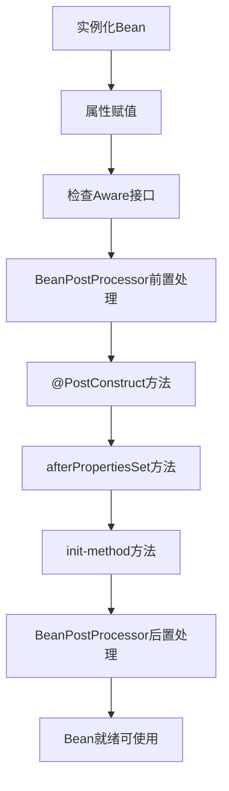

# 超级八股文系列来了！

欢迎来到**超级八股文**系列！这是一套精心打造的 Java 全栈技术知识库，专注于帮助你系统化地掌握面试必备知识，轻松应对技术面试的各种挑战。

## 什么是超级八股文？

所谓"八股文"，是指技术面试中常见的基础理论问题。传统的八股文往往停留在概念层面，让人死记硬背却难以真正理解。

**超级八股文**则不同——它不仅告诉你"是什么"，更深入讲解"为什么"和"怎么用"。通过详细的原理剖析、生动的代码示例、清晰的流程图解，让你真正理解每一个技术点，做到**知其然，更知其所以然**。

## 超级八股文的核心优势

### 1. 技术的深度详解

每一个知识点都经过精心梳理，从基础概念到底层原理，层层递进。我们不满足于表面的定义解释，而是深入到技术的本质。

以 MySQL 索引为例，我们不仅讲解索引的作用，还会详细分析：
- 为什么不选择哈希表作为索引结构？
- 为什么不使用二叉查找树、AVL树、红黑树？
- B+树相比B树有哪些优势？
- InnoDB的数据页与B+树是如何关联的？

这种**追根溯源式的讲解**，让你在面试中能够侃侃而谈，展现真正的技术深度。

### 2. 丰富的代码示例

理论再好，不如代码来得直观。超级八股文中的每个知识点都配有**精心设计的代码示例**，让你不仅能理解概念，还能动手实践。

```java
// Bean生命周期示例 - 展示初始化顺序
@Service
public class InitOrderDemo implements InitializingBean {
    
    public InitOrderDemo() {
        System.out.println("1. 构造函数执行");
    }
    
    @PostConstruct
    public void postConstruct() {
        System.out.println("2. @PostConstruct执行");
    }
    
    @Override
    public void afterPropertiesSet() {
        System.out.println("3. afterPropertiesSet执行");
    }
}
```

代码示例覆盖了各种场景：
- **正确用法**：展示最佳实践
- **错误示范**：避免常见陷阱
- **对比分析**：不同方案的优劣比较

### 3. 清晰的流程图解

复杂的技术概念往往需要图形化展示才能更好理解。超级八股文大量使用 **流程图**，将抽象的概念可视化：



通过流程图，你可以：
- 一目了然地掌握复杂流程
- 理解组件之间的关系
- 记忆关键的执行顺序

### 4. 重点内容的醒目标注

为了帮助你快速抓住重点，超级八股文使用了多种标注方式：

:::tip 重要提示
关键知识点会用醒目的提示框标注，让你不会错过任何重要内容。
:::

:::info 知识拓展
相关的扩展知识会单独标注，帮助你建立更完整的知识体系。
:::

- **粗体强调**：核心概念和关键术语
- **代码高亮**：重要的代码片段和命令
- **对比表格**：不同技术方案的横向对比

### 5. 体系化的知识结构

超级八股文不是零散知识点的堆砌，而是一套**完整的知识体系**。从开发工具到计算机基础，从 Java 核心到框架生态，从数据库到分布式架构，形成了完整的技术能力图谱。

每个模块都按照由浅入深的顺序编排，让你能够循序渐进地学习，构建扎实的技术基础。

### 6. 面试导向的内容设计

所有内容都围绕**面试高频考点**设计，直击面试官最爱问的问题：
- 基础概念的准确定义
- 底层原理的深入分析
- 不同方案的对比选型
- 实际场景的应用实践
- 常见问题的排查解决

## 超级八股文内容一览

超级八股文涵盖了 Java 技术栈的方方面面，以下是完整的内容目录：

### 1. Java

#### 面试技巧
- [面试准备全攻略](/java/interview-skills/preparation-guide)
- [项目介绍与技术面试准备](/java/interview-skills/project-and-tech-preparation)
- [面试与复盘技巧](/java/interview-skills/mindset-and-review)

#### 基础知识
- [Java语言特性与核心概念](/java/base/core-features)
- [面向对象核心概念](/java/base/oop-concepts)
- [异常处理与final-finally-finalize](/java/base/exceptions-final)
- [基本类型与包装类](/java/base/primitives-wrappers)
- [面向对象编程基础](/java/base/oop-basics)
- [接口与抽象类](/java/base/interfaces-abstract-classes)
- [String类详解](/java/base/string-deep-dive)
- [泛型详解](/java/base/genericity)
- [Java数值与金额精度](/java/base/numbers-money-precision)
- [反射与动态代理](/java/base/reflect-proxy)
- [Java序列化详解](/java/base/serialize)
- [JDK新版本特性详解](/java/base/jdk-features)
- [static关键字与枚举详解](/java/base/static-enum)
- [注解机制详解](/java/base/annotation)
- [日期时间处理与线程安全](/java/base/datetime)
- [UUID与唯一标识生成](/java/base/uuid)
- [字符编码详解](/java/base/charset)
- [equals与hashCode方法详解](/java/base/equals-hashcode)
- [Arrays排序算法详解](/java/base/arrays-sort)
- [ClassNotFoundException异常分析](/java/base/classnotfoundexception)

#### 集合
- [Java集合框架详解](/java/collect/introduce)
- [Set集合与排序机制详解](/java/collect/set-collection-and-sorting)
- [集合遍历修改与并发安全](/java/collect/safe-traversal-and-modification)

**HashMap相关**
- [HashMap核心原理与数据结构](/java/collect/hashmap-core-principles)
- [HashMap的哈希算法与索引计算](/java/collect/hashmap-hash-and-index)
- [HashMap的存取删除操作详解](/java/collect/hashmap-operations)
- [HashMap的扩容与容量优化](/java/collect/hashmap-resize-and-capacity)
- [Hash冲突原理与解决方案](/java/collect/hash-collision-solutions)
- [HashMap线程安全问题与解决方案](/java/collect/hashmap-thread-safety)
- [HashMap遍历与操作最佳实践](/java/collect/hashmap-traversal-best-practices)

**ConcurrentHashMap相关**
- [ConcurrentHashMap线程安全机制详解](/java/collect/concurrenthashmap-thread-safety)
- [ConcurrentHashMap架构演进与设计权衡](/java/collect/concurrenthashmap-architecture-evolution)
- [ConcurrentHashMap高级特性与最佳实践](/java/collect/concurrenthashmap-advanced-features)

#### IO相关
- [Java IO基础与流操作](/java/io/io-basis)
- [Java IO设计模式详解](/java/io/design-patterns)
- [IO模型与并发处理策略](/java/io/io-model-concurrent)
- [BIO、NIO与AIO核心原理](/java/io/bio-nio-aio)
- [NIO核心组件与零拷贝](/java/io/nio-core)
- [IO多路复用技术详解](/java/io/io-multiplexing)

#### JVM

**内存分布**
- [JVM运行时内存区域详解](/java/jvm/memory-area)
- [Java进程内存结构与方法区演进](/java/jvm/process-memory-structure)
- [对象创建与内存分配策略](/java/jvm/object-creation-and-memory-allocation)
- [对象存活判断与GC Roots](/java/jvm/object-liveness-detection)
- [常量池机制与内存结构深度解析](/java/jvm/constant-pool-mechanism)

**内存回收**
- [JVM垃圾回收机制深度解析](/java/jvm/garbage-collection)
- [垃圾回收流程与触发机制](/java/jvm/gc-process-and-triggers)
- [内存分配与回收原则](/java/jvm/memory-allocation-principles)

**垃圾回收**
- [垃圾收集器详解](/java/jvm/garbage-collectors)
- [G1垃圾收集器原理与优化](/java/jvm/g1-collector)
- [ZGC低延迟垃圾收集器](/java/jvm/zgc-collector)
- [Java版本GC演进对比](/java/jvm/gc-evolution)
- [垃圾收集器对比与选型策略](/java/jvm/gc-selection-strategy)

**诊断与调优**
- [JIT与AOT编译技术深度解析](/java/jvm/compilation-optimization)
- [内存异常处理与JVM稳定性保障](/java/jvm/memory-exceptions-stability)
- [JVM参数配置与性能调优](/java/jvm/jvm-parameters-tuning)
- [JVM诊断分析工具实战](/java/jvm/jvm-diagnostic-tools)

#### 类加载
- [类的生命周期与加载时机](/java/class-loading/lifecycle-and-timing)
- [类加载详细流程解析](/java/class-loading/loading-process)
- [类加载器与双亲委派机制](/java/class-loading/classloader-and-delegation)
- [双亲委派破坏与安全机制](/java/class-loading/delegation-breaking-and-security)
- [Class文件结构深度解析](/java/class-loading/class-file-structure)

#### 并发多线程
- [并发编程基础概念](/java/concurrent-multithreading/concurrent-basics)
- [线程调度与上下文切换](/java/concurrent-multithreading/thread-scheduling)
- [线程通信与协作机制](/java/concurrent-multithreading/thread-communication)
- [线程安全与并发控制](/java/concurrent-multithreading/thread-safety)
- [线程同步与数据一致性](/java/concurrent-multithreading/synchronization)
- [线程异常处理机制](/java/concurrent-multithreading/thread-exception-handling)
- [CAS机制深度剖析](/java/concurrent-multithreading/cas-mechanism-deep-dive)
- [虚拟线程与现代并发编程](/java/concurrent-multithreading/virtual-threads-deep-dive)

**内存模型**
- [Java内存模型核心原理](/java/concurrent-multithreading/jmm-core-principles)
- [Happens-Before原则详解](/java/concurrent-multithreading/happens-before-principle)
- [内存屏障与指令重排](/java/concurrent-multithreading/memory-barrier-and-reordering)
- [Volatile关键字深入解析](/java/concurrent-multithreading/volatile-in-depth)

**锁**
- [Java锁机制分类与对比](/java/concurrent-multithreading/lock-classification-comparison)
- [锁的公平性与竞争机制](/java/concurrent-multithreading/lock-fairness-mechanism)
- [死锁与活锁问题分析](/java/concurrent-multithreading/deadlock-livelock-analysis)
- [Synchronized并发特性保证](/java/concurrent-multithreading/synchronized-concurrency-guarantees)
- [Synchronized实现原理与核心机制](/java/concurrent-multithreading/synchronized-implementation)
- [Synchronized锁升级与优化策略](/java/concurrent-multithreading/synchronized-lock-upgrade)
- [Volatile与Synchronized对比分析](/java/concurrent-multithreading/volatile-vs-synchronized)

**线程池**
- [线程池核心原理与最佳实践](/java/concurrent-multithreading/thread-pool-core-principles)
- [线程池高级特性与调优策略](/java/concurrent-multithreading/thread-pool-advanced-features)

**并发工具**
- [AQS抽象队列同步器深度解析](/java/concurrent-multithreading/abstract-queued-synchronizer)
- [ThreadLocal线程局部变量详解](/java/concurrent-multithreading/threadlocal-deep-dive)
- [TransmittableThreadLocal线程池上下文传递](/java/concurrent-multithreading/transmittable-threadlocal-context-propagation)
- [JUC并发工具包详解](/java/concurrent-multithreading/juc-concurrent-utilities)
- [Unsafe底层操作详解](/java/concurrent-multithreading/unsafe-low-level-operations)
- [并发集合深入剖析](/java/concurrent-multithreading/concurrent-collections-deep-dive)
- [异步编程与CompletableFuture实战](/java/concurrent-multithreading/completablefuture-async-programming)
- [并发同步工具实战指南](/java/concurrent-multithreading/concurrent-synchronizers-guide)

#### 设计模式
- [设计模式概述与基本原则](/java/design-pattern/overview-and-principles)
- [单例模式深度解析](/java/design-pattern/singleton-pattern)
- [工厂模式体系详解](/java/design-pattern/factory-pattern)
- [行为型设计模式实践](/java/design-pattern/behavioral-patterns)
- [结构型设计模式应用](/java/design-pattern/structural-patterns)
- [MVC架构模式与设计模式实战](/java/design-pattern/mvc-and-practice)

#### Stream流相关
- [Lambda表达式与语法糖机制详解](/java/stream/lambda-and-syntactic-sugar)
- [Stream API核心操作详解](/java/stream/api-operations)
- [Stream并行流原理与性能优化](/java/stream/parallel-stream)

#### 恶意攻击
- [Web安全攻击与防护](/java/security-attack/web-security)
- [网络层攻击与防护](/java/security-attack/network-attack)
- [权限控制与越权漏洞](/java/security-attack/privilege-escalation)
- [密码学基础与加密技术](/java/security-attack/cryptography)

---

### 2. 开发工具

#### Maven
- [Maven项目管理工具详解](/tools/maven/overview)
- [Maven依赖管理与冲突解决](/tools/maven/dependency-management)
- [Maven插件系统与开发实践](/tools/maven/plugins-best-practices)

#### Git
- [Git版本控制系统全面解析](/tools/git/version-control-system)
- [Git代码回滚与分支合并策略](/tools/git/rollback-and-merge)
- [GitHub高效使用技巧与实践](/tools/git/github-advanced-tips)

#### Docker
- [Docker容器技术核心概念](/tools/docker/core-concepts)
- [Docker安装配置与实战操作](/tools/docker/practical-guide)
- [Dockerfile镜像构建与容器编排](/tools/docker/advanced-applications)

#### 日志
- [Java日志框架与门面模式](/tools/logging/framework-facade)
- [日志性能优化实践](/tools/logging/performance-optimization)
- [分布式日志系统架构](/tools/logging/distributed-system)

---

### 3. 基础内功

#### 操作系统
- [进程线程与协程](/system/operating-system/process-thread-coroutine)
- [进程通信与调度](/system/operating-system/process-communication-scheduling)
- [内存管理与虚拟地址](/system/operating-system/memory-management)
- [CPU缓存与一致性协议](/system/operating-system/cpu-cache-coherence)
- [系统性能监控](/system/operating-system/system-performance-monitoring)
- [IO优化与零拷贝](/system/operating-system/io-optimization-zerocopy)
- [线程实现机制](/system/operating-system/thread-implementation)

#### 网络
- [网络基础与协议模型](/system/network/basic-and-protocol-model)
- [TCP协议深入解析](/system/network/tcp-protocol-deep-dive)
- [HTTP协议演进与特性](/system/network/http-protocol-evolution)
- [网络工具与地址解析](/system/network/network-tools-and-address-resolution)
- [网络架构与优化](/system/network/network-architecture-and-optimization)
- [网络诊断与监控](/system/network/network-diagnosis-and-monitoring)

#### 数据结构
- [线性数据结构](/system/data-structure/linear-structures)
- [树形结构基础](/system/data-structure/tree-basics)
- [平衡树与搜索树](/system/data-structure/balanced-search-trees)
- [特殊树结构](/system/data-structure/special-trees)
- [图结构](/system/data-structure/graph-structure)

---

### 4. 数据库

#### MySQL

**MySQL锁**
- [MySQL锁机制概述](/database/mysql/lock-mechanism-overview)
- [MySQL锁的粒度与层级](/database/mysql/lock-granularity)
- [MySQL行级锁详解](/database/mysql/row-level-locks)
- [MySQL乐观锁与悲观锁实战](/database/mysql/optimistic-pessimistic-locks)
- [MySQL死锁问题分析与解决](/database/mysql/deadlock-analysis)

**MySQL事务**
- [MySQL事务机制与ACID特性](/database/mysql/transaction-acid)
- [MySQL事务执行流程与两阶段提交](/database/mysql/transaction-execution)
- [MySQL事务隔离级别详解](/database/mysql/transaction-isolation)
- [MySQL隔离级别实现原理](/database/mysql/isolation-implementation)
- [MySQL幻读问题深度剖析](/database/mysql/phantom-read)
- [MySQL事务优化实战](/database/mysql/transaction-optimization)
- [MySQL事务隔离级别选择策略](/database/mysql/isolation-level-choice)

**MySQL索引**
- [MySQL索引基础与底层原理](/database/mysql/index-fundamentals)
- [MySQL索引类型与存储结构](/database/mysql/index-types)
- [MySQL联合索引与查询优化](/database/mysql/composite-index-optimization)
- [MySQL索引失效问题排查](/database/mysql/index-failure-troubleshooting)
- [MySQL索引设计最佳实践](/database/mysql/index-design-best-practices)

**MySQL慢SQL调优**
- [执行计划深度解析与实战](/database/mysql/execution-plan-analysis)
- [ORDER BY排序机制与优化](/database/mysql/order-by-optimization)
- [JOIN查询优化与实战](/database/mysql/join-optimization)
- [SQL性能调优全面指南](/database/mysql/sql-performance-tuning)
- [MySQL分页查询原理与深度优化](/database/mysql/pagination-optimization)

**MySQL特征**
- [MySQL架构与执行流程](/database/mysql/architecture-execution)
- [MySQL存储引擎与高级特性](/database/mysql/storage-engine-advanced)
- [MySQL主从复制与同步机制详解](/database/mysql/replication-synchronization)
- [MySQL版本特性与演进](/database/mysql/version-features-evolution)
- [MySQL查询缓存机制详解](/database/mysql/query-cache-mechanism)

**MySQL使用的优化**
- [MySQL字段类型与设计规范](/database/mysql/field-types-design)
- [MySQL主键设计与自增机制](/database/mysql/primary-key-auto-increment)
- [MySQL性能优化与开发规范](/database/mysql/optimization-specification)
- [MySQL数据存储优化策略](/database/mysql/storage-optimization)
- [MySQL高级特性与最佳实践](/database/mysql/advanced-features-best-practices)
- [MySQL热点数据更新优化方案](/database/mysql/hotspot-update-optimization)
- [MySQL数据加密与安全实践](/database/mysql/data-encryption-security)

**MySQL进阶实战**
- [大表在线DDL操作实战](/database/mysql/online-ddl)
- [千万级数据查询优化实战](/database/mysql/query-optimization)
- [热点数据更新与缓存策略](/database/mysql/hotspot-cache)
- [数据归档与平滑迁移实战](/database/mysql/data-archive-migration)
- [逻辑删除与唯一性约束设计](/database/mysql/logical-delete-unique-constraint)

#### Redis
- [Redis核心数据类型与底层实现](/database/redis/core-data-types)
- [Redis线程模型与性能优化](/database/redis/threading-model)
- [Redis高级数据结构实现原理](/database/redis/data-structures)
- [Redis持久化与数据安全](/database/redis/persistence)
- [Redis内存管理与优化策略](/database/redis/memory-management)
- [Redis分布式特性与对比分析](/database/redis/distributed-features)
- [Redis集群架构与高可用方案](/database/redis/cluster-architecture)
- [Redis事务与原子性操作](/database/redis/transaction-atomicity)
- [Redis消息队列与通信模式](/database/redis/message-queue)
- [Redis原子性操作与命令详解](/database/redis/atomic-commands)
- [Redis分布式锁实战指南](/database/redis/distributed-lock-guide)
- [Redis乐观锁机制与并发控制](/database/redis/optimistic-locking)
- [Redisson分布式锁核心实现原理](/database/redis/redisson-lock-principle)
- [Redisson Watchdog自动续期机制深度剖析](/database/redis/redisson-watchdog-mechanism)
- [Redisson lock与tryLock使用对比](/database/redis/redisson-lock-vs-trylock)
- [RedLock算法原理与实践](/database/redis/redlock-algorithm-practice)
- [Redis与数据库一致性保障方案](/database/redis/cache-database-consistency)
- [Redis性能问题诊断与优化实战](/database/redis/performance-optimization)
- [Redis 8.0版本新特性详解](/database/redis/redis-8-new-features)
- [Redis Cluster集群操作限制与解决方案](/database/redis/cluster-transaction-lua-limitations)
- [Redis实战应用场景详解](/database/redis/practical-application-scenarios)
- [Redis操作最佳实践与遍历技巧](/database/redis/best-practices-and-key-traversal)

#### Oracle
- [Oracle索引技术全面解析](/database/oracle/index-technology)
- [Oracle核心语法与特性](/database/oracle/core-syntax-features)
- [Oracle事务隔离机制详解](/database/oracle/transaction-isolation)
- [Oracle与MySQL全面对比](/database/oracle/oracle-vs-mysql)
- [Oracle视图与数据安全](/database/oracle/view-data-security)

---

### 5. 框架中间件

#### Spring
- [Spring核心概念详解](/framework/spring/core-concepts)
- [Bean生命周期与依赖注入](/framework/spring/bean-lifecycle)
- [Spring高级特性与应用](/framework/spring/advanced-features)
- [Spring循环依赖解决方案详解](/framework/spring/circular-dependency)

**Spring事务**
- [Spring事务管理核心详解](/framework/spring/transaction-core)
- [Spring事务传播机制与隔离级别](/framework/spring/transaction-propagation)
- [Spring事务实现原理与注解详解](/framework/spring/transaction-implementation)
- [Spring事务失效场景与解决方案](/framework/spring/transaction-failure)
- [Spring事务高级应用场景](/framework/spring/transaction-advanced)

**SpringBoot**
- [SpringBoot核心特性与设计理念](/framework/spring/springboot-core-features)
- [SpringBoot自动配置原理深度剖析](/framework/spring/springboot-auto-configuration)
- [SpringBoot启动与Web容器](/framework/spring/springboot-web-container)
- [SpringBoot自定义Starter开发](/framework/spring/custom-starter-development)
- [SpringBoot3与Spring6新特性](/framework/spring/springboot3-spring6-features)
- [SpringBoot Bean加载顺序控制](/framework/spring/bean-loading-order)
- [SpringBoot启动原理](/framework/spring/springboot-startup)

#### Mybatis
- [MyBatis基础与核心概念](/framework/mybatis/basic-concepts)
- [MyBatis工作原理与核心组件](/framework/mybatis/working-principle)
- [MyBatis参数处理与SQL注入防护](/framework/mybatis/parameter-handling)
- [MyBatis动态SQL详解](/framework/mybatis/dynamic-sql)
- [MyBatis结果映射与类型处理](/framework/mybatis/result-mapping)
- [MyBatis分页实现方案](/framework/mybatis/pagination)
- [MyBatis缓存机制详解](/framework/mybatis/cache)
- [MyBatis插件机制与拦截器](/framework/mybatis/plugin)
- [MyBatis延迟加载与关联查询](/framework/mybatis/lazy-loading)
- [MyBatis连接池与数据源配置](/framework/mybatis/datasource)
- [MyBatis-Plus增强特性详解](/framework/mybatis/mybatis-plus)

#### SpringCloud
- [SpringCloud核心概念与架构](/framework/springcloud/core-architecture)
- [API网关技术选型与对比](/framework/springcloud/api-gateway)
- [Eureka核心机制深度解析](/framework/springcloud/eureka-mechanism)
- [Hystrix熔断与容错机制详解](/framework/springcloud/hystrix-circuit-breaker)
- [Nacos架构与核心功能详解](/framework/springcloud/nacos-architecture)
- [Nacos服务注册与发现机制深度剖析](/framework/springcloud/nacos-service-discovery)
- [Nacos配置中心实现原理与通信机制](/framework/springcloud/nacos-config-center)
- [Nacos一致性协议与高可用设计](/framework/springcloud/nacos-consistency-ha)
- [微服务负载均衡技术详解](/framework/springcloud/load-balancer)
- [Feign核心概念与技术对比](/framework/springcloud/feign-concept)
- [Feign配置与超时管理](/framework/springcloud/feign-config)
- [Feign性能优化与负载均衡](/framework/springcloud/feign-optimization)

#### Zookeeper
- [Zookeeper核心架构与数据模型](/framework/zookeeper/core-architecture)
- [Zookeeper一致性保障机制](/framework/zookeeper/consistency-mechanism)
- [Zookeeper选举机制详解](/framework/zookeeper/leader-election)
- [Zookeeper监听机制与通知](/framework/zookeeper/watch-mechanism)
- [Zookeeper典型应用场景](/framework/zookeeper/typical-scenarios)

#### Kafka
- [Kafka基础架构与核心概念](/framework/kafka/architecture)
- [Kafka消息可靠性保障机制](/framework/kafka/reliability)
- [Kafka消息发送与存储原理](/framework/kafka/send-storage)
- [Kafka消费机制详解](/framework/kafka/consume)
- [Kafka事务与一致性保障](/framework/kafka/transaction)
- [Kafka重平衡机制深度解析](/framework/kafka/rebalance)
- [Kafka高级特性与核心机制](/framework/kafka/advanced)

#### RocketMQ
- [RocketMQ架构设计与工作流程](/framework/rocketmq/architecture)
- [RocketMQ消息可靠性保障机制](/framework/rocketmq/reliability)
- [RocketMQ消费模式与消息分发](/framework/rocketmq/consume-mode)
- [RocketMQ顺序消息与幂等性保障](/framework/rocketmq/order-idempotent)
- [RocketMQ高级特性与事务消息](/framework/rocketmq/advanced-features)
- [RocketMQ性能优化与故障处理](/framework/rocketmq/performance)

#### RabbitMQ
- [RabbitMQ架构与工作模式](/framework/rabbitmq/architecture-work-mode)
- [消息可靠性保障机制](/framework/rabbitmq/message-reliability)
- [高级特性与应用场景](/framework/rabbitmq/advanced-features)
- [消费者流控与幂等性保障](/framework/rabbitmq/consumer-flow-control)
- [集群架构与高可用方案](/framework/rabbitmq/cluster-ha)

#### Elasticsearch
- [Elasticsearch基础与数据类型](/framework/elasticsearch/basic-datatypes)
- [倒排索引原理与性能优势](/framework/elasticsearch/inverted-index)
- [集群架构与节点角色](/framework/elasticsearch/cluster-architecture)
- [数据精度处理与并发控制](/framework/elasticsearch/data-precision-concurrency)
- [深度分页问题与解决方案](/framework/elasticsearch/deep-pagination)
- [索引生命周期管理](/framework/elasticsearch/ilm)
- [性能优化最佳实践](/framework/elasticsearch/performance-optimization)
- [数据同步与一致性保障](/framework/elasticsearch/data-synchronization)

#### Dubbo
- [RPC与Dubbo基础概念](/framework/dubbo/rpc-basic)
- [Dubbo核心架构与调用流程](/framework/dubbo/core-architecture)
- [Dubbo序列化与通信协议](/framework/dubbo/serialization-protocol)
- [Dubbo负载均衡与服务治理](/framework/dubbo/load-balance-governance)
- [Dubbo扩展机制SPI详解](/framework/dubbo/spi-extension)
- [Dubbo高级特性与应用](/framework/dubbo/advanced-features)

#### Netty
- [Netty核心架构与线程模型](/framework/netty/core-architecture)
- [Netty设计模式深度剖析](/framework/netty/design-patterns)
- [Netty零拷贝技术详解](/framework/netty/zero-copy)
- [ByteBuf核心机制与内存管理](/framework/netty/bytebuf-memory)
- [Netty性能优化技术全解析](/framework/netty/performance-optimization)
- [Netty序列化与粘包拆包处理](/framework/netty/serialization-sticky-packet)

#### XXL-JOB
- [XXL-JOB调度机制与一致性保障](/framework/xxl-job/scheduling-consistency)
- [XXL-JOB时间轮算法详解](/framework/xxl-job/time-wheel)
- [XXL-JOB分片任务与并行调度](/framework/xxl-job/sharding-task)

#### Tomcat
- [Tomcat核心架构与启动流程](/java/tomcat/architecture-and-startup)
- [Tomcat请求处理机制详解](/java/tomcat/request-processing)
- [Tomcat类加载器与类加载机制](/java/tomcat/classloader)
- [Tomcat IO模型详解](/java/tomcat/io-model)

---

### 6. 进阶设计与性能优化

#### 微服务相关
- [微服务架构设计理念](/architecture/microservice/design-philosophy)
- [微服务拆分策略与实践](/architecture/microservice/split-strategy)
- [微服务间通信技术详解](/architecture/microservice/communication)
- [微服务治理与稳定性保障](/architecture/microservice/governance-stability)
- [微服务发布与部署策略](/architecture/microservice/deploy-strategy)

#### 分布式相关理论
- [分布式系统一致性理论详解](/architecture/distributed-theory/consistency-theory)
- [一致性哈希算法原理与实践](/architecture/distributed-theory/consistent-hashing)
- [分布式共识算法与拜占庭问题](/architecture/distributed-theory/consensus-and-byzantine)

#### 分布式ID
- [分布式ID生成方案详解](/architecture/distributed-id/generation-solutions)

#### 限流与熔断
- [限流算法原理与实现](/architecture/rate-limiting/algorithm-principle)
- [熔断降级机制与实践](/architecture/rate-limiting/circuit-breaker)
- [高级限流策略与应用](/architecture/rate-limiting/advanced-strategy)
- [高并发系统设计实践](/architecture/rate-limiting/high-concurrency-design)

#### 缓存的设计
- [缓存淘汰策略详解](/architecture/cache/eviction-strategies)
- [本地缓存实现与应用](/architecture/cache/local-cache-implementation)
- [本地缓存一致性保障方案](/architecture/cache/local-cache-consistency)
- [多级缓存架构设计与实践](/architecture/cache/multi-level-cache-architecture)

#### 布隆过滤器
- [布隆过滤器原理与实战应用](/architecture/bloom-filter/principle-and-practice)

#### 问题故障解决
- [JVM诊断工具命令详解](/architecture/problem-solving/jvm-diagnostic-tools)
- [堆内存分析与Dump文件处理](/architecture/problem-solving/heap-dump-analysis)
- [字节码插桩技术与性能监控](/architecture/problem-solving/bytecode-instrumentation)
- [Linux日志分析与问题排查实战](/architecture/problem-solving/log-analysis)

#### 分库分表
- [分库分表核心概念与应用场景](/architecture/sharding/concepts)
- [分表字段选择与数据倾斜治理](/architecture/sharding/shard-key-selection)
- [分片算法与ShardingJDBC路由策略](/architecture/sharding/algorithms)
- [容量规划与扩容策略](/architecture/sharding/capacity-planning)
- [分布式ID生成方案](/architecture/sharding/distributed-id)
- [跨库查询与性能优化](/architecture/sharding/query-optimization)
- [分布式数据库核心原理与选型实践](/architecture/sharding/distributed-database)

#### 分布式事务
- [分布式事务基础概念与解决方案](/architecture/distributed-transaction/fundamentals)
- [两阶段与三阶段提交协议](/architecture/distributed-transaction/2pc-3pc)
- [TCC分布式事务详解](/architecture/distributed-transaction/tcc)
- [基于消息的分布式事务方案](/architecture/distributed-transaction/message-based)
- [本地消息表实现与优化](/architecture/distributed-transaction/local-message-table)

#### Seata
- [Seata分布式事务框架核心原理](/architecture/seata/core-principle)
- [Seata事务模式详解与选型指南](/architecture/seata/transaction-modes)
- [AT模式深度剖析与隔离性问题](/architecture/seata/at-mode-analysis)

#### DDD
- [领域驱动设计核心思想与价值](/architecture/ddd/core-concept)
- [DDD分层架构模式详解](/architecture/ddd/layered-architecture)
- [领域模型核心构建要素](/architecture/ddd/domain-model-elements)
- [领域事件与DDD落地实践](/architecture/ddd/domain-event-and-practice)

#### AI
- [大模型核心概念与技术原理](/architecture/ai/llm-fundamentals)
- [DeepSeek技术架构解析](/architecture/ai/deepseek)
- [RAG检索增强生成技术](/architecture/ai/rag)
- [AI Agent与工具调用协议](/architecture/ai/agent-tools)
- [Spring AI开发框架实践](/architecture/ai/spring-ai)

#### 方案设计
- [秒杀系统架构与库存扣减设计](/architecture/solution-design/flash-sale-inventory)
- [消息队列设计与消息乱序处理](/architecture/solution-design/mq-order-design)
- [高并发计数系统设计](/architecture/solution-design/high-concurrency-counter)
- [缓存系统设计与预热策略](/architecture/solution-design/cache-design-warmup)
- [订单支付并发冲突处理](/architecture/solution-design/payment-concurrency)
- [敏感词过滤算法与实现](/architecture/solution-design/sensitive-word-filter)

---

## 如何使用超级八股文？

### 系统学习

如果你是 Java 初学者或想系统复习，建议按照以下顺序学习：

1. **基础内功** → 打好计算机基础
2. **Java核心** → 掌握语言特性和核心API
3. **数据库** → 理解数据存储和查询优化
4. **框架中间件** → 学习主流技术栈
5. **进阶设计** → 提升架构设计能力

### 面试突击

如果你即将面试，可以重点关注：

- **高频考点**：集合、JVM、并发、MySQL、Redis、Spring
- **原理深挖**：HashMap原理、线程池、事务机制、索引优化
- **场景设计**：秒杀系统、分布式锁、缓存一致性

### 查漏补缺

遇到不熟悉的知识点时，可以通过搜索快速定位到相关文档，进行针对性学习。

:::tip 学习建议
- 不要死记硬背，理解原理才是王道
- 动手敲代码，实践出真知
- 多思考"为什么"，建立知识关联
- 定期复习，巩固记忆
:::
