# 项目贡献指南

欢迎你参与 JavaUp 知识库的建设与维护，这是一件极具价值的事情。无论你是刚入门的新手，还是经验丰富的开发者，都可以为这个项目贡献自己的一份力量。

## 为什么要参与贡献

参与开源项目贡献能够带来多方面的收益：

- **加深技术理解**：在整理和完善知识点的过程中，你会对相关技术有更深入的认知
- **提升写作能力**：技术文档的编写能够锻炼你的表达和总结能力
- **积累个人影响力**：你的贡献会被永久记录，成为项目的 Contributor
- **结识志同道合的朋友**：与社区成员交流，拓展技术人脉

## 贡献方向

你可以从以下几个维度来为项目做出贡献：

```mermaid
flowchart LR
    A([贡献方向]) --> B([修正错误])
    A --> C([完善内容])
    A --> D([新增知识])
    
    B --> B1([错别字修正])
    B --> B2([代码纠错])
    
    C --> C1([答案优化])
    C --> C2([示例补充])
    
    D --> D1([新增面试题])
    D --> D2([知识点详解])
    
    style A fill:#2196F3,stroke:#1565C0,color:#fff
    style B fill:#4CAF50,stroke:#2E7D32,color:#fff
    style C fill:#9C27B0,stroke:#6A1B9A,color:#fff
    style D fill:#FF5722,stroke:#D84315,color:#fff
    style B1 fill:#81C784,stroke:#4CAF50
    style B2 fill:#81C784,stroke:#4CAF50
    style C1 fill:#CE93D8,stroke:#9C27B0
    style C2 fill:#CE93D8,stroke:#9C27B0
    style D1 fill:#FFAB91,stroke:#FF5722
    style D2 fill:#FFAB91,stroke:#FF5722
```



### 修正错误

由于文档内容太多，光我自己编写的话，肯定有一些错别字或者内容上的错误问题，如果你在阅读过程中发现了这类问题，非常欢迎帮忙指正。

### 完善现有内容

对于已有的文章，你可以：
- 优化某个技术问题的解答，使其更加准确全面
- 补充相关的代码示例或图解说明
- 改进文章的结构和表述方式

### 新增内容

如果你发现某些重要的知识点还未收录，可以主动添加：
- 补充常见的面试问题及解答
- 编写某个技术专题的详细讲解
- 添加实战案例分析

## 贡献方式详解

参与项目贡献主要有三种途径，你可以根据实际情况选择最适合的方式：

### 最推荐：使用「编辑此页」功能

:::info 🚀 一键贡献，超级便捷！

本站每个文档页面的**左下角**都有一个 **「编辑此页」** 按钮。

点击后会直接跳转到 Github 的在线编辑界面，你可以**在浏览器中直接修改内容**，无需克隆仓库到本地！

:::



```mermaid
flowchart LR
    A([📖 阅读文档]) --> B([🔍 发现问题])
    B --> C([👆 点击左下角<br/>「编辑此页」])
    C --> D([✏️ 在线编辑内容])
    D --> E([📝 提交 PR])
    E --> F([✅ 完成贡献])
    
    style A fill:#E3F2FD,stroke:#1976D2,color:#1565C0
    style B fill:#FFF3E0,stroke:#F57C00,color:#E65100
    style C fill:#E8F5E9,stroke:#43A047,color:#2E7D32
    style D fill:#E8F5E9,stroke:#43A047,color:#2E7D32
    style E fill:#F3E5F5,stroke:#8E24AA,color:#6A1B9A
    style F fill:#E1F5FE,stroke:#0288D1,color:#01579B
```

**使用步骤：**

1. 在任意文档页面，找到左下角的 **「编辑此页」** 链接
2. 点击后会跳转到 Github 的文件编辑页面（首次需要 Fork 仓库）
3. 直接在网页上修改文档内容
4. 填写提交信息，点击提交即可自动创建 Pull Request

:::tip 适用场景
这种方式特别适合：
- 修正错别字、笔误
- 小范围的内容补充和优化
- 快速修复发现的问题

**无需任何本地环境配置，3 分钟即可完成一次贡献！**
:::

---

当然，如果你需要进行较大范围的修改，或者习惯在本地编辑，也可以使用下面的传统方式：

### 方式一：提交 Issue

当你在学习过程中发现了需要改进的地方，或者有新的内容想要添加，可以通过提交 Issue 来发起讨论。

**操作步骤：**

1. 进入项目的 Issues 页面
2. 点击右上角的「New Issue」按钮创建新议题
3. 清晰地描述你发现的问题或建议
4. 等待社区成员讨论和反馈

**Issue 编写建议：**

- 标题要简洁明了，能够概括核心问题
- 正文中详细说明问题的背景和具体情况
- 如果是内容完善建议，最好附上你的初步想法

**示例场景：**

假设你在阅读 Spring 相关章节时，发现缺少了关于循环依赖的处理机制说明，可以这样描述：

```
标题：建议补充 Spring 循环依赖处理机制的详解

内容：
在阅读 Spring 框架章节时，发现目前缺少对循环依赖问题的系统性讲解。

建议补充以下内容：
1. 什么是循环依赖
2. Spring 如何通过三级缓存解决循环依赖
3. 哪些场景下循环依赖无法被解决

我可以认领这个任务并提交相关内容。
```

### 方式二：处理现有 Issue

项目中会存在一些待处理的 Issue，这些都是社区成员发现的问题或提出的建议。你可以主动认领并帮助解决。

**操作步骤：**

1. 浏览项目的 Issues 列表，找到标记为「待处理」的议题
2. 在 Issue 下方评论，表明你想要认领该任务
3. 完成相关内容的修改或编写
4. 提交 Pull Request

### 方式三：直接提交 PR

对于错别字、笔误等简单问题，可以直接提交 Pull Request，无需事先创建 Issue。

## Pull Request 提交流程

提交 PR 是参与开源贡献的核心环节，下面详细介绍整个流程：

```mermaid
flowchart TD
    A([Fork 原仓库]) --> B([Clone 到本地])
    B --> C([创建功能分支])
    C --> D([修改内容])
    D --> E([提交 Commit])
    E --> F([Push 到远程])
    F --> G([创建 Pull Request])
    G --> H([等待审核])
    H --> I{审核结果}
    I -->|通过| J([合并到主分支])
    I -->|需修改| D
    
    style A fill:#42A5F5,stroke:#1565C0,color:#fff
    style B fill:#42A5F5,stroke:#1565C0,color:#fff
    style C fill:#66BB6A,stroke:#2E7D32,color:#fff
    style D fill:#66BB6A,stroke:#2E7D32,color:#fff
    style E fill:#66BB6A,stroke:#2E7D32,color:#fff
    style F fill:#AB47BC,stroke:#6A1B9A,color:#fff
    style G fill:#AB47BC,stroke:#6A1B9A,color:#fff
    style H fill:#FF7043,stroke:#D84315,color:#fff
    style I fill:#FF7043,stroke:#D84315,color:#fff
    style J fill:#26A69A,stroke:#00796B,color:#fff
```



### 第一步：Fork 项目仓库

由于你没有直接修改原仓库的权限，需要先将项目 Fork 到自己的账户下。

1. 访问项目的 Gitee/GitHub 页面
2. 点击页面右上角的「Fork」按钮
3. 系统会自动在你的账户下创建一份仓库副本

:::tip
Fork 后的仓库是原仓库的完整复制，你可以在其中自由修改而不会影响原项目。
:::

### 第二步：Clone 并创建分支

将 Fork 后的仓库克隆到本地，并创建一个新的功能分支：

```bash
# 克隆你 Fork 的仓库
git clone https://gitee.com/你的用户名/javaup.git

# 进入项目目录
cd javaup

# 创建并切换到新分支
git checkout -b feature/add-spring-circular-dependency
```

### 第三步：修改内容并提交

在本地完成内容的修改或新增后，提交你的更改：

```bash
# 添加修改的文件
git add .

# 提交更改，写清楚本次修改的内容
git commit -m "docs: 补充Spring循环依赖处理机制详解"

# 推送到远程仓库
git push origin feature/add-spring-circular-dependency
```

### 第四步：创建 Pull Request

1. 访问你 Fork 后的仓库页面
2. 点击「Pull Request」或「New Pull Request」按钮
3. 选择要合并的分支，填写 PR 的标题和描述
4. 点击提交，等待项目维护者审核

**PR 描述模板参考：**

```markdown
## 修改内容
补充了 Spring 循环依赖处理机制的详细讲解

## 修改原因
原文档缺少对三级缓存机制的系统性说明

## 主要改动
- 新增循环依赖的概念说明
- 补充三级缓存的工作原理
- 添加无法解决循环依赖的场景分析
```

## 内容规范要求

为了保证文档质量的一致性，请在贡献内容时遵循以下规范：

### 排版规范

推荐参考 [中文文案排版指北](https://github.com/sparanoid/chinese-copywriting-guidelines)，主要注意以下几点：

- 中英文之间需要增加空格
- 中文与数字之间需要增加空格
- 全角标点与其他字符之间不加空格
- 专有名词使用正确的大小写

### 内容原创性

:::warning 重要提醒
你可以参考学习其他优秀的技术文章，但**绝对不能直接复制粘贴**。请用自己的理解重新组织语言，做到：
- 表述更加通俗易懂
- 重点内容突出明确
- 示例贴合实际场景
:::

### 提问的艺术

如果你需要提出 Issue 或问题，建议先阅读 [《提问的智慧》](https://github.com/ryanhanwu/How-To-Ask-Questions-The-Smart-Way)，学习如何高效地描述问题。

## 贡献者的收获

参与项目贡献，你将获得：

```mermaid
flowchart LR
    A([参与贡献]) --> B([技能提升])
    A --> C([社区认可])
    A --> D([持久记录])
    
    B --> B1([深化技术理解])
    B --> B2([提升表达能力])
    
    C --> C1([成为 Contributor])
    C --> C2([结识技术伙伴])
    
    D --> D1([贡献被永久保留])
    D --> D2([个人技术名片])
    
    style A fill:#1976D2,stroke:#0D47A1,color:#fff
    style B fill:#388E3C,stroke:#1B5E20,color:#fff
    style C fill:#7B1FA2,stroke:#4A148C,color:#fff
    style D fill:#E64A19,stroke:#BF360C,color:#fff
    style B1 fill:#A5D6A7,stroke:#66BB6A
    style B2 fill:#A5D6A7,stroke:#66BB6A
    style C1 fill:#CE93D8,stroke:#AB47BC
    style C2 fill:#CE93D8,stroke:#AB47BC
    style D1 fill:#FFAB91,stroke:#FF8A65
    style D2 fill:#FFAB91,stroke:#FF8A65
```



我们真诚地欢迎更多的开发者加入到 JavaUp 的建设中来，让我们一起打造更优质的 Java 学习资源！
