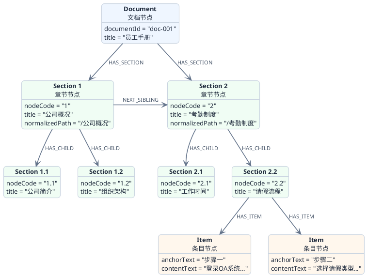

# Pro版：图数据库知识路由

前面几篇文档讲了检索链路、前置编排、多通道混合检索这些核心能力。但有一个问题一直没展开说：**用户提了一个问题，系统怎么知道应该去哪份文档里找答案？**

如果知识库里只有两三份文档，这不是问题。但当文档数量上了几十份甚至上百份，每次都全库检索，不仅慢，而且噪声会很大——用户问的是"年假怎么申请"，结果从产品手册里也检索出了包含"申请"这个词的段落，这就是典型的 **跨域干扰。**

Nexus Agent Pro 用了两个手段来解决这个问题：

1. **Neo4j 图数据库**：把每份文档的内部结构（章节、段落、条目）建成一张图，让系统能沿着文档结构精准导航，而不是只靠向量匹配碰运气
2. **知识路由三级漏斗**：在进入检索链路之前，先通过"领域 → 主题 → 文档"三级排序，自动锁定最相关的文档

另外还有一个很巧妙的设计：**影子路由**，用来持续观测路由质量，后面会详细讲。

如果把文档入库、图谱建模、知识路由、混合检索、证据生成和影子路由放到一条线上看，会更容易理解这部分为什么叫“知识闭环”：


这条闭环里，前半段负责把原始文档加工成可检索、可导航、可路由的知识资产；中间通过"领域 → 主题 → 文档"三级漏斗缩小检索范围；后半段通过向量检索、关键词检索、父子块聚合和证据控制生成可靠回答。最后，影子路由会把系统推荐结果和用户实际选择记录下来，持续反哺知识路由质量评估。

## 为什么需要图数据库

先说一个实际场景。用户问："第三章第二节讲了什么？"

这种问题，向量检索和关键词检索都很难处理——"第三章第二节"不是一个语义概念，也不是一个关键词，它是一个**结构定位**。你需要知道文档的目录结构，才能找到对应的内容。

再比如用户问："上一节讲的是什么？"这是一个**邻接查询**，需要知道当前节点的前一个兄弟节点是谁。

这些场景用关系型数据库也能做，但会非常的别扭。你得写一堆递归查询来遍历树结构。而图数据库天生就是干这个的，节点和关系就是它的擅长的地方。

:::info 为什么选 Neo4j
Neo4j 是图数据库领域的事实标准，Cypher 查询语言对图遍历的表达力远超 SQL。在 Nexus Agent Pro 的场景中，文档结构天然就是一棵树（Document → Section → Item），用图来存储和查询是最自然的选择。
:::

## Neo4j 中的文档结构图谱

每份文档在完成索引构建后，系统会同步在 Neo4j 中生成一张结构图谱：



### 三种节点类型

| 节点类型 | 说明 | 关键信息 |
| :--- | :--- | :--- |
| **文档节点** | 文档根节点，一份文档对应一个 | 文档 ID、标题 |
| **章节节点** | 对应文档里的标题层级 | 章节编号（如 "1.2.3"）、标题、规范化路径、正文内容 |
| **条目节点** | 对应步骤、列表项等更细的内容 | 锚点文字、正文内容 |

### 支持的图查询能力

有了这张图，系统就能做到很多向量检索做不到的事情：

- **章节编号定位**：用户问"1.2.3 节讲了什么"，直接按章节编号精准定位，不需要语义匹配
- **标题路径查找**：用户提到"考勤制度下面的请假流程"，沿着章节路径就能找到
- **相邻章节跳转**：用户问"上一节 / 下一节是什么"，顺着"下一个兄弟节点"的关系直接跳过去
- **展开子章节**：用户问"这一章有哪些内容"，展开"包含的子节点"关系就能拿到完整目录
- **最佳匹配**：给定一个主题和关键词，在图里找到语义最接近的章节

:::tip 图查询和向量检索是互补的
图查询擅长处理**结构性问题**（"第几章""上一节""目录"），向量检索擅长处理**语义性问题**（"怎么请假""墨盒怎么换"）。

Nexus Agent Pro 把所有文档问答统一收进多通道混合检索：系统先把问题理解成一个受控的**检索意图**（普通 / 结构 / 表格 / 图谱关系 / 全局总结），高把握的结构定位结果会作为**软提示**注入进去，用来调整各通道的权重，但不会绕过混合检索。

这样图定位和向量检索是"协同"关系，而不是"二选一"，链路统一、也好观测。
:::

:::warning 不要把两个"图"搞混
这个项目里有两张性质完全不同的"图"，面试时一定要分清：

- **文档结构图谱**：存的是**文档自身的层级结构**（文档 → 章节 → 条目），用来回答"第三章讲了什么""上一节是什么""这一章有哪些小节"这类**结构导航**问题。
- **知识图谱**：存的是从文档内容里**抽取出来的实体和关系**，用来回答"A 和 B 是什么关系"这类**语义关系**问题，作为一个检索通道参与混合检索。它在 [知识图谱与结构树](/super-agent/overview/graphrag-raptor) 里单独讲。

一个是"文档的骨架"，一个是"内容里的实体关系网"，不要弄混了。
:::

## 知识路由：三级漏斗自动选文档

图数据库解决了"文档内部怎么导航"的问题。但还有一个更前置的问题：**用户提了一个问题，系统怎么知道应该去哪份文档里找答案？**

这就是知识路由要干的事。

想象一下你去图书馆找资料。你不会把所有书架都翻一遍，而是先确定"我要找的是哪个学科的"（领域），再确定"具体是哪个主题"（主题），最后才锁定"应该看哪本书"（文档）。知识路由的思路完全一样——**三级漏斗，逐层收窄**。

```plantuml title="知识路由三级漏斗" width="70%" align="left"
@startuml

skinparam backgroundColor #FFFFFF
skinparam defaultFontName sans-serif
skinparam defaultFontSize 13
skinparam shadowing false
skinparam roundCorner 12
skinparam padding 6

skinparam ArrowColor #64748B
skinparam ArrowThickness 1.6
skinparam ArrowFontSize 11
skinparam ArrowFontColor #475569

skinparam activity {
  BackgroundColor #F8FAFC
  BorderColor #CBD5E1
  BorderThickness 1.2
  FontColor #1E293B
  FontSize 13
  DiamondBackgroundColor #F1F5F9
  DiamondBorderColor #94A3B8
  DiamondFontColor #334155
  DiamondFontSize 12
  BarColor #3B82F6
}

skinparam partition {
  BackgroundColor #F8FAFC
  BorderColor #CBD5E1
  BorderThickness 1.5
  FontColor #475569
  FontSize 13
  RoundCorner 16
}

skinparam note {
  BackgroundColor #EFF6FF
  BorderColor #BFDBFE
  BorderThickness 1
  FontColor #334155
  FontSize 11
  RoundCorner 8
}

start

:  <b>用户提问</b>\n<color:#64748B>"年假最多能请几天？"</color>  ; <<#3B82F6>>

partition "  <color:#7C3AED><b>第一级</b></color>  <color:#475569>Scope 排序 — 锁定知识域</color>  " {
  :  查询所有 Scope 节点\n<color:#64748B>语义打分 + 词法打分</color>  ;
  :  <color:#7C3AED><b>Top 5 候选 Scope</b></color>\n<color:#64748B>例：HR制度(0.82) > 产品手册(0.31) > ...</color>  ;
}

partition "  <color:#2563EB><b>第二级</b></color>  <color:#475569>Topic 排序 — 锁定主题</color>  " {
  :  在优选 Scope 下查询 Topic 节点\n<color:#64748B>语义 + 词法 + 关键词实体匹配</color>  ;
  :  属于 Top Scope 的 Topic 额外加分（+8）  ;
  :  <color:#2563EB><b>Top 8 候选 Topic</b></color>\n<color:#64748B>例：考勤与假期(0.91) > 薪酬福利(0.45) > ...</color>  ;
}

partition "  <color:#059669><b>第三级</b></color>  <color:#475569>Document 排序 — 锁定文档</color>  " {
  :  查询索引状态为 BUILD_SUCCESS 的文档\n<color:#64748B>语义 + 词法 + 关键词实体 + Scope加分(+15) + Topic关联加分(×20)</color>  ;
  :  <color:#059669><b>Top 5 候选 Document</b></color>\n<color:#64748B>例：员工手册(0.88) > 入职指南(0.52) > ...</color>  ;
}

partition "  <color:#D97706><b>置信度评估</b></color>  " {

  if (置信度 ≥ 0.55？) then (<color:#059669><b>SUCCESS</b></color>)
    :  <color:#FFFFFF><b>锁定目标文档</b></color>\n<color:#D1FAE5>进入检索链路</color>  ; <<#059669>>
  elseif (0 < 置信度 < 0.55？) then (<color:#D97706><b>LOW_CONFIDENCE</b></color>)
    :  <color:#FFFFFF><b>降级处理</b></color>\n<color:#FEF3C7>仍然使用排名最高的文档，但标记为低置信度</color>  ; <<#D97706>>
  else (<color:#DC2626><b>FAILED</b></color>)
    :  <color:#FFFFFF><b>路由失败</b></color>\n<color:#FEE2E2>无法确定目标文档</color>  ; <<#DC2626>>
  endif
}

stop

@enduml
```

### 第一级：锁定知识领域

"领域"可以理解为知识域或者学科分类。比如一个企业的知识库可能有这些领域：HR 制度、产品手册、开发文档、运维手册。

系统拿到用户问题后，先对所有领域做一轮排序。排序不是只看语义相似度，而是**语义打分 + 词法打分**双管齐下：

- **语义打分**：把用户问题和领域的描述文本都转成向量，算相似度
- **词法打分**：用关键词匹配，捕捉语义模型可能漏掉的精确匹配信号

两个分数加权融合后，取前 5 名作为候选领域。

### 第二级：锁定主题

在候选领域的范围内，进一步细化到具体主题。比如 HR 制度这个领域下面可能有：考勤与假期、薪酬福利、晋升制度等主题。

这一级的打分维度更丰富：

- **语义打分**：和领域排序一样
- **词法打分**：和领域排序一样
- **关键词实体匹配**：从用户问题里提取关键词实体，和主题的路由文本做匹配
- **领域归属加分**：如果这个主题属于排名第一的领域，额外加 8 分

取前 8 名作为候选主题。

### 第三级：锁定文档

最后一级，在候选主题关联的文档范围内，找到最匹配的文档。这一级的打分最复杂，因为要综合考虑多个信号：

| 打分维度 | 说明 | 权重 |
| :--- | :--- | :--- |
| 语义相似度 | 问题与文档画像的向量相似度 | 主分 |
| 词法匹配 | 关键词匹配分数 | 辅助分 |
| 关键词实体 | 问题关键词与文档路由文本的匹配度 | 辅助分 |
| 领域匹配加分 | 文档所属领域与排名第一的领域一致 | +15 |
| 主题关联加分 | 文档与候选主题的关联强度 | ×20 |

:::warning 为什么"主题关联加分"这么高
主题和文档的关联分数要乘以 20，看起来权重很大。这是因为这层关联是在知识库构建阶段就预先算好的，质量很高。如果一份文档和某个主题强关联，而这个主题又正好是用户问题的最佳匹配，那这份文档大概率就是正确答案。这个加分相当于把"领域专家的判断"注入到了路由决策里。
:::

### 置信度评估

排序完成后，系统不是无脑取第一名就完事，还要评估路由结果的可信度。评估看的不是第一名的绝对分数，而是**第一名比第二名领先多少**——第一名的分数占前几名总分的比例越高，说明系统越有把握；如果第一名和第二名分数咬得很紧，说明系统也拿不准，可信度就低。

根据可信度，路由结果分三种状态：

- **成功**（可信度 ≥ 0.55）：系统很确定应该去这份文档找答案
- **低可信**（0 < 可信度 < 0.55）：系统不太确定，但还是用排名最高的那份文档，同时打上"低可信"标记
- **失败**（没有候选）：完全找不到匹配的文档

:::info 为什么不直接用分数阈值过滤
你可能会想，为什么不直接设一个分数阈值，低于阈值就不路由？因为分数的绝对值受很多因素影响（向量模型、文档数量、文本长度等），不同知识库之间没有可比性。而"第一名比第二名领先多少"看的是**相对差距**，这个指标更稳定，也更有实际意义。
:::

## 影子路由：不打扰用户的质量观测

知识路由做好了，怎么知道它到底准不准？

最直接的办法是上线后看用户反馈，但这太被动了。Nexus Agent Pro 设计了一个更聪明的方案——**影子路由**。

### 什么是影子路由

影子路由的核心思路很简单：**当用户手动选择了一份文档进行问答时，系统在后台悄悄跑一遍完整的知识路由算法，看看系统自己会选哪份文档，然后和用户的实际选择做对比。**

整个过程对用户完全透明，不影响任何交互体验，所以叫"影子"路由。

```plantuml title="影子路由工作机制" width="80%" align="left"
@startuml

skinparam backgroundColor #FFFFFF
skinparam defaultFontName sans-serif
skinparam defaultFontSize 13
skinparam shadowing false
skinparam roundCorner 12
skinparam padding 6

skinparam ArrowColor #64748B
skinparam ArrowThickness 1.6
skinparam ArrowFontSize 11
skinparam ArrowFontColor #475569

skinparam activity {
  BackgroundColor #F8FAFC
  BorderColor #CBD5E1
  BorderThickness 1.2
  FontColor #1E293B
  FontSize 13
  DiamondBackgroundColor #F1F5F9
  DiamondBorderColor #94A3B8
  DiamondFontColor #334155
  DiamondFontSize 12
  BarColor #3B82F6
}

skinparam partition {
  BackgroundColor #F8FAFC
  BorderColor #CBD5E1
  BorderThickness 1.5
  FontColor #475569
  FontSize 13
  RoundCorner 16
}

skinparam note {
  BackgroundColor #EFF6FF
  BorderColor #BFDBFE
  BorderThickness 1
  FontColor #334155
  FontSize 11
  RoundCorner 8
}

start

:  <b>用户手动选择文档 A 进行问答</b>  ; <<#3B82F6>>

fork
  partition "  <color:#2563EB><b>主流程</b></color>  <color:#475569>正常对话</color>  " {
    :  基于文档 A 执行检索和回答\n<color:#64748B>用户看到的就是这条路径</color>  ;
  }
fork again
  partition "  <color:#7C3AED><b>影子流程</b></color>  <color:#475569>后台静默执行</color>  " {
    :  拿用户的问题跑一遍完整知识路由\n<color:#64748B>Scope → Topic → Document 三级排序</color>  ;
    :  得到系统推荐的文档 B  ;

    if (文档 A == 文档 B？) then (<color:#059669><b>命中</b></color>)
      :  hitSelectedDocument = <b>1</b>  ;
    else (<color:#DC2626><b>未命中</b></color>)
      :  hitSelectedDocument = <b>0</b>  ;
    endif

    :  记录完整 Trace 到数据库\n<color:#64748B>mode = "shadow"</color>  ;
  }
end fork

stop

@enduml
```

### 影子路由记录了什么

每次影子路由执行后，系统会把完整的决策过程保存到数据库中，记录的信息非常详细：

| 记录字段 | 说明 |
| :--- | :--- |
| 原始问题 + 改写后问题 | 路由用的是改写后的问题，方便对比改写效果 |
| 领域候选前 3 名 | 第一级排序的前三名，含分数 |
| 主题候选前 3 名 | 第二级排序的前三名，含分数 |
| 文档候选前 3 名 | 第三级排序的前三名，含分数 |
| 用户实际选的文档 | 用户手动选的是哪份文档 |
| 是否命中 | 系统推荐的第一名和用户选择是否一致 |
| 可信度 | 路由的可信度分数 |
| 路由状态 | 成功 / 低可信 / 失败 |

### 影子路由的价值

这些数据积累下来，能回答很多关键问题：

- **路由准确率是多少？** 统计"命中"的比例，就是路由的命中率
- **哪些场景路由容易出错？** 筛选"未命中"的记录，分析失败案例的共性
- **可信度阈值设得合不合理？** 看"低可信"状态下的实际命中率，如果命中率还不错，说明阈值可以适当降低
- **领域 / 主题的划分合不合理？** 如果某个领域下的路由命中率明显低于其他领域，可能需要调整知识域的划分

:::tip 影子路由是一种 A/B 测试思维
影子路由本质上是在做一种特殊的对照测试：一组是用户的真实选择（标准答案），另一组是系统的自动路由结果。通过持续对比两组数据，可以量化路由的质量，并且有针对性地优化。这种"不打扰用户、持续收集反馈"的设计思路，在生产级 AI 系统里非常实用。
:::

## 知识路由和检索链路是怎么串起来的

最后把知识路由放回到整体链路中，看看它在系统中的位置：

```plantuml title="知识路由在整体链路中的位置" width="70%" align="left"
@startuml

skinparam backgroundColor #FFFFFF
skinparam defaultFontName sans-serif
skinparam defaultFontSize 13
skinparam shadowing false
skinparam roundCorner 12
skinparam padding 6

skinparam ArrowColor #64748B
skinparam ArrowThickness 1.6
skinparam ArrowFontSize 11
skinparam ArrowFontColor #475569

skinparam activity {
  BackgroundColor #F8FAFC
  BorderColor #CBD5E1
  BorderThickness 1.2
  FontColor #1E293B
  FontSize 13
  DiamondBackgroundColor #F1F5F9
  DiamondBorderColor #94A3B8
  DiamondFontColor #334155
  DiamondFontSize 12
  BarColor #3B82F6
}

skinparam partition {
  BackgroundColor #F8FAFC
  BorderColor #CBD5E1
  BorderThickness 1.5
  FontColor #475569
  FontSize 13
  RoundCorner 16
}

start

:  <b>用户发送消息</b>  ; <<#3B82F6>>

if (对话模式？) then (<color:#2563EB><b>DOCUMENT 模式</b></color>\n用户已选文档)

  :  直接使用用户选择的文档  ;
  :  <color:#7C3AED>后台触发影子路由</color>\n<color:#64748B>（静默对比，不影响主流程）</color>  ;

elseif (对话模式？) then (<color:#059669><b>AUTO_DOCUMENT 模式</b></color>\n自动选文档)

  partition "  <color:#059669><b>知识路由</b></color>  " {
    :  三级漏斗排序\n<color:#64748B>Scope → Topic → Document</color>  ;
    :  锁定目标文档  ;
    :  记录自动路由 Trace  ;
  }

else (<color:#D97706><b>OPEN_CHAT 模式</b></color>\n开放对话)
  :  进入 ReAct Agent  ;
  stop
endif

partition "  <color:#2563EB><b>文档问题路由</b></color>  " {
  :  DocumentQuestionRouter 分析问题类型\n<color:#64748B>结构性问题 → 图查询 / 语义性问题 → 混合检索</color>  ;
}

partition "  <color:#2563EB><b>检索与回答</b></color>  " {
  :  执行检索 + 证据驱动生成  ;
}

stop

@enduml
```

简单来说：

1. **指定文档模式**（用户手动选了文档）：直接用用户选的文档，同时后台跑影子路由做质量观测
2. **自动选文档模式**（系统自动选文档）：走知识路由三级漏斗，自动锁定文档，并记录整条路由过程
3. 锁定文档后，系统识别出这次的检索意图，把结构定位结果作为软提示，注入统一的多通道混合检索
4. 最后执行多通道检索和证据驱动生成

**知识路由解决的是"去哪找"，问题路由解决的是"怎么找"，检索引擎解决的是"找什么"。** 三者各司其职，层层递进。

这两张项目截图是观测面板中"这轮回答的关键结果"视图。可以看到一次完整对话的核心决策链路：前置编排的诊断结果、检索执行情况、预处理阶段的各项判定，以及最终走了哪条路（比如"统一多通道检索、检索意图是结构导航"）。这些信息把知识路由、问题路由、检索引擎三者的协作过程完整呈现了出来：


## 面试中怎么聊这块

如果面试官问到知识路由相关的话题，可以从这几个角度展开：

:::info 面试参考
**Q：你们的 Agent 系统是怎么处理多文档场景的？**

A：我们设计了一套知识路由机制，在进入检索链路之前，先通过三级漏斗（领域 → 主题 → 文档）自动锁定最相关的文档。每一级都用语义 + 词法的混合打分，最后评估一下第一名比第二名领先多少，来判断路由结果可不可靠。不够可靠的时候会主动降级，不会硬猜。

**Q：怎么评估路由效果？**

A：我们做了影子路由机制。当用户手动选择文档时，系统在后台静默跑一遍完整路由，对比系统推荐和用户实际选择是否一致，把命中率、可信度、候选排名全部记录下来。这样就能持续量化路由质量，有针对性地优化。

**Q：为什么用图数据库？**

A：文档内部有天然的层级结构（章节、段落、条目），用户经常会问结构性问题，比如"第三章讲了什么""上一节是什么"。这类问题向量检索处理不了，但图数据库天生擅长。我们在 Neo4j 里构建了"文档 → 章节 → 条目"的结构图谱，支持章节定位、相邻跳转、展开子章节等查询，这些结构定位结果作为软提示注入统一的多通道混合检索，和向量、关键词等通道协同。这里要和知识图谱区分开——结构图谱存的是文档骨架，知识图谱存的是从内容里抽取的实体关系，两者是不同的东西。

**Q：多个知识库 / 文档之间怎么做隔离？**

A：系统有知识库硬边界。指定文档问答只在当前文档范围内检索，自动知识问答只在当前知识库允许的文档范围内检索和路由，不会跨库串味。三级知识路由和多通道检索都严格遵守这个边界——路由候选、融合候选、最终证据都限定在允许的文档集合里。这样多租户、多业务线的知识库能安全共存。
:::

## Nexus Agent Pro 项目的申请

Nexus Agent Pro 项目是本人根据大厂的真实开发思路，花费了很多的精力和时间认真打磨出来的，也为了更好的保护已经加入星球的小伙伴的权益。所以决定 Nexus Agent Pro 不再进行开源，而是将项目放到了私有库中。

普通版本的 Nexus Agent 项目依然还是正常开源，本人也依然会继续进行优化。开源地址为： [👉 点击这里跳转到 Nexus Agent](https://github.com/java-up-up/nexus-agent)

已经加入星球的小伙伴，可以按照以下指示来申请和学习 Nexus Agent Pro：[👉 点击这里学习 Nexus Agent Pro](https://articles.zsxq.com/id_jaib6bgwlisp.html) 
