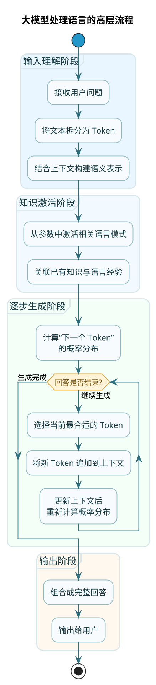
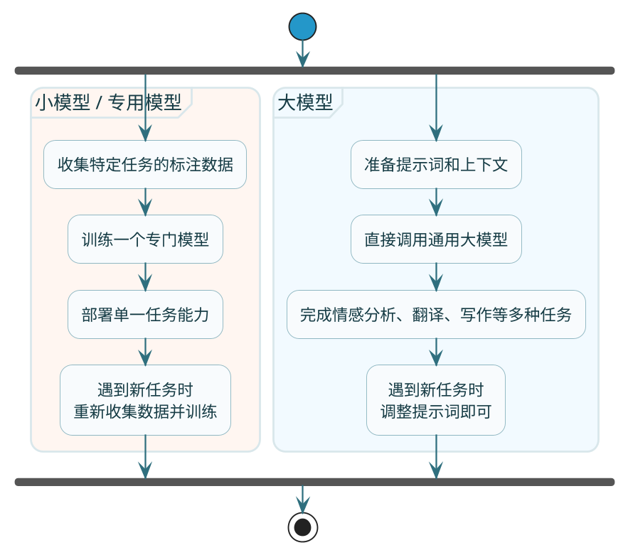
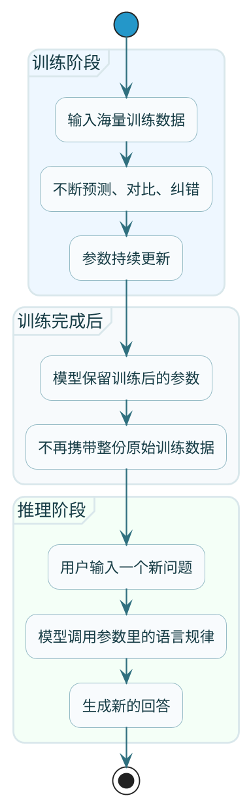

# 大模型基础入门

你可能已经用过 ChatGPT、DeepSeek 或者通义千问，体验过跟 AI 对话的感觉。不管是让它帮你写代码、改文章，还是单纯闲聊解闷，你都会发现这玩意儿确实有两把刷子。但如果让你解释一下什么是大模型，它和以前的 AI 有啥区别，它是怎么做到这么"聪明"的，可能就有点说不清了。

别急，咱们先从一个真实的业务场景说起，你就能直观感受到大模型的厉害之处。


## 传统编程的困境：规则永远写不完

假设你在公司负责一个智能客服系统。老板说，能不能让系统自动回答用户的常见问题，减少人工客服的压力？

按照传统编程的思路，你可能会这样写：

```java
public class TraditionalCustomerService {
    
    public String handleQuestion(String question) {
        // 密码相关问题
        if (question.contains("密码") && question.contains("忘记")) {
            return "请点击登录页面的'忘记密码'链接重置您的密码";
        }
        if (question.contains("密码") && question.contains("修改")) {
            return "请登录后在'账户设置'-'安全中心'中修改密码";
        }
        
        // 退款相关问题
        if (question.contains("退款") || question.contains("退货")) {
            return "退款申请请在订单详情页点击'申请退款'按钮提交";
        }
        
        // 发票相关问题
        if (question.contains("发票")) {
            return "发票将在确认收货后3个工作日内开具，届时会发送到您的邮箱";
        }
        
        // 物流相关问题
        if (question.contains("物流") || question.contains("快递") || question.contains("发货")) {
            return "您可以在订单详情页查看物流信息，一般下单后48小时内发货";
        }
        
        // 兜底
        return "抱歉，您的问题我暂时无法回答，正在为您转接人工客服...";
    }
}
```

这段代码看起来逻辑清晰，但上线之后你就会发现问题：**用户的表达方式千奇百怪，你永远也写不完所有的规则**。

比如"密码忘记了"这个意图，用户可能这样说：
- "我密码忘了怎么办"
- "登录不进去，密码不记得了"
- "账号进不了啊"
- "之前的密码想不起来了"
- "登陆密码是啥来着"（注意这里用户写的是"登陆"而不是"登录"）
- "password 忘了"
- "咋找回密码"

你的 if 语句只能匹配到包含"密码"和"忘记"两个关键词的情况。用户说"账号进不了"，虽然表达的是同一个意思，但因为没有"密码"这个词，就直接被踢到人工客服了。

你可能想，那我多加几个关键词不就行了？于是代码变成了：

```java
if ((question.contains("密码") || question.contains("口令") || question.contains("password")) 
    && (question.contains("忘记") || question.contains("忘了") || question.contains("不记得") 
        || question.contains("想不起") || question.contains("找回"))) {
    return "请点击登录页面的'忘记密码'链接重置您的密码";
}
```

这还只是一个意图。你的客服系统可能有几百个常见问题，每个问题都要写这么多规则，而且用户的表达方式还在不断变化。这条路走到底，只会越来越痛苦。

## 传统 NLP：比规则聪明一点，但也有限

后来有了传统的自然语言处理（NLP）技术，比如关键词匹配、TF-IDF、朴素贝叶斯分类器等。这些方法比 if-else 聪明一点，能做一些统计层面的文本分析。

比如 TF-IDF 可以计算每个词在文档中的重要程度，朴素贝叶斯可以根据词频统计来判断文本的类别。但本质上，这些方法还是在"数词频"、"算概率"，并不真正理解语言的含义。

举个例子，用户说："这个东西不想要了"。传统 NLP 可能把它拆成"这个"、"东西"、"不想要"、"了"几个词，然后分别去匹配。结果"东西"这个词可能被匹配到商品相关的类别，"不想要"可能被忽略或者误判，最后系统可能给出一个商品推荐的回答，完全答非所问。

再比如，"这家餐厅味道还行吧"和"这家餐厅味道真不行"，传统 NLP 可能因为两句话都包含"餐厅"、"味道"、"行"这些词，而把它们判断为相似的句子。但实际上一个是勉强认可，一个是明确差评，意思完全相反。

## 大模型的出现：让机器真正"理解"语言

大模型（Large Language Model，LLM）的出现彻底改变了这个局面。

大模型的训练方式可以简单理解为：让机器阅读互联网上海量的文本数据——书籍、网页、论坛、代码、新闻、百科、论文……从中学习语言的规律和知识。它不是靠人写规则，而是靠"读"了足够多的文本之后，自己"悟"出了语言是怎么运作的。

如果把大模型处理一句话的过程画成流程图，可以粗略理解成下面这样：



打个比方来说：

**传统编程**像是给一个人一本操作手册，手册上写了"遇到 A 情况就做 B"。手册有多厚，他能处理的情况就有多少。手册上没写的，他就不会。

**传统 NLP**像是让这个人学会了查字典和数数。他能统计一段话里某个词出现了几次，能算出两段话有多少相同的词。但他不理解这些词组合在一起是什么意思。

**大模型**更像是让一个人从小读了几百万本书。虽然没人专门教过他语法规则和语义分析，但通过大量阅读，他自然而然学会了语言的用法、理解了常识、具备了推理能力。你跟他说话，他能听懂你的意思，还能组织语言回应你。

所以当你问大模型"账号进不了"，它能理解你说的是登录问题；当你说"这个东西不想要了"，它能理解你想退货；当你说"味道还行吧"，它知道这是一个不太满意但也没太失望的评价。

这种能力，是之前任何技术都做不到的。

## 大模型到底是什么

现在我们来正式定义一下。当人们说"大模型"的时候，一般指的是 **LLM（Large Language Model）**，也就是**大语言模型**。

ChatGPT、GPT-4、DeepSeek、通义千问、文心一言、Llama、Claude……这些你听过的名字，都属于大语言模型。

### 大语言模型的定义

:::info 核心定义
**大语言模型是一种基于深度学习的人工智能模型，通过在海量文本数据上进行训练，学习语言的统计规律和知识表示，从而具备理解和生成自然语言的能力。**

这个定义有几个关键词：

1. **深度学习**：大模型的技术基础是深度神经网络，通常采用 Transformer 架构（后面会详细讲）
2. **海量文本数据**：训练数据量达到 TB 甚至 PB 级别
3. **统计规律**：模型学习的是词语之间的概率关系，而不是硬编码的规则
4. **理解和生成**：既能读懂人类的语言，也能产出人类可读的文本
:::

### 大模型和小模型的区别

在大模型出现之前，也有很多用于语言处理的模型，比如用于情感分析的模型、用于命名实体识别的模型、用于机器翻译的模型等。这些模型现在被称为"小模型"或"专用模型"。

大模型和小模型的核心区别在于：

| 维度 | 小模型/专用模型 | 大模型 |
|------|----------------|--------|
| 参数量 | 几千万到几亿 | 几十亿到几千亿 |
| 训练数据 | 特定领域的标注数据 | 互联网上的海量无标注文本 |
| 任务范围 | 只能做特定任务（如情感分析） | 一个模型能做多种任务 |
| 适应新任务 | 需要重新训练 | 通过提示词即可适应 |
| 通用性 | 差 | 强 |

举个例子，如果你想做一个情感分析功能：

**用小模型**：你需要收集大量的情感标注数据（比如"这个产品很好→正面"、"服务太差了→负面"），然后训练一个专门的情感分类模型。这个模型只能做情感分析，让它做翻译或者写文章，它就不会了。

**用大模型**：你不需要训练任何东西。直接给大模型一个提示词："请分析以下文本的情感倾向，输出'正面'、'负面'或'中性'。文本：xxx"。它就能给你答案。而且同一个模型，换个提示词，就能帮你翻译、写文章、改代码。

如果把这两种方案的落地方式画成图，对比会更直观：



这种"一个模型打天下"的能力，是大模型的核心价值。

## 为什么叫大模型？

大模型这个名字，不是随便叫的。它在三个维度上都做到了前所未有的规模。

### 第一个"大"：参数量巨大

这是"大"最直接、最核心的含义。

**什么是参数？**

你可能在各种技术文章里见过 7B、14B、72B、175B、671B 这样的数字。这里的 B 是 Billion（十亿）的缩写。7B 就是 70 亿个参数，175B 就是 1750 亿个参数。

那参数到底是什么呢？

从技术角度说，参数就是神经网络中的权重值。每个参数都是一个具体的数字，比如 0.0012、-1.357、0.889。整个模型就是由这些数字组成的巨大矩阵，它们记录了模型通过训练学到的所有知识。

从直觉角度说，你可以把参数理解为模型大脑里的"神经连接"。人类大脑有大约 860 亿个神经元，神经元之间通过突触连接，形成了我们的记忆、思维和智能。大模型的参数就类似于这些连接——参数越多，模型能存储的知识就越多，能处理的语言现象就越复杂。

**参数量的发展历程**

大模型的参数量经历了爆炸式增长：

| 年份 | 代表模型 | 参数量 | 里程碑意义 |
|------|---------|--------|-----------|
| 2018 | GPT-1 | 1.17 亿 | Transformer 架构在语言模型的首次大规模应用 |
| 2019 | GPT-2 | 15 亿 | 展示了语言模型的惊人生成能力 |
| 2020 | GPT-3 | 1750 亿 | 参数量跨越式增长，涌现出少样本学习能力 |
| 2022 | PaLM | 5400 亿 | 刷新参数量纪录，推理能力显著提升 |
| 2023 | GPT-4 | 传闻 1.8 万亿（MoE） | 多模态能力，综合智能接近人类 |
| 2024 | DeepSeek-V3 | 6710 亿（MoE） | 开源模型追上闭源，性价比革命 |

可以看到，从 GPT-1 的 1 亿参数到现在的万亿参数，只用了不到 6 年时间，增长了将近一万倍。

**参数量和能力的关系**

一般来说，参数量越大，模型的能力越强。但这不是线性关系，而是存在一些"涌现"效应。

什么是涌现？就是当模型规模突破某个临界点时，突然具备了之前没有的能力。比如：
- 小模型可能只会"复述"，而大模型能"推理"
- 小模型可能只会回答见过的问题，大模型能举一反三
- 小模型可能无法理解复杂的指令，大模型能理解并执行多步骤任务

下面是不同参数量级模型的能力参考：

| 参数量级 | 代表模型 | 能力范围 | 典型表现 |
|---------|---------|---------|---------|
| 1B-3B | Qwen2.5-1.5B、Phi-3-mini | 简单对话、基础文本分类、简单信息提取 | 能进行基本的问答，但复杂任务容易出错，推理能力有限 |
| 7B-8B | Qwen2.5-7B、Llama3-8B、Mistral-7B | 日常对话、简单问答、基础代码生成、摘要生成 | 能处理大多数日常任务，代码能力有限，复杂推理会出错 |
| 14B-32B | Qwen2.5-14B、Qwen2.5-32B、Mixtral-8x7B | 较复杂的对话和问答、中等难度代码生成、逻辑推理 | 能力接近 GPT-3.5，可以胜任大多数应用场景 |
| 70B+ | Qwen2.5-72B、Llama3.1-70B | 复杂推理、高质量代码生成、专业领域问答、创意写作 | 接近 GPT-4 的能力水平，可以处理复杂的专业任务 |
| 数百B+（MoE） | DeepSeek-V3、GPT-4 | 顶级推理能力、多模态理解、复杂指令跟随 | 当前最强的模型能力，适合最苛刻的应用场景 |

:::warning 常见误区
**参数越大越好吗？**

不一定。这是一个常见的误区。

虽然大参数模型能力更强，但也有明显的缺点：
1. **推理速度慢**：参数越多，计算量越大，生成回答的速度越慢
2. **成本高**：不管是本地部署还是 API 调用，大模型的成本都更高
3. **过于"聪明"**：有时候简单任务用大模型反而会过度发挥，答非所问
:::

:::tip 选型建议
正确的做法是**根据任务需求选择合适的模型**：
- 做一个简单的 FAQ 问答机器人，7B 可能就够了
- 做一个需要复杂推理的智能助手，可能需要 32B+
- 做顶级的代码生成或创意写作，才需要 70B 以上

选模型不是选最大的，而是选"刚好够用"的。这个道理后面讲模型选型时会详细展开。
:::

### 第二个"大"：训练数据量大

大模型的强大能力，很大程度上来自于海量的训练数据。

**训练数据从哪来？**

大模型的训练数据主要来自互联网上的公开文本，包括但不限于：

| 数据类型 | 来源示例 | 作用 |
|---------|---------|------|
| 网页文本 | Common Crawl（互联网快照） | 覆盖各种话题和写作风格 |
| 书籍 | Project Gutenberg、各种电子书 | 高质量的长文本、文学素养 |
| 学术论文 | arXiv、PubMed、学术期刊 | 专业知识和学术表达 |
| 代码 | GitHub、Stack Overflow | 编程能力和技术知识 |
| 百科 | Wikipedia 多语言版本 | 结构化的知识和事实 |
| 新闻 | 各大新闻网站 | 时事知识和新闻写作风格 |
| 社交媒体 | Reddit、论坛等 | 口语化表达和日常对话 |
| 问答网站 | Quora、知乎 | 问答格式和各领域知识 |

**数据量有多大？**

不同模型的训练数据量差异很大，但顶级模型的数据量通常达到惊人的规模：

| 模型 | 训练数据量（Token） | 大约相当于 |
|------|-------------------|-----------|
| GPT-3 | 约 5000 亿 Token | 3750 亿个汉字，约 3750 万本书 |
| Llama 2 | 2 万亿 Token | 1.5 万亿个汉字，约 1.5 亿本书 |
| GPT-4 | 传闻 13 万亿 Token | 约 10 亿本书 |
| Llama 3 | 15 万亿+ Token | 超过 10 亿本书 |

为了直观感受这个规模，做个对比：如果一个人每天阅读一本书，读完 1 亿本书需要 27 万年。而大模型在训练时"读"完了这些内容。

**为什么需要这么多数据？**

数据量大的意义在于：

1. **覆盖更多的语言现象**：人类语言的表达方式太多了。只有见过足够多的例子，模型才能学会处理各种情况。

2. **学习更深的知识**：要让模型知道"太阳从东边升起"、"水的化学式是 H2O"这些知识，它需要在训练数据中多次见到这些信息。

3. **理解更复杂的上下文**：理解一个词在不同语境下的不同含义，需要大量的上下文示例。

4. **掌握更多的技能**：写代码、翻译、写诗、做数学题……每种技能都需要大量相关的训练数据。

打个比方，就像前面说的厨师学艺。如果他只在一家川菜馆学了三年，见过的食材和做法有限，那他只会做川菜。但如果他走遍全国，在各种菜系的餐馆都学过，见过各种食材、各种做法、各种口味搭配，那他的厨艺就更全面。遇到没见过的食材，他也能根据以往的经验创造出新的菜品。

大模型的数据量就是它的"阅历"。阅历越丰富，处理新问题的能力就越强。

:::note 行业趋势
**数据危机：数据要用完了？**

有一个令人担忧的趋势：**高质量的训练数据可能快要用完了**。

根据研究机构 Epoch AI 的预测，按照目前的消耗速度，到 2026 年左右，互联网上的高质量文本数据可能会被"用尽"。这不是说数据量不够，而是说**高质量的、适合训练的数据**越来越稀缺。

这给大模型的发展带来了挑战。目前业界探索的解决方案主要有：

1. **合成数据**：让大模型自己生成数据，然后用这些数据来训练更强的模型。DeepSeek-R1 的训练就大量使用了合成数据。

2. **更高效的训练方法**：用更少的数据达到同样的效果，比如课程学习、数据蒸馏等技术。

3. **多模态数据**：不仅用文本，还用图像、视频、音频等多种模态的数据来训练。

4. **提高数据质量**：与其追求数据量，不如提高数据的质量和多样性。
:::

### 第三个"大"：算力需求量大

大模型的训练需要极其强大的计算资源，这也是"大"的一个重要维度。

**需要多少算力？**

训练一个大模型的计算量通常用 FLOPS（每秒浮点运算次数）或者 GPU 小时来衡量：

| 模型 | 训练使用的算力 | 大约花费 |
|------|---------------|---------|
| GPT-3 | 约 3640 PetaFLOP-days | 数百万美元 |
| Llama 2 70B | 约 6400 GPU 天（A100） | 数百万美元 |
| GPT-4 | 传闻 2.15e25 FLOPS | 上亿美元 |
| Llama 3 405B | 约 30M GPU 小时 | 上亿美元 |

什么概念？GPT-4 的训练据传使用了约 25000 块 A100 GPU，训练了约 90-100 天。按照云服务的价格计算，光是算力成本就要 6300 万到 7800 万美元，加上数据处理、人员工资、电费等，总成本轻松过亿。

**算力门槛**

这就是为什么能训练顶级大模型的公司屈指可数——不是技术门槛，是烧钱门槛。

在全球范围内，有能力训练千亿级参数模型的公司可能不超过 20 家。这些公司要么本身就是云计算巨头（Google、Microsoft、阿里、腾讯），要么获得了巨额融资（OpenAI、Anthropic、深度求索）。

**好消息：使用门槛在降低**

虽然训练大模型的门槛极高，但**使用大模型的门槛在持续降低**：

1. **API 服务**：你不需要自己训练或部署模型，直接调用 API 就能使用顶级模型的能力。成本按 Token 计算，可能几分钱就能完成一次对话。

2. **开源模型**：Llama、Qwen、DeepSeek 等开源模型让个人和小公司也能部署自己的大模型。

3. **模型量化**：通过量化技术，把模型压缩到更小的体积，用普通显卡甚至 CPU 就能运行。

4. **推理优化**：各种推理框架（vLLM、llama.cpp、Ollama）大幅降低了运行大模型的硬件要求。

作为开发者，你完全不需要关心训练的事情。你只需要学会如何使用现成的模型——这就是本系列后续内容的重点。

## 参数和训练数据的关系

这两个概念经常被混淆，咱们用一个详细的类比来说清楚。

### 类比：学生备战高考

想象一个学生备战高考的过程：

**训练数据 = 他刷过的所有题目**

五年高考三年模拟、各省真题、名校月考卷、各种辅导书的练习题……加起来可能有几万道题。这些题目是**外部的学习材料**，是他学习的输入。

在训练过程中，他每做一道题，就会有反馈：这道题做对了，那道题做错了。做错的题要分析原因，调整自己的解题思路。

**参数 = 他脑子里总结出来的解题方法**

经过大量做题之后，他脑子里形成了一套解题方法论：
- "看到求导想极值"
- "数列题先找通项公式"
- "物理题先分析受力"
- "作文开头要点题"
- "选择题不确定的选 B 或 C 概率大"（虽然这个不太靠谱 😄）

这些方法论是**内部的能力沉淀**，是学习后留下来的东西。

**考试时发生了什么？**

高考那天，他走进考场，拿到一张从未见过的试卷。

他不是去回忆"这道题和哪道做过的题一模一样"，而是用脑子里的解题方法来分析这道新题：这是什么类型的题？我应该用什么方法？

同样，大模型在生成回答时，也不是去训练数据里搜索完全一样的问题。而是用它学到的"语言规律"（参数）来理解你的问题，然后组织语言生成回答。

这个关系如果换成训练和使用两个阶段来看，会更容易记住：



### 关键区别

| 维度 | 训练数据 | 参数 |
|------|---------|------|
| 本质 | 外部输入 | 内部状态 |
| 存在时间 | 只在训练时使用 | 训练完成后永久保存 |
| 可否查看 | 可以（只是量太大） | 就是一堆数字，看了也看不懂 |
| 大小 | TB/PB 级 | GB 级（压缩后） |
| 作用 | 提供学习材料 | 存储学习成果 |

### 一个常见误解

:::warning 注意
很多人以为大模型回答问题时，是去训练数据里"搜索"答案。这是不对的。

训练完成后，模型只保留了参数（那些数字），原始的训练数据是不会被打包进模型的。这就像高考完之后，你不会带着几万道练习题去上大学，但你脑子里的解题能力会跟着你。

当然，模型确实会"记住"一些训练数据中的具体信息，比如"中国的首都是北京"这种知识。但这些信息是被编码进了参数里，而不是以原文的形式存储。

这也解释了为什么大模型会有"幻觉"——它不是在查资料，而是在"推测"什么样的回答看起来合理。有时候推测错了，就会产生看起来很像那么回事、但实际上不对的内容。
:::

## 大模型和传统编程的本质区别

搞清楚了大模型的基本概念，咱们来深入对比一下它和传统编程的区别。这对于理解大模型的能力和局限性都很重要。

### 范式的根本不同

**传统编程是"规则驱动"的**。程序员把所有的逻辑写成代码，计算机严格按照代码执行：

```
if 条件A:
    执行动作1
elif 条件B:
    执行动作2
else:
    执行默认动作
```

所有的情况都必须被预先定义。代码里没写的情况，程序就不知道怎么处理。程序员是"全知全能"的，必须预见所有可能的场景。

**大模型是"数据驱动"的**。没有人告诉模型具体的规则，它通过学习海量数据，自己发现了语言的规律：

```
输入: 大量文本数据
训练: 学习词语之间的概率关系
输出: 能够根据上下文预测/生成合理的内容
```

模型学到的是"模式"而不是"规则"。它能处理训练时没见过的情况，只要这种情况和见过的模式相似。

### 用一个例子说明

**任务**：判断用户评论是正面还是负面

**传统编程的做法**：

```java
public class SentimentAnalyzer {
    private static final Set<String> POSITIVE_WORDS = Set.of(
        "好", "棒", "赞", "喜欢", "满意", "优秀", "出色", "完美"
    );
    private static final Set<String> NEGATIVE_WORDS = Set.of(
        "差", "烂", "糟糕", "讨厌", "失望", "垃圾", "难用", "坑"
    );
    
    public String analyze(String comment) {
        int positiveCount = 0;
        int negativeCount = 0;
        
        for (String word : POSITIVE_WORDS) {
            if (comment.contains(word)) positiveCount++;
        }
        for (String word : NEGATIVE_WORDS) {
            if (comment.contains(word)) negativeCount++;
        }
        
        if (positiveCount > negativeCount) return "正面";
        if (negativeCount > positiveCount) return "负面";
        return "中性";
    }
}
```

这种方法的问题显而易见：
- "这部电影真是让我大开眼界"——没有触发任何关键词，判断为中性，但实际上是正面
- "好一个坑货"——触发了"好"和"坑"，可能判断为中性，但实际上是负面
- "味道不差"——触发了"差"，可能判断为负面，但实际上是正面（双重否定）

**大模型的做法**：

```python
prompt = """请分析以下用户评论的情感倾向，输出"正面"、"负面"或"中性"。

评论：这部电影真是让我大开眼界
情感："""

response = call_llm(prompt)
# 输出：正面
```

大模型能正确处理这些情况，因为：
- 它在训练数据中见过各种情感表达方式
- 它理解"大开眼界"在这个语境下是褒义
- 它能识别出反讽、双重否定等复杂的语言现象

### 各自的优缺点

| 维度 | 传统编程 | 大模型 |
|------|---------|--------|
| 可预测性 | 高，输入相同则输出必定相同 | 低，可能每次输出都略有不同 |
| 可解释性 | 高，可以追踪每一步逻辑 | 低，内部决策过程是黑箱 |
| 处理边界情况 | 差，只能处理预定义的情况 | 好，能泛化到没见过的情况 |
| 精确计算 | 好，数学计算绝对准确 | 差，可能算错简单的数学题 |
| 开发成本 | 简单场景低，复杂场景高 | 调用 API 成本低，但要花钱 |
| 错误模式 | 逻辑错误，可以 debug | 可能一本正经地胡说八道 |

### 什么时候用什么

**适合传统编程的场景**：
- 规则明确、逻辑清晰的业务流程
- 需要精确计算的场景
- 对可靠性要求极高、不允许出错的场景
- 处理结构化数据（数据库操作、API 调用等）

**适合大模型的场景**：
- 自然语言理解和生成
- 规则模糊、难以穷举的场景
- 需要理解语义和上下文的任务
- 创意类工作（写作、头脑风暴等）

:::tip 最佳实践
**最佳实践：结合使用**

实际项目中，最好的做法往往是把两者结合起来：
- 用大模型做自然语言理解，把用户意图转化为结构化数据
- 用传统编程处理业务逻辑、数据库操作、精确计算
- 用大模型生成自然语言回复

```
用户输入 → 大模型理解意图 → 传统代码执行业务逻辑 → 大模型生成回复 → 用户
```

这种架构既发挥了大模型理解自然语言的优势，又保证了业务逻辑的可靠性和可控性。
:::

## 大模型技术演进简史

了解大模型是怎么一步步发展到今天的，有助于你理解现在各种技术的来龙去脉。

如果先站在全局看，大模型的发展大致经历了下面这条演进路线：

```plantuml title="大模型技术演进路线" width="100%" align="center"
@startuml

left to right direction
skinparam backgroundColor transparent
skinparam shadowing false
skinparam dpi 180
skinparam DefaultTextAlignment center
skinparam ArrowColor #2F6F7E
skinparam ArrowThickness 1.4
skinparam rectangle {
  RoundCorner 18
  BorderColor #8FB7C2
  FontColor #153B44
}

rectangle "统计语言模型\nN-gram\n只能看短上下文" as S1 #FFF8EF
rectangle "神经网络语言模型\nRNN / LSTM\n上下文更长，但训练慢" as S2 #EEF7FF
rectangle "Transformer 时代\n自注意力 + 并行训练" as S3 #F4FFF7
rectangle "规模化阶段\nGPT-3 / PaLM\n能力开始涌现" as S4 #F5F0FF
rectangle "ChatGPT 时代\n对话化 + RLHF + 产品化" as S5 #FFF3F6
rectangle "当前趋势\n开源、多模态、Agent、推理增强" as S6 #F5FAFC

S1 --> S2
S2 --> S3
S3 --> S4
S4 --> S5
S5 --> S6

@enduml
```



### 第一阶段：统计语言模型时代（1990s-2010s）

最早的语言模型是基于统计的。核心思想很简单：统计在大量文本中，某个词后面最可能出现什么词。

比如 N-gram 模型：
- "我喜欢吃"后面出现"苹果"的概率是 0.15
- "我喜欢吃"后面出现"的"的概率是 0.02
- ...

这种方法的问题是只能看到有限的上下文（通常是前面 2-3 个词），无法理解长距离的依赖关系。

### 第二阶段：神经网络语言模型（2010s-2017）

深度学习兴起后，研究者开始用神经网络来做语言模型。主要技术是 RNN（循环神经网络）和 LSTM（长短期记忆网络）。

这些模型可以处理更长的上下文，但有两个主要问题：
1. **训练慢**：必须按顺序处理，无法并行
2. **长距离依赖问题**：句子太长时，开头的信息会被"遗忘"

### 第三阶段：Transformer 时代（2017-2020）

2017 年，Google 发表了划时代的论文《Attention Is All You Need》，提出了 Transformer 架构。这是大模型技术的奠基之作。

Transformer 的核心创新是"自注意力机制"：
- 可以同时看到整个句子的所有位置
- 能够直接建立任意两个位置之间的联系
- 可以大规模并行计算

基于 Transformer，出现了两个重要的方向：
- **BERT**（2018）：双向编码器，擅长理解任务
- **GPT**（2018）：单向解码器，擅长生成任务

### 第四阶段：大力出奇迹（2020-2022）

OpenAI 的 GPT-3（2020）证明了一件事：**模型够大、数据够多，就能涌现出惊人的能力**。

GPT-3 有 1750 亿参数，比 GPT-2 大了 100 多倍。它展示了一种神奇的能力：只需要给几个例子，就能学会做新的任务（few-shot learning）。

这个阶段的特点是"大力出奇迹"——不断增加参数量和数据量，模型能力也不断提升。Google 的 PaLM（5400 亿参数）把这个趋势推向了顶峰。

### 第五阶段：ChatGPT 引爆全民 AI（2022-至今）

2022 年 11 月，OpenAI 发布了 ChatGPT，一夜之间引爆了全民 AI 热潮。

ChatGPT 的突破不在于模型本身，而在于：
1. **对话形式**：让普通人也能轻松使用大模型
2. **RLHF**：通过人类反馈强化学习，让模型的回答更符合人类期望
3. **产品化**：把技术包装成了好用的产品

随后，GPT-4、Claude、Gemini、通义千问、DeepSeek 等模型百花齐放，大模型进入了高速发展期。

### 当前趋势

2024-2025 年，大模型领域呈现几个明显的趋势：

1. **开源追赶闭源**：Llama 3、Qwen 2.5、DeepSeek-V3 等开源模型的能力已经接近甚至在某些方面超越 GPT-4

2. **效率优化**：不再一味追求大参数，而是通过更好的架构（如 MoE）、更高效的训练方法来提升性价比

3. **多模态融合**：模型不仅能处理文本，还能理解图片、视频、音频

4. **Agent 能力**：让大模型能够使用工具、执行任务，而不仅仅是对话

5. **推理能力增强**：DeepSeek-R1 等模型通过"思维链"技术，大幅提升了复杂推理能力

## 小结

这篇咱们深入聊了大模型的基础知识：

**1. 大模型是什么**
- LLM = Large Language Model = 大语言模型
- 基于海量数据训练的深度学习模型
- 能理解和生成自然语言

**2. 为什么叫"大"**
- 参数量大：从 10 亿到万亿级别
- 训练数据量大：TB/PB 级的文本数据
- 算力需求大：需要上万张 GPU 训练数周

**3. 核心概念**
- 参数 = 模型学到的知识，以数字形式存储
- 训练数据 = 学习材料，训练后不再需要
- 参数越多 ≠ 越适合，要根据任务选择

**4. 和传统编程的区别**
- 传统编程：规则驱动，精确但不灵活
- 大模型：数据驱动，灵活但可能出错
- 最佳实践：结合使用

**5. 技术演进**
- 从统计模型到神经网络到 Transformer
- ChatGPT 引爆全民 AI
- 当前趋势：开源、高效、多模态、Agent

理解了这些基础概念，下一篇咱们来深入聊聊大模型的工作原理——它到底是怎么"理解"语言、怎么生成回答的。这部分内容涉及到 Transformer 架构和注意力机制，是理解后续 Prompt 工程、RAG 等技术的重要基础。
