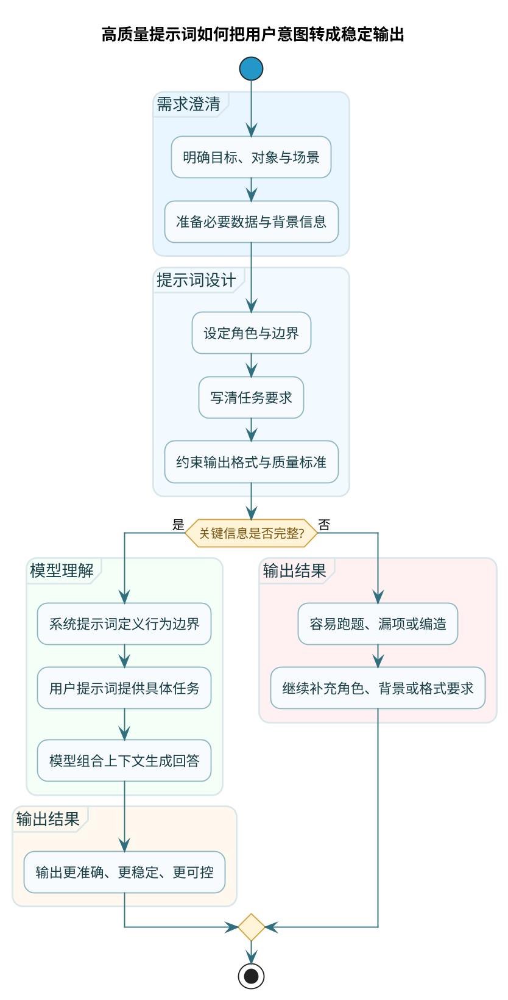

# 提示词入门与核心概念

当你打开 ChatGPT 或者 DeepSeek，在对话框里敲下一行字，点击发送——你有没有想过，这行字在技术层面叫什么？

它不叫"问题"，不叫"请求"，也不叫"指令"。在大模型的世界里，它有一个专门的名字：**Prompt（提示词）**。

你可以把提示词理解成一把钥匙，用来开启大模型能力的那扇门。钥匙的形状对不对、材质好不好，直接决定了门能不能打开、开得顺不顺利。

> 换句话说，**提示词就是你告诉模型"做什么、怎么做、做成什么样"的那段话**。

但这里有个关键区别：提示词不是代码，不是命令行指令，它是**自然语言**。你平时怎么说话，就可以怎么写提示词。比如你想让 AI 扮演一个角色，就直接说"你是一个xxx专家"；想要特定格式的输出，就说"请用表格形式回答"。

这种自然语言的特性，既是提示词的魅力所在，也是它的难点所在——因为自然语言天然存在歧义和模糊性，你以为说清楚了，模型可能理解成另一个意思。

## 为什么提示词这么重要

先看一个实际案例，感受一下提示词带来的差异。

假设你需要 AI 帮忙写一份员工体检报告分析，你可能会这样问：

**随便问法**：
```
帮我写一份体检报告分析
```

AI 大概率会问你：请提供体检数据。或者更糟糕的情况是，它直接编造一个虚构员工的体检分析给你——这就是业内常说的"一本正经胡说八道"。

**认真问法**：
```
# 你的身份
你是一名有十年经验的企业健康管理顾问

# 你的任务
根据下面这位员工的体检指标，分析他的健康状况，指出潜在风险，并给出切实可行的改善建议

# 员工体检数据
姓名：李明
年龄：45岁
身高：172cm
体重：85kg
血压：135/90mmHg
空腹血糖：6.8mmol/L
总胆固醇：5.9mmol/L
尿酸：480μmol/L
肝功能：ALT 52 U/L
日常习惯：久坐办公，应酬多，平均每周喝酒3次

# 输出要求
1. 用"健康分析报告"作为标题
2. 分别从心血管、代谢、肝脏三个维度分析
3. 每个问题都要给出具体的改善措施
4. 控制在400字左右
```

这两种问法，得到的结果完全是两个档次。后者会输出一份结构清晰、分析专业、建议具体的报告；前者可能就是一堆泛泛而谈的套话。

**这说明一个重要道理：提示词的质量，直接决定了输出的质量。**

你给模型的信息越具体、越有结构，模型就越能准确理解你的意图，输出也就越符合预期。



## 提示词到底包含哪些要素

从上面那个例子，你可能已经看出一些门道了。一个好的提示词，通常包含这几个核心要素：

### 角色设定：让 AI 知道"自己是谁"

给模型一个身份定位，它的回答风格和专业度会完全不同。

比如你问"什么是股票分红"：
- 不设定角色时，AI 可能给你一个教科书式的定义
- 设定角色为"证券从业者给新手解释"，回答会更通俗易懂
- 设定角色为"金融学教授"，回答会更学术严谨

角色设定不是玩角色扮演游戏，而是在告诉模型应该用什么视角、什么专业程度来回答问题。

### 任务描述：明确告诉 AI"要做什么"

模糊的任务描述是提示词设计的大忌。

对比这两种表述：
- 模糊："分析一下这段代码"
- 清晰："检查这段 Java 代码是否存在空指针风险，如果有请指出具体行号，并给出修复建议"

任务描述要回答三个问题：做什么（分析代码）、怎么做（检查空指针风险）、结果是什么（指出行号+修复建议）。

### 背景信息：提供 AI 需要的"原材料"

大模型不是神，它不知道你的具体场景、具体数据、具体需求。你得把这些信息喂给它。

比如让 AI 写一封邮件，你需要告诉它：
- 写给谁（收件人的身份和你们的关系）
- 关于什么事（邮件主题和背景）
- 想达到什么目的（催促、感谢、协商还是通知）
- 有什么特殊要求（语气正式还是随意、是否需要附上时间节点等）

### 输出格式：规定 AI 输出的"样子"

你不说，AI 就自由发挥。自由发挥的结果往往是：要么输出太长，要么格式混乱，要么不是你想要的形式。

常见的输出格式约束：
- 字数限制："回答控制在200字以内"
- 结构要求："用表格对比优缺点"、"分点列出，每点不超过一句话"
- 格式类型："输出为 JSON 格式"、"用 Markdown 格式"

## 提示词的两种类型：系统提示词和用户提示词

如果你调用过大模型的 API，会发现消息有两种角色：`system` 和 `user`。

```json
{
  "messages": [
    {"role": "system", "content": "你是一个专业的代码审查助手"},
    {"role": "user", "content": "请检查下面这段代码有什么问题"}
  ]
}
```

**系统提示词（System Prompt）** 是在幕后工作的，用户通常看不到。它定义了 AI 的"人格"和"边界"：
- 你是谁（角色身份）
- 你的行为准则（什么能做、什么不能做）
- 你的输出风格（专业严肃还是轻松幽默）

**用户提示词（User Prompt）** 就是用户直接输入的内容，是具体的问题或任务。

打个比方：系统提示词像是给员工的岗位说明书，定义了他的职责范围和工作标准；用户提示词像是每天分配给他的具体任务。

在实际应用中，系统提示词通常由开发者预先设定好，用户是看不到也改不了的。这也是为什么有些 AI 产品会拒绝回答某些问题——因为系统提示词里设置了限制。

## 提示词工程：为什么这件事值得认真对待

"提示词工程"（Prompt Engineering）这个词听起来有点唬人，但说白了就是**系统性地设计和优化提示词，让 AI 输出更稳定、更可控、更符合预期**。

为什么要当成"工程"来对待？因为在实际项目中，一个提示词往往需要：
- 覆盖各种边界情况
- 处理用户的各种奇葩表达
- 防止 AI 输出有害或错误的内容
- 保证输出格式的一致性
- 应对模型升级带来的变化

这些都不是写一句话能解决的，需要反复测试、持续迭代，和写代码没什么两样。

实际上，很多 AI 应用的"智能程度"，一大半功劳要归功于提示词的设计。同样的模型，不同的提示词，效果可能天差地别。

## 一个形象的类比：提示词就像"炼丹"

在圈子里，大家经常把提示词设计比作"炼丹"。这个比喻非常贴切：

**炼丹的特点**：
- 没有标准配方，需要不断尝试
- 同样的药材，不同的火候、顺序、比例，结果完全不同
- 成功了也不一定能复制，失败了不一定知道原因
- 经验很重要，老师傅的直觉往往比新手靠谱

**提示词设计也是这样**：
- 没有放之四海而皆准的模板
- 同样的要素，排列组合方式不同，效果就不同
- 在模型 A 上好用的提示词，换到模型 B 可能就不行了
- 需要大量实践积累经验

但"炼丹"不意味着没有章法。经过这些年的探索，业界已经总结出很多行之有效的原则和技巧。掌握这些方法论，你就能更快地"炼"出好用的提示词，而不是完全靠碰运气。

## 影响提示词效果的其他因素

提示词写得好还不够，有些外部因素也会影响最终效果：

### 模型本身的能力

不同模型的"聪明程度"不一样。同一个提示词：
- 在 GPT-5 上可能表现完美
- 在开源小模型上可能一塌糊涂

选择合适的模型很重要。简单任务用小模型就够了，复杂任务才需要动用大模型。

### 上下文窗口的限制

每个模型能处理的文本长度是有限的。如果你塞进去的信息太多，超过了模型的上下文窗口，它可能会"遗忘"开头的内容，或者干脆报错。

所以提示词也要讲究精简，该说的要说，废话少说。

### 模型的随机性

大模型的输出是有随机性的。同样的提示词，问两次可能得到不同的答案。这是模型的特性，不是 bug。

如果你需要稳定的输出，可以通过调整 `temperature` 参数来降低随机性。temperature 越低，输出越稳定（但也可能越呆板）。

## 本章小结

这一章我们聊了提示词的基础概念：

1. **提示词是什么**：你输入给大模型的那段文字，是人机沟通的桥梁

2. **提示词为什么重要**：它直接决定了输出质量，写得好和写得差，效果天壤之别

3. **提示词的核心要素**：角色设定、任务描述、背景信息、输出格式

4. **两种提示词类型**：系统提示词（定义 AI 的"人格"）、用户提示词（具体的任务）

5. **提示词工程的价值**：系统性地设计和优化提示词，是打造优质 AI 应用的关键

6. **影响效果的其他因素**：模型能力、上下文限制、输出随机性

理解了这些基础概念，下一章我们来聊聊具体的设计原则和实战技巧——怎么把一个普通的提示词，打磨成一个好用的提示词。
