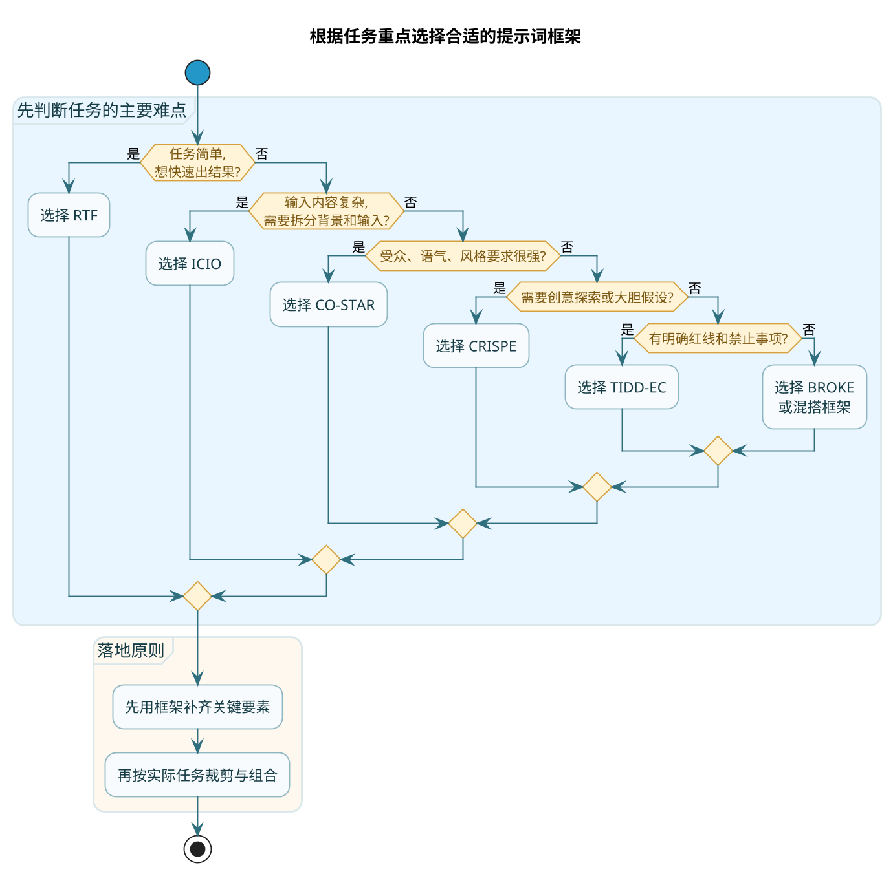

# 结构化提示词框架与模板

上一章讲了提示词设计的各种原则，但原则毕竟是原则，真到自己动手时，还是容易漏东漏西。

比如你记得要设角色、要写任务、要给示例……但到底先写啥后写啥？有没有更系统的方式？

这就是框架的价值。

:::info 框架的本质
**框架是前人趟过的路**。别人踩过的坑，你就不用再踩；别人总结的套路，你拿来就能用。

当然，框架不是死的。了解框架的核心思想，然后根据实际情况灵活调整，这才是正确的用法。
:::

下面介绍几种常见的提示词框架，各有特点，适合不同场景。

## RTF 框架：最简单的入门款

RTF 是 **Role-Task-Format** 的缩写，中文就是"角色-任务-格式"。

这是最基础的框架，三个要素就够了，简单粗暴，适合大多数日常场景。

### 框架结构

```
# Role（角色）
定义 AI 要扮演的身份

# Task（任务）
说明具体要完成什么

# Format（格式）
规定输出的形式
```

### 实战案例：让 AI 分析市场趋势

```
# Role
你是一位在新能源汽车行业深耕8年的投资分析师，擅长从政策、技术、市场三个维度分析行业走势。

# Task
分析2025年中国新能源汽车市场的竞争格局，找出3个最值得关注的投资方向，并解释你的判断依据。

# Format
用 Markdown 表格呈现，列包括：投资方向、机会点、风险提示、判断依据
```

### 什么时候用 RTF

- 任务相对简单，不需要太多背景铺垫
- 输入信息不复杂，不需要特别区分
- 快速出结果，不追求极致的精确度

:::note 适用说明
RTF 的优点是**简洁**，缺点是**对复杂场景可能不够用**。如果你的任务需要大量上下文或者有复杂的约束条件，RTF 可能就不够了。
:::

## ICIO 框架：强调输入输出的清晰分隔

ICIO 是 **Instruction-Context-Input-Output** 的缩写，即"指令-背景-输入-输出"。

相比 RTF，ICIO 更强调输入信息的组织方式，把"背景"和"输入"明确分开了。

### 框架结构

```
# Instruction（指令）
核心任务是什么

# Context（背景）
任务相关的背景信息，角色定位也可以放这里

# Input（输入）
需要处理的具体内容

# Output（输出）
期望的输出格式和要求
```

### 实战案例：为产品写营销文案

```
# Instruction
为下面这款产品撰写一段吸引眼球的营销文案。

# Context
你是一名深谙年轻消费者心理的营销文案策划。目标受众是25-35岁的都市职场人，他们追求效率、注重健康、愿意为品质买单。

# Input
产品名称：智能冷热杯
核心卖点：
- 一键切换冷热模式，5分钟快速制冷/加热
- 智能温控，实时显示水温
- 真空隔热，8小时保温
- 304不锈钢内胆，安全无异味
- 轻量设计，仅重280g

# Output
输出一段100字左右的营销文案，要求：
- 第一句话要抓人眼球
- 体现"懂生活"的调性
- 不要用"智能""颠覆""革命"这类用烂了的词
```

### ICIO 的优势

把背景和具体输入分开，有几个好处：

:::tip 为什么要分离背景与输入
1. **结构更清晰**：AI 能明确区分"我需要知道的背景"和"我需要处理的内容"
2. **便于复用**：背景和指令可以复用，只换 Input 就能处理不同内容
3. **调试更方便**：输出不对时，能更快定位是背景没给对还是输入格式有问题
:::

## CO-STAR 框架：全面系统的选择

CO-STAR 是一个更完整的框架，包含六个要素：**Context-Objective-Style-Tone-Audience-Response**。

翻译过来就是"背景-目标-风格-语气-受众-响应形式"。

### 框架结构

```
# Context（背景）
任务发生的场景和前因后果

# Objective（目标）
要达成的具体目的

# Style（风格）
内容的整体风格定位

# Tone（语气）
说话的腔调，正式还是随意

# Audience（受众）
内容是给谁看的

# Response（响应形式）
输出的格式、结构、长度等
```

### 实战案例：给青少年写社交媒体使用建议

```
# Context（背景）
近年来，青少年沉迷社交媒体的问题越来越普遍，刷手机到凌晨、被网络暴力困扰、分不清真假信息等现象屡见不鲜。学校计划在班会课上做一次专题教育。

# Objective（目标）
让学生认识到无节制使用社交媒体的危害，学会自我管理，建立健康的上网习惯。

# Style（风格）
不要说教，不要上纲上线，而是像一个过来人分享经验，有共鸣感。

# Tone（语气）
轻松、平等、略带幽默，像学长学姐聊天而不是老师训话。

# Audience（受众）
14-17岁的初高中学生，他们对说教很反感，但对真实案例和实用技巧有兴趣。

# Response（响应形式）
输出5条具体可操作的建议，每条建议：
1. 一句话点明核心观点
2. 举一个他们能感同身受的小场景或例子
3. 控制在50字以内
```

### CO-STAR 适合什么场景

- 输出内容有明确的受众群体
- 对语气和风格有要求
- 需要全面考虑各种因素的复杂任务

CO-STAR 的优点是**全面**，缺点是有时候显得**啰嗦**。简单任务没必要把六个要素都填满。

## CRISPE 框架：需要探索性输出时用

CRISPE 框架比较有意思，它包含一个"Experiment"环节，允许 AI 进行一些探索性的输出。

六个要素是：**Capacity-Role-Insight-Statement-Personality-Experiment**。

翻译一下就是"能力边界-角色-背景洞察-任务声明-个性风格-实验性输出"。

### 框架结构

```
# Capacity and Role（能力与角色）
定义 AI 的专业能力和身份定位

# Insight（洞察）
提供深层的背景信息或行业洞察

# Statement（声明）
具体的任务要求

# Personality（个性）
输出风格和人设

# Experiment（实验）
允许 AI 进行的创造性尝试或假设
```

### 实战案例：制定产品市场策略

```
# Capacity and Role
你是一位在消费电子行业有10年经验的产品战略顾问，擅长新品定位和市场突围。

# Insight
某国产耳机品牌计划明年推出一款主打"空间音频"的真无线耳机，目标是在500-800元价位段抢占市场。目前该价位段被索尼、BOSE、苹果二代产品牢牢把持，国产品牌缺乏存在感。

# Statement
请从以下四个维度给出策略建议：
1. 目标用户画像：谁是最有可能购买的第一批用户
2. 产品差异化：除了空间音频，还需要哪些卖点
3. 定价策略：定在这个区间的哪个位置
4. 上市节奏：什么时机推出最合适

# Personality
分析要有理有据，结论要明确不含糊，像给老板汇报而不是写论文。

# Experiment
在建议最后，请大胆提出一个"可能有争议但值得尝试"的营销创意，并说明它的机会和风险。
```

### CRISPE 的特点

Experiment 环节很有意思。它告诉 AI："除了完成常规任务，你还可以发挥一下，给一些有创意的想法。"

这对于策略规划、创意营销、方案设计这类需要开放思维的任务特别有用。

## TIDD-EC 框架：有明确禁区时用

TIDD-EC 全称是 **Task Type-Instructions-Do-Don't-Example-Content**。

它的特点是有一个专门的"Don't"环节，用来列出禁止的事项。

### 框架结构

```
# Task Type（任务类型）
这是一个什么性质的任务

# Instructions（指令）
具体的执行步骤

# Do（要做的）
必须做到的事情

# Don't（不能做的）
绝对禁止的事情

# Example（示例）
期望输出的样例

# Content（内容）
需要处理的具体内容
```

### 实战案例：撰写法律风险分析

```
# Task Type
这是一份商业合同的法律风险分析任务。

# Instructions
阅读下面的合同条款，找出其中的法律风险点，并给出规避建议。

# Do
- 必须结合具体的法律条文进行分析
- 必须明确指出哪些条款有问题
- 必须给出可操作的修改建议

# Don't
- 不要给出具体的诉讼策略
- 不要预测案件胜败
- 不要编造不存在的法律条文
- 不要给出确定性的法律结论（应使用"可能""建议"等措辞）

# Example
格式参考：
【风险条款】第X条：xxx
【风险等级】高/中/低
【风险分析】这一条款存在xxx问题，根据《xxx法》第xx条...
【修改建议】建议修改为xxx，或增加xxx补充条款

# Content
（这里放合同条款内容）
```

### TIDD-EC 适合什么场景

- 任务有明确的"红线"不能触碰
- 输出要规避某些风险
- 需要严格控制 AI 的输出边界

:::warning 专业领域必须用护栏
比如法律、医疗、财务这类专业领域，"什么不能说"和"什么必须说"同样重要。TIDD-EC 的 Don't 列表正是为此而生。
:::

## BROKE 框架：适合需要持续改进的场景

BROKE 框架包含一个"Evolution"（进化/改进）环节，适合那些需要迭代优化的任务。

五个要素是：**Background-Role-Objective-Key Result-Evolution**。

### 框架结构

```
# Background（背景）
项目或任务的背景

# Role（角色）
AI 要扮演的角色

# Objective（目标）
要达成的目标

# Key Result（关键成果）
可衡量的成功指标

# Evolution（进化）
如何根据反馈进行优化
```

### 实战案例：策划环保主题活动

```
# Background
某中学要举办一次校园环保主题活动，希望通过有趣的形式让学生真正参与进来，而不是走过场。学校有一个500平米的操场可以使用，预算5000元，时间定在周五下午的两节课。

# Role
你是一名善于策划校园活动的创意顾问，擅长把严肃话题变得有参与感。

# Objective
设计一套活动方案，既能传递环保理念，又能让学生玩得开心、有收获感。

# Key Result
- 学生参与率要超过80%
- 至少收集30份学生创作的环保创意作品
- 活动后的调查问卷满意度要超过4分（5分制）

# Evolution
方案提出后，请说明：
1. 哪些环节最可能出问题，需要提前准备预案
2. 如果第一次效果不理想，下次可以怎么调整
3. 如何根据学生的现场反馈实时调整流程
```

### BROKE 的亮点

Key Result 让目标变得可衡量，Evolution 让方案有了持续改进的空间。

这个框架特别适合需要落地执行、需要根据反馈不断调整的任务。

## 框架选择指南

说了这么多框架，实际用的时候该选哪个？给你一个简单的决策路径：

### 快速对照表

| 场景特点 | 推荐框架 |
|---------|---------|
| 任务简单，快速出结果 | RTF |
| 输入内容复杂，需要结构化组织 | ICIO |
| 对受众、语气、风格有要求 | CO-STAR |
| 需要创意和探索性输出 | CRISPE |
| 有明确的禁止事项 | TIDD-EC |
| 需要可衡量的结果和持续优化 | BROKE |



### 别死记框架，理解本质

:::tip 框架使用建议
这些框架本质上都在做同一件事：**把一个模糊的任务，拆解成结构清晰的多个要素**。

框架不是法律，你完全可以：
- 把不同框架的要素混搭使用
- 根据任务需要增减要素
- 发明自己的框架

关键是记住几个核心要素：
1. **身份/角色**：让 AI 知道自己是谁
2. **任务/目标**：让 AI 知道要做什么
3. **背景/输入**：让 AI 有足够的信息
4. **约束/格式**：让 AI 知道边界在哪

其他的，都是在这四个核心上做细化。
:::

### 实用主义建议

刚开始学提示词设计时，可以严格按框架来写，帮助自己养成结构化思维的习惯。

等熟练之后，就可以抛开框架，根据任务特点灵活组织了。

**把大模型当人看**——这句话说三遍也不为过。你跟一个人说话时，会根据对方是谁、你俩什么关系、你想达成什么目的，来决定怎么表达。跟 AI 说话也一样。

## 本章小结

这一章介绍了六种常见的提示词框架：

- **RTF**：最简单的三要素框架，适合快速任务
- **ICIO**：强调输入输出分隔，适合内容处理任务
- **CO-STAR**：六要素全覆盖，适合对输出质量要求高的场景
- **CRISPE**：包含实验环节，适合需要创意的任务
- **TIDD-EC**：有明确的"禁止清单"，适合专业领域
- **BROKE**：有关键成果和进化机制，适合需要迭代的任务

框架是工具，不是枷锁。理解每个要素的作用，灵活组合才是正道。

下一章，我们来聊一些更高级的提示词技巧——思维链、自我一致性、反思机制这些听起来玄乎但实际很有用的方法。
