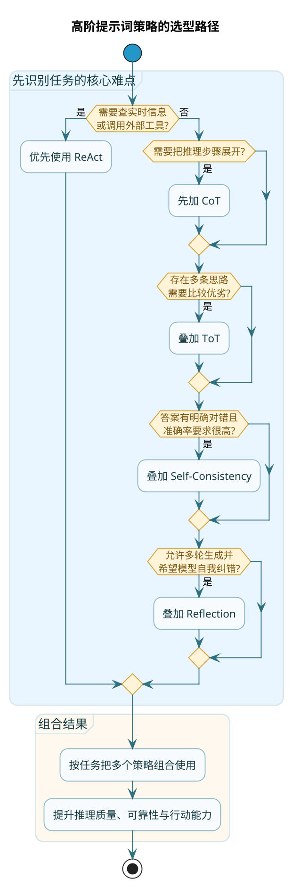

import VipInline from '@site/src/components/VipInline';

# 高阶提示词优化策略

前面几章讲的技巧，主要解决的是"怎么跟 AI 说清楚要干嘛"。

但有些任务，光说清楚还不够。比如数学应用题、逻辑推理、复杂决策——这些需要 AI 真正"动脑子"，一步步思考才能得出正确答案。

这一章，我们来聊几种让 AI 变得更"聪明"的高阶技巧。



## 思维链（Chain of Thought）：让 AI 展示推理过程

**思维链**，英文叫 Chain of Thought，简称 CoT，是这几年最火的提示词技巧之一。

核心思想很简单：**不要让 AI 直接给答案，而是让它先把推理过程写出来，再得出结论**。

### 为什么需要思维链

你问 AI："小明有5个苹果，给了小红3个，又买了4个，现在有几个？"

AI 可能直接蹦出一个答案："6个"。

这个答案是对的（5-3+4=6）。但如果问题再复杂一点，AI 直接给答案就容易出错了。

为什么？因为 AI 在"脑子里"快速算了一下，但这个"快速计算"可能跳过了某些关键步骤，或者搞混了条件之间的关系。

思维链的做法是：让 AI 把每一步都写出来。

```
小明原来有5个苹果。
给了小红3个，还剩 5 - 3 = 2 个。
又买了4个，现在有 2 + 4 = 6 个。
所以答案是6个。
```

当推理过程被明确写出来时，两件好事会发生：
1. AI 更不容易出错，因为每一步都要"过一遍脑子"
2. 就算错了，你也能看出是哪一步出了问题

### 最简单的用法：加一句"魔法咒语"

:::tip 最简触发方式
最简单触发思维链的方式，就是在提示词末尾加一句话：

**"请一步一步思考"** 或者 **"Let's think step by step"**

就这么简单。很多时候，这一句话就能显著提升 AI 处理复杂问题的准确率。
:::

<VipInline />