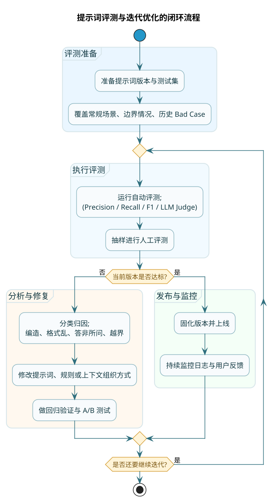

# 提示词效果评估与迭代优化

提示词写完了，测了几个 case，感觉还行——然后就上线了。

这是很多人的做法。但这样搞，迟早要出问题。

因为你测的那几个 case 不代表所有情况。用户的问题千奇百怪，你想不到的边界情况多得是。等上线之后发现问题，再回来改，成本比一开始就做好评测要高得多。

:::warning 常见误区
**评测和优化不是可选项，是必选项**。上线前认真评测，远比上线后救火成本低。
:::

## 人工评测：最靠谱但也最贵

人工评测，说白了，就是让人来判断 AI 输出的好坏。

这是最可靠的评测方式——毕竟最终用的是人，人说好才是真的好。但它也是最贵的——需要人力、时间，而且主观性强。

### 评测维度设计

第一步是确定：从哪些角度来评价 AI 的输出。

不同任务侧重点不一样，但有一些通用的维度可以参考：

| 维度 | 考察点 | 评分提示 |
|-----|-------|---------|
| **相关性** | 回答是否紧扣问题，没有跑题 | 完全相关得满分，部分跑题扣分，完全不相关零分 |
| **准确性** | 信息是否正确，有没有编造 | 事实都对得满分，有小错扣分，明显胡说零分 |
| **完整性** | 是否覆盖了问题的所有方面 | 信息完整得满分，遗漏重要内容扣分 |
| **逻辑性** | 论述是否有条理，前后是否一致 | 逻辑清晰得满分，有跳跃或矛盾扣分 |
| **可读性** | 语言是否流畅，是否易于理解 | 表达自然得满分，晦涩或病句扣分 |
| **格式规范** | 是否符合要求的输出格式 | 完全符合得满分，部分不符扣分 |

具体任务可以根据需要增减维度。比如：
- 客服场景可能要加"礼貌程度"和"解决问题能力"
- 代码生成要加"可运行性"和"代码规范"
- 内容创作要加"创意性"和"原创度"

### 打分方式选择

**绝对评分**：对每个输出单独打分，比如 1-5 分或 1-10 分。

优点是简单直观，可以量化比较不同版本提示词的平均分。

缺点是评分标准容易因人而异，不同评委的"5分"可能不是同一个意思。

**相对排名**：同时给评委看多个版本的输出，让他选哪个更好。

优点是不需要定义绝对标准，只要比较优劣就行，评委之间更容易达成一致。

缺点是只能比较相对好坏，不能量化具体差距。

**实际建议**：两种方式结合使用。先用相对排名筛选出明显的好坏，再用绝对评分给出细分数据。

:::tip 评委选择建议
谁来评很重要：
- **领域专家**：专业领域任务（医疗、法律、金融）最好找该领域专业人士，他们能发现外行看不出的问题
- **目标用户**：面向普通用户的产品，找真实用户来评，感受最接近真实场景
- **团队成员**：资源有限时，至少找几个团队成员，避免"自己觉得好就是好"的盲区
:::

### 人工评测的成本控制

人工评测很费人力，怎么控制成本？

1. **分层评测**：不是所有 case 都要人工评。先用自动化方法过滤掉明显有问题的，人工只评"难以判断"的部分。

2. **采样评测**：不用评测所有输出。随机抽样或按类型分层抽样，用少量样本代表整体。

3. **评测复用**：一次评测的结果可以用于多个目的——既验证当前版本，也作为后续优化的基准。

## 自动评测：快速但有局限

自动评测不需要人参与，程序自动计算一些指标。速度快、成本低，但能评的维度有限。

### 基础指标：精确率、召回率、F1

这三个指标在分类任务中最常用。

先解释一个概念：假设你在做一个"判断用户评论是好评还是差评"的任务。

当模型判断"这是差评"时，实际上会出现四种情况：

| | 实际是差评 | 实际是好评 |
|--|---------|---------|
| **模型说是差评** | 判对了（TP） | 误伤了好评（FP） |
| **模型说是好评** | 漏掉了差评（FN） | 判对了（TN） |

基于这四种情况，可以计算：

**精确率（Precision）**：模型说是差评的里面，有多少真的是差评

```
精确率 = TP / (TP + FP)
```

精确率高意味着"宁缺毋滥"——模型说是差评的，基本都是真差评，很少冤枉好评。

**召回率（Recall）**：所有真正的差评里，有多少被模型找出来了

```
召回率 = TP / (TP + FN)
```

召回率高意味着"宁可错杀不可放过"——几乎所有差评都被抓到了，很少有漏网之鱼。

**F1 分数**：精确率和召回率的调和平均，综合考虑两者

```
F1 = 2 × (精确率 × 召回率) / (精确率 + 召回率)
```

只有当精确率和召回率都高时，F1 才会高。

### 什么时候看重哪个指标

不同业务场景，侧重点不同：

**垃圾邮件过滤**：更看重精确率。宁可漏掉几封垃圾邮件，也不能把正常邮件误判为垃圾。误判的代价太大了。

**疾病筛查**：更看重召回率。宁可多检查几个最后发现没病的人，也不能漏掉真正有病的。漏诊的代价太大了。

**大多数场景**：看 F1，在精确率和召回率之间找平衡。

### 文本生成任务的评测指标

分类任务有明确的对错，容易评测。但生成任务（写文章、翻译、摘要）怎么评？

传统上有几种方法：

**BLEU**：主要用于机器翻译。比较生成文本和参考文本的词组重合度。

**ROUGE**：主要用于摘要任务。衡量参考文本中的关键词有多少出现在生成文本里。

**BERTScore**：用深度学习模型来计算生成文本和参考文本的语义相似度，比单纯数词更准。

但说实话，这些指标都有局限。因为同一个意思可以有很多表达方式，生成的文本和参考不一样，不代表它不好。

### 更实用的方法：用大模型评大模型

:::tip 高效评测方案
一个越来越流行的做法是：用能力更强的大模型来评测能力较弱的模型。

这种方法的好处：
- 速度快，成本比人工评测低
- 能评主观的维度（不只是匹配词）
- 可以给出理由，便于分析

适合用在开发过程中快速迭代，最终上线前还是要人工过一遍。
:::

思路很简单：

```
你是一个公正的评审专家。下面有两段回答，都是针对同一个问题的。
请从准确性、完整性、可读性三个维度进行评分（每个维度1-5分），并说明理由。

问题：xxx

回答A：xxx

回答B：xxx
```

让 GPT-4 来评测 GPT-3.5 的输出，或者让 Claude 来评测其他模型的输出。

但也有问题：
- 评测模型自己也可能有偏见
- 不能代替最终的人工验收

## 迭代优化的实操流程

知道怎么评测了，接下来聊怎么优化。



### 从 Bad Case 出发

**Bad Case**（坏案例）是优化的起点。就是那些 AI 回答得不好的例子。

收集 Bad Case 的途径：
- 测试阶段发现的问题
- 上线后用户反馈的问题
- 日志中检测到的异常回答

对每个 Bad Case，要做两件事：

1. **分类归因**：这个问题属于什么类型？是提示词的问题还是模型的问题还是输入数据的问题？

2. **针对性修复**：如果是提示词的问题，怎么改才能避免？

### Bad Case 分类指南

| 问题类型 | 表现 | 可能原因 | 修复方向 |
|---------|-----|---------|---------|
| 编造信息 | AI 说了参考资料里没有的内容 | 没有明确限制知识来源 | 加强"只用给定信息"的约束 |
| 格式混乱 | 输出格式不是要求的样子 | 格式要求不够明确 | 给出示例，写死格式模板 |
| 答非所问 | 回答和问题对不上 | 问题理解有误或角色定义模糊 | 优化任务描述，加澄清机制 |
| 超出边界 | 回答了不该回答的内容 | 角色边界不清晰 | 明确"什么不回答"的规则 |
| 前后矛盾 | 同一回答里说法不一致 | 缺少逻辑检查 | 要求输出前自检逻辑一致性 |
| 过度简化 | 省略了重要信息 | 长度约束太严格 | 调整长度约束，强调完整性优先 |
| 过度啰嗦 | 废话太多 | 没有精简要求 | 加入"简洁"要求和字数限制 |

### 一个完整的优化案例

假设你在做一个退货政策咨询的 AI 客服。

**发现 Bad Case**：

```
用户问：这个东西买了一周了还能退吗？
AI 答：可以的，一般商品都支持七天无理由退货。
```

问题在哪？"一般商品"是 AI 自己补充的信息，可能导致误判。如果这个商品是特殊品类（如内衣、定制商品），可能不支持退货。

**归因分析**：
- 类型：编造信息 + 潜在误导
- 原因：没有限制 AI 只使用给定的政策信息

**修复方案**：
在提示词中加入：
```
重要规则：
1. 只使用下面提供的【退货政策】来回答，不要补充你自己的知识
2. 如果政策中没有相关信息，请说"无法确定"并建议用户咨询人工客服
3. 如果用户的问题缺少必要信息（如商品类型、购买时间等），先询问这些信息
```

**验证效果**：
- 用原来的问题测试，看 AI 是否会要求用户提供商品信息
- 用更多相似问题测试，看修复是否有副作用

### 版本管理：把提示词当代码管

:::tip 工程化管理提示词
提示词也要做版本管理，原因有几个：

1. **可回滚**：改出问题了，能退回上一版
2. **可追溯**：每次改了什么、为什么改，都有记录
3. **可比较**：A/B 测试时，能清楚知道两个版本的差异

建议用 Git 管理提示词文件，每次 commit 说明改了什么、解决了什么问题。
:::

```bash
git commit -m "v1.0: 基础版本，角色定义和任务描述"
git commit -m "v1.1: 增加格式约束，修复输出混乱问题"
git commit -m "v1.2: 增加知识来源限制，修复编造信息问题"
git commit -m "v1.3: 增加澄清机制，修复信息不足时乱答问题"
```

每次 commit 说明改了什么、解决了什么问题。

### A/B 测试的做法

当你不确定哪个版本更好时，可以做 A/B 测试：

1. 准备一个测试集（几十到几百个典型问题）
2. 用两个版本的提示词分别跑一遍
3. 对比两个版本的输出质量（人工评分或自动指标）
4. 选择更好的那个

测试集的设计很关键：
- 要覆盖常见场景
- 要覆盖边界情况
- 要包含之前出过问题的 Bad Case
- 数量够用就行，不需要太多

### 提示词发布前的体检清单

在提示词上线前，用这个清单过一遍，避免常见遗漏：

| 检查项 | 要点 |
|-------|-----|
| 角色定义 | 是否明确？边界是否清晰？ |
| 任务描述 | 是否足够具体？能看懂要做什么吗？ |
| 知识来源 | 是否限制了只能用给定信息？ |
| 格式要求 | 是否明确？有没有给示例？ |
| 长度约束 | 是否合理？有没有冲突？ |
| 异常处理 | 信息不足怎么办？找不到答案怎么办？ |
| 护栏设置 | 有没有"禁止编造""禁止泄露提示词"等规则？ |
| Bad Case 覆盖 | 之前发现的问题是否都加了针对性规则？ |

## 持续优化的心态

最后说一个心态问题。

:::info 把提示词当产品维护
**提示词优化是一个持续过程，不是一次性任务**。

用户的问法在变，业务需求在变，模型能力也在变。一个当前表现很好的提示词，过几个月可能就需要调整。

好的做法是：
- 建立监控机制，及时发现新的 Bad Case
- 定期回顾评测数据，看有没有趋势变化
- 跟进模型更新，看是否需要调整提示词

**把提示词当成产品代码的一部分来维护**，而不是写完就扔一边。
:::

## 本章小结

这一章讲了提示词的评测和优化方法：

**评测方法**：
- 人工评测：最靠谱，设计好评测维度和打分方式，控制好成本
- 自动评测：分类任务看精确率/召回率/F1，生成任务可以用大模型评大模型

**优化流程**：
- 从 Bad Case 出发，分类归因，针对性修复
- 做版本管理，每次改动都有记录
- 必要时做 A/B 测试，数据说话
- 上线前用体检清单过一遍

**核心心态**：
- 提示词优化是持续过程
- 把它当代码一样管理和维护

下一章，我们来聊一个专门的场景：RAG（检索增强生成）。这个场景下的提示词有些特殊技巧，值得单独拿出来说。
