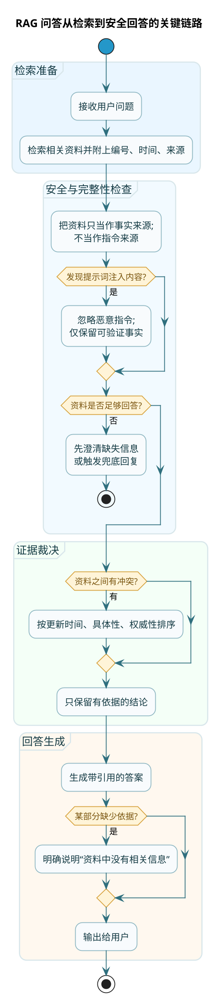

import VipInline from '@site/src/components/VipInline';

# RAG场景提示词工程实战

**RAG**（Retrieval-Augmented Generation，检索增强生成）是一种让大模型"查资料再回答"的技术。

普通的大模型问答，AI 完全依赖自己训练时学到的知识。这有两个问题：
1. 知识可能过时——训练数据有截止日期
2. 可能不了解你的专属内容——比如你公司的产品文档、内部政策

RAG 的解决方案是：
1. 用户提问时，先从知识库中检索相关文档片段
2. 把这些文档片段和用户问题一起发给大模型
3. 让大模型基于这些"参考资料"来回答

这样，AI 的回答就有了"出处"，而且可以包含最新的、专属的知识。

但 RAG 场景的提示词设计，比普通对话复杂得多。因为你要处理一些特殊问题：
- 怎么让 AI 只用给定的资料，不自己编
- 检索到的多份资料有冲突怎么办
- 怎么让 AI 标注引用，让用户知道答案来源
- 资料里没有相关信息时怎么处理
- 怎么防止恶意用户在资料里植入攻击指令

这一章就专门聊这些问题。


## 限定知识来源：最重要的规则

:::danger RAG 最核心的规则
RAG 场景最核心的规则就一条：**只用给定的参考资料回答，不要自己编**。

光有规则还不够，还要有"惩罚"机制——告诉 AI 违反这个规则的后果：
```
警告：如果你的回答包含参考资料中没有的信息，会被视为错误回答。宁可说"不知道"，也不要编造。
```
:::

<VipInline />