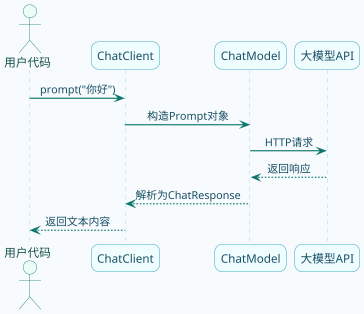
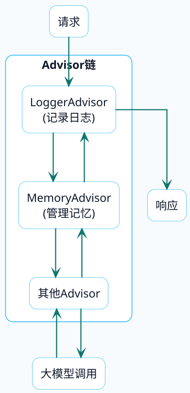

# Spring AI快速入门实战

很多人第一次接触大模型开发，脑子里都会冒出一个问题：在Java项目里怎么跟AI对话？是不是要自己拼HTTP请求、解析JSON、处理各种异常？

其实完全不用这么麻烦。Spring官方团队专门搞了一套叫Spring AI的框架，目的就是让Java开发者能像调用普通Service一样调用大模型。今天咱们就从零开始，跑通第一个AI对话程序。

## 为什么选择Spring AI

在动手之前，先聊聊为什么要用Spring AI，而不是自己撸HTTP请求。

你可能想过用HttpClient直接调API：

```java
// 自己拼接HTTP请求调大模型，看着就累
HttpClient client = HttpClient.newHttpClient();
String requestBody = """
    {
        "model": "qwen-plus",
        "messages": [{"role": "user", "content": "你好"}]
    }
    """;
HttpRequest request = HttpRequest.newBuilder()
    .uri(URI.create("https://api.example.com/chat"))
    .header("Authorization", "Bearer " + apiKey)
    .POST(HttpRequest.BodyPublishers.ofString(requestBody))
    .build();
// 还要处理响应解析、异常、重试...
```

这种写法有几个问题：

- **代码量大**：每次调用都要组装请求体、设置Header、解析响应
- **没有复用性**：换个模型厂商，代码几乎要重写
- **功能受限**：流式输出、对话记忆、工具调用这些高级功能实现起来很痛苦

Spring AI就是来解决这些问题的。它把各种大模型的API差异屏蔽掉了，你只需要面向统一的接口编程，底层对接的是OpenAI还是DeepSeek，代码基本不用改。

## 环境准备

在开始写代码之前，确保你的开发环境满足以下条件：

- JDK 17及以上版本（Spring AI要求的最低版本）
- Maven或Gradle构建工具
- 一个大模型的API Key（本文以DeepSeek为例）

**获取API Key的方式**：[申请模型的调用](/super-agent/getting-started/apply-model-access)

## 本文示例在项目中的位置

这篇文章里的代码，我已经同步落到了 `super-ai` 仓库的 `ai-example/ai-example-spring-ai` 模块中，对应位置如下：

- 父工程版本管理：`super-ai/pom.xml`
- 模块依赖：`super-ai/ai-example/ai-example-spring-ai/pom.xml`
- DeepSeek 和日志配置：`super-ai/ai-example/ai-example-spring-ai/src/main/resources/application.yaml`
- Log4j2 调试输出：`super-ai/ai-example/ai-example-spring-ai/src/main/resources/log4j2.xml`
- ChatClient 配置：`super-ai/ai-example/ai-example-spring-ai/src/main/java/org/javaup/ai/config/SpringAiChatConfig.java`
- 对话接口示例：`super-ai/ai-example/ai-example-spring-ai/src/main/java/org/javaup/ai/controller/ChatController.java`
- 浏览器流式演示页：`super-ai/ai-example/ai-example-spring-ai/src/main/resources/static/spring-ai-stream-demo.html`

## 搭建项目骨架

### 引入核心依赖

在 `super-ai` 示例工程里，BOM版本统一定义在父工程 `super-ai/pom.xml` 中，当前实际使用的是：

- Spring Boot `3.5.6`
- Spring AI `1.1.0`

`ai-example-spring-ai` 模块本身只保留和本文示例直接相关的依赖：

```xml
<dependencies>
    <dependency>
        <groupId>org.springframework.boot</groupId>
        <artifactId>spring-boot-starter-web</artifactId>
    </dependency>

    <!-- DeepSeek模型支持 -->
    <dependency>
        <groupId>org.springframework.ai</groupId>
        <artifactId>spring-ai-starter-model-deepseek</artifactId>
    </dependency>

    <dependency>
        <groupId>org.springframework.boot</groupId>
        <artifactId>spring-boot-starter-log4j2</artifactId>
    </dependency>
</dependencies>
```

这里有个细节要注意：Spring AI支持多种大模型，包括OpenAI、阿里云百炼、Ollama本地模型等。你只需要换一个starter依赖，其他代码基本不用动。

### 配置API密钥

在真实项目里，`application.yaml` 不光配置了 DeepSeek 的 API Key，还顺手把默认系统提示词、日志级别和端口一起收好了：

```yaml
server:
  port: 7089

spring:
  ai:
    deepseek:
      base-url: https://api.deepseek.com
      api-key: ${DEEPSEEK_API_KEY:}
      chat:
        options:
          model: deepseek-chat
          temperature: 0.7

app:
  ai:
    chat:
      default-system-prompt: >-
        你是一名友好的 Spring AI 入门助手，负责帮助用户快速了解 Spring AI、Java 和大模型开发基础。

logging:
  level:
    org.springframework.ai: DEBUG
```

出于安全考虑，建议把 API Key 放到环境变量里，而不是直接写在配置文件中。本文示例模块默认读取的是 `DEEPSEEK_API_KEY`。

## 认识ChatClient

Spring AI提供了一个核心组件叫ChatClient，它是你和大模型打交道的主要入口。可以把它理解成一个"对话客户端"，封装了请求构造、响应解析、错误处理等一系列繁琐的工作。

先来看看 ChatClient 是怎么创建的。为了让文档示例和项目保持一致，我把默认系统提示词和调试日志都合并到了同一个 Bean 里：

```java
@Configuration
public class SpringAiChatConfig {

    @Bean
    public ChatClient chatClient(ChatModel chatModel,
                                 @Value("${app.ai.chat.default-system-prompt}") String defaultSystemPrompt) {
        return ChatClient.builder(chatModel)
                .defaultSystem(defaultSystemPrompt)
                .defaultAdvisors(new SimpleLoggerAdvisor())
                .build();
    }
}
```

`ChatModel` 是 Spring AI 自动注入的，它代表具体的大模型实现。  
如果你只想先跑最小示例，把 `.defaultSystem()` 和 `.defaultAdvisors()` 去掉也一样能工作。

下面这张图展示了ChatClient在整个调用链路中的位置：



## 实现第一次对话

有了 ChatClient，写一个对话接口就非常简单了：

```java
@RestController
@RequestMapping("/chat")
public class ChatController {

    private final ChatClient chatClient;

    public ChatController(ChatClient chatClient) {
        this.chatClient = chatClient;
    }

    @GetMapping("/ask")
    public String ask(@RequestParam(value = "question", defaultValue = "请介绍一下 Spring AI 的核心能力") String question) {
        return this.chatClient.prompt()
                .user(question)
                .call()
                .content();
    }
}
```

这段代码做了什么？

1. `prompt()` - 开始构建一次对话请求
2. `user(question)` - 设置用户输入的问题
3. `call()` - 执行调用，等待模型返回
4. `content()` - 提取返回内容中的文本部分

启动应用后，访问 `http://localhost:7089/chat/ask?question=请介绍一下SpringAI的核心能力` 就能看到 AI 的回答了。


## 流式输出：打字机效果

上面的方式有个问题：用户要等AI把整段话都生成完才能看到结果。如果回答比较长，用户就得干等着，体验不好。

更好的做法是流式输出，就像ChatGPT那样一个字一个字往外蹦。Spring AI对这个支持得很好：

```java
@GetMapping(value = "/stream", produces = MediaType.TEXT_EVENT_STREAM_VALUE)
public Flux<String> stream(
        @RequestParam(value = "question", defaultValue = "请用三点介绍 Spring AI 为什么适合 Java 项目") String question) {
    return this.chatClient.prompt()
            .user(question)
            .stream()
            .content();
}
```

把`call()`换成`stream()`，返回类型从String变成`Flux<String>`，就完成了流式输出的改造。

这里用到了Reactor框架的Flux类型，它代表一个异步的数据流。每当大模型生成一小段文本，就会通过这个流推送给前端，实现实时显示的效果。

**注意事项**：接口的produces要设置成`text/event-stream`，告诉浏览器这是一个SSE（Server-Sent Events）响应。

如果你直接在浏览器地址栏访问 `http://localhost:7089/chat/stream?...`，看到一行行 `data:xxx`，这不是接口异常，而是浏览器正在直接展示 SSE 的原始协议帧。

想看到类似 ChatGPT 的“打字机效果”，需要前端代码主动消费这个流。本文示例模块已经提供了一个现成的演示页面：

```text
http://localhost:7089/spring-ai-stream-demo.html
```

这个页面会通过 JavaScript 调用 `/chat/stream`，并把一段段 `data:` 内容实时拼接成正常文本，更适合在浏览器里验证流式输出效果。


## 给AI设定角色

你可能发现了，直接问AI问题，它的回答风格是通用的。但在实际业务中，我们往往希望AI扮演某个特定角色。

在这个示例模块里，我把默认系统提示词放到了配置文件中，让 `/chat/ask` 默认扮演一个“Spring AI 入门助手”。如果你想在单次请求里覆盖默认角色，可以像下面这样做：

```java
@GetMapping("/interview")
public String interview(
        @RequestParam(value = "question", defaultValue = "请介绍一下 HashMap 的实现原理") String question) {
    return this.chatClient.prompt()
            .system("你现在是一名严肃但专业的 Java 技术面试官。")
            .user(question)
            .call()
            .content();
}
```

这样就只会影响这一轮调用，不会改掉默认的系统提示词。

如果你想更灵活一点，项目里还额外提供了一个 `/chat/ask-with-system` 接口，可以直接通过参数传入 `system`：

```java
@GetMapping("/ask-with-system")
public String askWithSystem(
        @RequestParam(value = "system", required = false) String system,
        @RequestParam(value = "question", defaultValue = "请介绍一下 Spring AI") String question) {
    ChatClient.ChatClientRequestSpec requestSpec = this.chatClient.prompt();
    if (StringUtils.hasText(system)) {
        requestSpec = requestSpec.system(system);
    }
    return requestSpec.user(question)
            .call()
            .content();
}
```

## 开启调试日志

开发阶段，你肯定想知道 Spring AI 到底给大模型发了什么请求、收到了什么响应。这时候就可以加一个日志 Advisor。这个配置在本文示例模块里已经直接打开了：

```java
@Bean
public ChatClient chatClient(ChatModel chatModel,
                             @Value("${app.ai.chat.default-system-prompt}") String defaultSystemPrompt) {
    return ChatClient.builder(chatModel)
            .defaultSystem(defaultSystemPrompt)
            .defaultAdvisors(new SimpleLoggerAdvisor())
            .build();
}
```

`SimpleLoggerAdvisor` 是 Spring AI 内置的日志记录器，它会打印每次请求和响应的详细内容。不过要注意，它的日志级别是 `DEBUG`，所以你至少要把 `org.springframework.ai` 的日志级别调低：

```yaml
logging:
  level:
    org.springframework.ai: DEBUG
```

如果你项目里和本文示例一样用了自定义 `log4j2.xml`，还要确保 Console Appender 允许 `DEBUG` 输出。`ai-example-spring-ai` 模块已经在 `src/main/resources/log4j2.xml` 里同步处理好了。

这样在控制台就能看到类似这样的输出：

```
DEBUG SimpleLoggerAdvisor - request: ChatClientRequest[prompt=Prompt{messages=[UserMessage{content='你好'...}]}]
DEBUG SimpleLoggerAdvisor - response: {"result":{"output":{"text":"你好！有什么我可以帮助你的吗？"...}}}
```

## Advisor是什么

刚才用到了Advisor这个概念，这里简单解释一下。

Advisor可以理解成对话请求的"拦截器"或"增强器"，和Spring AOP里的Advisor设计思想类似。它的工作原理是这样的：



每个Advisor可以在请求发送前做一些事情（比如添加上下文信息），也可以在收到响应后做一些事情（比如记录日志、保存对话历史）。

Spring AI内置了不少实用的Advisor，后面的章节会详细介绍。

## 小结

通过这篇文章，你已经学会了：

- Spring AI的定位和价值
- 如何引入依赖和配置API Key
- ChatClient的基本使用方法
- 同步调用和流式调用的区别
- 如何设置系统提示词定义AI角色
- 使用Advisor记录调试日志

这只是Spring AI的冰山一角。接下来的文章会深入讲解更多高级特性，比如结构化输出、对话记忆、工具调用等。
