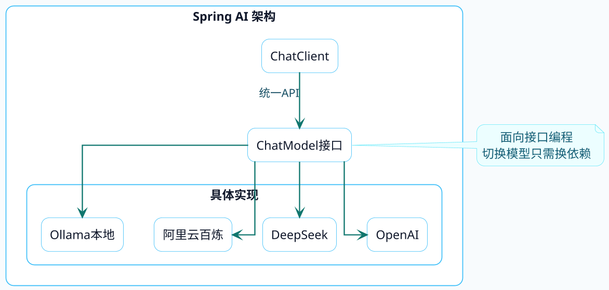
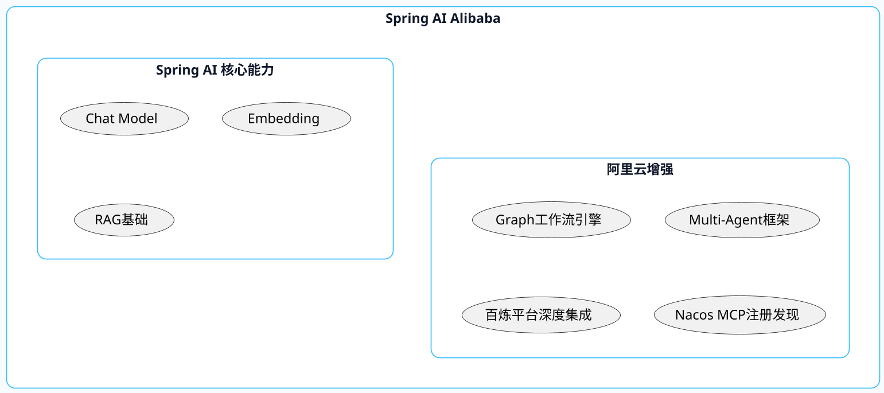

# Java调用大模型全景图

作为Java开发者，当你决定在项目中集成大模型能力时，第一个问题往往是：我该选哪个框架？

市面上的选择还真不少：可以自己用HTTP客户端硬撸，也可以用Spring AI这种官方框架，还有阿里云搞的Spring AI Alibaba，以及从Python圈子移植过来的LangChain4j。

这篇文章会把这几种方案掰开了揉碎了讲清楚，帮你做出明智的选择。

## 方案一：原生HTTP调用

最直接的方式，就是用Java的HTTP客户端直接请求大模型的API。来看个例子：

```java
public class RawHttpCaller {
    
    private static final String API_URL = "https://dashscope.aliyuncs.com/compatible-mode/v1/chat/completions";
    
    public String chat(String message, String apiKey) throws Exception {
        String requestBody = """
            {
                "model": "qwen-plus",
                "messages": [
                    {"role": "system", "content": "你是一个有帮助的助手"},
                    {"role": "user", "content": "%s"}
                ]
            }
            """.formatted(message);
        
        HttpClient client = HttpClient.newHttpClient();
        HttpRequest request = HttpRequest.newBuilder()
                .uri(URI.create(API_URL))
                .header("Content-Type", "application/json")
                .header("Authorization", "Bearer " + apiKey)
                .POST(HttpRequest.BodyPublishers.ofString(requestBody))
                .build();
        
        HttpResponse<String> response = client.send(request, 
                HttpResponse.BodyHandlers.ofString());
        
        // 还需要解析JSON提取实际内容...
        return parseResponse(response.body());
    }
}
```

### 这种方式的问题在哪？

**第一，代码冗余度高**。每次调用都要手动构建JSON请求体、设置Header、解析响应。如果项目中有十几个地方要调用大模型，这些样板代码会让你吐血。

**第二，切换模型成本高**。不同厂商的API格式不一样，OpenAI是一套、阿里云是一套、DeepSeek又是一套。今天用通义千问，明天老板说换成GPT-5，又得改一堆代码。

**第三，高级功能难实现**。流式输出、对话记忆、工具调用这些功能，用原生HTTP实现起来非常繁琐。

**适用场景**：学习理解大模型API原理，或者只有极简单的调用需求且不想引入额外依赖。

## 方案二：Spring AI

Spring AI是Spring官方推出的AI开发框架，目标是让Java开发者能用熟悉的Spring风格开发AI应用。

### 核心设计理念

Spring AI的设计哲学可以用三个词概括：**统一抽象、开箱即用、可扩展性**。



### 代码长什么样

用 Spring AI 实现同样的功能，代码量能可以直接砍半了：

```java
@Service
public class OrderAssistant {
    
    private final ChatClient chatClient;
    
    public OrderAssistant(ChatClient chatClient) {
        this.chatClient = chatClient;
    }
    
    public String analyzeOrder(String orderInfo) {
        return chatClient.prompt()
                .system("你是电商平台的订单分析助手，擅长解读订单数据")
                .user("请分析这个订单的情况：" + orderInfo)
                .call()
                .content();
    }
}
```

### Spring AI的能力边界

截至1.1.x版本，Spring AI已经覆盖了这些核心功能：

| 功能模块 | 说明 |
|---------|------|
| Chat Model | 对话模型统一接口 |
| Embedding Model | 文本向量化 |
| Prompt Templates | 提示词模板管理 |
| Structured Output | 结构化输出解析 |
| Chat Memory | 对话历史记忆 |
| Tool Calling | 工具/函数调用 |
| RAG支持 | 检索增强生成 |
| 向量数据库集成 | 多种向量库适配 |

**适用场景**：已有Spring Boot项目需要集成AI能力，追求快速开发和代码简洁，不需要复杂的Agent编排。

## 方案三：Spring AI Alibaba

Spring AI Alibaba是阿里云在Spring AI基础上的增强版本，专门针对国内开发者和阿里云生态做了深度优化。

### 和Spring AI是什么关系？

简单说，Spring AI Alibaba **兼容Spring AI的所有能力**，同时额外提供了企业级增强功能。



### 最大的亮点：Graph工作流引擎

在1.0 GA版本之后，Spring AI Alibaba引入了受LangGraph启发的工作流编排能力。这意味着你可以用图的方式定义复杂的AI处理流程：

```java
// 伪代码示意，展示Graph的设计思想
Graph orderProcessGraph = Graph.builder()
    .addNode("intentRecognition", intentRecognizer)
    .addNode("orderQuery", orderQueryAgent)
    .addNode("refundProcess", refundAgent)
    .addNode("humanHandoff", humanAgent)
    .addEdge("intentRecognition", "orderQuery", 
             condition -> condition.getIntent().equals("查询"))
    .addEdge("intentRecognition", "refundProcess",
             condition -> condition.getIntent().equals("退款"))
    .addEdge("intentRecognition", "humanHandoff",
             condition -> condition.getIntent().equals("投诉"))
    .build();
```

这在构建智能客服、自动化审批等复杂业务场景时非常有用。

### 接入百炼平台

如果你用的是阿里云的模型服务，Spring AI Alibaba提供了开箱即用的支持：

```xml
<dependency>
    <groupId>com.alibaba.cloud.ai</groupId>
    <artifactId>spring-ai-alibaba-starter-dashscope</artifactId>
    <version>1.1.0.0</version>
</dependency>
```

```yaml
spring:
  ai:
    dashscope:
      api-key: ${AI_DASHSCOPE_API_KEY}
```

**适用场景**：使用阿里云服务、需要构建复杂Agent或多步骤工作流、对可观测性和稳定性有较高要求的企业级项目。

## 方案四：LangChain4j

LangChain4j是LangChain的Java版本，如果你之前接触过Python的AI开发，对LangChain应该不陌生。

### 设计特点

LangChain4j的核心理念是提供两层抽象：

**低层次API**：提供细粒度的控制，包括模型调用、提示词模板、记忆管理、文档加载器等基础组件，你可以自由组合它们。

**高层次API**：通过AI Services机制，让你只需要定义接口，具体实现由框架代理完成，类似于Spring Data JPA的风格。

```java
// AI Service示例：只需定义接口
interface ProductRecommender {
    
    @SystemMessage("你是电商平台的商品推荐专家")
    String recommend(@UserMessage String userPreference);
}

// 框架自动生成实现
ProductRecommender recommender = AiServices.create(ProductRecommender.class, chatModel);
String result = recommender.recommend("我喜欢户外运动，预算500以内");
```

### 和Spring AI的差异

| 维度 | LangChain4j | Spring AI |
|-----|------------|-----------|
| Spring依赖 | 可独立使用 | 深度集成Spring生态 |
| 设计风格 | 偏Python LangChain风格 | 纯Spring风格 |
| Agent支持 | 内置ReAct等模式 | 需手动实现或用Alibaba版 |
| 社区生态 | 国际化，对接模型丰富 | Spring社区支持强 |
| 学习曲线 | 熟悉LangChain的人上手快 | Spring开发者更亲切 |

**适用场景**：非Spring项目、熟悉Python LangChain想快速迁移、需要更灵活的Agent实现方式。

## 选型决策树

面对这四种方案，怎么选？我画了张决策图帮你理清思路：

```plantuml title="Java 大模型接入方案选型决策树" width="100%" align="center"
@startuml
skinparam backgroundColor #F8FBFD
skinparam roundcorner 18
skinparam shadowing false
skinparam defaultFontName Microsoft YaHei
skinparam defaultFontSize 14
skinparam defaultTextAlignment center
skinparam linetype ortho
skinparam dpi 160
skinparam ArrowColor #0F766E
skinparam ArrowThickness 1.4
skinparam ArrowFontColor #164E63
skinparam ArrowFontSize 13
skinparam HyperlinkColor #0891B2
skinparam packageStyle rectangle
skinparam componentStyle rectangle

skinparam note {
  BackgroundColor #ECFEFF
  BorderColor #67E8F9
  FontColor #155E75
}

skinparam package {
  BackgroundColor #FFFFFF
  BorderColor #7DD3FC
  FontColor #164E63
}

skinparam rectangle {
  BackgroundColor #FFFFFF
  BorderColor #38BDF8
  FontColor #0F172A
}

skinparam component {
  BackgroundColor #FFFFFF
  BorderColor #38BDF8
  FontColor #0F172A
}

skinparam interface {
  BackgroundColor #F0FDFF
  BorderColor #0891B2
  FontColor #164E63
}

skinparam class {
  BackgroundColor #FFFFFF
  BorderColor #0891B2
  ArrowColor #0F766E
  FontColor #164E63
  HeaderBackgroundColor #ECFEFF
}

skinparam object {
  BackgroundColor #FFFFFF
  BorderColor #0891B2
  FontColor #164E63
}

skinparam actor {
  BackgroundColor #ECFDF5
  BorderColor #0F766E
  FontColor #134E4A
}

skinparam participant {
  BackgroundColor #F0FDFF
  BorderColor #0891B2
  FontColor #164E63
}

skinparam sequence {
  LifeLineBorderColor #7DD3FC
  LifeLineBackgroundColor #F8FBFD
  ParticipantBorderColor #0891B2
  ParticipantBackgroundColor #F0FDFF
  ParticipantFontColor #164E63
  ActorBorderColor #0F766E
  ActorBackgroundColor #ECFDF5
  ActorFontColor #134E4A
  ArrowColor #0F766E
  ArrowFontColor #164E63
  BoxBorderColor #A5F3FC
  BoxBackgroundColor #F8FEFF
  BoxFontColor #164E63
  GroupBorderColor #38BDF8
  GroupBackgroundColor #ECFEFF
  GroupHeaderBackgroundColor #CFFAFE
  GroupHeaderFontColor #155E75
  DividerBorderColor #67E8F9
  DividerBackgroundColor #F0FDFF
  DividerFontColor #155E75
}

skinparam activity {
  BackgroundColor #FFFFFF
  BorderColor #0891B2
  FontColor #164E63
  StartColor #0F766E
  EndColor #0F766E
  BarColor #0891B2
  DiamondBackgroundColor #ECFEFF
  DiamondBorderColor #38BDF8
  DiamondFontColor #155E75
}

start
:你的项目用Spring Boot吗?;
if (是) then (yes)
  :需要复杂的Agent编排吗?;
  if (需要Graph/Multi-Agent) then (yes)
    :用阿里云服务吗?;
    if (是) then (yes)
      :Spring AI Alibaba; <<#LightGreen>>
    else (no)
      :评估Spring AI Alibaba\n或LangChain4j;
    endif
  else (简单调用即可)
    :Spring AI; <<#LightBlue>>
  endif
else (no)
  :是学习/Demo项目吗?;
  if (是) then (yes)
    :原生HTTP\n理解原理; <<#LightYellow>>
  else (no)
    :LangChain4j; <<#LightCyan>>
  endif
endif
stop
@enduml
```

## 横向对比总结

把几个方案的关键指标放在一起对比：

| 对比维度 | 原生HTTP | Spring AI | Spring AI Alibaba | LangChain4j |
|---------|---------|-----------|-------------------|-------------|
| 代码简洁度 | 低 | 高 | 高 | 高 |
| 学习成本 | 低 | 中 | 中 | 中 |
| 模型切换成本 | 高 | 低 | 低 | 低 |
| Agent能力 | 无 | 基础 | 强(Graph) | 强(ReAct) |
| 阿里云集成 | 手动 | 一般 | 原生支持 | 手动 |
| 社区活跃度 | - | 高 | 中 | 高 |
| 生产可用性 | 取决于实现 | 高 | 高 | 高 |

## 我的建议

如果你问我怎么选，我的建议是：

1. **大多数Spring Boot项目**：直接用Spring AI，官方维护、集成简单、功能够用
2. **需要复杂智能体**：Spring AI Alibaba或LangChain4j，看你更熟悉哪种风格
3. **用阿里云全家桶**：无脑选Spring AI Alibaba，生态集成是真的香
4. **非Spring项目**：LangChain4j是最佳选择
5. **学习研究目的**：建议先用原生HTTP理解原理，再用框架提效

技术选型没有银弹，关键是找到最适合你团队和项目的那个。希望小伙伴看完对模型能有更深入的理解！
