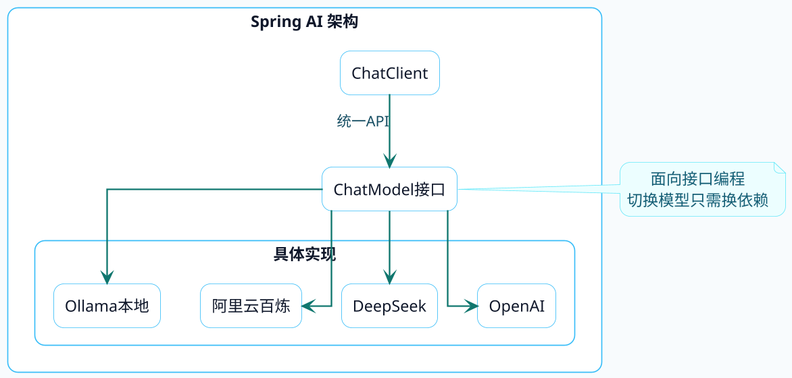

import VipInline from '@site/src/components/VipInline';

# Java调用大模型全景图

作为Java开发者，当你决定在项目中集成大模型能力时，第一个问题往往是：我该选哪个框架？

市面上的选择还真不少：可以自己用HTTP客户端硬撸，也可以用Spring AI这种官方框架，还有阿里云搞的Spring AI Alibaba，以及从Python圈子移植过来的LangChain4j。

这篇文章会把这几种方案掰开了揉碎了讲清楚，帮你做出明智的选择。

## 方案一：原生HTTP调用

最直接的方式，就是用Java的HTTP客户端直接请求大模型的API。来看个例子：

```java
public class RawHttpCaller {
    
    private static final String API_URL = "https://dashscope.aliyuncs.com/compatible-mode/v1/chat/completions";
    
    public String chat(String message, String apiKey) throws Exception {
        String requestBody = """
            {
                "model": "qwen-plus",
                "messages": [
                    {"role": "system", "content": "你是一个有帮助的助手"},
                    {"role": "user", "content": "%s"}
                ]
            }
            """.formatted(message);
        
        HttpClient client = HttpClient.newHttpClient();
        HttpRequest request = HttpRequest.newBuilder()
                .uri(URI.create(API_URL))
                .header("Content-Type", "application/json")
                .header("Authorization", "Bearer " + apiKey)
                .POST(HttpRequest.BodyPublishers.ofString(requestBody))
                .build();
        
        HttpResponse<String> response = client.send(request, 
                HttpResponse.BodyHandlers.ofString());
        
        // 还需要解析JSON提取实际内容...
        return parseResponse(response.body());
    }
}
```

### 这种方式的问题在哪？

:::warning 原生HTTP调用的弊端
**第一，代码冗余度高**。每次调用都要手动构建JSON请求体、设置Header、解析响应。如果项目中有十几个地方要调用大模型，这些样板代码会让你吐血。

**第二，切换模型成本高**。不同厂商的API格式不一样，OpenAI是一套、阿里云是一套、DeepSeek又是一套。今天用通义千问，明天老板说换成GPT-5，又得改一堆代码。

**第三，高级功能难实现**。流式输出、对话记忆、工具调用这些功能，用原生HTTP实现起来非常繁琐。
:::

**适用场景**：学习理解大模型API原理，或者只有极简单的调用需求且不想引入额外依赖。

## 方案二：Spring AI

Spring AI是Spring官方推出的AI开发框架，目标是让Java开发者能用熟悉的Spring风格开发AI应用。

### 核心设计理念

:::info Spring AI 设计哲学
Spring AI的设计哲学可以用三个词概括：**统一抽象、开箱即用、可扩展性**。

它把各种大模型的API差异屏蔽掉了，你只需要面向统一的接口编程，底层对接的是OpenAI还是DeepSeek，代码基本不用改。
:::



### 代码长什么样

用 Spring AI 实现同样的功能，代码量能可以直接砍半了：

<VipInline />