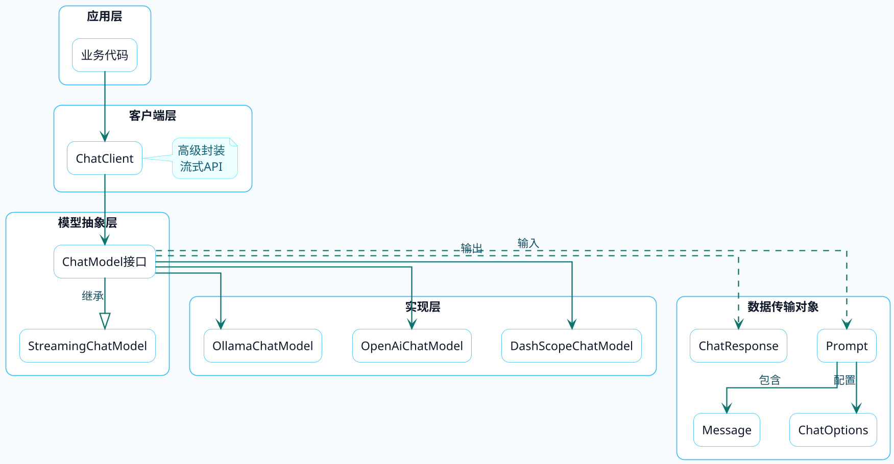

import VipInline from '@site/src/components/VipInline';

# Spring AI核心架构解析

用Spring AI写代码很简单，几行就能跑起来。但如果你想用好它，或者遇到问题能快速定位，就得搞清楚底层的架构设计。

这篇文章会带你深入Spring AI的核心组件，理解它们之间的关系和协作方式。

## 整体架构鸟瞰

先从宏观视角看看Spring AI的分层设计：



Spring AI采用了经典的分层架构，核心思想是**面向接口编程**。你的业务代码只需要和ChatClient或ChatModel打交道，完全不用关心底层对接的是哪家模型。

:::info 核心设计思想
Spring AI 的核心是**面向接口编程**。`ChatModel` 是统一的模型抽象接口，`ChatClient` 是更高级的封装入口，业务代码与具体的模型实现完全解耦——换模型只需要换依赖，代码基本不用改。
:::

## ChatModel：模型统一抽象

ChatModel是Spring AI最核心的接口，它定义了与对话模型交互的标准方式。

### 接口设计

来看看它的接口定义：

```java
public interface ChatModel extends Model<Prompt, ChatResponse>, StreamingChatModel {
    
    // 最简单的调用方式：传入字符串，返回字符串
    default String call(String message) {
        Prompt prompt = new Prompt(new UserMessage(message));
        Generation generation = call(prompt).getResult();
        return (generation != null) ? generation.getOutput().getText() : "";
    }
    
    // 传入多条消息
    default String call(Message... messages) {
        Prompt prompt = new Prompt(Arrays.asList(messages));
        Generation generation = call(prompt).getResult();
        return (generation != null) ? generation.getOutput().getText() : "";
    }
    
    // 核心方法：传入Prompt，返回完整响应
    @Override
    ChatResponse call(Prompt prompt);
    
    // 流式调用
    default Flux<ChatResponse> stream(Prompt prompt) {
        throw new UnsupportedOperationException("streaming is not supported");
    }
}
```

注意到它继承了两个接口：

- **Model\<Prompt, ChatResponse\>**：定义了基本的call方法
- **StreamingChatModel**：定义了stream方法，支持流式输出

### 为什么这样设计？

这种设计带来的好处是**解耦**。假设今天用阿里云的通义千问，明天要换成OpenAI的GPT-4，你只需要换一个依赖包，业务代码一行不改：

```java
// 业务代码完全不关心用的是哪个模型
@Service
public class ProductService {
    
    private final ChatModel chatModel;  // 只依赖接口
    
    public String generateDescription(String productName) {
        return chatModel.call("为商品'" + productName + "'写一段吸引人的描述");
    }
}
```

## ChatClient：更友好的门面

ChatModel虽然功能完整，但用起来稍显繁琐。Spring AI又封装了一个ChatClient，提供了更流畅的API。

### ChatClient vs ChatModel

打个比方：ChatModel像是JDBC，功能强大但用起来啰嗦；ChatClient像是Spring Data JPA，简洁优雅，大多数场景用它就够了。

:::tip ChatClient vs ChatModel
日常开发中优先使用 `ChatClient`，它提供了更简洁的链式 API，内置了对 Advisor、默认参数的支持。只有当你需要精细控制底层请求（比如自定义 `Prompt` 构建），才有必要直接使用 `ChatModel`。
:::

<VipInline />
