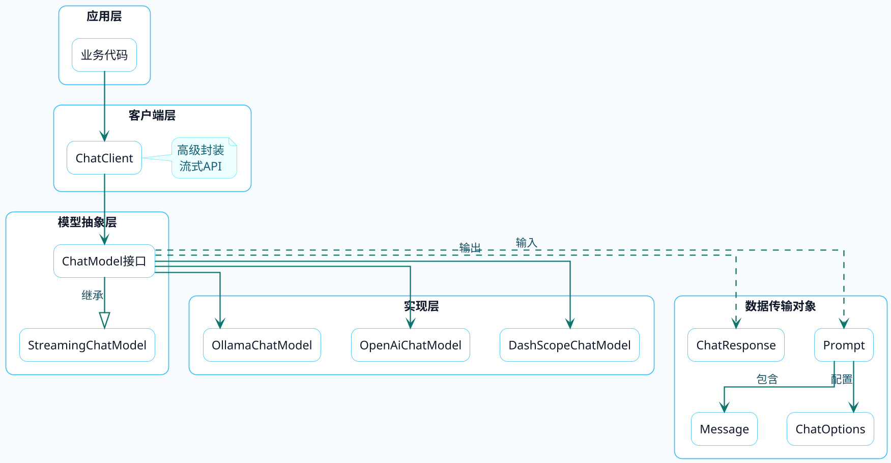
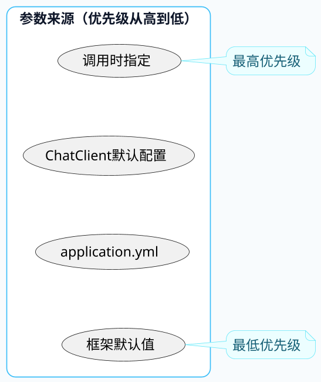
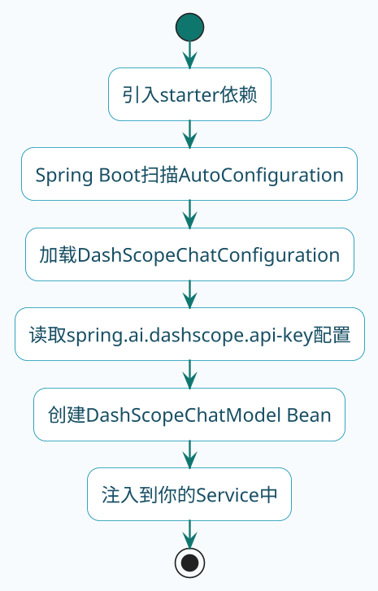
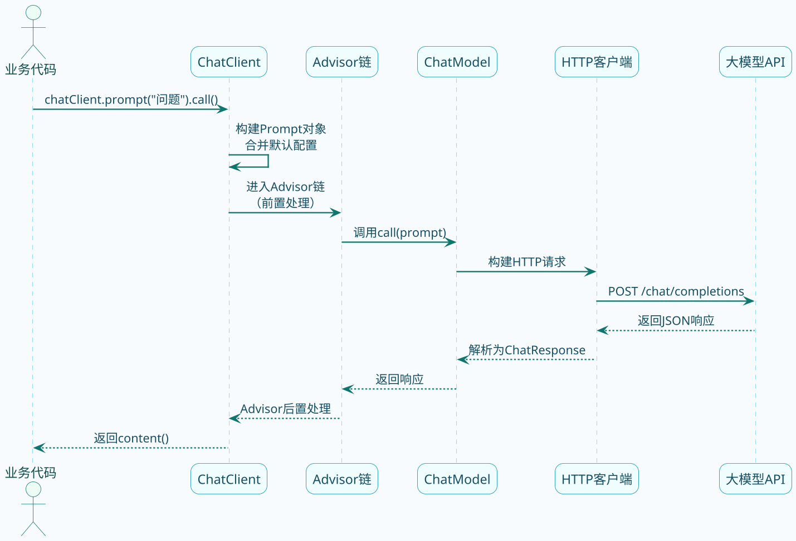

# Spring AI核心架构解析

用Spring AI写代码很简单，几行就能跑起来。但如果你想用好它，或者遇到问题能快速定位，就得搞清楚底层的架构设计。

这篇文章会带你深入Spring AI的核心组件，理解它们之间的关系和协作方式。

## 整体架构鸟瞰

先从宏观视角看看Spring AI的分层设计：



Spring AI采用了经典的分层架构，核心思想是**面向接口编程**。你的业务代码只需要和ChatClient或ChatModel打交道，完全不用关心底层对接的是哪家模型。

## ChatModel：模型统一抽象

ChatModel是Spring AI最核心的接口，它定义了与对话模型交互的标准方式。

### 接口设计

来看看它的接口定义：

```java
public interface ChatModel extends Model<Prompt, ChatResponse>, StreamingChatModel {
    
    // 最简单的调用方式：传入字符串，返回字符串
    default String call(String message) {
        Prompt prompt = new Prompt(new UserMessage(message));
        Generation generation = call(prompt).getResult();
        return (generation != null) ? generation.getOutput().getText() : "";
    }
    
    // 传入多条消息
    default String call(Message... messages) {
        Prompt prompt = new Prompt(Arrays.asList(messages));
        Generation generation = call(prompt).getResult();
        return (generation != null) ? generation.getOutput().getText() : "";
    }
    
    // 核心方法：传入Prompt，返回完整响应
    @Override
    ChatResponse call(Prompt prompt);
    
    // 流式调用
    default Flux<ChatResponse> stream(Prompt prompt) {
        throw new UnsupportedOperationException("streaming is not supported");
    }
}
```

注意到它继承了两个接口：

- **Model\<Prompt, ChatResponse\>**：定义了基本的call方法
- **StreamingChatModel**：定义了stream方法，支持流式输出

### 为什么这样设计？

这种设计带来的好处是**解耦**。假设今天用阿里云的通义千问，明天要换成OpenAI的GPT-4，你只需要换一个依赖包，业务代码一行不改：

```java
// 业务代码完全不关心用的是哪个模型
@Service
public class ProductService {
    
    private final ChatModel chatModel;  // 只依赖接口
    
    public String generateDescription(String productName) {
        return chatModel.call("为商品'" + productName + "'写一段吸引人的描述");
    }
}
```

## ChatClient：更友好的门面

ChatModel虽然功能完整，但用起来稍显繁琐。Spring AI又封装了一个ChatClient，提供了更流畅的API。

### ChatClient vs ChatModel

打个比方：ChatModel像是JDBC，功能强大但用起来啰嗦；ChatClient像是Spring Data JPA，简洁优雅，大多数场景用它就够了。

看看两种方式的代码对比：

```java
// 使用ChatModel
Prompt prompt = new Prompt(
    List.of(
        new SystemMessage("你是订单分析助手"),
        new UserMessage("分析这个订单的状态")
    ),
    DashScopeChatOptions.builder().withModel("qwen-plus").build()
);
ChatResponse response = chatModel.call(prompt);
String result = response.getResult().getOutput().getText();

// 使用ChatClient - 链式调用，清爽多了
String result = chatClient.prompt()
    .system("你是订单分析助手")
    .user("分析这个订单的状态")
    .options(DashScopeChatOptions.builder().withModel("qwen-plus").build())
    .call()
    .content();
```

### ChatClient的构建方式

ChatClient通过Builder模式构建，可以预设各种默认配置：

```java
@Bean
public ChatClient chatClient(ChatModel chatModel) {
    return ChatClient.builder(chatModel)
            // 默认系统提示词
            .defaultSystem("你是一个专业的电商客服")
            // 默认模型参数
            .defaultOptions(
                DashScopeChatOptions.builder()
                    .withTemperature(0.7)
                    .build()
            )
            // 默认Advisor（拦截器）
            .defaultAdvisors(
                new SimpleLoggerAdvisor()
            )
            .build();
}
```

这些默认配置在每次调用时都会生效，但也可以在调用时覆盖。

## Prompt：请求的载体

Prompt是发给大模型的请求对象，包含了对话内容和调用参数。

### Prompt的结构

```java
public class Prompt implements ModelRequest<List<Message>> {
    
    // 对话内容：历史消息 + 当前消息
    private final List<Message> messages;
    
    // 调用参数：模型名称、温度值等
    @Nullable
    private ChatOptions chatOptions;
}
```

一个典型的Prompt长这样：

```plantuml title="Prompt 对象的组成结构" width="100%" align="center"
@startuml
skinparam backgroundColor #F8FBFD
skinparam roundcorner 18
skinparam shadowing false
skinparam defaultFontName Microsoft YaHei
skinparam defaultFontSize 14
skinparam defaultTextAlignment center
skinparam linetype ortho
skinparam dpi 160
skinparam ArrowColor #0F766E
skinparam ArrowThickness 1.4
skinparam ArrowFontColor #164E63
skinparam ArrowFontSize 13
skinparam HyperlinkColor #0891B2
skinparam packageStyle rectangle
skinparam componentStyle rectangle

skinparam note {
  BackgroundColor #ECFEFF
  BorderColor #67E8F9
  FontColor #155E75
}

skinparam package {
  BackgroundColor #FFFFFF
  BorderColor #7DD3FC
  FontColor #164E63
}

skinparam rectangle {
  BackgroundColor #FFFFFF
  BorderColor #38BDF8
  FontColor #0F172A
}

skinparam component {
  BackgroundColor #FFFFFF
  BorderColor #38BDF8
  FontColor #0F172A
}

skinparam interface {
  BackgroundColor #F0FDFF
  BorderColor #0891B2
  FontColor #164E63
}

skinparam class {
  BackgroundColor #FFFFFF
  BorderColor #0891B2
  ArrowColor #0F766E
  FontColor #164E63
  HeaderBackgroundColor #ECFEFF
}

skinparam object {
  BackgroundColor #FFFFFF
  BorderColor #0891B2
  FontColor #164E63
}

skinparam actor {
  BackgroundColor #ECFDF5
  BorderColor #0F766E
  FontColor #134E4A
}

skinparam participant {
  BackgroundColor #F0FDFF
  BorderColor #0891B2
  FontColor #164E63
}

skinparam sequence {
  LifeLineBorderColor #7DD3FC
  LifeLineBackgroundColor #F8FBFD
  ParticipantBorderColor #0891B2
  ParticipantBackgroundColor #F0FDFF
  ParticipantFontColor #164E63
  ActorBorderColor #0F766E
  ActorBackgroundColor #ECFDF5
  ActorFontColor #134E4A
  ArrowColor #0F766E
  ArrowFontColor #164E63
  BoxBorderColor #A5F3FC
  BoxBackgroundColor #F8FEFF
  BoxFontColor #164E63
  GroupBorderColor #38BDF8
  GroupBackgroundColor #ECFEFF
  GroupHeaderBackgroundColor #CFFAFE
  GroupHeaderFontColor #155E75
  DividerBorderColor #67E8F9
  DividerBackgroundColor #F0FDFF
  DividerFontColor #155E75
}

skinparam activity {
  BackgroundColor #FFFFFF
  BorderColor #0891B2
  FontColor #164E63
  StartColor #0F766E
  EndColor #0F766E
  BarColor #0891B2
  DiamondBackgroundColor #ECFEFF
  DiamondBorderColor #38BDF8
  DiamondFontColor #155E75
}

object "Prompt" as prompt {
  messages = [...]
  chatOptions = ...
}

package "消息列表示例" as msgList {
  object "SystemMessage" as sys {
    content = "你是智能客服"
    messageType = SYSTEM
  }

  object "UserMessage" as user1 {
    content = "我的订单怎么还没发货"
    messageType = USER
  }

  object "AssistantMessage" as ass1 {
    content = "让我帮您查一下..."
    messageType = ASSISTANT
  }

  object "UserMessage" as user2 {
    content = "订单号是12345"
    messageType = USER
  }

  sys -[hidden]right- user1
  user1 -[hidden]right- ass1
  ass1 -[hidden]right- user2
}

object "ChatOptions" as opts {
  model = "qwen-plus"
  temperature = 0.7
  maxTokens = 2000
}

msgList -[hidden]right- opts
prompt -down-> msgList
prompt -down-> opts
@enduml
```



### Message的类型

Message表示对话中的一条消息，根据角色不同有四种类型：

| 类型 | 说明 | 使用场景 |
|-----|------|---------|
| SystemMessage | 系统设定 | 定义AI的角色、行为准则 |
| UserMessage | 用户输入 | 用户的问题或指令 |
| AssistantMessage | AI回复 | 模型之前的回答 |
| ToolResponseMessage | 工具返回 | 工具调用的结果 |

在多轮对话中，Message列表会包含完整的对话历史，这就是大模型"记住"上下文的方式。

## ChatOptions：参数配置

ChatOptions用来设置调用大模型时的各种参数，不同模型厂商支持的参数有差异。

### 通用参数

```java
// 使用通用的ChatOptions
ChatOptions options = ChatOptions.builder()
    .model("qwen-plus")           // 模型名称
    .temperature(0.7)             // 温度：越高越有创意
    .maxTokens(2000)              // 最大生成token数
    .topP(0.9)                    // 核采样概率
    .build();
```

### 厂商特有参数

如果要用某个厂商的特殊参数，需要用对应的Options实现类：

```java
// 阿里云DashScope特有参数
DashScopeChatOptions options = DashScopeChatOptions.builder()
    .withModel("qwen-plus")
    .withTemperature(0.7)
    .withEnableSearch(true)    // 开启联网搜索
    .withResultFormat("text")  // 结果格式
    .build();
```

### 参数优先级

参数可以在多个地方设置，优先级从高到低是：

1. **单次调用时指定** - `chatClient.prompt().options(xxx)`
2. **ChatClient构建时的默认值** - `ChatClient.builder().defaultOptions(xxx)`
3. **配置文件** - `spring.ai.xxx.chat.options.xxx`
4. **框架默认值**



## ChatResponse：响应解析

大模型返回的结果封装在ChatResponse中，结构稍微有点复杂。

### 响应结构

```java
// 简化后的响应结构
public class ChatResponse {
    
    private ChatResponseMetadata metadata;      // 元数据
    private List<Generation> results;           // 生成结果（可能有多个）
    
    public Generation getResult() {
        return results.get(0);                  // 获取第一个结果
    }
}

public class Generation {
    private AssistantMessage output;            // AI回复内容
    private ChatGenerationMetadata metadata;    // 生成元数据
}
```

### 常用的取值方式

```java
ChatResponse response = chatModel.call(prompt);

// 获取文本内容 - 最常用
String text = response.getResult().getOutput().getText();

// 获取完整的消息对象
AssistantMessage message = response.getResult().getOutput();

// 获取token使用情况
Usage usage = response.getMetadata().getUsage();
System.out.println("输入token: " + usage.getPromptTokens());
System.out.println("输出token: " + usage.getCompletionTokens());
System.out.println("总计token: " + usage.getTotalTokens());
```

如果用ChatClient，取值更简单：

```java
// 直接拿到文本
String content = chatClient.prompt("你好").call().content();

// 拿到完整响应（需要时）
ChatResponse response = chatClient.prompt("你好").call().chatResponse();
```

## 自动配置机制

Spring AI大量使用了Spring Boot的自动配置特性，让集成变得非常简单。

以阿里云DashScope为例，当你引入`spring-ai-alibaba-starter-dashscope`依赖后，会自动发生以下事情：



这一切都是自动完成的，你只需要配置API Key就行了。

### 自定义Bean

如果默认配置不满足需求，可以自己定义Bean覆盖：

```java
@Configuration
public class CustomAiConfig {
    
    @Bean
    public ChatModel customChatModel(DashScopeApi dashScopeApi) {
        // 自定义ChatModel配置
        return new DashScopeChatModel(dashScopeApi, 
            DashScopeChatOptions.builder()
                .withModel("qwen-max")
                .withTemperature(0.5)
                .build());
    }
}
```

## 调用流程全景

最后，我们把整个调用流程串起来看：



## 小结

这篇文章梳理了Spring AI的核心架构：

- **ChatModel**是模型抽象层，定义了统一的交互接口
- **ChatClient**是更高级的封装，提供流畅的链式API
- **Prompt**承载请求信息，包含Message列表和ChatOptions
- **ChatResponse**是响应对象，通过getResult().getOutput().getText()获取文本

理解了这些核心概念，你就能更好地使用Spring AI，也能在遇到问题时快速定位根因。

下一篇，我们来聊聊流式输出的实现原理，看看那个Flux到底是怎么回事。
