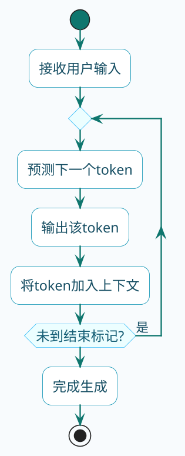

import VipInline from '@site/src/components/VipInline';

# 响应式流式输出详解

用过ChatGPT的人都知道，AI回答问题时是一个字一个字往外蹦的，而不是等全部生成完再一次性显示。这种"打字机"效果不是装酷，而是有实际意义——大模型生成长回答可能需要十几秒甚至更久，如果让用户干等着，体验会非常差。

这背后的技术就是**流式输出**。今天我们来深入聊聊它是怎么实现的。

## 大模型为什么适合流式输出

先从原理层面理解一下。

大模型的工作方式是**逐个预测token**。它不是一下子想好整段话再输出，而是：

1. 根据输入内容，预测下一个最可能的词
2. 把这个词加入上下文，继续预测下一个
3. 重复上述过程，直到生成结束标记

既然是逐个生成的，那完全可以生成一个就推送一个给用户，这就是流式输出的基础。

:::info 大模型逐 Token 生成原理
大模型的工作方式是**逐个预测 token**，每次预测下一个最可能的词并加入上下文，重复直到生成结束标记。这意味着可以边生成边推送，无需等待全部内容生成完毕。
:::

<VipInline />
