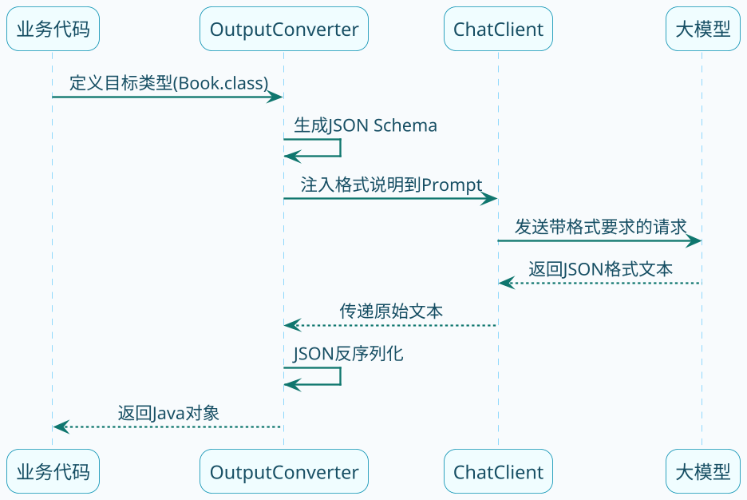

import VipInline from '@site/src/components/VipInline';

# 结构化输出深度剖析

大模型的输出是自然语言文本，格式不固定。如果是人类阅读没问题，但程序处理起来就麻烦了。

比如你问模型"推荐几本书"，它可能这样回答：

```
我给你推荐三本不错的书：
1.《代码整洁之道》- 讲代码规范的经典之作
2.《设计模式》- 四人组的名著
3.《重构》- Martin Fowler的代表作
```

这种格式人读着没问题，但你想用代码解析出书名、作者，就得写正则或者其他脏活累活。

结构化输出就是让模型按指定格式返回，比如直接返回JSON，甚至直接转成Java对象。今天我们来深入聊聊Spring AI是怎么实现的。

:::info 结构化输出的核心原理
Spring AI 的结构化输出机制分两步：
1. **调用前**：根据目标 Java 类自动生成 JSON Schema，注入到提示词中，告诉模型要按什么格式输出
2. **调用后**：把模型返回的 JSON 文本反序列化成目标 Java 类型
:::

## 结构化输出的基本原理

Spring AI的结构化输出机制，核心思想是：

1. **调用前**：往提示词里注入格式说明，告诉模型要按什么格式输出
2. **调用后**：把模型返回的文本解析成目标类型



<VipInline />
