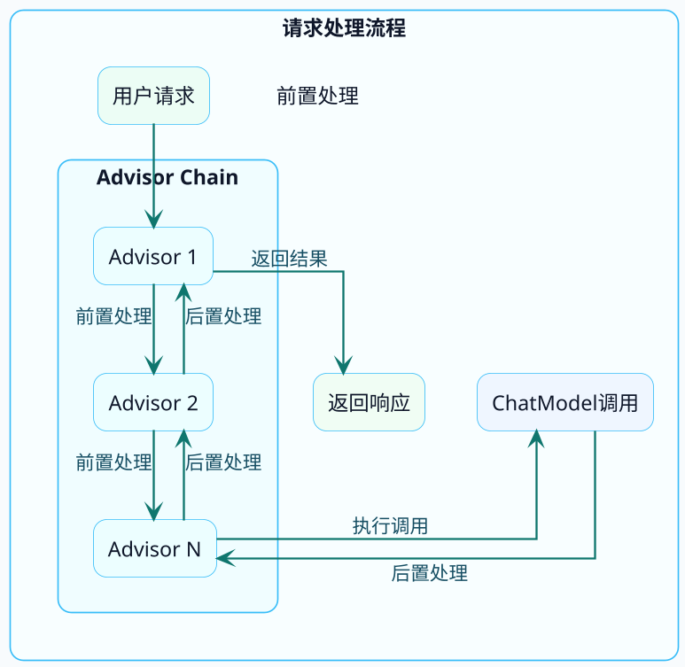

import VipInline from '@site/src/components/VipInline';

# Advisor拦截器机制揭秘

在前面的章节中，我们多次用到了Advisor，比如SimpleLoggerAdvisor用来打印日志。但Advisor到底是什么？能做什么？怎么自己写一个？

这篇文章来彻底搞清楚Spring AI的Advisor机制。

## Advisor的设计思想

如果你熟悉Spring AOP，那理解Advisor会非常轻松——它们的设计思想如出一辙。

**Advisor就是AI请求/响应的拦截器**，可以在请求发送前和响应返回后做一些增强处理。

典型的责任链模式（Chain of Responsibility），每个Advisor都有机会：
- 在请求发送给大模型**之前**，修改或增强请求内容
- 在大模型返回响应**之后**，处理或转换响应内容

:::info Advisor 的应用场景
| 场景 | 说明 |
|-----|------|
| 日志记录 | 记录每次请求和响应，便于调试和审计 |
| 对话记忆 | 自动维护多轮对话的上下文 |
| 内容审核 | 过滤敏感词、检查输入输出 |
| 性能监控 | 统计响应时间、token消耗 |
| 限流熔断 | 控制调用频率、失败重试 |
| 权限校验 | 检查用户是否有调用权限 |
| 内容增强 | 自动注入额外上下文信息 |
:::

<VipInline />
