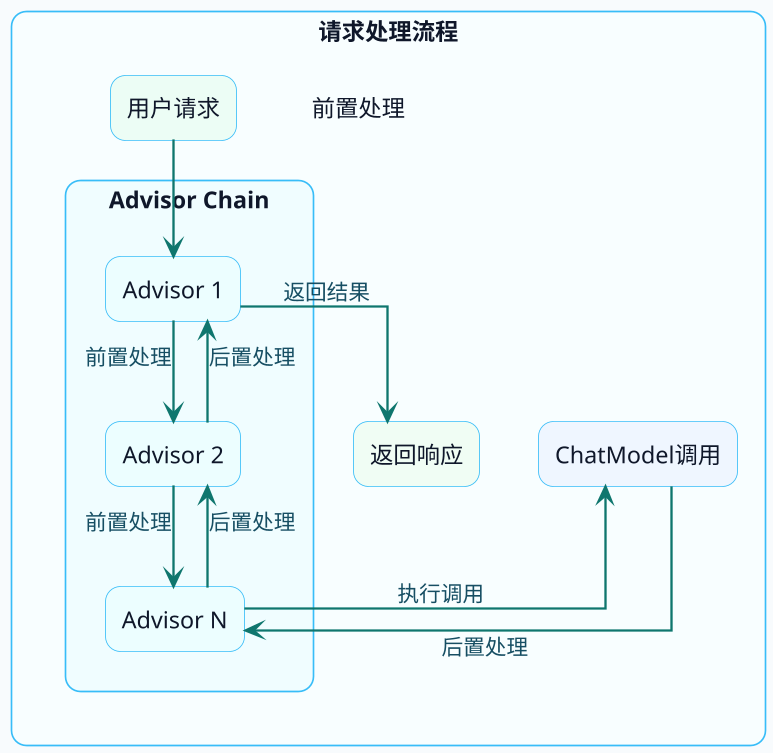
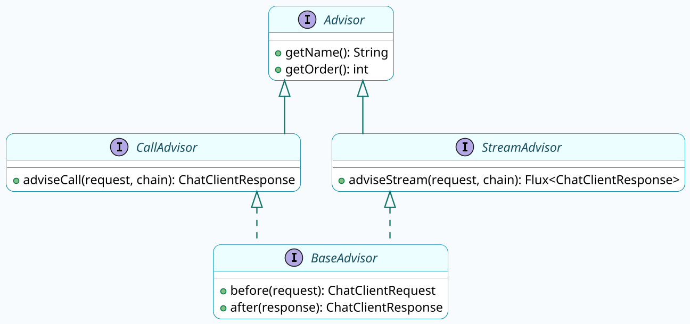
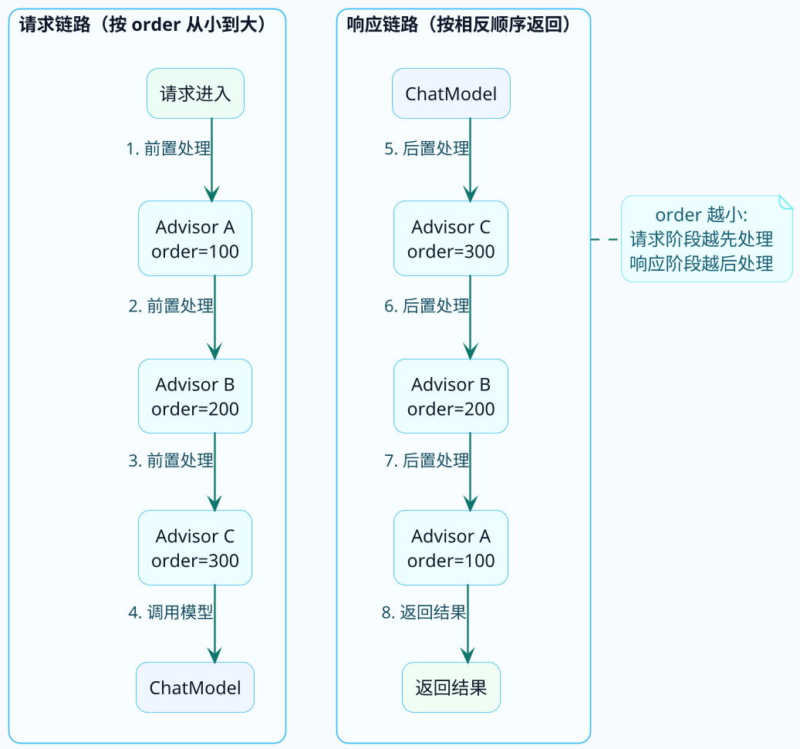

# Advisor拦截器机制揭秘

在前面的章节中，我们多次用到了Advisor，比如SimpleLoggerAdvisor用来打印日志。但Advisor到底是什么？能做什么？怎么自己写一个？

这篇文章来彻底搞清楚Spring AI的Advisor机制。

## Advisor的设计思想

如果你熟悉Spring AOP，那理解Advisor会非常轻松——它们的设计思想如出一辙。

**Advisor就是AI请求/响应的拦截器**，可以在请求发送前和响应返回后做一些增强处理。



典型的责任链模式（Chain of Responsibility），每个Advisor都有机会：
- 在请求发送给大模型**之前**，修改或增强请求内容
- 在大模型返回响应**之后**，处理或转换响应内容

:::info Advisor 的应用场景
| 场景 | 说明 |
|-----|------|
| 日志记录 | 记录每次请求和响应，便于调试和审计 |
| 对话记忆 | 自动维护多轮对话的上下文 |
| 内容审核 | 过滤敏感词、检查输入输出 |
| 性能监控 | 统计响应时间、token消耗 |
| 限流熔断 | 控制调用频率、失败重试 |
| 权限校验 | 检查用户是否有调用权限 |
| 内容增强 | 自动注入额外上下文信息 |
:::

## Advisor接口体系

来看看Spring AI中Advisor相关的接口定义：



**核心接口说明**：

:::info Advisor 接口体系
- **Advisor**：基础接口，定义名称（`getName()`）和执行顺序（`getOrder()`）
- **CallAdvisor**：同步调用的拦截器，实现 `adviseCall()` 方法
- **StreamAdvisor**：流式调用的拦截器，实现 `adviseStream()` 方法
- **BaseAdvisor**：提供 `before()/after()` 模式的便捷基类，同时实现同步和流式
:::

## 内置Advisor源码分析

### SimpleLoggerAdvisor

这是最常用的内置Advisor，用于打印请求和响应日志。

```java
public class SimpleLoggerAdvisor implements CallAdvisor, StreamAdvisor {
    
    private static final Logger logger = LoggerFactory.getLogger(SimpleLoggerAdvisor.class);
    
    @Override
    public ChatClientResponse adviseCall(ChatClientRequest request, 
                                         CallAdvisorChain chain) {
        // 1. 记录请求日志
        logRequest(request);
        
        // 2. 执行下一个Advisor（或最终的模型调用）
        ChatClientResponse response = chain.nextCall(request);
        
        // 3. 记录响应日志
        logResponse(response);
        
        return response;
    }
    
    private void logRequest(ChatClientRequest request) {
        logger.debug("request: {}", requestToString(request));
    }
    
    private void logResponse(ChatClientResponse response) {
        logger.debug("response: {}", responseToString(response.chatResponse()));
    }
    
    @Override
    public int getOrder() {
        return Ordered.LOWEST_PRECEDENCE - 1000;  // 优先级较低，最先执行
    }
}
```

**代码解读**：
1. 在调用`chain.nextCall(request)`之前打印请求
2. 调用链传递给下一个处理器
3. 拿到响应后打印日志
4. 返回响应（可以原样返回，也可以修改后返回）

### SafeGuardAdvisor

这是一个内容安全审查的Advisor，用于敏感词过滤：

```java
public class SafeGuardAdvisor implements CallAdvisor, StreamAdvisor {
    
    private final List<String> sensitiveWords;
    private final String blockMessage;
    
    public SafeGuardAdvisor(List<String> sensitiveWords, String blockMessage) {
        this.sensitiveWords = sensitiveWords;
        this.blockMessage = blockMessage;
    }
    
    @Override
    public ChatClientResponse adviseCall(ChatClientRequest request, 
                                         CallAdvisorChain chain) {
        // 检查用户输入是否包含敏感词
        String userMessage = extractUserMessage(request);
        
        for (String word : sensitiveWords) {
            if (userMessage.contains(word)) {
                // 发现敏感词，直接返回拒绝响应，不调用模型
                return buildBlockResponse(blockMessage);
            }
        }
        
        // 通过检查，继续执行
        return chain.nextCall(request);
    }
    
    @Override
    public int getOrder() {
        return Ordered.HIGHEST_PRECEDENCE;  // 最高优先级，最先检查
    }
}
```

**要点**：
- 在请求发出前就进行拦截
- 发现问题直接返回，不会调用大模型
- 设置为最高优先级，确保第一个执行

### ChatModelCallAdvisor

这是责任链的终点，负责真正调用大模型：

```java
public class ChatModelCallAdvisor implements CallAdvisor {
    
    private final ChatModel chatModel;
    
    @Override
    public ChatClientResponse adviseCall(ChatClientRequest request, 
                                         CallAdvisorChain chain) {
        // 这里不再调用chain.nextCall()，而是直接调用ChatModel
        Prompt prompt = buildPrompt(request);
        ChatResponse chatResponse = chatModel.call(prompt);
        return buildClientResponse(chatResponse);
    }
    
    @Override
    public int getOrder() {
        return Ordered.LOWEST_PRECEDENCE;  // 最低优先级，最后执行
    }
}
```

它是链条的最后一环，真正和大模型交互。

:::note SafeGuardAdvisor 的设计要点
`SafeGuardAdvisor` 将 `getOrder()` 设置为 `Ordered.HIGHEST_PRECEDENCE`（最高优先级），确保安全检查是第一个执行的 Advisor。发现敏感词时**直接返回拒绝响应**，不会调用后续 Advisor，也不会产生任何模型调用费用。
:::

## BaseAdvisor：简化开发的基类

如果你只是想在调用前后做点事情，继承BaseAdvisor会更方便：

```java
public interface BaseAdvisor extends CallAdvisor, StreamAdvisor {
    
    // 子类只需要实现这两个方法
    ChatClientRequest before(ChatClientRequest request);
    ChatClientResponse after(ChatClientResponse response);
    
    // 默认实现了adviseCall
    @Override
    default ChatClientResponse adviseCall(ChatClientRequest request, 
                                          CallAdvisorChain chain) {
        // 前置处理
        ChatClientRequest modifiedRequest = before(request);
        
        // 执行链
        ChatClientResponse response = chain.nextCall(modifiedRequest);
        
        // 后置处理
        return after(response);
    }
}
```

这样你只需要重写`before()`和`after()`方法，不用关心责任链的细节。

## 自定义Advisor实战

来写几个实用的自定义Advisor。

### 场景一：调用耗时统计

```java
@Component
public class PerformanceAdvisor implements CallAdvisor, StreamAdvisor {
    
    private static final Logger log = LoggerFactory.getLogger(PerformanceAdvisor.class);
    
    @Override
    public ChatClientResponse adviseCall(ChatClientRequest request, 
                                         CallAdvisorChain chain) {
        long startTime = System.currentTimeMillis();
        String requestId = UUID.randomUUID().toString().substring(0, 8);
        
        log.info("[{}] 开始调用大模型", requestId);
        
        try {
            ChatClientResponse response = chain.nextCall(request);
            
            long costTime = System.currentTimeMillis() - startTime;
            log.info("[{}] 调用完成，耗时 {}ms", requestId, costTime);
            
            return response;
        } catch (Exception e) {
            long costTime = System.currentTimeMillis() - startTime;
            log.error("[{}] 调用失败，耗时 {}ms，错误：{}", requestId, costTime, e.getMessage());
            throw e;
        }
    }
    
    @Override
    public Flux<ChatClientResponse> adviseStream(ChatClientRequest request, 
                                                  StreamAdvisorChain chain) {
        long startTime = System.currentTimeMillis();
        String requestId = UUID.randomUUID().toString().substring(0, 8);
        
        log.info("[{}] 开始流式调用", requestId);
        
        return chain.nextStream(request)
                .doOnComplete(() -> {
                    long costTime = System.currentTimeMillis() - startTime;
                    log.info("[{}] 流式调用完成，耗时 {}ms", requestId, costTime);
                })
                .doOnError(e -> {
                    long costTime = System.currentTimeMillis() - startTime;
                    log.error("[{}] 流式调用失败，耗时 {}ms", requestId, costTime);
                });
    }
    
    @Override
    public String getName() {
        return "PerformanceAdvisor";
    }
    
    @Override
    public int getOrder() {
        return Ordered.HIGHEST_PRECEDENCE + 100;  // 比安全检查低一点
    }
}
```

### 场景二：Token用量统计

```java
@Component
public class TokenUsageAdvisor implements CallAdvisor {
    
    private static final Logger log = LoggerFactory.getLogger(TokenUsageAdvisor.class);
    
    private final AtomicLong totalPromptTokens = new AtomicLong(0);
    private final AtomicLong totalCompletionTokens = new AtomicLong(0);
    
    @Override
    public ChatClientResponse adviseCall(ChatClientRequest request, 
                                         CallAdvisorChain chain) {
        ChatClientResponse response = chain.nextCall(request);
        
        // 统计token使用量
        ChatResponse chatResponse = response.chatResponse();
        if (chatResponse != null && chatResponse.getMetadata() != null) {
            Usage usage = chatResponse.getMetadata().getUsage();
            if (usage != null) {
                totalPromptTokens.addAndGet(usage.getPromptTokens());
                totalCompletionTokens.addAndGet(usage.getCompletionTokens());
                
                log.info("本次消耗 - 输入: {} tokens, 输出: {} tokens, " +
                        "累计 - 输入: {} tokens, 输出: {} tokens",
                        usage.getPromptTokens(), usage.getCompletionTokens(),
                        totalPromptTokens.get(), totalCompletionTokens.get());
            }
        }
        
        return response;
    }
    
    @Override
    public String getName() {
        return "TokenUsageAdvisor";
    }
    
    @Override
    public int getOrder() {
        return Ordered.LOWEST_PRECEDENCE - 500;
    }
    
    // 提供查询接口
    public long getTotalTokens() {
        return totalPromptTokens.get() + totalCompletionTokens.get();
    }
}
```

### 场景三：请求内容增强

```java
@Component
public class ContextEnhanceAdvisor implements CallAdvisor, StreamAdvisor {
    
    @Override
    public ChatClientResponse adviseCall(ChatClientRequest request, 
                                         CallAdvisorChain chain) {
        // 增强请求：添加额外的上下文信息
        ChatClientRequest enhancedRequest = enhanceRequest(request);
        return chain.nextCall(enhancedRequest);
    }
    
    @Override
    public Flux<ChatClientResponse> adviseStream(ChatClientRequest request, 
                                                  StreamAdvisorChain chain) {
        ChatClientRequest enhancedRequest = enhanceRequest(request);
        return chain.nextStream(enhancedRequest);
    }
    
    private ChatClientRequest enhanceRequest(ChatClientRequest request) {
        // 在用户提示词前添加当前时间、用户信息等上下文
        String currentTime = LocalDateTime.now().format(
                DateTimeFormatter.ofPattern("yyyy-MM-dd HH:mm:ss"));
        
        String contextInfo = String.format(
                "[系统信息] 当前时间：%s，用户地区：中国\n\n", 
                currentTime);
        
        // 这里需要修改request中的用户消息，具体实现略
        return request.mutate()
                .userText(contextInfo + request.userText())
                .build();
    }
    
    @Override
    public String getName() {
        return "ContextEnhanceAdvisor";
    }
    
    @Override
    public int getOrder() {
        return 0;  // 中等优先级
    }
}
```

## Advisor的注册方式

### 方式一：构建ChatClient时注册

```java
@Bean
public ChatClient chatClient(ChatModel chatModel) {
    return ChatClient.builder(chatModel)
            .defaultAdvisors(
                new SimpleLoggerAdvisor(),
                new PerformanceAdvisor(),
                new TokenUsageAdvisor()
            )
            .build();
}
```

这样注册的Advisor对所有调用都生效。

### 方式二：单次调用时指定

```java
chatClient.prompt("问题")
    .advisors(spec -> spec.advisors(new CustomAdvisor()))
    .call()
    .content();
```

这种方式只对当前这次调用生效。

### 方式三：追加参数

```java
chatClient.prompt("问题")
    .advisors(spec -> spec.param("customKey", "customValue"))
    .call()
    .content();
```

通过param传递参数给Advisor使用。

## Advisor执行顺序

:::warning 执行顺序容易搞反
Advisor 的执行顺序由 `getOrder()` 决定：
- **数值越小，优先级越高**，请求阶段**越先**执行（前置处理）
- **响应阶段则是相反**，数值越小的 Advisor 其后置处理**越后**执行（先进后出）

记住这个规律：`order=100` 的 Advisor 比 `order=200` 的先处理请求，但后处理响应。
:::



Spring AI提供了一些常量方便设置：

```java
// 最高优先级（最先处理请求）
Ordered.HIGHEST_PRECEDENCE  // Integer.MIN_VALUE

// 最低优先级（最后处理请求，即最先处理响应）  
Ordered.LOWEST_PRECEDENCE   // Integer.MAX_VALUE
```

## 小结

这篇文章全面介绍了Spring AI的Advisor机制：

- **设计思想**：借鉴Spring AOP，采用责任链模式
- **接口体系**：CallAdvisor用于同步、StreamAdvisor用于流式
- **内置实现**：SimpleLoggerAdvisor日志、SafeGuardAdvisor安全检查
- **自定义开发**：继承接口或BaseAdvisor实现定制需求
- **执行顺序**：getOrder()控制，数值小的优先处理请求

Advisor是Spring AI扩展能力的核心机制，掌握它，你就能灵活地增强AI应用的功能。

下一篇是最后一篇，我们来聊聊对话记忆系统的设计与实现。
