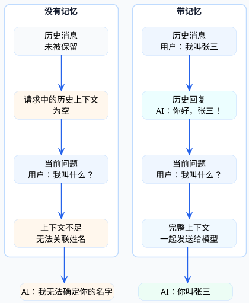

import VipInline from '@site/src/components/VipInline';

# 对话记忆系统设计

和ChatGPT聊过天的人都知道，它能记住你之前说的话。问它"我刚才说了什么"，它能准确回答。这种能力叫做**对话记忆**。

对于AI应用来说，记忆能力至关重要。没有记忆，每次对话都是"新朋友"，用户体验会很差。今天我们来深入聊聊Spring AI中对话记忆的设计与实现。

## 为什么需要对话记忆

先来理解一个基本事实：**大模型本身是无状态的**。

每次你调用大模型API，对它来说都是一次全新的请求。它不知道一秒钟前你问过什么，更不知道昨天聊了什么话题。

那ChatGPT是怎么做到"记住"对话的？答案是：**把历史对话一起发给模型**。

每次对话时，把之前的所有消息都带上，模型就能"理解"上下文。这就是对话记忆的本质。

:::info 对话记忆的本质
大模型本身是**无状态的**，每次 API 调用对它来说都是全新请求。实现"记忆"的方式是：把历史对话消息一起发给模型，模型从完整的上下文中"理解"之前说了什么。
:::

<VipInline />
