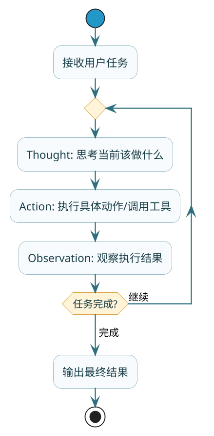

import VipInline from '@site/src/components/VipInline';

# 主流架构深度对比

上一篇我们知道了Agent是什么，这篇来聊聊Agent是**怎么干活**的。

同样是完成一个任务，不同的Agent可能有完全不同的"工作风格"。有的边想边干，做一步看一步；有的先整体规划，再分步执行；有的做完还要自我检查，反复打磨。

这些不同的工作风格，在技术上叫做**Agent架构**。目前主流的有三种：**ReAct**、**Reflection**、**Plan and Execute**。

咱们用一个统一的场景来对比它们：假设你让Agent帮你**分析某个品类的电商竞品，给出定价建议**。

## ReAct：边想边干的实干派

### 核心思想

:::info 核心概念
ReAct的全称是**Reasoning + Acting**，核心理念是**思考和行动交替进行**。

它模仿的是人类解决问题的自然过程：遇到问题先想一想，想清楚就动手做，做完看看结果，根据结果再想下一步该怎么办。

用三个词概括：**Thought（思考）→ Action（行动）→ Observation（观察）**，然后循环往复。
:::

### 论文背景

ReAct架构最早来自普林斯顿和Google的研究论文 **《ReAct: Synergizing Reasoning and Acting in Language Models》**，论文地址：[https://react-lm.github.io/](https://react-lm.github.io/)

作者通过实验证明，单独的推理（Chain of Thought）或单独的行动（工具调用）都不如两者结合的效果好。

:::tip 实验结论
论文中的实验结果显示：
- **标准方法**：直接让模型回答，容易产生幻觉
- **纯推理（CoT）**：只思考不行动，缺乏外部信息
- **纯行动（Act Only）**：只调工具不思考，容易走偏
- **ReAct**：边想边做，能在行动中发现错误并修正

在多跳问答任务中，ReAct的准确率比其他方法有明显提升，特别是在需要多步推理的复杂问题上。
:::

<VipInline />
