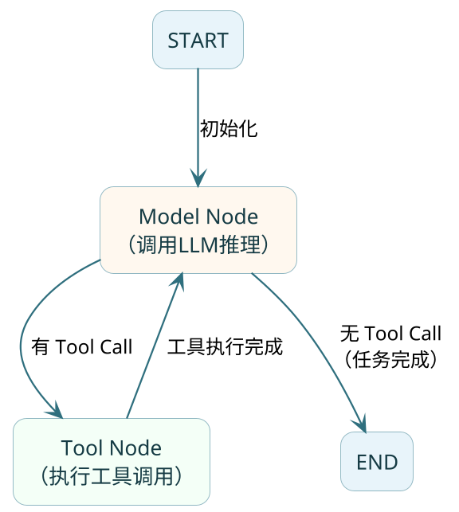
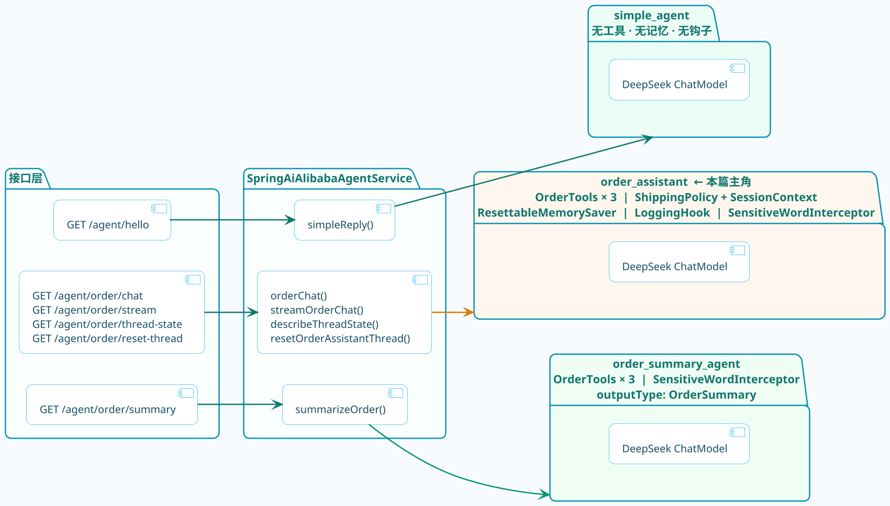
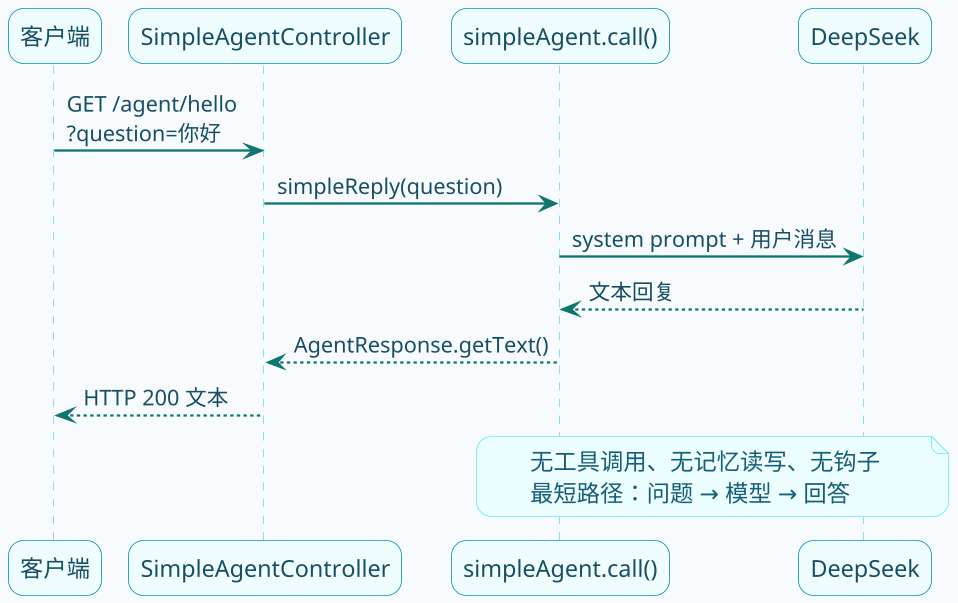
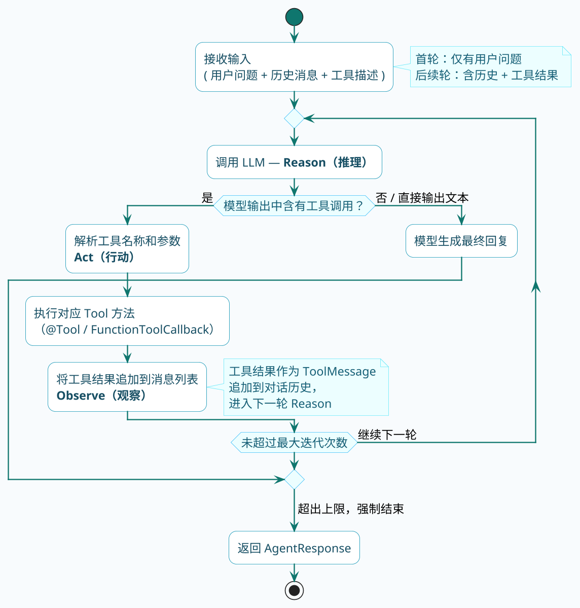
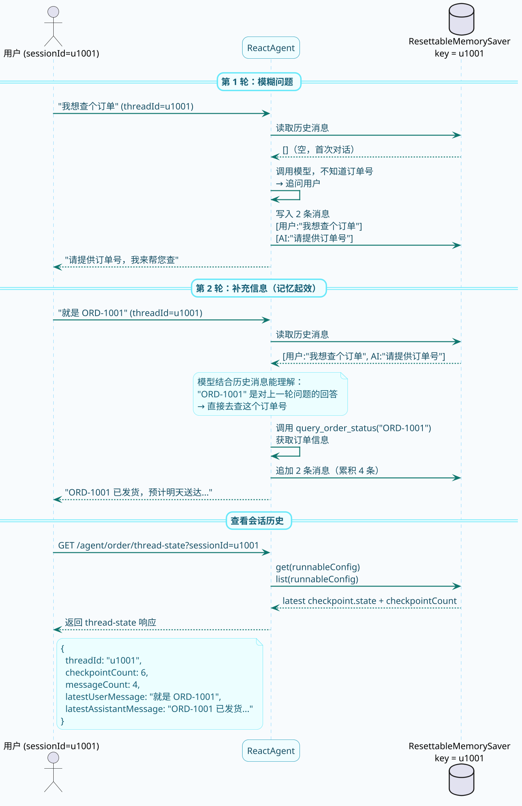
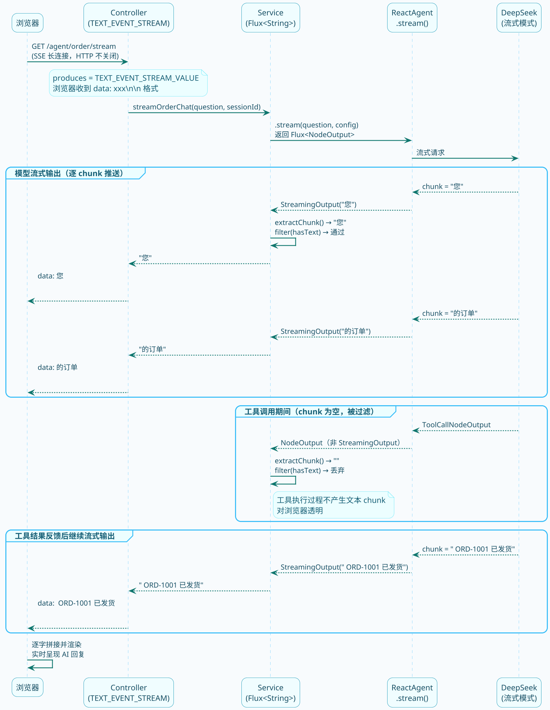

# 框架实战快速上手

前面几篇把 Agent 的概念、协作模式和架构拆开讲过了，这一篇进入实战——用 **Spring AI Alibaba ReactAgent** 从零搭一个订单助手，五个核心能力（Tools、Memory、Hook、Interceptor、结构化输出/流式输出）在这个模块里都有真实落地。

## Spring AI Alibaba ReactAgent 概览

在正式开始实战之前，我们先来了解一下 Spring AI Alibaba ReactAgent 的整体架构和核心概念。

### 框架定位

**Spring AI Alibaba** 是阿里巴巴基于 **Spring AI** 推出的增强版框架。你可以把它理解为 Spring AI 的"阿里云定制版"——底层核心逻辑还是 Spring AI，但在上层做了大量增强，特别是在 Agent 能力方面。

从 1.1 版本开始，Spring AI Alibaba 提供了**生产级 ReactAgent 的实现**，不需要你自己从头写循环控制、工具调度这些脏活累活了。

### Graph Runtime：图执行引擎

:::info 核心概念
ReactAgent 底层是基于 **Graph Runtime（图运行时）** 构建的。所谓 Graph 就是由 **节点（Node）** 和 **边（Edge）** 组成的执行图：
- **Node（节点）**：执行具体逻辑的单元，比如调用大模型、执行工具
- **Edge（边）**：定义节点之间的流转规则，比如"有工具调用就去Tool节点，没有就结束"

这种设计让 Agent 的执行过程**可控、可追溯、可调试**，比单纯的循环嵌套清晰得多。
:::



### 三种核心节点

在 ReactAgent 的执行过程中，有三种关键的节点类型：

| 节点类型 | 职责 | 说明 |
|---------|------|------|
| **Model Node** | Agent 的"大脑" | 调用大模型进行推理，决定下一步是调工具还是直接回答 |
| **Tool Node** | Agent 的"手脚" | 当模型决定使用工具时，这个节点负责实际执行工具方法 |
| **Hook Node** | Agent 的"探针" | 在流程关键位置插入自定义逻辑，比如日志、审计、限流 |

:::tip 执行流程简述
1. 用户输入进入 Model Node，模型进行推理
2. 如果模型决定调用工具，流转到 Tool Node 执行
3. 工具执行完成后，结果回到 Model Node 继续推理
4. 如果模型认为任务完成（不再调用工具），流转到 END
5. 这个循环就是 ReAct 的"思考→行动→观察"过程
:::

### ReactAgent 核心组件速览

ReactAgent 提供了一套完整的组件体系，每个组件负责不同的能力：

| 组件 | 作用 | 配置方式 |
|------|------|---------|
| **Model** | 大模型，Agent 的推理引擎 | `.model(chatModel)` |
| **Tools** | 工具集，Agent 可以调用的外部能力 | `.tools(...)` 或 `.methodTools(...)` |
| **System Prompt** | 系统提示词，定义 Agent 的身份和行为规范 | `.systemPrompt(...)` 或 `.instruction(...)` |
| **Memory（Saver）** | 记忆，支持多轮对话 | `.saver(memorySaver)` |
| **Hooks** | 生命周期钩子，在 Agent 执行前后插入逻辑 | `.hooks(...)` |
| **Interceptors** | 拦截器，在每次模型调用前拦截和增强 | `.interceptors(...)` |
| **Output Type** | 结构化输出，约束模型输出为指定的 Java 类型 | `.outputType(Xxx.class)` |

### 依赖引入

使用 Spring AI Alibaba ReactAgent 需要引入以下依赖：

```xml
<!-- Spring AI Alibaba Agent 框架主体 -->
<dependency>
    <groupId>com.alibaba.cloud.ai</groupId>
    <artifactId>spring-ai-alibaba-agent-framework</artifactId>
    <version>1.1.0.0</version>
</dependency>

<!-- 阿里云灵积模型接入（DashScope） -->
<dependency>
    <groupId>com.alibaba.cloud.ai</groupId>
    <artifactId>spring-ai-alibaba-starter-dashscope</artifactId>
    <version>1.1.0.0</version>
</dependency>
```

:::note 版本说明
Spring AI Alibaba 从 1.1 版本开始提供完整的 ReactAgent 支持。如果你使用其他模型（如通过 OpenAI 兼容协议接入硅基流动、DeepSeek 等），可以只引入 `spring-ai-alibaba-agent-framework`，模型层使用 Spring AI 原生的 starter。
:::

### 最简示例：创建你的第一个 Agent

```java
// 创建最简单的 ReactAgent
ReactAgent agent = ReactAgent.builder()
        .name("my_first_agent")
        .model(chatModel)  // 注入的 ChatModel Bean
        .systemPrompt("你是一个友好的助手，请用简洁的语言回答问题。")
        .build();

// 同步调用
String response = agent.call("你好，请介绍一下自己").getText();

// 流式调用
Flux<NodeOutput> stream = agent.stream("讲个笑话", config);
```

这就是 ReactAgent 最核心的用法：通过 Builder 模式构建 Agent 实例，然后调用 `call()` 或 `stream()` 方法与之对话。

## 项目完整实战示例

接下来，我们通过一个完整的订单助手项目，逐步掌握 ReactAgent 的各个核心能力。

### 示例中项目地址

- 项目地址：[https://gitee.com/shining-stars-l/super-ai-hub](https://gitee.com/shining-stars-l/super-ai-hub)
- 项目模块：`ai-example-spring-ai-alibaba`

## 项目全景：三层结构与三个 Agent

先把整体结构看清楚，再逐层拆细节。



三个 Agent 的设计是"从简到繁"递进的：

| Agent 实例 | 新增能力 | 对应接口 |
|-----------|---------|---------|
| `simple_agent` | 最小可运行：只有模型 | `/agent/hello` |
| `order_assistant` | 在 simple 基础上加：5 个工具 + 多轮记忆 + Hook + Interceptor | `/agent/order/chat`、`/stream` |
| `order_summary_agent` | 在工具基础上加：结构化输出 (`outputType`) | `/agent/order/summary` |

## 目录结构

```
ai-example-spring-ai-alibaba/
├── controller/
│   ├── SimpleAgentController.java       # /agent/hello 最简入口
│   └── OrderAssistantController.java    # /agent/order/** 完整接口
├── service/
│   └── SpringAiAlibabaAgentService.java # 三个 ReactAgent 的创建与调用
├── tool/
│   ├── OrderTools.java                  # @Tool 注解式工具：订单/商品/退款
│   ├── ShippingPolicyRequest.java       # 函数式工具入参
│   ├── SessionContextRequest.java       # 上下文工具入参
│   └── SessionContextTool.java          # BiFunction 工具：读取会话上下文
├── support/
│   ├── LoggingHook.java                 # AgentHook：Agent 前后打日志
│   ├── ResettableMemorySaver.java       # 基于 MemorySaver 扩展，支持清理指定 threadId
│   └── SensitiveWordInterceptor.java    # ModelInterceptor：每次模型调用前拦截
└── model/
    ├── OrderInfo.java  ProductInfo.java  RefundResult.java   # 工具返回值
    └── OrderSummary.java                # 结构化输出目标类型
```

## 依赖和配置

```xml
<dependency>
    <groupId>org.springframework.boot</groupId>
    <artifactId>spring-boot-starter-web</artifactId>
</dependency>
<!-- Spring AI Alibaba：ReactAgent 框架主体 -->
<dependency>
    <groupId>com.alibaba.cloud.ai</groupId>
    <artifactId>spring-ai-alibaba-agent-framework</artifactId>
</dependency>
<!-- Spring AI OpenAI（硅基流动兼容OpenAI协议） -->
<dependency>
    <groupId>org.springframework.ai</groupId>
    <artifactId>spring-ai-starter-model-openai</artifactId>
</dependency>
```

版本由 BOM 统一管理，模块里不单独声明：`Spring AI` 来自父工程 BOM，`Spring AI Alibaba` 来自模块内的 `spring-ai-alibaba-bom`。

```yaml
spring:
  ai:
    openai:
      base-url: https://api.siliconflow.cn
      api-key: ${SILICONFLOW_API_KEY}
      chat:
        options:
          model: Qwen/Qwen3.5-122B-A10B
```

## 第一步：最简 Agent（simple_agent）

拿 `simple_agent` 当切入点，把 ReactAgent 的最小工作单元跑通。

### 接口 → Service → Agent 的完整路径

控制器只做参数传递，不包含任何 Agent 逻辑：

```java
@RestController
@RequestMapping("/agent")
public class SimpleAgentController {

    @GetMapping("/hello")
    public String hello(
        @RequestParam(value = "question", defaultValue = "你好，请介绍一下 Spring AI Alibaba ReactAgent 的作用")
        String question) {
        return this.agentService.simpleReply(question);
    }
}
```

Service 构造函数里创建 Agent 实例——整个应用生命周期内共享这一个对象，调用时无状态：

```java
this.simpleAgent = ReactAgent.builder()
    .name("simple_agent")
    .model(chatModel)          // 注入 DeepSeek ChatModel Bean
    .systemPrompt(SIMPLE_AGENT_PROMPT)
    .build();

// 调用时：
public String simpleReply(String question) {
    return this.simpleAgent.call(question).getText();
}
```

`.call(question)` 是同步阻塞的，返回 `AgentResponse`，调 `.getText()` 取出纯文本回复。整条链路就这三步：



验证：`http://localhost:7089/agent/hello?question=你好`


## 第二步：工具体系（Tools）

:::info 工具执行原理
工具是 Agent 调用外部能力的通道。**模型本身不执行任何操作**，它只负责"决策"——判断是否需要工具、选择哪个工具、传什么参数；框架负责真正执行工具方法并把结果反馈给模型。
:::

项目里落地了三种工具定义方式，分别适合不同场景。

### 方式一：注解式工具（`@Tool`）

这是最常见的写法，把业务方法集中在一个 Spring Bean 里，用注解声明工具名和参数描述，框架自动注册。

```java
@Component
public class OrderTools {

    // 内存模拟数据库，双 key 设计：ID 和名称都能命中
    private static final Map<String, OrderInfo> ORDER_STORE = Map.of(
        "ord-1001", new OrderInfo("ORD-1001", "蓝牙耳机 Pro", "已发货", "SF123456789", "2026-03-14 18:00 前送达", true),
        "ord-1002", new OrderInfo("ORD-1002", "机械键盘 V87", "已签收", "JD99887766", "2026-03-11 12:00 已签收", false)
    );

    private static final Map<String, ProductInfo> PRODUCT_STORE = Map.of(
        "p-1001",       new ProductInfo("P-1001", "蓝牙耳机 Pro", "299.00", 28, "主动降噪、40 小时续航、支持双设备切换"),
        "蓝牙耳机 pro",  new ProductInfo("P-1001", "蓝牙耳机 Pro", "299.00", 28, "主动降噪、40 小时续航、支持双设备切换"),
        "p-1002",       new ProductInfo("P-1002", "机械键盘 V87", "499.00", 12, "Gasket 结构、热插拔、三模连接"),
        "机械键盘 v87",  new ProductInfo("P-1002", "机械键盘 V87", "499.00", 12, "Gasket 结构、热插拔、三模连接")
    );

    @Tool(name = "query_order_status",
          description = "根据订单号查询订单状态、物流单号、预计送达时间和是否支持退款")
    public OrderInfo queryOrderStatus(
        @ToolParam(description = "订单号，例如 ORD-1001") String orderId) {
        return ORDER_STORE.getOrDefault(normalize(orderId),
            new OrderInfo(orderId, "未知商品", "未查到订单", "N/A", "请先确认订单号是否正确", false));
    }

    @Tool(name = "query_product_detail",
          description = "根据商品 ID 或商品名称查询价格、库存和卖点")
    public ProductInfo queryProduct(
        @ToolParam(description = "商品 ID 或商品名称") String productQuery) {
        return PRODUCT_STORE.getOrDefault(normalize(productQuery),
            new ProductInfo("UNKNOWN", productQuery, "0.00", 0, "暂未找到，请转人工客服核实"));
    }

    @Tool(name = "apply_refund",
          description = "为指定订单提交退款申请，需要提供订单号和退款原因")
    public RefundResult applyRefund(
        @ToolParam(description = "订单号，例如 ORD-1001") String orderId,
        @ToolParam(description = "退款原因，例如商品破损、重复下单") String reason) {
        // 先查订单判断是否支持退款，有业务拦截逻辑
        OrderInfo orderInfo = queryOrderStatus(orderId);
        if (!orderInfo.canRefund()) {
            return new RefundResult(orderInfo.orderId(), false, "N/A",
                "当前状态为"" + orderInfo.status() + ""，不支持直接退款，请联系人工客服。");
        }
        String normalizedReason = StringUtils.hasText(reason) ? reason.trim() : "未说明原因";
        return new RefundResult(orderInfo.orderId(), true, "RF-20260313-1001",
            "退款申请已受理，原因：" + normalizedReason + "，预计 1-3 个工作日原路退回。");
    }

    // 统一做 trim + 转小写，避免大小写和空格问题导致查不到
    private String normalize(String value) {
        return StringUtils.hasText(value) ? value.trim().toLowerCase(Locale.ROOT) : "";
    }
}
```

:::tip 工具设计亮点
- `PRODUCT_STORE` 用商品 ID（`p-1001`）和商品中文名（`蓝牙耳机 pro`）两套 key 同时索引，模型传哪种都能命中
- `normalize()` 统一处理大小写和空格，防止模型输出 `ORD-1001` 时因大小写匹配失败
- `applyRefund` 内部先调 `queryOrderStatus` 判断 `canRefund`，业务校验封闭在工具内部
:::

挂载到 Agent：

```java
.methodTools(orderTools)  // 框架自动扫描 Bean 上所有 @Tool 方法
```

### 方式二：函数式工具（`FunctionToolCallback`）

轻量规则查询不需要单独建类，直接用 Lambda 或方法引用包装成工具：

```java
// 构建工具
private ToolCallback buildShippingPolicyTool() {
    return FunctionToolCallback.builder("shipping_policy_lookup", this::shippingPolicyLookup)
        .description("根据商品名称查询发货和售后规则")
        .inputType(ShippingPolicyRequest.class)
        .build();
}

// 工具的具体实现：对象入参 → 字符串结果
private String shippingPolicyLookup(ShippingPolicyRequest request) {
    String productQuery = request != null ? request.productQuery() : "";
    if (StringUtils.hasText(productQuery) && productQuery.contains("耳机")) {
        return "蓝牙耳机 Pro 支持 48 小时内发货，未拆封支持 7 天无理由退货。";
    }
    return "默认规则：24 小时内出库，签收前可拦截，签收后请结合订单状态判断是否可退款。";
}

public record ShippingPolicyRequest(
    String productQuery
) {
}
```

这里把工具输入包装成 `record`，模型侧看到的工具 schema 就会是标准的 JSON `object`，比直接用 `String` 更稳定。

挂载方式与注解式不同，直接传 `ToolCallback` 实例：

```java
.tools(shippingPolicyTool, sessionContextTool)
```

### 方式三：上下文感知工具（`BiFunction<I, ToolContext, O>`）

前两种工具只接收模型传来的参数。当工具还需要读取当前会话运行时状态（比如消息条数、当前线程 ID），就实现 `BiFunction`，第二个参数 `ToolContext` 由框架注入：

```java
public class SessionContextTool implements BiFunction<SessionContextRequest, ToolContext, String> {

    @Override
    public String apply(SessionContextRequest request, ToolContext toolContext) {
        // 从 ToolContext 取出 Agent 内部状态图和运行配置
        Object stateObject  = toolContext.getContext().get(ToolContextConstants.AGENT_STATE_CONTEXT_KEY);
        Object configObject = toolContext.getContext().get(ToolContextConstants.AGENT_CONFIG_CONTEXT_KEY);

        // 统计当前线程的历史消息数量
        int messageCount = 0;
        if (stateObject instanceof OverAllState state) {
            Object messages = state.value("messages").orElse(List.of());
            if (messages instanceof List<?> list) {
                messageCount = list.size();
            }
        }

        // 读取 threadId（即 sessionId）
        String threadId = configObject instanceof RunnableConfig config
            ? config.threadId().orElse("unknown") : "unknown";

        String focus = request != null ? request.focus() : "";
        String focusText = StringUtils.hasText(focus) ? focus.trim() : "当前对话";
        return "当前线程 " + threadId + " 已累计 " + messageCount + " 条消息，重点关注：" + focusText + "。";
    }
}

public record SessionContextRequest(
    String focus
) {
}
```

:::info ToolContext 核心常量
`ToolContext` 中可以获取以下关键信息：

| 常量 Key | 类型 | 说明 |
|---------|------|------|
| `_AGENT_STATE_` | `OverAllState` | Agent 内部的状态图，包含完整的消息历史 |
| `_AGENT_CONFIG_` | `RunnableConfig` | 运行配置，可以读取 threadId、metadata 等 |
| `_AGENT_STATE_FOR_UPDATE_` | `Map<String, Object>` | 用于工具向状态图写入额外数据 |

通过 `OverAllState.value("messages")` 可以获取 ReAct Agent 的完整历史消息列表，包括 User、Assistant、Tool 类型的消息。
:::

`ToolContext` 里的 `OverAllState` 和 `RunnableConfig` 是框架运行时注入的"活数据"，每次工具被调用时都能拿到最新状态。

包装挂载：

```java
private ToolCallback buildSessionContextTool() {
    return FunctionToolCallback.builder("session_context_snapshot", new SessionContextTool())
        .description("读取当前线程上下文，告诉用户会话已经记录了多少历史消息")
        .inputType(SessionContextRequest.class)
        .build();
}
```

### 三种工具方式怎么选？

| 方式 | 适用场景 | 挂载方法 |
|------|---------|---------|
| `@Tool` 注解式 | 业务逻辑较复杂、多个相关工具聚合成一个 Bean | `.methodTools(bean)` |
| `FunctionToolCallback` | 单一轻量的规则查询或转换，不需要专门建类 | `.tools(callback)` |
| `BiFunction + ToolContext` | 需要读取会话状态（消息历史、threadId）的工具 | `.tools(callback)` |


## 第三步：组装完整的 order_assistant

有了工具体系，再来看 `order_assistant` 是怎么把所有组件拼在一起的。

```java
this.orderAssistantMemorySaver = new ResettableMemorySaver();     // ① 基于 MemorySaver 扩展，支持清空指定会话
ToolCallback shippingPolicyTool = buildShippingPolicyTool();      // ② 函数式工具
ToolCallback sessionContextTool = buildSessionContextTool();      // ③ 上下文感知工具

this.orderAssistantAgent = ReactAgent.builder()
    .name("order_assistant")
    .model(chatModel)                                              // 模型（DeepSeek）
    .methodTools(orderTools)                                       // 注解式工具（订单/商品/退款）
    .tools(shippingPolicyTool, sessionContextTool)                 // 函数式工具
    .instruction(ORDER_ASSISTANT_PROMPT)                           // 系统提示词，约束行为边界
    .saver(this.orderAssistantMemorySaver)                         // 挂载记忆，启用多轮对话
    .hooks(loggingHook)                                            // 生命周期钩子
    .interceptors(sensitiveWordInterceptor)                        // 模型调用拦截器
    .build();
```

### systemPrompt vs instruction

ReactAgent 支持两种方式配置系统提示词：

| 配置方式 | 适用场景 | 说明 |
|---------|---------|------|
| `.systemPrompt("...")` | 简单的单行提示 | 直接传一个字符串，适合简短的角色设定 |
| `.instruction("...")` | 复杂的多行指令 | 支持结构化的提示词，适合详细的行为规范 |

```java
// 方式一：简单提示词
ReactAgent agent = ReactAgent.builder()
    .systemPrompt("你是一个友好的助手。")
    .build();

// 方式二：复杂指令（推荐用于生产环境）
String instruction = """
    你是一个专业的电商客服助手。
    
    你的工作职责：
    1. 解答用户关于商品的问题
    2. 帮助用户查询订单状态
    3. 处理用户的退换货请求
    
    回复规范：
    - 使用友好、专业的语气
    - 回答要简洁明了
    - 涉及金额操作时要再次确认
    """;
    
ReactAgent agent = ReactAgent.builder()
    .instruction(instruction)
    .build();
```

:::tip 选择建议
- 开发测试阶段用 `systemPrompt`，快速验证
- 生产环境用 `instruction`，把完整的行为规范、约束条件都写进去
- 两者功能等价，只是风格不同，选一个用即可
:::

系统提示词约束了 Agent 的行为边界，防止模型编造数据、控制退款流程：

```java
private static final String ORDER_ASSISTANT_PROMPT = """
    你是 JavaUp 电商订单助手，需要结合工具结果回答问题。
    你可以：
    1. 查询订单状态和物流信息。
    2. 查询商品详情和售后规则。
    3. 处理退款申请，但涉及退款时必须先确认订单号和退款原因。

    回复要求：
    - 优先使用工具返回的事实，不要编造订单信息。
    - 回答要简洁，适合直接返回给前端页面展示。
    - 如果用户追问"这个会话记住了什么"，可以调用 session_context_snapshot 工具总结当前线程上下文。
    """;
```

## 完整请求链路：一次调用的全生命周期

访问 `http://localhost:7089/agent/order/chat?question=帮我查订单ORD-1001&sessionId=u1001` 进行对话


整个执行过程分三个阶段，下面逐段来看。

### 阶段一：请求调度与 Agent 启动

HTTP 请求进来后，经过 Controller → Service 组装好携带 `threadId` 的 `RunnableConfig`，再触发 `beforeAgent` 钩子打印启动日志，最后才真正进入 ReactAgent 的推理流程。

```plantuml title="阶段一：请求进入 → 构建会话配置 → Hook beforeAgent" width="100%" align="left"
@startuml
skinparam backgroundColor #F8FBFD
skinparam roundcorner 18
skinparam shadowing false
skinparam defaultFontName Microsoft YaHei
skinparam defaultFontSize 13
skinparam dpi 160
skinparam ArrowColor #0F766E
skinparam ArrowThickness 1.4
skinparam ArrowFontColor #164E63
skinparam ArrowFontSize 12

skinparam participant {
  BackgroundColor #F0FDFF
  BorderColor #0891B2
  FontColor #164E63
}
skinparam sequence {
  LifeLineBorderColor #7DD3FC
  LifeLineBackgroundColor #F8FBFD
  GroupBorderColor #38BDF8
  GroupBackgroundColor #ECFEFF
  GroupHeaderBackgroundColor #CFFAFE
  GroupHeaderFontColor #155E75
  DividerBorderColor #67E8F9
  DividerBackgroundColor #F0FDFF
  DividerFontColor #155E75
}
skinparam note {
  BackgroundColor #ECFEFF
  BorderColor #67E8F9
  FontColor #155E75
}

participant "客户端" as C
participant "Controller" as CTL
participant "Service" as SVC
participant "ReactAgent" as RA
participant "LoggingHook" as HOOK #ECFDF5

C -> CTL : GET /agent/order/chat\n?question=查ORD-1001&sessionId=u1001
CTL -> SVC : orderChat("查ORD-1001", "u1001")
SVC -> SVC : buildSessionConfig("u1001")\n→ RunnableConfig(threadId="u1001")
SVC -> RA : call(question, config)

== Hook：beforeAgent（整个 Agent 生命周期只执行一次）==

RA -> HOOK : beforeAgent(state, config)
note right of HOOK
  log.info("start,
  threadId=u1001,
  userMessage=查ORD-1001")
end note
HOOK --> RA : Map.of()（不向状态图写入数据）
@enduml
```

### 阶段二：拦截器过滤 + ReAct 推理执行

这是最核心的阶段——拦截器在**每次模型调用前**都会执行。本次请求触发了两轮模型调用：第一轮模型决策调用工具，第二轮基于工具结果生成最终回复。

```plantuml title="阶段二：拦截器 → 第1次模型推理 → 工具执行 → 拦截器 → 第2次模型推理" width="100%" align="left"
@startuml
skinparam backgroundColor #F8FBFD
skinparam roundcorner 18
skinparam shadowing false
skinparam defaultFontName Microsoft YaHei
skinparam defaultFontSize 13
skinparam dpi 160
skinparam ArrowColor #0F766E
skinparam ArrowThickness 1.4
skinparam ArrowFontColor #164E63
skinparam ArrowFontSize 12

skinparam participant {
  BackgroundColor #F0FDFF
  BorderColor #0891B2
  FontColor #164E63
}
skinparam sequence {
  LifeLineBorderColor #7DD3FC
  LifeLineBackgroundColor #F8FBFD
  GroupBorderColor #38BDF8
  GroupBackgroundColor #ECFEFF
  GroupHeaderBackgroundColor #CFFAFE
  GroupHeaderFontColor #155E75
  DividerBorderColor #67E8F9
  DividerBackgroundColor #F0FDFF
  DividerFontColor #155E75
}
skinparam note {
  BackgroundColor #ECFEFF
  BorderColor #67E8F9
  FontColor #155E75
}

participant "ReactAgent" as RA
participant "SensitiveWord\nInterceptor" as INT #FFF7ED
participant "DeepSeek" as LLM #F0FDFF
participant "OrderTools" as OT #FFFBEB

== 第 1 次模型调用：Reason（推理阶段）==

RA -> INT : interceptModel(request)
note right of INT
  ① 遍历所有消息检测敏感词
     命中 → 直接返回，不调模型
  ② 未命中 → 在 system message 末尾
     追加退款约束文本
end note
INT -> LLM : 增强后的请求\n(system + 工具描述列表 + 用户消息)
LLM --> INT : 决策：调用 query_order_status("ORD-1001")
INT --> RA : ModelResponse（工具调用决策）

== ReAct：Act（行动阶段）==

RA -> OT : queryOrderStatus("ORD-1001")
note right of OT
  normalize("ORD-1001") → "ord-1001"
  ORDER_STORE.getOrDefault("ord-1001", ...)
end note
OT --> RA : OrderInfo(已发货, SF123456789,\n2026-03-14, canRefund=true)

== 第 2 次模型调用：Reason（生成最终回复）==

RA -> INT : interceptModel(request)
note right of INT
  拦截器在每次模型调用前都执行
  不论是第几轮 ReAct 循环
end note
INT -> LLM : 历史消息 + 工具执行结果
LLM --> INT : "您的订单 ORD-1001 已发货，\n快递单号 SF123456789..."
INT --> RA : ModelResponse（最终文本回复）
@enduml
```

### 阶段三：记忆持久化与响应返回

ReAct 循环结束后，框架把本轮所有消息写入 `MemorySaver`（为下一轮多轮对话准备），触发 `afterAgent` 钩子记录结束日志，最终把文本回复沿原路返回给客户端。

```plantuml title="阶段三：写入记忆 → Hook afterAgent → 返回 HTTP 响应" width="100%" align="left"
@startuml
skinparam backgroundColor #F8FBFD
skinparam roundcorner 18
skinparam shadowing false
skinparam defaultFontName Microsoft YaHei
skinparam defaultFontSize 13
skinparam dpi 160
skinparam ArrowColor #0F766E
skinparam ArrowThickness 1.4
skinparam ArrowFontColor #164E63
skinparam ArrowFontSize 12

skinparam participant {
  BackgroundColor #F0FDFF
  BorderColor #0891B2
  FontColor #164E63
}
skinparam sequence {
  LifeLineBorderColor #7DD3FC
  LifeLineBackgroundColor #F8FBFD
  GroupBorderColor #38BDF8
  GroupBackgroundColor #ECFEFF
  GroupHeaderBackgroundColor #CFFAFE
  GroupHeaderFontColor #155E75
  DividerBorderColor #67E8F9
  DividerBackgroundColor #F0FDFF
  DividerFontColor #155E75
}
skinparam note {
  BackgroundColor #ECFEFF
  BorderColor #67E8F9
  FontColor #155E75
}

participant "ReactAgent" as RA
participant "MemorySaver\n(threadId=u1001)" as MEM #F5F3FF
participant "LoggingHook" as HOOK #ECFDF5
participant "Service" as SVC
participant "Controller" as CTL
participant "客户端" as C

== 记忆持久化（为下一轮多轮对话准备）==

RA -> MEM : 保存本轮全部消息\n[用户问 · 工具调用 · 工具结果 · 助手回复]
note right of MEM
  key = threadId "u1001"
  下次同 sessionId 访问时可读取
end note
MEM --> RA

== Hook：afterAgent（整个 Agent 生命周期只执行一次）==

RA -> HOOK : afterAgent(state, config)
note right of HOOK
  log.info("finish,
  threadId=u1001,
  assistantMessage=您的订单ORD-1001已...")
end note
HOOK --> RA : Map.of()

== 响应返回 ==

RA --> SVC : AgentResponse
SVC --> CTL : getText() → "您的订单 ORD-1001 已发货..."
CTL --> C : HTTP 200 文本响应
@enduml
```

## ReAct 循环：推理 — 行动 — 观察

上面时序图里的"ReAct 循环"是 Agent 的核心运转机制，每一轮包含三个阶段：



:::tip ReAct 循环关键点
- 模型每轮只负责"推理"，工具执行由框架负责，两者完全解耦
- 工具结果会作为 `ToolMessage` 追加进消息列表，模型下一轮能看到
- 一个问题可能触发多次工具调用（多轮循环），也可能直接回答（只有一轮）
- 框架有最大迭代次数保护，防止无限循环
:::

## Memory：ResettableMemorySaver 与多轮对话

`order_assistant` 挂载的是 `ResettableMemorySaver`。它底层继承自 `MemorySaver`，保留了基于 `threadId` 的多轮记忆能力，同时额外提供了清空指定会话的能力，方便演示页随时回到干净状态。

```java
this.orderAssistantMemorySaver = new ResettableMemorySaver();  // 内存级别，应用重启后丢失
```

```java
public class ResettableMemorySaver extends MemorySaver {

    public int clearThread(String threadId) {
        Collection<Checkpoint> removed = remove(threadId);
        return removed != null ? removed.size() : 0;
    }
}
```

**多轮连贯性的关键是 `threadId`**：

```java
private RunnableConfig buildSessionConfig(String sessionId) {
    return RunnableConfig.builder()
        .threadId(normalizeSessionId(sessionId))   // sessionId 即 threadId
        .build();
}
```

框架内部以 `threadId` 为 key 读写历史消息列表，只要前后两次调用的 `threadId` 相同，Agent 就能"记得"上一轮说了什么。



`thread-state` 接口直接从内存里的最新 checkpoint 提取状态，并补充当前线程的 checkpoint 数量：

```java
public Map<String, Object> describeThreadState(String sessionId) {
    String normalizedSessionId = normalizeSessionId(sessionId);
    RunnableConfig runnableConfig = buildSessionConfig(normalizedSessionId);

    Map<String, Object> state = this.orderAssistantMemorySaver.get(runnableConfig)
        .map(Checkpoint::getState)
        .orElseGet(() -> this.orderAssistantAgent.getThreadState(normalizedSessionId));

    List<?> messageList = state.get("messages") instanceof List<?> list ? list : List.of();
    int checkpointCount = this.orderAssistantMemorySaver.list(runnableConfig).size();

    Map<String, Object> result = new LinkedHashMap<>();
    result.put("threadId", normalizedSessionId);
    result.put("checkpointCount", checkpointCount);
    result.put("messageCount", messageList.size());
    result.put("latestUserMessage", findLatestMessage(messageList, MessageType.USER));
    result.put("latestAssistantMessage", findLatestMessage(messageList, MessageType.ASSISTANT));
    return result;
}
```

演示页里的"重置当前会话"按钮，对应的就是这个接口：

```java
@GetMapping("/reset-thread")
public Map<String, Object> resetThread(
    @RequestParam(value = "sessionId", defaultValue = "demo-user-1001") String sessionId) {
    return this.agentService.resetOrderAssistantThread(sessionId);
}

public Map<String, Object> resetOrderAssistantThread(String sessionId) {
    String normalizedSessionId = normalizeSessionId(sessionId);
    int removedCheckpointCount = this.orderAssistantMemorySaver.clearThread(normalizedSessionId);

    Map<String, Object> result = new LinkedHashMap<>();
    result.put("threadId", normalizedSessionId);
    result.put("reset", true);
    result.put("removedCheckpointCount", removedCheckpointCount);
    result.put("checkpointCount", 0);
    result.put("messageCount", 0);
    result.put("latestUserMessage", "");
    result.put("latestAssistantMessage", "");
    return result;
}
```

:::caution 生产化建议
`ResettableMemorySaver` 本质上仍然是内存实现，应用重启后历史会丢失。换成 `MysqlSaver` 或 `PostgresSaver` 时，调用侧的 `threadId` 约定仍然可以保留。
:::

## Hook 与 Interceptor：两层插件机制

两者都是"中间件"，但执行位置不同、职责不同：

| 维度 | `AgentHook` | `ModelInterceptor` |
|------|------------|-------------------|
| 执行时机 | Agent 整体启动前 / 结束后（各一次） | 每次调用模型之前（可能多次） |
| 能否修改请求 | 不能，只能读取状态 | 能，可修改 system message |
| 能否短路 | 不能 | 能，直接返回 ModelResponse |
| 典型用途 | 日志、链路追踪、指标上报 | 安全过滤、请求增强、降级 |

### Hook 的四种执行位置

通过 `@HookPositions` 注解可以指定 Hook 在哪些位置执行：

| 位置 | 说明 | 执行次数 |
|------|------|---------|
| `BEFORE_AGENT` | Agent 整体开始前 | 每次 call() 执行一次 |
| `AFTER_AGENT` | Agent 整体结束后 | 每次 call() 执行一次 |
| `BEFORE_MODEL` | 每次模型调用前 | 可能多次（ReAct 循环中） |
| `AFTER_MODEL` | 每次模型调用后 | 可能多次（ReAct 循环中） |

:::tip Hook vs Interceptor 选择建议
- **需要记录整体执行情况**（开始/结束日志、耗时统计）→ 用 `AgentHook`
- **需要在每次模型调用时做处理**（敏感词过滤、提示词增强、审计）→ 用 `ModelInterceptor`
- **需要短路/拦截模型调用**（安全拦截、降级返回）→ 只能用 `ModelInterceptor`
:::

```plantuml title="Hook 与 Interceptor 在 Agent 生命周期中的执行位置" width="100%" align="left"
@startuml
skinparam backgroundColor #F8FBFD
skinparam roundcorner 18
skinparam shadowing false
skinparam defaultFontName Microsoft YaHei
skinparam defaultFontSize 13
skinparam dpi 160
skinparam ArrowColor #0F766E
skinparam ArrowThickness 1.4
skinparam ArrowFontColor #164E63
skinparam ArrowFontSize 12

skinparam participant {
  BackgroundColor #F0FDFF
  BorderColor #0891B2
  FontColor #164E63
}
skinparam sequence {
  LifeLineBorderColor #7DD3FC
  LifeLineBackgroundColor #F8FBFD
  GroupBorderColor #38BDF8
  GroupBackgroundColor #ECFEFF
  GroupHeaderBackgroundColor #CFFAFE
  GroupHeaderFontColor #155E75
  DividerBorderColor #67E8F9
  DividerBackgroundColor #F0FDFF
  DividerFontColor #155E75
}
skinparam note {
  BackgroundColor #ECFEFF
  BorderColor #67E8F9
  FontColor #155E75
}

participant "框架调度" as FW
participant "LoggingHook\nbeforeAgent" as HB #ECFDF5
participant "SensitiveWord\nInterceptor" as INT #FFF7ED
participant "DeepSeek" as LLM
participant "LoggingHook\nafterAgent" as HA #ECFDF5

== Agent 整体开始（只执行一次）==

FW -> HB : beforeAgent(state, config)
note right of HB : 打印：threadId + 用户最后一条消息\n截断到 80 字
HB --> FW

== 第 1 次模型调用（ReAct 第 1 轮：推理）==

FW -> INT : interceptModel(request)
note right of INT : ① 遍历所有 messages，\n   检测"炸药/违法洗钱/攻击学校"\n② 命中 → 直接 return，LLM 不被调用\n③ 未命中 → 追加退款约束到 system message
INT -> LLM : 增强后的请求（含退款约束）
LLM --> INT : 返回工具调用决策
INT --> FW

note over FW, LLM : [工具执行：queryOrderStatus → 返回 OrderInfo]

== 第 2 次模型调用（ReAct 第 2 轮：最终回复）==

FW -> INT : interceptModel(request)
note right of INT : 每次调用模型都重新执行\n（不论是第几轮 ReAct）
INT -> LLM : 含工具结果的完整请求
LLM --> INT : 最终文本回复
INT --> FW

== Agent 整体结束（只执行一次）==

FW -> HA : afterAgent(state, config)
note right of HA : 打印：threadId + 助手最后一条回复（截断 80 字）
HA --> FW
@enduml
```

### LoggingHook 核心代码

```java
@Component
@HookPositions({HookPosition.BEFORE_AGENT, HookPosition.AFTER_AGENT})
public class LoggingHook extends AgentHook {

    @Override
    public CompletableFuture<Map<String, Object>> beforeAgent(OverAllState state, RunnableConfig config) {
        log.info("ReactAgent start, threadId={}, userMessage={}",
            config.threadId().orElse("default"), extractLastMessage(state, MessageType.USER));
        return CompletableFuture.completedFuture(Map.of());  // Map.of()：不向状态图写入数据
    }

    @Override
    public CompletableFuture<Map<String, Object>> afterAgent(OverAllState state, RunnableConfig config) {
        log.info("ReactAgent finish, threadId={}, assistantMessage={}",
            config.threadId().orElse("default"), extractLastMessage(state, MessageType.ASSISTANT));
        return CompletableFuture.completedFuture(Map.of());
    }

    private String extractLastMessage(OverAllState state, MessageType targetType) {
        Object messages = state.value("messages").orElse(List.of());
        if (!(messages instanceof List<?> list)) return "";
        // 从后往前找，取最后一条目标类型的消息
        for (int i = list.size() - 1; i >= 0; i--) {
            if (list.get(i) instanceof AbstractMessage msg && msg.getMessageType() == targetType) {
                // 截断到 80 字，防止日志行太长
                return msg.getText().length() > 80 ? msg.getText().substring(0, 77) + "..." : msg.getText();
            }
        }
        return "";
    }
}
```

### SensitiveWordInterceptor 核心代码

```java
@Component
public class SensitiveWordInterceptor extends ModelInterceptor {

    private static final List<String> BLOCKED_WORDS = List.of("炸药", "违法洗钱", "攻击学校");
    private static final String REFUND_GUARD =
        "额外约束：当用户提到退款、退货、售后时，必须先确认订单号和退款原因，再决定是否调用退款工具。";

    @Override
    public ModelResponse interceptModel(ModelRequest request, ModelCallHandler handler) {
        // 分支一：命中敏感词 → 短路，handler.call() 不会被执行
        if (containsBlockedWords(request.getMessages())) {
            return ModelResponse.of(AssistantMessage.builder()
                .content("检测到敏感或违法内容，当前示例不会继续处理该请求。")
                .build());
        }
        // 分支二：未命中 → 增强 system message，再传给模型
        ModelRequest decoratedRequest = ModelRequest.builder(request)
            .systemMessage(appendRefundGuard(request.getSystemMessage()))
            .build();
        return handler.call(decoratedRequest);   // 透传给真正的模型调用
    }
}
```

## 结构化输出（order_summary_agent）

自然语言回答适合对话，但如果下游是前端页面或工作流，**稳定的 JSON** 更可靠。`order_summary_agent` 就是专门为此设计的第三个 Agent：

```java
this.orderSummaryAgent = ReactAgent.builder()
    .name("order_summary_agent")
    .model(chatModel)
    .methodTools(orderTools)
    .instruction(STRUCTURED_OUTPUT_PROMPT)          // 提示词要求只输出 JSON
    .outputType(OrderSummary.class)                  // 告诉框架期望的输出类型
    .interceptors(sensitiveWordInterceptor)
    .build();
```

`OrderSummary` 是一个 Java Record，字段与提示词里约定的 JSON 一一对应：

```java
public record OrderSummary(
    String orderId,
    String status,
    boolean canRefund,
    String nextAction     // 一句中文建议
) {}
```

:::tip 结构化输出防御处理
Service 里的调用做了两层防御，防止模型偶尔输出 Markdown 代码块格式：第一层去掉 ` ```json ... ``` ` 包裹，第二层在解析失败时兜底返回降级对象，不让接口 500。
:::

```java
public OrderSummary summarizeOrder(String question) {
    String rawResponse = this.orderSummaryAgent.call(question).getText();

    // 第一层：去掉 ```json ... ``` 包裹
    String jsonPayload = extractJsonPayload(rawResponse);

    try {
        return this.objectMapper.readValue(jsonPayload, OrderSummary.class);
    } catch (JsonProcessingException e) {
        // 第二层：解析失败时兜底，不让接口 500
        return new OrderSummary("UNKNOWN", "MODEL_OUTPUT_NOT_JSON", false, "模型原始输出：" + rawResponse);
    }
}

private String extractJsonPayload(String raw) {
    String trimmed = raw.trim();
    if (trimmed.startsWith("```") && trimmed.endsWith("```")) {
        String[] parts = trimmed.split("\n", 2);
        if (parts.length == 2) return parts[1].replaceAll("```$", "").trim();
    }
    return trimmed;
}
```

访问验证：

```text
GET http://localhost:7089/agent/order/summary
    ?question=请先查询订单 ORD-1001，再用结构化 JSON 总结订单状态、是否可退款和下一步建议

# 返回：
{
  "orderId": "ORD-1001",
  "status": "已发货",
  "canRefund": true,
  "nextAction": "订单正在配送中，如需退款请在签收后联系客服申请。"
}
```

## 流式输出（SSE）

流式输出通过 Server-Sent Events 把模型生成内容实时推送给浏览器，不用等全部生成完才显示。



### 接口定义

```java
@GetMapping(value = "/stream", produces = MediaType.TEXT_EVENT_STREAM_VALUE)
public Flux<String> stream(
    @RequestParam(value = "question", defaultValue = "请先查询订单 ORD-1001，再告诉我下一步建议") String question,
    @RequestParam(value = "sessionId", defaultValue = "demo-user-1001") String sessionId) {
    return this.agentService.streamOrderChat(question, sessionId);
}
```

### Service 调用与 chunk 过滤

```java
public Flux<String> streamOrderChat(String question, String sessionId) {
    return this.orderAssistantAgent.stream(question, buildSessionConfig(sessionId))
        .map(this::extractChunk)            // 取出文本片段，非文本返回 ""
        .filter(StringUtils::hasText);       // 过滤掉空串（工具调用中间节点）
}

private String extractChunk(NodeOutput output) {
    // NodeOutput 有两种：普通节点输出（工具调用结果等）和 StreamingOutput（流式文本片段）
    // 只保留后者
    if (output instanceof StreamingOutput<?> so && StringUtils.hasText(so.chunk())) {
        return so.chunk();
    }
    return "";
}
```

### 浏览器综合演示页

项目内置了一个专门给这篇"框架实战快速上手"使用的综合演示页，无需自己再写前端：

```text
http://localhost:7089/spring-ai-alibaba-agent-demo.html
```


这个页面不是只演示流式输出，而是把本篇涉及的 6 个入口都放到了同一页：

- `GET /agent/hello`
- `GET /agent/order/chat`
- `GET /agent/order/stream`
- `GET /agent/order/summary`
- `GET /agent/order/thread-state`
- `GET /agent/order/reset-thread`

页面首次加载时会自动生成新的 `sessionId`，同时提供"重置当前会话"按钮，方便快速回到干净的演示状态。

其中流式区域依然使用 `fetch` + `ReadableStream` 消费 SSE 数据，边收边渲染；如果你想观察原始协议帧，再直接访问 `/agent/order/stream` 即可。


## 所有可用接口汇总

项目启动后（端口 7089），可以直接测试：

| 接口 | 功能说明 | 对应 Agent |
|------|---------|-----------|
| `GET /agent/hello` | 最简问答，无工具无记忆 | `simple_agent` |
| `GET /agent/order/chat` | 多轮对话（携带 `sessionId`） | `order_assistant` |
| `GET /agent/order/stream` | 同上，SSE 流式推送 | `order_assistant` |
| `GET /agent/order/summary` | 返回结构化 JSON | `order_summary_agent` |
| `GET /agent/order/thread-state` | 查看指定 `sessionId` 的会话历史 | `order_assistant` |
| `GET /agent/order/reset-thread` | 清空指定 `sessionId` 的内存会话 | `order_assistant` |
| `GET /spring-ai-alibaba-agent-demo.html` | 综合演示页（同步问答 / 流式输出 / 结构化总结 / 会话状态） | — |


## 小结

这一篇把示例模块里的五个核心能力逐层拆开，串成了一条完整的知识链路：

```
simple_agent（最小单元）
    ↓ 加 Tools（5 个，三种定义方式）
    ↓ 加 Memory（ResettableMemorySaver + threadId）
    ↓ 加 Hook（LoggingHook：Agent 前后钩子）
    ↓ 加 Interceptor（SensitiveWordInterceptor：每次模型调用前过滤/增强）
 = order_assistant（完整全功能 Agent）
    ↓ 换 outputType
 = order_summary_agent（结构化输出变体）
```

| 组件 | 职责 | 关键类 |
|------|------|--------|
| `ReactAgent.builder()` | 组装 Agent 实例，声明式配置全部组件 | `SpringAiAlibabaAgentService` 构造函数 |
| `@Tool` 注解式工具 | 业务方法直接暴露为工具描述 | `OrderTools` |
| `FunctionToolCallback` | Lambda/方法引用快速包装 | `shippingPolicyLookup` |
| `BiFunction + ToolContext` | 需要读取运行时状态的工具 | `SessionContextTool` |
| `ResettableMemorySaver` | 基于 `threadId` 的会话记忆，并支持清空指定会话 | 在 Service 构造时初始化 |
| `AgentHook` | Agent 整体生命周期埋点（各执行一次） | `LoggingHook` |
| `ModelInterceptor` | 每次模型调用前的拦截和增强 | `SensitiveWordInterceptor` |
| `outputType` | 约束模型输出为结构化 Java 对象 | 配合 `OrderSummary` Record |
| `ReactAgent.stream()` | 流式 SSE 输出 | `Flux<String>` 管道过滤 |

下一步如果要生产化，核心替换点只有两个：把 `MemorySaver` 换成持久化实现（`MysqlSaver` / `PostgresSaver`），把敏感词列表从硬编码换成配置中心或数据库动态加载。其余的代码结构可以直接复用。
