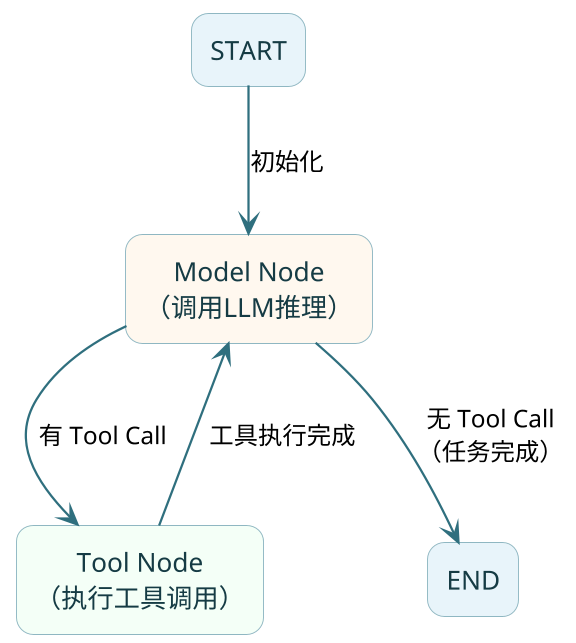

import VipInline from '@site/src/components/VipInline';

# 框架实战快速上手

前面几篇把 Agent 的概念、协作模式和架构拆开讲过了，这一篇进入实战——用 **Spring AI Alibaba ReactAgent** 从零搭一个订单助手，五个核心能力（Tools、Memory、Hook、Interceptor、结构化输出/流式输出）在这个模块里都有真实落地。

## Spring AI Alibaba ReactAgent 概览

在正式开始实战之前，我们先来了解一下 Spring AI Alibaba ReactAgent 的整体架构和核心概念。

### 框架定位

**Spring AI Alibaba** 是阿里巴巴基于 **Spring AI** 推出的增强版框架。你可以把它理解为 Spring AI 的"阿里云定制版"——底层核心逻辑还是 Spring AI，但在上层做了大量增强，特别是在 Agent 能力方面。

从 1.1 版本开始，Spring AI Alibaba 提供了**生产级 ReactAgent 的实现**，不需要你自己从头写循环控制、工具调度这些脏活累活了。

### Graph Runtime：图执行引擎

:::info 核心概念
ReactAgent 底层是基于 **Graph Runtime（图运行时）** 构建的。所谓 Graph 就是由 **节点（Node）** 和 **边（Edge）** 组成的执行图：
- **Node（节点）**：执行具体逻辑的单元，比如调用大模型、执行工具
- **Edge（边）**：定义节点之间的流转规则，比如"有工具调用就去Tool节点，没有就结束"

这种设计让 Agent 的执行过程**可控、可追溯、可调试**，比单纯的循环嵌套清晰得多。
:::



### 三种核心节点

在 ReactAgent 的执行过程中，有三种关键的节点类型：

| 节点类型 | 职责 | 说明 |
|---------|------|------|
| **Model Node** | Agent 的"大脑" | 调用大模型进行推理，决定下一步是调工具还是直接回答 |
| **Tool Node** | Agent 的"手脚" | 当模型决定使用工具时，这个节点负责实际执行工具方法 |
| **Hook Node** | Agent 的"探针" | 在流程关键位置插入自定义逻辑，比如日志、审计、限流 |

:::tip 执行流程简述
1. 用户输入进入 Model Node，模型进行推理
2. 如果模型决定调用工具，流转到 Tool Node 执行
3. 工具执行完成后，结果回到 Model Node 继续推理
4. 如果模型认为任务完成（不再调用工具），流转到 END
5. 这个循环就是 ReAct 的"思考→行动→观察"过程
:::

### ReactAgent 核心组件速览

ReactAgent 提供了一套完整的组件体系，每个组件负责不同的能力：

| 组件 | 作用 | 配置方式 |
|------|------|---------|
| **Model** | 大模型，Agent 的推理引擎 | `.model(chatModel)` |
| **Tools** | 工具集，Agent 可以调用的外部能力 | `.tools(...)` 或 `.methodTools(...)` |
| **System Prompt** | 系统提示词，定义 Agent 的身份和行为规范 | `.systemPrompt(...)` 或 `.instruction(...)` |
| **Memory（Saver）** | 记忆，支持多轮对话 | `.saver(memorySaver)` |
| **Hooks** | 生命周期钩子，在 Agent 执行前后插入逻辑 | `.hooks(...)` |
| **Interceptors** | 拦截器，在每次模型调用前拦截和增强 | `.interceptors(...)` |
| **Output Type** | 结构化输出，约束模型输出为指定的 Java 类型 | `.outputType(Xxx.class)` |

### 依赖引入

使用 Spring AI Alibaba ReactAgent 需要引入以下依赖：

```xml
<!-- Spring AI Alibaba Agent 框架主体 -->
<dependency>
    <groupId>com.alibaba.cloud.ai</groupId>
    <artifactId>spring-ai-alibaba-agent-framework</artifactId>
    <version>1.1.0.0</version>
</dependency>

<!-- 阿里云灵积模型接入（DashScope） -->
<dependency>
    <groupId>com.alibaba.cloud.ai</groupId>
    <artifactId>spring-ai-alibaba-starter-dashscope</artifactId>
    <version>1.1.0.0</version>
</dependency>
```

:::note 版本说明
Spring AI Alibaba 从 1.1 版本开始提供完整的 ReactAgent 支持。如果你使用其他模型（如通过 OpenAI 兼容协议接入硅基流动、DeepSeek 等），可以只引入 `spring-ai-alibaba-agent-framework`，模型层使用 Spring AI 原生的 starter。
:::

### 最简示例：创建你的第一个 Agent

```java
// 创建最简单的 ReactAgent
ReactAgent agent = ReactAgent.builder()
        .name("my_first_agent")
        .model(chatModel)  // 注入的 ChatModel Bean
        .systemPrompt("你是一个友好的助手，请用简洁的语言回答问题。")
        .build();

// 同步调用
String response = agent.call("你好，请介绍一下自己").getText();

// 流式调用
Flux<NodeOutput> stream = agent.stream("讲个笑话", config);
```

这就是 ReactAgent 最核心的用法：通过 Builder 模式构建 Agent 实例，然后调用 `call()` 或 `stream()` 方法与之对话。

<VipInline />
