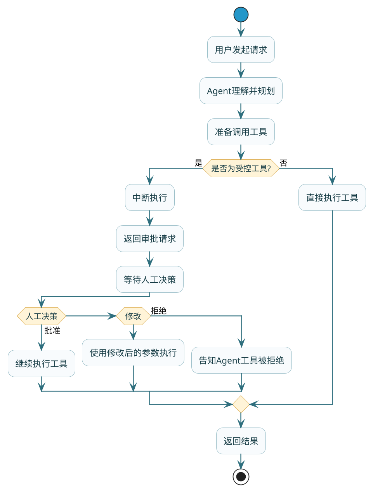
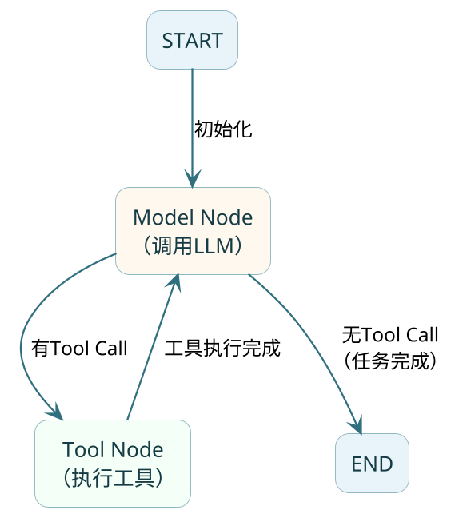
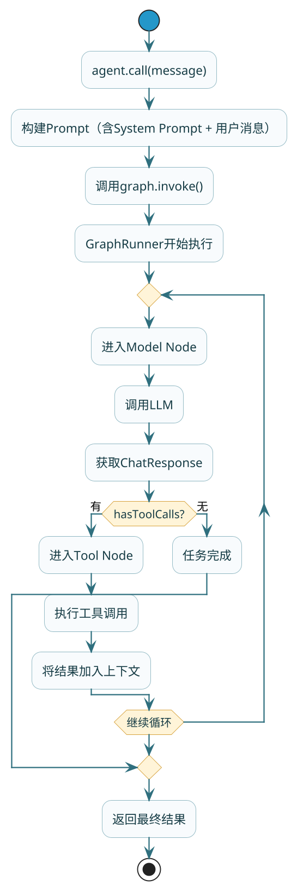

# 进阶特性与源码探秘

前面几篇我们学会了搭建Agent、给它配工具、让它有记忆。但在生产环境中，还有一些关键问题需要解决：

- 敏感操作（如支付、退款）能让Agent自动执行吗？
- 应用重启后，Agent怎么记住之前的对话？
- ReactAgent底层到底是怎么运行的？

这篇我们来逐一攻破。

## 高危操作的安全阀：Human in the Loop

### 为什么需要人工审批

想象一个场景：用户对Agent说"帮我把这个订单退掉"，Agent二话不说就调用退款接口，钱就退了。

这在某些场景下可能是你想要的。但很多时候，我们希望在**执行敏感操作前让人类确认一下**：
- 涉及资金的操作（支付、退款、转账）
- 不可逆的操作（删除数据、发送通知）
- 涉及权限的操作（修改配置、停止服务）

这就是**Human in the Loop（HITL）**——在Agent自动执行的流程中，关键节点让人类介入审批。

### HITL工作流程



### Spring AI Alibaba实现

Spring AI Alibaba通过`HumanInTheLoopHook`实现HITL，整体分三步：配置中断、响应中断、恢复执行。

**第一步：配置哪些工具需要审批**

```java
// 创建HITL Hook，指定哪些工具需要审批
HumanInTheLoopHook hitlHook = HumanInTheLoopHook.builder()
        .approvalOn("process_refund", ToolConfig.builder()
                .description("退款操作需要人工确认")
                .build())
        .approvalOn("process_payment", ToolConfig.builder()
                .description("支付操作需要人工确认")
                .build())
        .build();

// 持久化Saver（HITL需要检查点来处理中断）
MemorySaver saver = new MemorySaver();

// 创建Agent
ReactAgent agent = ReactAgent.builder()
        .name("payment_agent")
        .model(chatModel)
        .tools(refundTool, paymentTool, queryTool)
        .hooks(List.of(hitlHook))
        .saver(saver)
        .build();
```

**第二步：调用Agent，处理中断**

```java
String threadId = "order_session_001";
RunnableConfig config = RunnableConfig.builder()
        .threadId(threadId)
        .build();

// 第一次调用
Optional<NodeOutput> result = agent.invokeAndGetOutput(
        "帮我退掉订单ORD123的款，金额299元",
        config
);

// 检查是否返回中断
if (result.isPresent() && result.get() instanceof InterruptionMetadata) {
    InterruptionMetadata interruption = (InterruptionMetadata) result.get();
    
    // 获取待审批的工具调用信息
    for (InterruptionMetadata.ToolFeedback feedback : interruption.toolFeedbacks()) {
        System.out.println("待审批工具：" + feedback.getName());
        System.out.println("调用参数：" + feedback.getArguments());
        System.out.println("审批说明：" + feedback.getDescription());
        // 输出示例：
        // 待审批工具：process_refund
        // 调用参数：{"orderId": "ORD123", "amount": 299}
        // 审批说明：退款操作需要人工确认
    }
    
    // 这里可以把信息展示给用户，让用户决定
    // 实际场景中可能是弹窗、发通知、进审批流程等
}
```

**第三步：人工决策后恢复执行**

```java
// 假设人工批准了退款
InterruptionMetadata.Builder feedbackBuilder = InterruptionMetadata.builder()
        .nodeId(interruption.node())
        .state(interruption.state());

// 构造审批结果
for (InterruptionMetadata.ToolFeedback toolFeedback : interruption.toolFeedbacks()) {
    InterruptionMetadata.ToolFeedback approved = InterruptionMetadata.ToolFeedback
            .builder(toolFeedback)
            .result(InterruptionMetadata.ToolFeedback.FeedbackResult.APPROVED)
            .build();
    feedbackBuilder.addToolFeedback(approved);
}

InterruptionMetadata approvalMetadata = feedbackBuilder.build();

// 带上审批结果恢复执行
RunnableConfig resumeConfig = RunnableConfig.builder()
        .threadId(threadId)
        .addMetadata(RunnableConfig.HUMAN_FEEDBACK_METADATA_KEY, approvalMetadata)
        .build();

Optional<NodeOutput> finalResult = agent.invokeAndGetOutput("", resumeConfig);
System.out.println("执行结果：" + finalResult.get());
```

### 三种审批结果

人工审批可以返回三种结果：

| 结果 | 说明 | 后续行为 |
|------|------|---------|
| APPROVED | 批准 | 使用原参数执行工具 |
| EDITED | 修改 | 使用修改后的参数执行 |
| REJECTED | 拒绝 | 不执行工具，告知Agent被拒绝原因 |

**修改参数示例**：

```java
// 人工审核时发现金额有误，修改参数后批准
InterruptionMetadata.ToolFeedback edited = InterruptionMetadata.ToolFeedback
        .builder(toolFeedback)
        .result(InterruptionMetadata.ToolFeedback.FeedbackResult.EDITED)
        .arguments("{\"orderId\": \"ORD123\", \"amount\": 199}")  // 修改金额
        .build();
```

**拒绝示例**：

```java
// 人工拒绝退款
InterruptionMetadata.ToolFeedback rejected = InterruptionMetadata.ToolFeedback
        .builder(toolFeedback)
        .result(InterruptionMetadata.ToolFeedback.FeedbackResult.REJECTED)
        .rejectionReason("该订单已超过退款期限，无法退款")
        .build();
```

### 完整示例

```java
@RestController
@RequestMapping("/payment")
public class PaymentAgentController {
    
    @Autowired
    private ChatModel chatModel;
    
    private MemorySaver saver = new MemorySaver();
    
    @PostMapping("/chat")
    public ResponseEntity<?> chat(@RequestBody ChatRequest request) {
        ReactAgent agent = buildAgent();
        RunnableConfig config = RunnableConfig.builder()
                .threadId(request.getSessionId())
                .build();
        
        Optional<NodeOutput> result = agent.invokeAndGetOutput(request.getMessage(), config);
        
        if (result.isPresent() && result.get() instanceof InterruptionMetadata) {
            // 返回需要审批的信息
            InterruptionMetadata meta = (InterruptionMetadata) result.get();
            return ResponseEntity.ok(Map.of(
                    "status", "PENDING_APPROVAL",
                    "pendingTools", meta.toolFeedbacks()
            ));
        }
        
        // 正常返回结果
        return ResponseEntity.ok(Map.of(
                "status", "COMPLETED",
                "response", result.map(Object::toString).orElse("")
        ));
    }
    
    @PostMapping("/approve")
    public ResponseEntity<?> approve(@RequestBody ApprovalRequest request) {
        ReactAgent agent = buildAgent();
        
        // 构造审批结果
        InterruptionMetadata approvalMetadata = buildApprovalMetadata(request);
        
        RunnableConfig config = RunnableConfig.builder()
                .threadId(request.getSessionId())
                .addMetadata(RunnableConfig.HUMAN_FEEDBACK_METADATA_KEY, approvalMetadata)
                .build();
        
        Optional<NodeOutput> result = agent.invokeAndGetOutput("", config);
        
        return ResponseEntity.ok(Map.of(
                "status", "COMPLETED",
                "response", result.map(Object::toString).orElse("")
        ));
    }
    
    private ReactAgent buildAgent() {
        HumanInTheLoopHook hitlHook = HumanInTheLoopHook.builder()
                .approvalOn("process_refund", ToolConfig.builder()
                        .description("退款需要确认").build())
                .build();
        
        return ReactAgent.builder()
                .name("payment_agent")
                .model(chatModel)
                .tools(ToolCallbacks.from(new PaymentTools()))
                .hooks(List.of(hitlHook))
                .saver(saver)
                .build();
    }
}
```

## 让Agent拥有长期记忆

上一篇我们简单提了Memory，这里详细聊聊持久化方案。

### 为什么需要持久化

`MemorySaver`是基于内存的，应用一重启，所有对话历史都没了。生产环境肯定不能这样。

持久化记忆的好处：
- 应用重启后对话可继续
- 支持分布式部署（多实例共享记忆）
- 可做数据分析和审计

### MySQL持久化方案

```java
@Configuration
public class AgentMemoryConfig {
    
    @Bean
    public MysqlSaver mysqlSaver(DataSource dataSource) {
        return new MysqlSaver.Builder()
                .dataSource(dataSource)
                .build();
    }
}

@Service
public class PersistentAgent {
    
    @Autowired
    private ChatModel chatModel;
    
    @Autowired
    private MysqlSaver mysqlSaver;
    
    public String chat(String message, String userId) {
        ReactAgent agent = ReactAgent.builder()
                .name("persistent_agent")
                .model(chatModel)
                .saver(mysqlSaver)
                .build();
        
        RunnableConfig config = RunnableConfig.builder()
                .threadId("user_" + userId)
                .build();
        
        return agent.call(message, config).getText();
    }
}
```

框架会自动创建两张表：

- `graph_thread`：存储会话线程信息
- `graph_checkpoint`：存储对话状态检查点

### 不同Saver对比

| Saver | 特点 | 适用场景 |
|-------|------|---------|
| MemorySaver | 内存存储，速度快 | 开发测试、短期对话 |
| MysqlSaver | MySQL持久化 | 生产环境、需要关系型数据库 |
| PostgresSaver | PostgreSQL持久化 | 生产环境、需要PostgreSQL |
| FileSystemSaver | 文件系统存储 | 单机部署、简单持久化 |

### 自定义Saver

如果内置的Saver不满足需求，可以自己实现：

```java
public class RedisSaver implements BaseSaver {
    
    private RedisTemplate<String, Object> redisTemplate;
    
    @Override
    public void save(String threadId, OverAllState state) {
        redisTemplate.opsForValue().set("agent:state:" + threadId, state);
    }
    
    @Override
    public Optional<OverAllState> load(String threadId) {
        Object state = redisTemplate.opsForValue().get("agent:state:" + threadId);
        return Optional.ofNullable((OverAllState) state);
    }
    
    // ... 其他方法
}
```

## ReactAgent源码原理揭秘

了解原理能帮助你更好地使用框架，遇到问题也知道从哪儿下手排查。

### 整体架构

ReactAgent底层基于**Graph（图）**实现。Graph由**Node（节点）**和**Edge（边）**组成：
- Node：执行具体逻辑的单元
- Edge：定义节点之间的流转规则



核心节点：
- **Model Node**：调用大模型进行推理
- **Tool Node**：执行模型决定调用的工具

### 执行流程

当你调用`agent.call(message)`时，发生了什么？



简单说：
1. 用户输入进来，构建成Prompt
2. 调用LLM，看看返回的是普通文本还是Tool Call
3. 如果有Tool Call，执行工具，把结果加到上下文，再调LLM
4. 如果没有Tool Call，说明任务完成，返回结果
5. 这个循环就是ReAct的"思考→行动→观察"

### 关键源码解读

**1. ReactAgent初始化Graph**

在`ReactAgent.initGraph()`方法中，框架构建了Graph的结构：

```java
// 伪代码，展示核心逻辑
protected void initGraph() {
    // 添加Model节点
    graph.addNode("model", node_async(this::llmNode));
    
    // 添加Tool节点
    if (hasTools) {
        graph.addNode("tool", node_async(this::toolNode));
    }
    
    // 添加边（路由规则）
    graph.addConditionalEdges("model", 
        state -> hasToolCalls(state) ? "tool" : END);
    
    graph.addConditionalEdges("tool", 
        state -> shouldContinue(state) ? "model" : END);
}
```

**2. Model Node执行逻辑**

`AgentLlmNode`的核心是调用大模型：

```java
// 伪代码
public Map<String, Object> apply(OverAllState state, RunnableConfig config) {
    // 构建消息列表
    List<Message> messages = buildMessages(state);
    
    // 调用模型
    ChatResponse response = chatModel.call(new Prompt(messages, chatOptions));
    
    // 更新状态
    state.updateMessage(response.getResult().getOutput());
    
    return state.data();
}
```

**3. Tool Node执行逻辑**

`AgentToolNode`负责执行工具调用：

```java
// 伪代码
public Map<String, Object> apply(OverAllState state, RunnableConfig config) {
    // 获取上一次模型输出中的Tool Calls
    AssistantMessage lastMessage = getLastAssistantMessage(state);
    List<ToolCall> toolCalls = lastMessage.getToolCalls();
    
    // 执行每个工具调用
    List<ToolResponseMessage> responses = new ArrayList<>();
    for (ToolCall call : toolCalls) {
        String result = executeToolCall(call);
        responses.add(new ToolResponseMessage(call.id(), result));
    }
    
    // 将工具结果加入状态
    state.addMessages(responses);
    
    return state.data();
}
```

**4. 边的路由逻辑**

路由决定了节点之间的跳转：

```java
// Model节点后的路由
private String routeAfterModel(OverAllState state) {
    AssistantMessage lastMessage = getLastAssistantMessage(state);
    
    if (lastMessage.hasToolCalls()) {
        return "tool";  // 有Tool Call，去Tool节点
    } else {
        return END;     // 没有Tool Call，结束
    }
}

// Tool节点后的路由
private String routeAfterTool(OverAllState state) {
    // 检查是否有工具标记了return_direct
    if (allToolsReturnDirect(state)) {
        return END;     // 直接返回结果
    }
    return "model";     // 回到Model节点继续推理
}
```

### Hooks是怎么工作的

Hooks通过在Graph中注入额外的节点实现：

```java
// 伪代码
if (hasHooks) {
    // 在Model节点前后插入Hook节点
    graph.addNode("before_model_hook", hookNode);
    graph.addNode("after_model_hook", hookNode);
    
    // 修改边
    graph.addEdge("before_model_hook", "model");
    graph.addEdge("model", "after_model_hook");
}
```

### HITL是怎么实现的

`HumanInTheLoopHook`实现了`InterruptableAction`接口，关键方法是`interrupt()`：

```java
// 伪代码
public Optional<InterruptionMetadata> interrupt(OverAllState state, RunnableConfig config) {
    // 检查是否已有人工反馈
    if (hasHumanFeedback(config)) {
        // 验证反馈是否合法
        if (validateFeedback(config)) {
            return Optional.empty();  // 放行，继续执行
        }
    }
    
    // 检查是否有受控工具被调用
    List<ToolCall> controlledCalls = findControlledToolCalls(state);
    if (!controlledCalls.isEmpty()) {
        // 构造中断元数据
        return Optional.of(buildInterruptionMetadata(controlledCalls));
    }
    
    return Optional.empty();  // 不中断
}
```

`interrupt()`方法在每个节点执行前被调用。如果返回了`InterruptionMetadata`，Graph执行引擎会立即暂停，保存当前状态，等待人工反馈后再恢复。

## 小结

这篇我们深入了Agent的进阶特性：

**Human in the Loop**：
- 用于敏感操作的人工审批
- 三步流程：配置中断→响应中断→恢复执行
- 三种审批结果：APPROVED、EDITED、REJECTED

**长期记忆持久化**：
- MysqlSaver/PostgresSaver用于生产环境
- 框架自动维护`graph_thread`和`graph_checkpoint`表
- 可自定义Saver实现特殊需求

**ReactAgent源码原理**：
- 基于Graph（图）实现
- Model Node负责调用LLM
- Tool Node负责执行工具
- 通过Edge（边）的路由规则控制流转
- Hooks通过在Graph中注入节点实现

理解了这些原理，你就能更自如地使用框架，遇到问题也知道从哪儿排查。

至此，Agent开发实战系列就告一段落了。从概念到架构，从协作到实战，从入门到进阶，希望这几篇能帮你建立起对AI Agent开发的整体认知，在实际项目中能派上用场。
