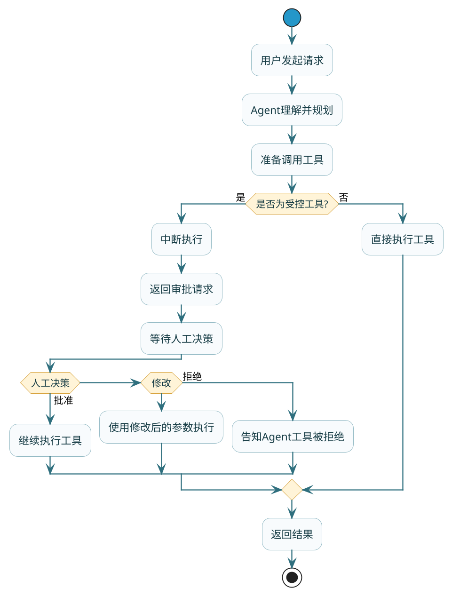

import VipInline from '@site/src/components/VipInline';

# 进阶特性与源码探秘

:::info 注意
本章节比较难，是讨论源码的流程，如果对源码不感兴趣或者不想看源码的同学，可以直接跳过。
:::

前面几篇我们学会了搭建Agent、给它配工具、让它有记忆。但在生产环境中，还有一些关键问题需要解决：

- 敏感操作（如支付、退款）能让Agent自动执行吗？
- 应用重启后，Agent怎么记住之前的对话？
- ReactAgent底层到底是怎么运行的？

这篇我们来逐一攻破。

## 高危操作的安全阀：Human in the Loop

### 为什么需要人工审批

想象一个场景：用户对Agent说"帮我把这个订单退掉"，Agent二话不说就调用退款接口，钱就退了。

这在某些场景下可能是你想要的。但很多时候，我们希望在**执行敏感操作前让人类确认一下**：
- 涉及资金的操作（支付、退款、转账）
- 不可逆的操作（删除数据、发送通知）
- 涉及权限的操作（修改配置、停止服务）

:::warning 高危操作必须人工审批
涉及资金的操作（支付、退款、转账）、不可逆的操作（删除数据、发送通知）、涉及权限的操作（修改配置、停止服务），不应允许 Agent 全自动执行，必须引入 HITL 机制，在关键节点让人类介入审批。
:::

### HITL工作流程



### Spring AI Alibaba实现

Spring AI Alibaba通过`HumanInTheLoopHook`实现HITL，整体分三步：配置中断、响应中断、恢复执行。

**第一步：配置哪些工具需要审批**

```java
// 创建HITL Hook，指定哪些工具需要审批
HumanInTheLoopHook hitlHook = HumanInTheLoopHook.builder()
        .approvalOn("process_refund", ToolConfig.builder()
                .description("退款操作需要人工确认")
                .build())
        .approvalOn("process_payment", ToolConfig.builder()
                .description("支付操作需要人工确认")
                .build())
        .build();

// 持久化Saver（HITL需要检查点来处理中断）
MemorySaver saver = new MemorySaver();

// 创建Agent
ReactAgent agent = ReactAgent.builder()
        .name("payment_agent")
        .model(chatModel)
        .tools(refundTool, paymentTool, queryTool)
        .hooks(List.of(hitlHook))
        .saver(saver)
        .build();
```

**第二步：调用Agent，处理中断**

```java
String threadId = "order_session_001";
RunnableConfig config = RunnableConfig.builder()
        .threadId(threadId)
        .build();

// 第一次调用
Optional<NodeOutput> result = agent.invokeAndGetOutput(
        "帮我退掉订单ORD123的款，金额299元",
        config
);

// 检查是否返回中断
if (result.isPresent() && result.get() instanceof InterruptionMetadata) {
    InterruptionMetadata interruption = (InterruptionMetadata) result.get();
    
    // 获取待审批的工具调用信息
    for (InterruptionMetadata.ToolFeedback feedback : interruption.toolFeedbacks()) {
        System.out.println("待审批工具：" + feedback.getName());
        System.out.println("调用参数：" + feedback.getArguments());
        System.out.println("审批说明：" + feedback.getDescription());
        // 输出示例：
        // 待审批工具：process_refund
        // 调用参数：{"orderId": "ORD123", "amount": 299}
        // 审批说明：退款操作需要人工确认
    }
    
    // 这里可以把信息展示给用户，让用户决定
    // 实际场景中可能是弹窗、发通知、进审批流程等
}
```

**第三步：人工决策后恢复执行**

```java
// 假设人工批准了退款
InterruptionMetadata.Builder feedbackBuilder = InterruptionMetadata.builder()
        .nodeId(interruption.node())
        .state(interruption.state());

// 构造审批结果
for (InterruptionMetadata.ToolFeedback toolFeedback : interruption.toolFeedbacks()) {
    InterruptionMetadata.ToolFeedback approved = InterruptionMetadata.ToolFeedback
            .builder(toolFeedback)
            .result(InterruptionMetadata.ToolFeedback.FeedbackResult.APPROVED)
            .build();
    feedbackBuilder.addToolFeedback(approved);
}

InterruptionMetadata approvalMetadata = feedbackBuilder.build();

// 带上审批结果恢复执行
RunnableConfig resumeConfig = RunnableConfig.builder()
        .threadId(threadId)
        .addMetadata(RunnableConfig.HUMAN_FEEDBACK_METADATA_KEY, approvalMetadata)
        .build();

Optional<NodeOutput> finalResult = agent.invokeAndGetOutput("", resumeConfig);
System.out.println("执行结果：" + finalResult.get());
```

### 三种审批结果

人工审批可以返回三种结果：

| 结果 | 说明 | 后续行为 |
|------|------|---------|
| APPROVED | 批准 | 使用原参数执行工具 |
| EDITED | 修改 | 使用修改后的参数执行 |
| REJECTED | 拒绝 | 不执行工具，告知Agent被拒绝原因 |

**修改参数示例**：

```java
// 人工审核时发现金额有误，修改参数后批准
InterruptionMetadata.ToolFeedback edited = InterruptionMetadata.ToolFeedback
        .builder(toolFeedback)
        .result(InterruptionMetadata.ToolFeedback.FeedbackResult.EDITED)
        .arguments("{\"orderId\": \"ORD123\", \"amount\": 199}")  // 修改金额
        .build();
```

**拒绝示例**：

```java
// 人工拒绝退款
InterruptionMetadata.ToolFeedback rejected = InterruptionMetadata.ToolFeedback
        .builder(toolFeedback)
        .result(InterruptionMetadata.ToolFeedback.FeedbackResult.REJECTED)
        .rejectionReason("该订单已超过退款期限，无法退款")
        .build();
```

### 完整示例

```java
@RestController
@RequestMapping("/payment")
public class PaymentAgentController {
    
    @Autowired
    private ChatModel chatModel;
    
    private MemorySaver saver = new MemorySaver();
    
    @PostMapping("/chat")
    public ResponseEntity<?> chat(@RequestBody ChatRequest request) {
        ReactAgent agent = buildAgent();
        RunnableConfig config = RunnableConfig.builder()
                .threadId(request.getSessionId())
                .build();
        
        Optional<NodeOutput> result = agent.invokeAndGetOutput(request.getMessage(), config);
        
        if (result.isPresent() && result.get() instanceof InterruptionMetadata) {
            // 返回需要审批的信息
            InterruptionMetadata meta = (InterruptionMetadata) result.get();
            return ResponseEntity.ok(Map.of(
                    "status", "PENDING_APPROVAL",
                    "pendingTools", meta.toolFeedbacks()
            ));
        }
        
        // 正常返回结果
        return ResponseEntity.ok(Map.of(
                "status", "COMPLETED",
                "response", result.map(Object::toString).orElse("")
        ));
    }
    
    @PostMapping("/approve")
    public ResponseEntity<?> approve(@RequestBody ApprovalRequest request) {
        ReactAgent agent = buildAgent();
        
        // 构造审批结果
        InterruptionMetadata approvalMetadata = buildApprovalMetadata(request);
        
        RunnableConfig config = RunnableConfig.builder()
                .threadId(request.getSessionId())
                .addMetadata(RunnableConfig.HUMAN_FEEDBACK_METADATA_KEY, approvalMetadata)
                .build();
        
        Optional<NodeOutput> result = agent.invokeAndGetOutput("", config);
        
        return ResponseEntity.ok(Map.of(
                "status", "COMPLETED",
                "response", result.map(Object::toString).orElse("")
        ));
    }
    
    private ReactAgent buildAgent() {
        HumanInTheLoopHook hitlHook = HumanInTheLoopHook.builder()
                .approvalOn("process_refund", ToolConfig.builder()
                        .description("退款需要确认").build())
                .build();
        
        return ReactAgent.builder()
                .name("payment_agent")
                .model(chatModel)
                .tools(ToolCallbacks.from(new PaymentTools()))
                .hooks(List.of(hitlHook))
                .saver(saver)
                .build();
    }
}
```

<VipInline />
