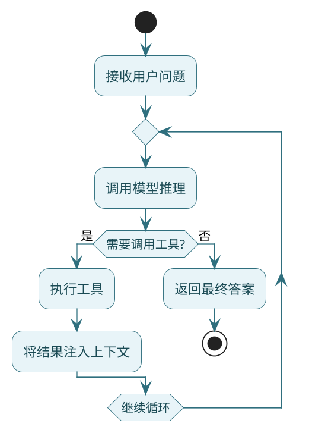
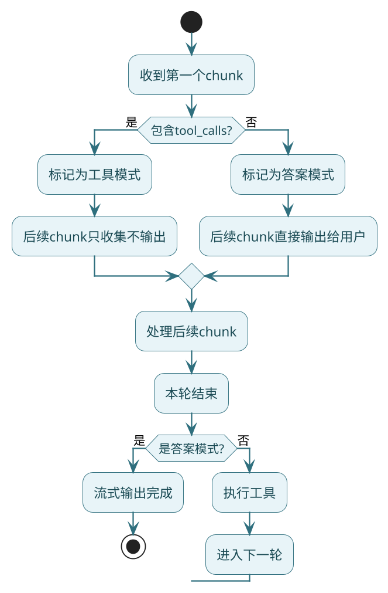

# 底层实战之ReactAgent

**//TODO (待定是否保留)使用SpringAI的能力加上额外手写来实现了ReAct循环逻辑、反思机制、Plan&Execute功能**

上一篇我们用Spring AI Alibaba框架快速搭建了Agent，几行代码就跑起来了。但框架帮你封装了太多细节，你可能还是不太清楚：

- ReAct循环到底是怎么转起来的？
- 模型怎么知道该调工具还是该回答？
- 工具执行完，结果怎么喂回给模型？

这篇我们不用任何Agent框架，**纯手工用Spring AI实现一个完整的ReactAgent**。当你把这套代码跑通后，ReAct对你来说就不再是黑盒了。

## 先搞清楚要做什么

回顾一下ReAct的核心循环：



:::info ReAct 循环本质
用代码的视角来看，ReAct 就是一个`while(true)`循环：
1. 把当前所有消息扔给模型
2. 模型返回结果，看有没有`tool_calls`
3. 有就执行工具，把结果追加到消息列表，继续循环
4. 没有就说明模型给出了最终答案，跳出循环

核心代码不到100行。
:::

## 基础组件设计

一个最小可用的ReactAgent需要这些东西：

```java
public class SimpleReactAgent {
    
    // 系统提示词：告诉模型它是个ReAct Agent
    public static final String REACT_SYSTEM_PROMPT = """
        你是一个遵循ReAct模式的智能助手。
        
        ## 工具调用规则
        1. 需要调用工具时，使用标准的ToolCall格式
        2. 工具调用消息中不要包含任何额外文本
        3. 工具执行结果会自动注入上下文
        
        ## 最终答案规则
        1. 当上下文信息足够时，直接输出自然语言答案
        2. 最终答案不要包含ToolCall格式
        """;
    
    private final String name;
    private final ChatModel chatModel;
    private final List<ToolCallback> tools;
    private final String systemPrompt;
    private final int maxRounds;
    
    private ChatClient chatClient;
}
```

## 关键配置：internalToolExecutionEnabled

:::warning 关键配置：internalToolExecutionEnabled
初始化ChatClient时，有个配置**极其重要**：必须将 `internalToolExecutionEnabled` 设为 `false`。

默认情况下，ChatClient会**自动**帮你执行工具调用——这对简单场景很方便，但对ReAct来说是灾难。ReAct需要**你来控制**每一步，设成`false`后，模型只负责告诉你"我想调什么工具"，至于调不调、怎么调、调完干嘛，全由你说了算。
:::
    ToolCallingChatOptions toolOptions = ToolCallingChatOptions.builder()
            .toolCallbacks(tools)
            .internalToolExecutionEnabled(false)  // 关键！
            .build();
    
    this.chatClient = ChatClient.builder(chatModel)
            .defaultOptions(toolOptions)
            .defaultToolCallbacks(tools)
            .build();
}
```

为什么要设成`false`？

默认情况下，ChatClient会**自动**帮你执行工具调用——模型返回ToolCall后，框架内部就把工具执行了，然后继续调模型，最后给你一个最终结果。这对简单场景很方便，但对ReAct来说是灾难。

ReAct需要**你来控制**每一步：

| 场景 | internalToolExecutionEnabled=true | internalToolExecutionEnabled=false |
|------|-----------------------------------|-------------------------------------|
| 工具执行 | 框架自动执行 | 你手动控制 |
| 循环控制 | 框架内部循环 | 你自己while循环 |
| 状态感知 | 看不到中间过程 | 每一步都清清楚楚 |
| 适用场景 | 简单一次性工具调用 | ReAct多轮推理 |

设成`false`后，模型只负责告诉你"我想调什么工具"，至于调不调、怎么调、调完干嘛，全由你说了算。

## 主流程实现

现在来写核心的call方法。场景是电商客服，帮用户查订单和商品：

```java
public String call(String question) {
    // 初始化消息列表
    List<Message> messages = new ArrayList<>();
    messages.add(new SystemMessage(REACT_SYSTEM_PROMPT));
    messages.add(new SystemMessage(systemPrompt));
    messages.add(new UserMessage(question));
    
    int round = 0;
    
    while (true) {
        round++;
        
        // 防止无限循环
        if (maxRounds > 0 && round > maxRounds) {
            log.warn("达到最大轮次{}，强制输出答案", maxRounds);
            return forceAnswer(messages);
        }
        
        // 调用模型
        ChatClientResponse response = chatClient
                .prompt()
                .messages(messages)
                .call()
                .chatClientResponse();
        
        String aiText = response.chatResponse()
                .getResult()
                .getOutput()
                .getText();
        
        // 判断：有没有工具调用？
        if (!response.chatResponse().hasToolCalls()) {
            // 没有工具调用 = 最终答案
            return aiText;
        }
        
        // 有工具调用，执行它们
        executeToolCalls(response, messages);
    }
}
```

流程很清晰：
1. 构建初始消息
2. 进入循环调模型
3. 没有tool_calls就返回
4. 有tool_calls就执行工具，继续循环

## 工具执行逻辑

工具执行需要注意几个点：

```java
private void executeToolCalls(ChatClientResponse response, List<Message> messages) {
    List<AssistantMessage.ToolCall> toolCalls = response.chatResponse()
            .getResult()
            .getOutput()
            .getToolCalls();
    
    // 先把模型的"决策"记录下来
    // 这很重要！后续推理需要知道之前做过什么决策
    AssistantMessage assistantMsg = AssistantMessage.builder()
            .content("")
            .toolCalls(toolCalls)
            .build();
    messages.add(assistantMsg);
    
    // 逐个执行工具
    for (AssistantMessage.ToolCall tc : toolCalls) {
        String toolName = tc.name();
        String argsJson = tc.arguments();
        
        log.info("执行工具: {}, 参数: {}", toolName, argsJson);
        
        // 找到对应的工具实现
        ToolCallback callback = findTool(toolName);
        if (callback == null) {
            // 工具不存在，告诉模型
            addToolResponse(messages, tc, "错误：工具不存在 - " + toolName);
            continue;
        }
        
        try {
            // 执行工具
            Object result = callback.call(argsJson);
            String resultJson = objectMapper.writeValueAsString(result);
            
            // 把结果追加到消息
            addToolResponse(messages, tc, resultJson);
            
        } catch (Exception e) {
            // 执行失败也要告诉模型
            addToolResponse(messages, tc, "执行失败：" + e.getMessage());
        }
    }
}

private void addToolResponse(List<Message> messages, 
                             AssistantMessage.ToolCall tc, 
                             String result) {
    ToolResponseMessage.ToolResponse tr = new ToolResponseMessage.ToolResponse(
            tc.id(), tc.name(), result);
    
    messages.add(ToolResponseMessage.builder()
            .responses(List.of(tr))
            .build());
}
```

:::caution 工具响应规范
**这里有个坑要注意**：OpenAI规范要求，带有`tool_calls`的`AssistantMessage`后面必须跟`ToolResponseMessage`，否则会报400错误。所以不管工具执行成功还是失败，都要加上ToolResponse。
:::

## 达到最大轮次的处理

当循环次数达到上限时，不能简单地返回空，需要让模型基于已有信息给个答案：

```java
private String forceAnswer(List<Message> messages) {
    // 先确保ToolCall都有对应的Response
    ensureToolCallsClosed(messages);
    
    // 追加提示，让模型强制输出
    messages.add(new UserMessage("""
        你已达到最大推理轮次。
        请基于当前已有信息，直接给出最终答案。
        禁止再调用任何工具。
        如果信息不完整，请合理总结和说明。
        """));
    
    return chatClient.prompt()
            .messages(messages)
            .call()
            .content();
}

private void ensureToolCallsClosed(List<Message> messages) {
    if (messages.isEmpty()) return;
    
    Message last = messages.get(messages.size() - 1);
    if (!(last instanceof AssistantMessage am)) return;
    
    List<AssistantMessage.ToolCall> toolCalls = am.getToolCalls();
    if (toolCalls == null || toolCalls.isEmpty()) return;
    
    // 给每个未响应的ToolCall补上空响应
    List<ToolResponseMessage.ToolResponse> responses = toolCalls.stream()
            .map(tc -> new ToolResponseMessage.ToolResponse(tc.id(), tc.name(), ""))
            .toList();
    
    messages.add(ToolResponseMessage.builder()
            .responses(responses)
            .build());
}
```

## 测试一下：电商客服场景

准备两个工具——查订单和查物流：

```java
public class OrderService {
    
    @Tool(description = "根据订单号查询订单详情")
    public String queryOrder(@ToolParam(description = "订单号") String orderId) {
        // 模拟查询
        return switch (orderId) {
            case "ORD001" -> "订单ORD001：iPhone 15 Pro，金额8999元，状态：已发货";
            case "ORD002" -> "订单ORD002：AirPods Pro，金额1899元，状态：待发货";
            default -> "未找到订单：" + orderId;
        };
    }
}

public class LogisticsService {
    
    @Tool(description = "查询订单的物流信息")
    public String queryLogistics(@ToolParam(description = "订单号") String orderId) {
        return "订单" + orderId + "物流：顺丰快递SF123456，已到达北京分拨中心，预计明天送达";
    }
}
```

跑一下：

```java
public static void main(String[] args) {
    // 初始化ChatModel...
    
    ToolCallback[] tools = ToolCallbacks.from(
            new OrderService(), 
            new LogisticsService()
    );
    
    SimpleReactAgent agent = SimpleReactAgent.builder()
            .name("ecommerce-agent")
            .chatModel(chatModel)
            .tools(Arrays.asList(tools))
            .maxRounds(10)
            .systemPrompt("你是电商客服助手，帮用户查询订单和物流信息。")
            .build();
    
    String answer = agent.call("帮我查下订单ORD001的状态和物流信息");
    System.out.println(answer);
}
```

控制台会看到：
```
执行工具: queryOrder, 参数: {"orderId":"ORD001"}
执行工具: queryLogistics, 参数: {"orderId":"ORD001"}
```

然后输出整合后的答案。

---

# 流式版本实现

非流式版本有个问题：用户要等到所有工具执行完、模型生成完，才能看到结果。对于长回复，体验很差。

流式版本可以边生成边输出，但实现复杂度会上升不少。

## 流式的难点在哪

非流式时，模型一次性返回完整结果，你很容易判断：有tool_calls就执行工具，没有就是最终答案。

流式时，数据是一个个chunk到达的：
- 文本是一点点吐出来的
- tool_calls也是分段到达的
- **你不知道当前这个chunk是最终答案的一部分，还是工具调用的参数**

所以需要一个**状态管理器**来跟踪每一轮的模式。

## 轮次状态设计

```java
// 每一轮的状态
private static class RoundState {
    RoundMode mode = RoundMode.UNKNOWN;      // 当前轮次是什么模式
    boolean firstChunkHandled = false;        // 第一个chunk是否处理过
    StringBuilder textBuffer = new StringBuilder();
    List<AssistantMessage.ToolCall> toolCalls = new ArrayList<>();
}

private enum RoundMode {
    UNKNOWN,       // 还不知道
    FINAL_ANSWER,  // 最终答案模式
    TOOL_CALL      // 工具调用模式
}
```

**判断逻辑**：看第一个chunk。如果第一个chunk里有tool_calls，那整个轮次就是工具模式；否则就是最终答案模式。



## 流式主流程

```java
public Flux<String> stream(String question) {
    List<Message> messages = new ArrayList<>();
    messages.add(new SystemMessage(REACT_SYSTEM_PROMPT));
    messages.add(new SystemMessage(systemPrompt));
    messages.add(new UserMessage(question));
    
    // Sink：用于向外推送流式内容
    Sinks.Many<String> sink = Sinks.many().unicast().onBackpressureBuffer();
    
    AtomicLong roundCounter = new AtomicLong(0);
    AtomicBoolean finished = new AtomicBoolean(false);
    
    // 启动第一轮
    scheduleRound(messages, sink, roundCounter, finished);
    
    return sink.asFlux();
}

private void scheduleRound(List<Message> messages, 
                           Sinks.Many<String> sink,
                           AtomicLong roundCounter,
                           AtomicBoolean finished) {
    roundCounter.incrementAndGet();
    RoundState state = new RoundState();
    
    chatClient.prompt()
            .messages(messages)
            .stream()
            .chatResponse()
            .publishOn(Schedulers.boundedElastic())  // 异步处理
            .doOnNext(chunk -> processChunk(chunk, sink, state))
            .doOnComplete(() -> finishRound(messages, sink, state, 
                                            roundCounter, finished))
            .doOnError(err -> {
                finished.set(true);
                sink.tryEmitError(err);
            })
            .subscribe();
}
```

:::tip 流式实现关键点
`publishOn(Schedulers.boundedElastic())`很重要——它让模型输出和我们的处理逻辑在不同线程执行，避免处理逻辑阻塞模型输出。

**判断逻辑**：看第一个chunk。如果第一个chunk里有tool_calls，那整个轮次就是工具模式；否则就是最终答案模式，直接实时推送给用户。
:::

## 处理每个chunk

```java
private void processChunk(ChatResponse chunk, 
                          Sinks.Many<String> sink, 
                          RoundState state) {
    if (chunk == null || chunk.getResult() == null) return;
    
    String text = chunk.getResult().getOutput().getText();
    List<AssistantMessage.ToolCall> tc = chunk.getResult()
            .getOutput()
            .getToolCalls();
    
    // 第一个chunk：决定这一轮的模式
    if (!state.firstChunkHandled) {
        state.firstChunkHandled = true;
        
        if (tc != null && !tc.isEmpty()) {
            // 有tool_calls -> 工具模式
            state.mode = RoundMode.TOOL_CALL;
            state.toolCalls.addAll(tc);
            return;
        }
        
        // 没有tool_calls -> 答案模式，直接输出
        state.mode = RoundMode.FINAL_ANSWER;
        if (text != null) {
            sink.tryEmitNext(text);
        }
        return;
    }
    
    // 后续chunk：根据模式处理
    switch (state.mode) {
        case FINAL_ANSWER -> {
            // 答案模式：直接输出
            if (text != null) {
                sink.tryEmitNext(text);
            }
        }
        case TOOL_CALL -> {
            // 工具模式：收集但不输出
            if (text != null) state.textBuffer.append(text);
            if (tc != null) state.toolCalls.addAll(tc);
        }
    }
}
```

## 轮次结束处理

```java
private void finishRound(List<Message> messages,
                         Sinks.Many<String> sink,
                         RoundState state,
                         AtomicLong roundCounter,
                         AtomicBoolean finished) {
    
    // 答案模式 -> 完成
    if (state.mode == RoundMode.FINAL_ANSWER) {
        sink.tryEmitComplete();
        finished.set(true);
        return;
    }
    
    // 工具模式 -> 执行工具，然后下一轮
    AssistantMessage assistantMsg = AssistantMessage.builder()
            .content(state.textBuffer.toString())
            .toolCalls(state.toolCalls)
            .build();
    messages.add(assistantMsg);
    
    // 检查轮次限制
    if (maxRounds > 0 && roundCounter.get() >= maxRounds) {
        forceStreamFinish(messages, sink, finished);
        return;
    }
    
    // 并发执行工具
    executeToolCallsAsync(state.toolCalls, messages, () -> {
        if (!finished.get()) {
            // 工具执行完，进入下一轮
            scheduleRound(messages, sink, roundCounter, finished);
        }
    });
}
```

## 并发执行工具

流式场景下，可以让多个工具并发执行，提升效率：

```java
private void executeToolCallsAsync(List<AssistantMessage.ToolCall> toolCalls,
                                   List<Message> messages,
                                   Runnable onComplete) {
    AtomicInteger completed = new AtomicInteger(0);
    int total = toolCalls.size();
    
    for (AssistantMessage.ToolCall tc : toolCalls) {
        Schedulers.boundedElastic().schedule(() -> {
            try {
                ToolCallback callback = findTool(tc.name());
                String result = callback != null 
                        ? callback.call(tc.arguments()).toString()
                        : "工具不存在：" + tc.name();
                
                synchronized (messages) {
                    messages.add(ToolResponseMessage.builder()
                            .responses(List.of(
                                    new ToolResponseMessage.ToolResponse(
                                            tc.id(), tc.name(), result)))
                            .build());
                }
            } finally {
                // 最后一个工具执行完，触发回调
                if (completed.incrementAndGet() >= total) {
                    onComplete.run();
                }
            }
        });
    }
}
```

## 流式效果演示

```java
agent.stream("查询订单ORD001的详情和物流")
        .doOnNext(chunk -> System.out.print(chunk))  // 实时输出
        .doOnComplete(() -> System.out.println("\n=== 完成 ==="))
        .blockLast();
```

你会看到文字一个个蹦出来，而不是等半天才一次性显示。

## 真流式 vs 假流式

有些实现是"假流式"：用非流式拿到完整结果，然后切成小段模拟打字机效果。这种做法：

| 对比项 | 真流式 | 假流式 |
|--------|--------|--------|
| 首字延迟 | 低（边生成边输出） | 高（等全部生成完） |
| 工具调用 | 可以实时感知 | 全部完成后才看到 |
| 用户体验 | 响应快 | 等待久 |
| 实现复杂度 | 高 | 低 |

真流式虽然实现复杂，但用户体验好得多。

## 小结

这篇我们不用框架，从零实现了ReactAgent：

**核心收获**：
1. **internalToolExecutionEnabled(false)** 是ReAct能跑起来的前提
2. ReAct循环本质是`while(true)` + 判断是否有tool_calls
3. 消息列表`messages`是Agent的状态容器，贯穿整个执行过程
4. 流式实现需要状态管理，第一个chunk决定当前轮次的模式

**代码结构**：
- 非流式：`while(true)` + `hasToolCalls()`判断
- 流式：`RoundState`状态管理 + 递归`scheduleRound`

理解了这套实现，再去看任何Agent框架的源码，都会清晰很多。下一篇，我们在这个基础上加入反思机制，让Agent能自我检查和修正答案。
