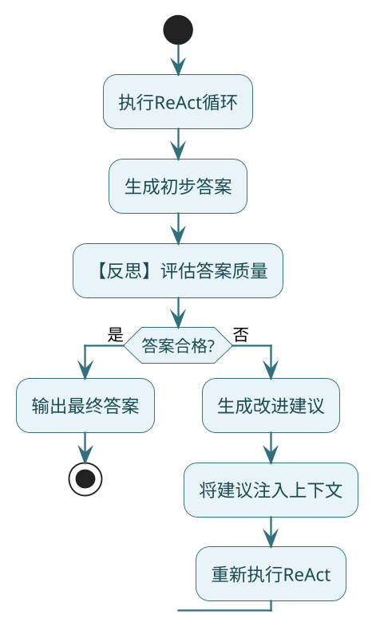
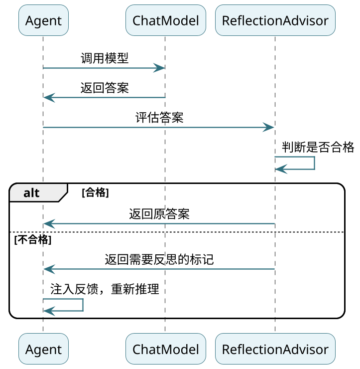

# 底层实战之ReflectionAgent

**//TODO (待定是否保留)使用SpringAI的能力加上额外手写来实现了ReAct循环逻辑、反思机制、Plan&Execute功能**

上一篇我们手搓了ReactAgent，它能正常推理和调用工具。但有个问题：**Agent给出的答案质量如何，它自己不知道**。

想象一下这个场景：
- 用户问"帮我分析一下这个订单有没有问题"
- Agent查了订单信息，给了个回答
- 但这个回答可能漏掉了关键信息，或者逻辑不够清晰

如果Agent能在输出前先"审视"一下自己的答案，发现问题了再改进，那质量不就上去了吗？这就是**反思机制（Reflection）**的核心思想。

## 反思机制是什么

简单说，就是让Agent具备"自我批判"能力：



:::info 反思机制核心思想
反思机制就是让Agent具备"自我批判"能力：

- **ReactAgent**：想一步做一步，想到答案就输出
- **ReflectionAgent**：想到答案先自己检查一遍，不合格就重新想

反思机制会增加响应时间，所以要根据场景选择：
- 需要高质量输出（报告、分析）→ 用反思
- 追求响应速度（简单问答）→ 不用反思
:::

## 架构设计：基于Advisor实现

Spring AI提供了Advisor机制——在模型调用前后插入自定义逻辑。反思正好适合放在"模型调用后"这个位置：



整体设计分两层：
1. **ReflectionAdvisor**：负责评估答案，给出"通过/不通过"的结论
2. **ReflectionAgent**：包装ReactAgent，管理反思轮次

## ReflectionAdvisor实现

Advisor是核心，它拦截模型输出，调用另一次模型来评估答案质量：

```java
public class ReflectionAdvisor implements CallAdvisor {
    
    private static final String REFLECTION_PROMPT = """
        你是一个严格的答案评估专家。
        
        请判断【当前回答】是否充分、准确地回答了【用户问题】。
        
        评估标准：
        1. 信息是否完整
        2. 逻辑是否清晰
        3. 结论是否可靠
        4. 表达是否符合要求
        
        【只能输出JSON，格式如下】
        {
          "passed": true或false,
          "feedback": "如果passed=false，给出简明的改进建议；否则为null"
        }
        
        禁止输出任何额外文本。
        """;
    
    private final ChatModel reflectionModel;
    
    @Override
    public ChatClientResponse adviseCall(ChatClientRequest request,
                                         CallAdvisorChain chain) {
        // 先让模型正常执行
        ChatClientResponse response = chain.nextCall(request);
        
        // 如果是工具调用，不做反思（工具还没执行完）
        if (response.chatResponse() != null 
                && response.chatResponse().hasToolCalls()) {
            return response;
        }
        
        // 获取模型的回答
        String answer = response.chatResponse()
                .getResult()
                .getOutput()
                .getText();
        
        // 获取用户原始问题
        String question = extractQuestion(request.prompt());
        
        // 调用反思模型评估
        ReflectionResult result = evaluate(question, answer);
        
        if (result.passed()) {
            // 合格，直接返回
            return response;
        }
        
        // 不合格，标记需要反思
        return response.mutate()
                .context("reflection.required", true)
                .context("reflection.feedback", result.feedback())
                .build();
    }
    
    private ReflectionResult evaluate(String question, String answer) {
        Prompt prompt = new Prompt(List.of(
                new SystemMessage(REFLECTION_PROMPT),
                new UserMessage("""
                    ## 用户问题
                    %s
                    
                    ## 当前回答
                    %s
                    """.formatted(question, answer))
        ));
        
        String json = reflectionModel.call(prompt)
                .getResult()
                .getOutput()
                .getText();
        
        // 解析JSON
        return objectMapper.readValue(json, ReflectionResult.class);
    }
    
    @Override
    public String getName() {
        return "ReflectionAdvisor";
    }
    
    @Override
    public int getOrder() {
        return 50;  // 在其他Advisor之后执行
    }
}

public record ReflectionResult(
        @JsonProperty("passed") boolean passed,
        @JsonProperty("feedback") String feedback
) {}
```

:::note Advisor 核心逻辑
Advisor的核心逻辑：
1. 先让模型正常执行，拿到回答
2. 如果是工具调用阶段，跳过反思
3. 调用反思模型评估答案
4. 通过就返回，不通过就标记context
:::

## 改造ReactAgent支持反思

接下来改造上一篇的SimpleReactAgent，让它能识别反思标记并重新推理：

```java
public String callInternal(String conversationId, String question) {
    List<Message> messages = new ArrayList<>();
    messages.add(new SystemMessage(REACT_SYSTEM_PROMPT));
    messages.add(new SystemMessage(systemPrompt));
    messages.add(new UserMessage(question));
    
    int reflectionRound = 0;  // 反思轮次计数
    int round = 0;
    
    while (true) {
        round++;
        
        if (maxRounds > 0 && round > maxRounds) {
            return forceAnswer(messages);
        }
        
        ChatClientResponse response = chatClient
                .prompt()
                .messages(messages)
                .call()
                .chatClientResponse();
        
        String aiText = response.chatResponse()
                .getResult()
                .getOutput()
                .getText();
        
        // 没有工具调用，准备输出
        if (!response.chatResponse().hasToolCalls()) {
            
            // 【关键】检查是否需要反思
            if (maxReflectionRounds > 0 
                    && Boolean.TRUE.equals(
                            response.context().get("reflection.required"))) {
                
                reflectionRound++;
                log.info("反思第{}轮，答案未通过评估", reflectionRound);
                
                // 达到反思上限，强制输出
                if (reflectionRound >= maxReflectionRounds) {
                    log.warn("达到最大反思轮次，强制输出");
                    return aiText;
                }
                
                // 获取反馈，注入上下文
                String feedback = (String) response.context()
                        .get("reflection.feedback");
                
                messages.add(new AssistantMessage("""
                    【反思反馈】
                    %s
                    
                    请根据以上反馈重新思考，
                    必要时可以重新调用工具获取更多信息，
                    然后给出更完善的答案。
                    """.formatted(feedback)));
                
                continue;  // 重新进入循环
            }
            
            // 反思通过或未启用反思，输出答案
            return aiText;
        }
        
        // 有工具调用，执行工具
        executeToolCalls(response, messages);
    }
}
```

改动不大，核心就是在"准备输出答案"的位置加了反思检查。

## ReflectionAgent封装

为了使用方便，封装一个ReflectionAgent类：

```java
public class ReflectionAgent {
    
    private final SimpleReactAgent delegate;
    
    private ReflectionAgent(SimpleReactAgent delegate) {
        this.delegate = delegate;
    }
    
    public String call(String question) {
        return delegate.call(question);
    }
    
    public static Builder builder() {
        return new Builder();
    }
    
    public static class Builder {
        private String name = "reflection-agent";
        private ChatModel chatModel;
        private List<ToolCallback> tools = new ArrayList<>();
        private String systemPrompt = "";
        private int maxReflectionRounds = 1;  // 默认反思1次
        private int maxRounds = 10;
        
        public Builder chatModel(ChatModel chatModel) {
            this.chatModel = chatModel;
            return this;
        }
        
        public Builder tools(ToolCallback... tools) {
            this.tools = Arrays.asList(tools);
            return this;
        }
        
        public Builder maxReflectionRounds(int rounds) {
            this.maxReflectionRounds = rounds;
            return this;
        }
        
        public Builder systemPrompt(String prompt) {
            this.systemPrompt = prompt;
            return this;
        }
        
        public ReflectionAgent build() {
            // 创建反思Advisor
            ReflectionAdvisor reflectionAdvisor = 
                    new ReflectionAdvisor(chatModel);
            
            // 构建带反思能力的ReactAgent
            SimpleReactAgent reactAgent = SimpleReactAgent.builder()
                    .name(name)
                    .chatModel(chatModel)
                    .tools(tools)
                    .advisors(List.of(reflectionAdvisor))
                    .maxReflectionRounds(maxReflectionRounds)
                    .maxRounds(maxRounds)
                    .systemPrompt(systemPrompt)
                    .build();
            
            return new ReflectionAgent(reactAgent);
        }
    }
}
```

## 系统提示词增强

加入反思机制后，系统提示词也要相应调整：

```java
public static final String REACT_SYSTEM_PROMPT = """
    你是一个遵循ReAct模式的智能助手。
    
    ## 工具调用规则
    1. 需要调用工具时，使用标准的ToolCall格式
    2. 工具调用消息中不要包含任何额外文本
    
    ## 最终答案规则
    1. 当上下文信息足够时，直接输出自然语言答案
    2. 最终答案不要包含ToolCall格式
    
    ## 反思机制（重要）
    如果你收到【反思反馈】，说明之前的回答有不足。请：
    1. 认真阅读反馈内容
    2. 必要时重新调用工具获取更多信息
    3. 给出更完整、更准确的答案
    
    即使信息不完全，也要尽量给出有价值的回答，
    并说明哪些信息是基于推断的。
    """;
```

## 测试一下：订单异常分析场景

这个场景很适合反思：用户想知道订单是否有问题，Agent需要综合分析。

```java
public class OrderAnalysisService {
    
    @Tool(description = "查询订单基本信息")
    public String queryOrderInfo(
            @ToolParam(description = "订单号") String orderId) {
        return """
            订单号：%s
            商品：蓝牙耳机 Pro
            金额：299元
            下单时间：2024-01-15 10:30:00
            状态：已发货
            """.formatted(orderId);
    }
    
    @Tool(description = "查询订单的物流轨迹")
    public String queryLogistics(
            @ToolParam(description = "订单号") String orderId) {
        return """
            物流轨迹：
            - 01-15 11:00 仓库发货
            - 01-15 18:00 到达北京分拨中心
            - 01-16 09:00 派送中
            - 01-16 14:00 签收（代收点）
            """;
    }
    
    @Tool(description = "查询用户的收货地址")
    public String queryAddress(
            @ToolParam(description = "订单号") String orderId) {
        return "收货地址：北京市朝阳区xxx街道xxx小区1号楼101";
    }
}
```

使用ReflectionAgent：

```java
public static void main(String[] args) {
    // 初始化ChatModel...
    
    ToolCallback[] tools = ToolCallbacks.from(new OrderAnalysisService());
    
    ReflectionAgent agent = ReflectionAgent.builder()
            .chatModel(chatModel)
            .tools(tools)
            .maxReflectionRounds(2)  // 最多反思2次
            .systemPrompt("你是订单分析专家，帮用户分析订单是否存在异常。")
            .build();
    
    String question = "帮我看看订单ORD12345有没有问题，我好像还没收到货";
    
    String answer = agent.call(question);
    System.out.println(answer);
}
```

## 执行过程分析

看看控制台日志，理解反思是怎么工作的：

```
执行工具: queryOrderInfo, 参数: {"orderId":"ORD12345"}
执行工具: queryLogistics, 参数: {"orderId":"ORD12345"}

[第一轮回答]
根据查询，您的订单已于1月16日签收，签收地点是代收点。

[反思评估]
passed: false
feedback: 用户说没收到货，但系统显示已签收。答案应该分析这个矛盾，
         并给出可能的原因和建议，而不是简单陈述签收状态。

反思第1轮，答案未通过评估

[第二轮回答，注入了反馈]
执行工具: queryAddress, 参数: {"orderId":"ORD12345"}

分析结果：
1. 系统显示订单已于1月16日14:00签收，签收地点是代收点
2. 您反馈还没收到货，可能的原因：
   - 包裹在代收点，还没取
   - 代收点误签收
   - 包裹被他人取走

建议：
1. 先去您附近的代收点（菜鸟驿站/快递柜）查看
2. 如果代收点没有，联系快递员确认
3. 确认丢失可申请理赔

[反思评估]
passed: true

最终输出第二轮答案
```

可以看到：
1. 第一轮回答太简单，反思没通过
2. 反思给出了具体改进建议
3. 第二轮Agent主动多查了一个工具，回答更完善
4. 反思通过，输出最终答案

## 反思轮次的权衡

`maxReflectionRounds`设多少合适？

| 设置 | 优点 | 缺点 |
|------|------|------|
| 0（不反思） | 响应快 | 答案质量不稳定 |
| 1 | 大部分情况够用 | 复杂问题可能不够 |
| 2~3 | 质量明显提升 | 响应时间翻倍 |
| >3 | 收益递减 | 太慢，成本高 |

:::tip 反思轮次设置建议
`maxReflectionRounds`设多少合适？建议：
- 简单问答场景：0或1
- 分析报告场景：2
- 关键决策场景：3

超过3次后收益递减，响应时间和成本都会显著增加。
:::

## 扩展：Advisor还能做什么

Advisor不只是反思，还可以做很多事：

```java
// 日志记录
public class LoggingAdvisor implements CallAdvisor {
    @Override
    public ChatClientResponse adviseCall(ChatClientRequest request,
                                         CallAdvisorChain chain) {
        log.info("请求: {}", extractLastMessage(request));
        ChatClientResponse response = chain.nextCall(request);
        log.info("响应: {}", response.chatResponse().getResult()
                .getOutput().getText());
        return response;
    }
}

// 敏感词过滤
public class SensitiveFilterAdvisor implements CallAdvisor {
    @Override
    public ChatClientResponse adviseCall(ChatClientRequest request,
                                         CallAdvisorChain chain) {
        // 前置检查
        if (containsSensitiveWord(request)) {
            return blockedResponse("检测到敏感内容");
        }
        
        ChatClientResponse response = chain.nextCall(request);
        
        // 后置过滤
        return filterSensitiveContent(response);
    }
}

// 上下文压缩（防止对话太长）
public class ContextCompressAdvisor implements CallAdvisor {
    @Override
    public ChatClientResponse adviseCall(ChatClientRequest request,
                                         CallAdvisorChain chain) {
        if (request.prompt().getInstructions().size() > 50) {
            request = compressContext(request);
        }
        return chain.nextCall(request);
    }
}
```

:::tip Advisor 扩展能力
Advisor不只是反思，还可以做很多事：日志记录、敏感词过滤、上下文压缩（防止对话太长）等。这种责任链模式让Agent的能力扩展变得很灵活。
:::

## 小结

这篇我们基于ReactAgent实现了反思机制：

**核心思路**：
- 用Advisor在模型输出后拦截
- 调用反思模型评估答案质量
- 不合格则注入反馈，重新推理

**关键改动**：
- ReflectionAdvisor：评估答案，给出反馈
- ReactAgent增加反思检查和轮次控制
- 系统提示词引导Agent处理反思反馈

**适用场景**：
- 需要高质量输出的任务
- 复杂分析、报告生成
- 对响应时间不敏感的场景

下一篇，我们实现Plan & Execute架构——适合处理更复杂、多步骤的任务。
