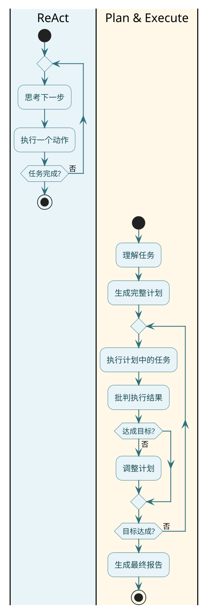
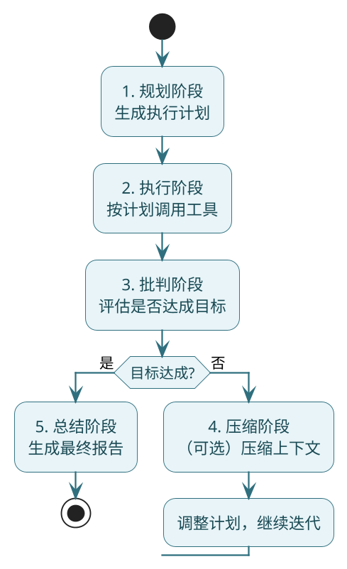

# 底层实战之PlanExecuteAgent

**//TODO (待定是否保留)使用SpringAI的能力加上额外手写来实现了ReAct循环逻辑、反思机制、Plan&Execute功能**

前面实现的ReactAgent是"边想边做"——想一步做一步，适合简单任务。但遇到复杂任务时，这种模式就有点力不从心了：

- 任务有多个步骤，需要全局规划
- 有些步骤可以并行，有些必须串行
- 中间可能出错，需要自我修正
- 最终要输出一份完整的分析报告

这时候需要另一种架构：**Plan & Execute（先规划，再执行）**。

## 两种架构的对比



| 维度 | ReAct | Plan & Execute |
|------|-------|----------------|
| 决策方式 | 逐步决策 | 先全局规划 |
| 并行能力 | 无 | 支持 |
| 自我修正 | 弱 | 强（批判机制） |
| 适合任务 | 简单、即时 | 复杂、多步骤 |
| 响应时间 | 快 | 慢但质量高 |

## 整体架构设计

Plan & Execute分为6个阶段：



## 全局状态设计

整个Agent的运行围绕一个**全局状态**展开，它记录了用户目标、执行历史、每轮结果：

```java
public class OverAllState {
    // 用户原始问题
    private final String question;
    
    // 执行过程中的所有消息
    private final List<Message> messages = new ArrayList<>();
    
    // 每轮执行的结果
    private final List<PlanRoundState> rounds = new ArrayList<>();
    
    // 当前轮次
    private int round = 0;
    
    public void nextRound() {
        this.round++;
    }
    
    public void add(Message message) {
        this.messages.add(message);
    }
    
    public int currentChars() {
        return messages.stream()
                .mapToInt(m -> m.getText() == null ? 0 : m.getText().length())
                .sum();
    }
}

// 单轮执行状态
public record PlanRoundState(
        int round,                        // 第几轮
        List<PlanTask> plan,              // 这轮的计划
        Map<String, TaskResult> results,  // 执行结果
        CritiqueResult critique           // 批判结论
) {}

// 执行计划中的任务
public record PlanTask(
        String id,           // 任务ID
        String instruction,  // 任务指令
        int order            // 执行顺序（相同order可并行）
) {}

// 批判结果
public record CritiqueResult(
        boolean passed,      // 是否通过
        String feedback      // 改进建议
) {}

// 任务执行结果
public record TaskResult(
        String taskId,
        boolean success,
        String output,
        String error
) {}
```

为什么要这么设计？因为Plan & Execute是**多轮、非线性**的。不像ReAct那样简单地堆叠消息，这里需要明确记录：
- 这一轮规划了什么任务
- 每个任务的执行结果
- 批判给出了什么反馈

这些结构化信息是后续调整计划、最终总结的基础。

## 规划阶段

规划阶段不执行任何工具，只做一件事：**基于当前状态，决定接下来要做什么**。

```java
private List<PlanTask> generatePlan(OverAllState state) {
    String toolDesc = renderToolDescriptions();
    
    Prompt prompt = new Prompt(List.of(
            new SystemMessage("""
                你是【执行计划生成器】。
                当前是第 %s 轮迭代。
                
                ## 你的职责
                1. 判断是否需要调用工具来推进任务
                2. 如果不需要，返回"无需执行"
                3. 如果需要，生成工具调用计划
                
                ## 规则（必须遵守）
                1. 每个任务必须对应一个具体工具
                2. instruction中必须包含工具名称
                3. 禁止规划"总结""分析"这类不调用工具的任务
                4. order相同的任务可以并行执行
                5. order不同的任务串行执行（小的先执行）
                
                ## 可用工具
                %s
                
                ## 输出格式（严格JSON）
                示例1 - 无需工具：
                [{"id": null, "instruction": "无需调用工具", "order": 0}]
                
                示例2 - 并行任务：
                [
                  {"id": "task-1", "instruction": "调用queryOrder查询订单ORD001", "order": 1},
                  {"id": "task-2", "instruction": "调用queryInventory查询库存", "order": 1}
                ]
                
                示例3 - 串行任务：
                [
                  {"id": "task-1", "instruction": "调用queryOrder查询订单", "order": 1},
                  {"id": "task-2", "instruction": "根据task-1结果，调用queryLogistics查询物流", "order": 2}
                ]
                """.formatted(state.getRound(), toolDesc)),
            new UserMessage(renderMessages(state.getMessages()))
    ));
    
    String json = chatModel.call(prompt)
            .getResult()
            .getOutput()
            .getText();
    
    return parseJsonArray(json, PlanTask.class);
}
```

**关键点**：
- 规划器只生成"工具调用型"任务
- 不能生成"写报告""总结"这种纯文本任务
- 支持并行（order相同）和串行（order递增）

## 执行阶段

拿到计划后，按order分组执行：

```java
private Map<String, TaskResult> executePlan(List<PlanTask> plan,
                                            OverAllState state) {
    Map<String, TaskResult> results = new ConcurrentHashMap<>();
    
    // 按order分组
    Map<Integer, List<PlanTask>> grouped = plan.stream()
            .collect(Collectors.groupingBy(PlanTask::order));
    
    // 存储已执行任务的结果，供后续任务依赖
    Map<String, String> accumulatedResults = new ConcurrentHashMap<>();
    
    // 按order顺序执行（不同order串行）
    for (Integer order : new TreeSet<>(grouped.keySet())) {
        String dependencySnapshot = renderDependencySnapshot(accumulatedResults);
        List<PlanTask> tasks = grouped.get(order);
        
        // 同一个order的任务并行执行
        List<CompletableFuture<Void>> futures = tasks.stream()
                .map(task -> CompletableFuture.runAsync(() -> {
                    if (task.id() == null) return;
                    
                    try {
                        semaphore.acquire();  // 限制并发数
                        
                        TaskResult result = executeWithRetry(task, dependencySnapshot);
                        results.put(task.id(), result);
                        
                        if (result.success()) {
                            accumulatedResults.put(task.id(), result.output());
                        }
                        
                        // 记录到状态
                        state.add(new AssistantMessage("""
                            【任务完成】
                            taskId: %s
                            success: %s
                            result: %s
                            """.formatted(task.id(), result.success(), 
                                    result.success() ? result.output() : result.error())));
                        
                    } catch (InterruptedException e) {
                        Thread.currentThread().interrupt();
                    } finally {
                        semaphore.release();
                    }
                }))
                .toList();
        
        // 等待当前order的任务全部完成
        CompletableFuture.allOf(futures.toArray(new CompletableFuture[0])).join();
    }
    
    return results;
}
```

**关键点**：
- order相同的任务并行执行（用CompletableFuture）
- order不同的任务串行执行（等上一组完成才开始下一组）
- 用信号量限制并发数，防止工具调用太多
- 每个任务的结果都记录到状态里

单个任务的执行复用之前的ReactAgent：

```java
private TaskResult executeWithRetry(PlanTask task, String dependencySnapshot) {
    int attempt = 0;
    Exception lastError = null;
    
    while (attempt < maxToolRetries) {
        attempt++;
        try {
            // 复用ReactAgent执行单个任务
            SimpleReactAgent agent = SimpleReactAgent.builder()
                    .chatModel(chatModel)
                    .tools(tools)
                    .maxRounds(5)
                    .systemPrompt("你是工具执行助手，只执行指定的任务。")
                    .build();
            
            String result = agent.call("""
                【前置任务结果】
                %s
                
                【当前任务】
                %s
                """.formatted(
                    dependencySnapshot.isBlank() ? "无" : dependencySnapshot,
                    task.instruction()
                ));
            
            return new TaskResult(task.id(), true, result, null);
            
        } catch (Exception e) {
            lastError = e;
            log.warn("任务{}执行失败，第{}次重试", task.id(), attempt);
        }
    }
    
    return new TaskResult(task.id(), false, null, 
            lastError != null ? lastError.getMessage() : "未知错误");
}
```

## 批判阶段

执行完一轮后，需要判断：**目标达成了吗？**

```java
private CritiqueResult critique(OverAllState state) {
    Prompt prompt = new Prompt(List.of(
            new SystemMessage("""
                你是【任务批判评估专家】。
                基于完整的执行上下文，判断用户目标是否已经满足。
                
                评估标准：
                1. 用户问题是否被完整回答
                2. 所有必要的信息是否已获取
                3. 是否还有未解决的问题
                
                输出格式（严格JSON）：
                {
                  "passed": true或false,
                  "feedback": "如果未通过，给出明确的改进建议"
                }
                """),
            new UserMessage(renderMessages(state.getMessages()))
    ));
    
    String json = chatModel.call(prompt)
            .getResult()
            .getOutput()
            .getText();
    
    return parseJson(json, CritiqueResult.class);
}
```

批判阶段很关键——它决定了Agent是继续迭代还是输出结果。

## 上下文压缩

多轮迭代后，消息会越来越多，可能超出模型上下文限制。需要"压缩"：

```java
private void compressIfNeeded(OverAllState state) {
    if (state.currentChars() < contextCharLimit) {
        return;  // 没超限，不压缩
    }
    
    log.warn("上下文过长({}字符)，开始压缩", state.currentChars());
    
    Prompt prompt = new Prompt(List.of(
            new SystemMessage("""
                你是【上下文压缩器】。
                
                压缩目标：
                在不丢失关键信息的前提下，
                将当前上下文压缩到支持下一轮正确决策的最小状态。
                
                压缩上限：%s 字符（硬性限制）
                
                必须保留的信息：
                1. 用户原始目标
                2. 已完成任务的关键结论
                3. 工具执行的关键结果（数据、事实）
                4. 最近一次批判反馈
                5. 当前未解决的问题
                
                压缩规则：
                - 删除冗余对话、重复推理
                - 保留事实、结论、判断
                - 不要引入新信息
                
                输出格式：
                【用户目标】
                <原始问题>
                
                【已完成工作】
                - 任务: xxx, 结论: xxx
                
                【关键数据】
                - 工具: xxx, 结果: xxx
                
                【待解决问题】
                - xxx
                """.formatted(contextCharLimit)),
            new UserMessage(renderMessages(state.getMessages()))
    ));
    
    String compressed = chatModel.call(prompt)
            .getResult()
            .getOutput()
            .getText();
    
    // 替换原有消息
    state.clearMessages();
    state.add(new SystemMessage("【压缩后状态】\n" + compressed));
    
    log.info("压缩完成，从{}字符压缩到{}字符", 
            state.currentChars(), compressed.length());
}
```

压缩不是"摘要"，是**状态裁剪**——保留对后续决策有用的信息，去掉冗余。

## 总结阶段

当批判通过后，生成最终报告：

```java
private String summarize(OverAllState state) {
    Prompt prompt = new Prompt(List.of(
            new SystemMessage("""
                你是【结果总结专家】。
                
                任务：
                基于完整执行上下文，生成面向用户的最终答案。
                
                要求：
                1. 直接回应用户原始问题
                2. 充分利用工具执行结果
                3. 不要提及内部执行过程（计划、轮次、批判等）
                4. 输出应专业、完整、结构清晰
                5. 如果用户要求报告/分析，使用清晰的小标题
                """),
            new UserMessage("""
                【用户原始问题】
                %s
                
                【执行上下文】
                %s
                """.formatted(state.getQuestion(), renderMessages(state.getMessages())))
    ));
    
    return chatModel.call(prompt)
            .getResult()
            .getOutput()
            .getText();
}
```

## 主流程串联

把上面6个阶段串起来：

```java
public String call(String question) {
    OverAllState state = new OverAllState(question);
    state.add(new UserMessage(question));
    
    while (state.getRound() < maxRounds) {
        state.nextRound();
        log.info("===== 第{}轮迭代 =====", state.getRound());
        
        // 1. 规划
        List<PlanTask> plan = generatePlan(state);
        log.info("执行计划: {}", plan);
        state.add(new AssistantMessage("【执行计划】\n" + plan));
        
        // 无需执行 -> 直接总结
        if (plan.isEmpty() || plan.stream().allMatch(t -> t.id() == null)) {
            log.info("无需工具调用，直接总结");
            break;
        }
        
        // 2. 执行
        Map<String, TaskResult> results = executePlan(plan, state);
        
        // 3. 批判
        CritiqueResult critique = critique(state);
        state.addRound(new PlanRoundState(state.getRound(), plan, results, critique));
        
        if (critique.passed()) {
            log.info("批判通过，目标达成");
            break;
        }
        
        // 4. 未通过，注入反馈
        log.info("批判未通过: {}", critique.feedback());
        state.add(new AssistantMessage("【批判反馈】\n" + critique.feedback()));
        
        // 5. 压缩（如需）
        compressIfNeeded(state);
    }
    
    if (state.getRound() >= maxRounds) {
        log.warn("达到最大轮次，强制总结");
    }
    
    // 6. 总结
    return summarize(state);
}
```

## 测试：电商运营分析场景

这个场景需要多步骤：查订单、查库存、查评价、综合分析。

```java
public class EcommerceAnalysisTools {
    
    @Tool(description = "查询商品的订单统计")
    public String queryOrderStats(
            @ToolParam(description = "商品ID") String productId) {
        return """
            商品%s订单统计：
            - 今日订单: 156单
            - 本周订单: 892单
            - 退货率: 3.2%%
            """.formatted(productId);
    }
    
    @Tool(description = "查询商品库存")
    public String queryInventory(
            @ToolParam(description = "商品ID") String productId) {
        return """
            商品%s库存：
            - 北京仓: 230件
            - 上海仓: 180件
            - 广州仓: 95件
            - 总计: 505件
            """.formatted(productId);
    }
    
    @Tool(description = "查询商品评价")
    public String queryReviews(
            @ToolParam(description = "商品ID") String productId) {
        return """
            商品%s评价：
            - 好评率: 94.5%%
            - 差评关键词: 发货慢(23条), 包装破损(8条)
            - 最新好评: "质量很好，物流快"
            """.formatted(productId);
    }
    
    @Tool(description = "查询竞品数据")
    public String queryCompetitors(
            @ToolParam(description = "商品ID") String productId) {
        return """
            竞品分析：
            - 竞品A: 价格低10%%, 销量高20%%
            - 竞品B: 价格持平, 评价相近
            """;
    }
}
```

运行：

```java
public static void main(String[] args) {
    ToolCallback[] tools = ToolCallbacks.from(new EcommerceAnalysisTools());
    
    PlanExecuteAgent agent = PlanExecuteAgent.builder()
            .chatModel(chatModel)
            .tools(tools)
            .maxRounds(3)
            .maxToolRetries(2)
            .contextCharLimit(5000)
            .build();
    
    String question = """
        帮我分析一下商品SKU12345的运营情况：
        1. 订单表现如何
        2. 库存是否充足
        3. 用户评价怎么样
        4. 和竞品相比如何
        最后给出运营建议
        """;
    
    String report = agent.call(question);
    System.out.println(report);
}
```

## 执行过程分析

看一下控制台日志：

```
===== 第1轮迭代 =====
执行计划: [
  {id=task-1, instruction=调用queryOrderStats查询SKU12345订单统计, order=1},
  {id=task-2, instruction=调用queryInventory查询SKU12345库存, order=1},
  {id=task-3, instruction=调用queryReviews查询SKU12345评价, order=1},
  {id=task-4, instruction=调用queryCompetitors查询竞品数据, order=1}
]

[并发执行4个任务...]
任务task-1完成
任务task-2完成
任务task-3完成
任务task-4完成

批判结果: {passed: true, feedback: null}
批判通过，目标达成

===== 最终报告 =====
# SKU12345运营分析报告

## 一、订单表现
今日156单，本周892单，表现良好。退货率3.2%处于正常水平...

## 二、库存状况
总库存505件，各仓分布均衡...

## 三、用户评价
好评率94.5%，优于行业平均。主要差评集中在发货速度...

## 四、竞品对比
与竞品A相比价格略高，但评价更好...

## 五、运营建议
1. 优化发货时效，降低"发货慢"差评
2. 考虑适当调价应对竞品压力
3. 加强广州仓备货...
```

**亮点**：
- 4个任务并行执行（order都是1）
- 一轮就完成了所有数据收集
- 批判通过，直接输出报告

## 批判迭代场景

假设工具有问题（比如返回了错误城市的数据），批判就会不通过：

```
===== 第1轮迭代 =====
批判结果: {
  passed: false, 
  feedback: "竞品数据查询结果为空，需要重新获取"
}
批判未通过，继续迭代

===== 第2轮迭代 =====
执行计划: [
  {id=task-5, instruction=重新调用queryCompetitors获取竞品数据, order=1}
]

任务task-5完成
批判结果: {passed: true}
```

Agent会自动识别问题并重新执行，这就是Plan & Execute的"自我修正"能力。

## 小结

这篇我们实现了Plan & Execute架构：

**核心设计**：
- **全局状态**：OverAllState统一管理执行历史
- **六阶段流程**：规划→执行→批判→压缩→迭代→总结
- **并行/串行**：通过order字段控制任务调度

**关键能力**：
- 复杂任务自动拆解
- 支持并行执行提升效率
- 批判机制实现自我修正
- 上下文压缩防止溢出

**适用场景**：
- 多步骤数据分析
- 报告自动生成
- 复杂业务流程处理

下一篇，我们实现Human in the Loop——让Agent在关键操作前等待人工审批。
