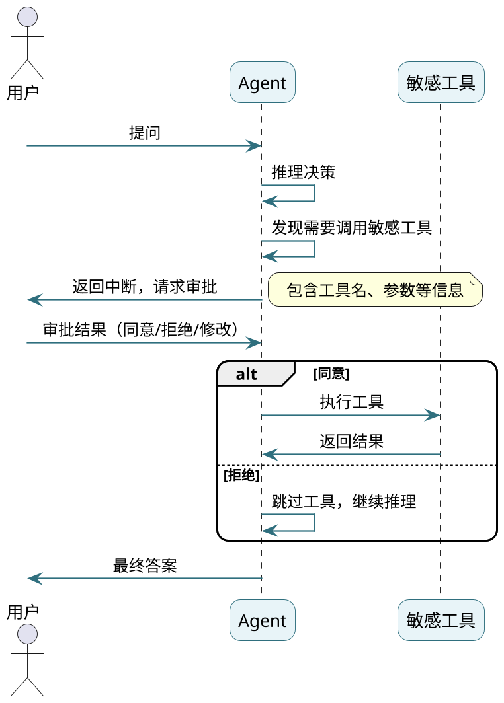
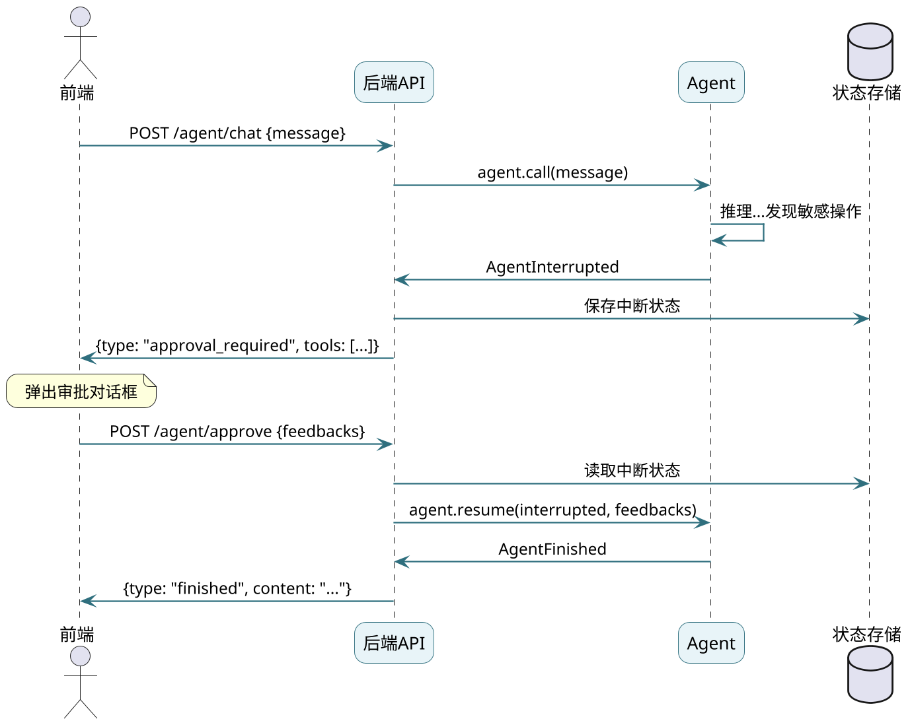

# 底层实战之HITL机制

**//TODO (待定是否保留)使用SpringAI的能力加上额外手写来实现了ReAct循环逻辑、反思机制、Plan&Execute功能**

前面几篇我们实现了ReactAgent、ReflectionAgent、PlanExecuteAgent，它们都是"全自动"的——用户提问，Agent一路执行到底，中间不需要人干预。

但有些场景下，"全自动"反而是个问题：
- Agent要发起一笔支付，用户想确认一下金额
- Agent要删除一条数据，需要人工审核
- Agent要发送邮件，用户想先看看内容

这时候需要**Human in the Loop（HITL）**——让Agent在执行敏感操作前"暂停"，等待人工审批后再继续。

## HITL的核心流程



关键点：
1. **只拦截敏感工具**：不是所有工具都需要审批
2. **中断返回**：带上完整的上下文快照，方便恢复
3. **支持多种审批结果**：同意、拒绝、修改参数

## 设计思路

实现HITL需要解决几个问题：

| 问题 | 解决方案 |
|------|----------|
| 怎么知道哪些工具需要审批？ | 配置需要拦截的工具名列表 |
| 在什么位置拦截？ | 用Advisor，在模型返回tool_calls后拦截 |
| 中断后怎么恢复？ | 保存消息快照和上下文状态 |
| 怎么避免重复拦截？ | 用状态记录已审批的工具调用 |

## HITLAdvisor实现

用Advisor拦截敏感工具调用：

```java
public class HITLAdvisor implements CallAdvisor {
    
    public static final String HITL_REQUIRED = "hitl.required";
    public static final String HITL_PENDING_TOOLS = "hitl.pending.tools";
    public static final String HITL_STATE_KEY = "hitl.state";
    
    // 需要拦截的工具名称
    private final Set<String> interceptToolNames;
    
    public HITLAdvisor(Set<String> interceptToolNames) {
        this.interceptToolNames = interceptToolNames;
    }
    
    @Override
    public ChatClientResponse adviseCall(ChatClientRequest request,
                                         CallAdvisorChain chain) {
        // 先让模型正常执行
        ChatClientResponse response = chain.nextCall(request);
        
        // 没有工具调用，直接返回
        if (!response.chatResponse().hasToolCalls()) {
            return response;
        }
        
        // 检查是否有需要审批的工具
        List<PendingToolCall> pending = new ArrayList<>();
        
        for (AssistantMessage.ToolCall tc : response.chatResponse()
                .getResult()
                .getOutput()
                .getToolCalls()) {
            
            // 只拦截配置的敏感工具
            if (!interceptToolNames.contains(tc.name())) {
                continue;
            }
            
            pending.add(new PendingToolCall(
                    tc.id(),
                    tc.name(),
                    tc.arguments(),
                    null,  // 审批结果，初始为空
                    "该工具需要人工确认后执行"
            ));
        }
        
        // 没有需要审批的工具
        if (pending.isEmpty()) {
            return response;
        }
        
        // 标记需要HITL，并附上待审批工具列表
        response.context().put(HITL_REQUIRED, true);
        response.context().put(HITL_PENDING_TOOLS, pending);
        
        return response;
    }
    
    @Override
    public String getName() {
        return "HITLAdvisor";
    }
    
    @Override
    public int getOrder() {
        return 0;  // 最先执行
    }
}
```

## 待审批工具的数据结构

```java
public record PendingToolCall(
        String id,           // 工具调用ID
        String name,         // 工具名称
        String arguments,    // 调用参数（JSON）
        FeedbackResult result, // 审批结果
        String description   // 工具描述
) {
    
    public enum FeedbackResult {
        APPROVED,  // 同意执行
        REJECTED,  // 拒绝执行
        EDITED     // 修改参数后执行
    }
    
    // 创建"同意"的反馈
    public PendingToolCall approve() {
        return new PendingToolCall(id, name, arguments, 
                FeedbackResult.APPROVED, description);
    }
    
    // 创建"拒绝"的反馈
    public PendingToolCall reject(String reason) {
        return new PendingToolCall(id, name, arguments, 
                FeedbackResult.REJECTED, reason);
    }
    
    // 创建"修改参数"的反馈
    public PendingToolCall edit(String newArguments) {
        return new PendingToolCall(id, name, newArguments, 
                FeedbackResult.EDITED, description);
    }
}
```

## HITL状态管理

为了避免同一个工具调用被重复拦截，需要记录哪些已经审批过了：

```java
public class HITLState {
    // 已经处理过的工具调用ID
    private final Set<String> consumedToolCallIds = ConcurrentHashMap.newKeySet();
    
    public boolean isConsumed(String toolCallId) {
        return consumedToolCallIds.contains(toolCallId);
    }
    
    public void markConsumed(String toolCallId) {
        consumedToolCallIds.add(toolCallId);
    }
}
```

## Agent返回结果设计

普通Agent返回String，但HITL场景下可能返回"中断"或"完成"两种状态：

```java
// 密封接口，只允许两个实现
public sealed interface AgentResult 
        permits AgentFinished, AgentInterrupted {}

// 任务完成
public record AgentFinished(String content) implements AgentResult {}

// 任务中断，等待审批
public record AgentInterrupted(
        List<PendingToolCall> pendingToolCalls,  // 待审批工具
        List<Message> checkpointMessages,         // 消息快照
        Map<String, Object> context               // 上下文状态
) implements AgentResult {}
```

## HITLReactAgent实现

改造ReactAgent，支持中断和恢复：

```java
public class HITLReactAgent {
    
    private final String name;
    private final ChatModel chatModel;
    private final List<ToolCallback> tools;
    private final List<Advisor> advisors;
    private final int maxRounds;
    
    private ChatClient chatClient;
    
    // 首次调用
    public AgentResult call(String question) {
        List<Message> messages = new ArrayList<>();
        messages.add(new SystemMessage(REACT_SYSTEM_PROMPT));
        messages.add(new UserMessage(question));
        
        // 初始化HITL状态
        Map<String, Object> context = new ConcurrentHashMap<>();
        context.put(HITLAdvisor.HITL_STATE_KEY, new HITLState());
        
        return run(messages, context);
    }
    
    // 核心执行逻辑
    private AgentResult run(List<Message> messages, Map<String, Object> context) {
        int round = 0;
        
        while (true) {
            round++;
            
            if (maxRounds > 0 && round > maxRounds) {
                return new AgentFinished(forceAnswer(messages));
            }
            
            ChatClientResponse response = chatClient
                    .prompt()
                    .messages(messages)
                    .call()
                    .chatClientResponse();
            
            // 【关键】检查是否需要HITL
            if (Boolean.TRUE.equals(response.context().get(HITLAdvisor.HITL_REQUIRED))) {
                // 返回中断，等待人工审批
                List<PendingToolCall> pending = (List<PendingToolCall>) 
                        response.context().get(HITLAdvisor.HITL_PENDING_TOOLS);
                
                return new AgentInterrupted(
                        pending,
                        List.copyOf(messages),  // 保存当前消息快照
                        context
                );
            }
            
            // 没有工具调用 = 最终答案
            if (!response.chatResponse().hasToolCalls()) {
                return new AgentFinished(response.chatResponse()
                        .getResult()
                        .getOutput()
                        .getText());
            }
            
            // 有工具调用且不需要审批，直接执行
            executeToolCalls(response, messages);
        }
    }
    
    // 恢复执行（收到审批反馈后）
    public AgentResult resume(AgentInterrupted interrupted,
                              List<PendingToolCall> feedbacks) {
        // 恢复消息和上下文
        List<Message> messages = new ArrayList<>(interrupted.checkpointMessages());
        Map<String, Object> context = interrupted.context();
        
        HITLState hitlState = (HITLState) context.get(HITLAdvisor.HITL_STATE_KEY);
        
        // 构建工具调用消息
        List<AssistantMessage.ToolCall> toolCalls = new ArrayList<>();
        
        for (PendingToolCall fb : feedbacks) {
            // 跳过已处理的
            if (hitlState.isConsumed(fb.id())) {
                continue;
            }
            hitlState.markConsumed(fb.id());
            
            toolCalls.add(new AssistantMessage.ToolCall(
                    fb.id(), "function", fb.name(), fb.arguments()));
        }
        
        // 补全AssistantMessage（带tool_calls）
        if (!toolCalls.isEmpty()) {
            messages.add(AssistantMessage.builder()
                    .toolCalls(toolCalls)
                    .build());
        }
        
        // 根据审批结果执行或拒绝
        for (PendingToolCall fb : feedbacks) {
            String result;
            
            if (fb.result() == PendingToolCall.FeedbackResult.REJECTED) {
                // 用户拒绝，告诉模型
                result = "用户拒绝执行此工具。工具名：" + fb.name() 
                        + "，原因：" + fb.description();
            } else {
                // 同意或修改后执行
                ToolCallback tool = findTool(fb.name());
                result = tool.call(fb.arguments()).toString();
            }
            
            // 添加工具响应
            messages.add(ToolResponseMessage.builder()
                    .responses(List.of(new ToolResponseMessage.ToolResponse(
                            fb.id(), fb.name(), result)))
                    .build());
        }
        
        // 继续执行
        return run(messages, context);
    }
    
    // ... 其他辅助方法
}
```

**核心逻辑**：
1. `call()`：首次调用，初始化状态
2. `run()`：执行循环，检测到HITL需求就返回中断
3. `resume()`：收到反馈后恢复执行

## 使用示例：支付确认场景

假设有一个支付工具，需要用户确认后才能执行：

```java
public class PaymentService {
    
    @Tool(description = "发起支付，需要人工确认")
    public String makePayment(
            @ToolParam(description = "订单号") String orderId,
            @ToolParam(description = "支付金额") double amount) {
        // 实际支付逻辑
        return "支付成功，订单" + orderId + "，金额" + amount + "元";
    }
    
    @Tool(description = "查询订单金额")
    public String queryOrderAmount(
            @ToolParam(description = "订单号") String orderId) {
        // 模拟查询
        return "订单" + orderId + "待支付金额：199.00元";
    }
}
```

构建带HITL的Agent：

```java
public static void main(String[] args) {
    ToolCallback[] tools = ToolCallbacks.from(new PaymentService());
    
    // 配置需要拦截的工具
    HITLAdvisor hitlAdvisor = new HITLAdvisor(Set.of("makePayment"));
    
    HITLReactAgent agent = HITLReactAgent.builder()
            .name("payment-agent")
            .chatModel(chatModel)
            .tools(Arrays.asList(tools))
            .advisors(List.of(hitlAdvisor))
            .build();
    
    // 第一次调用
    AgentResult result = agent.call("帮我支付订单ORD12345");
    
    // 处理可能的多次HITL中断
    while (result instanceof AgentInterrupted interrupted) {
        System.out.println("===== 需要人工审批 =====");
        
        for (PendingToolCall tc : interrupted.pendingToolCalls()) {
            System.out.println("工具: " + tc.name());
            System.out.println("参数: " + tc.arguments());
        }
        
        // 获取用户审批（这里模拟控制台输入）
        List<PendingToolCall> feedbacks = getUserFeedback(interrupted);
        
        // 恢复执行
        result = agent.resume(interrupted, feedbacks);
    }
    
    // 最终结果
    if (result instanceof AgentFinished finished) {
        System.out.println("===== 最终结果 =====");
        System.out.println(finished.content());
    }
}

private static List<PendingToolCall> getUserFeedback(AgentInterrupted interrupted) {
    Scanner scanner = new Scanner(System.in);
    List<PendingToolCall> feedbacks = new ArrayList<>();
    
    for (PendingToolCall tc : interrupted.pendingToolCalls()) {
        System.out.println("是否同意执行 " + tc.name() + "？(y/n)");
        String input = scanner.nextLine();
        
        if ("y".equalsIgnoreCase(input)) {
            feedbacks.add(tc.approve());
        } else {
            feedbacks.add(tc.reject("用户主动拒绝"));
        }
    }
    
    return feedbacks;
}
```

## 执行过程

```
用户: 帮我支付订单ORD12345

Agent推理: 需要调用queryOrderAmount查询金额...
执行工具: queryOrderAmount(ORD12345)
结果: 订单ORD12345待支付金额：199.00元

Agent推理: 需要调用makePayment发起支付...
检测到敏感工具，返回中断

===== 需要人工审批 =====
工具: makePayment
参数: {"orderId":"ORD12345","amount":199.0}

是否同意执行 makePayment？(y/n)
> y

恢复执行...
执行工具: makePayment(ORD12345, 199.0)
结果: 支付成功

===== 最终结果 =====
已为您完成订单ORD12345的支付，金额199.00元。
```

## 拒绝场景

如果用户选择拒绝：

```
是否同意执行 makePayment？(y/n)
> n

恢复执行...
（工具未执行，告诉模型用户拒绝了）

Agent推理: 用户拒绝了支付操作...

===== 最终结果 =====
好的，我已取消支付操作。如果您确认要支付，可以再次告诉我。
```

Agent会根据"用户拒绝"这个信息，给出合理的回复。

## 实际应用：前后端交互

实际项目中，HITL不是用控制台输入，而是前后端交互：



后端API示例：

```java
@RestController
@RequestMapping("/agent")
public class AgentController {
    
    @Autowired
    private HITLReactAgent agent;
    
    // 存储中断状态（实际用Redis等）
    private final Map<String, AgentInterrupted> interruptedSessions = 
            new ConcurrentHashMap<>();
    
    @PostMapping("/chat")
    public ResponseEntity<?> chat(@RequestBody ChatRequest request) {
        AgentResult result = agent.call(request.getMessage());
        
        if (result instanceof AgentInterrupted interrupted) {
            // 保存中断状态
            String sessionId = UUID.randomUUID().toString();
            interruptedSessions.put(sessionId, interrupted);
            
            return ResponseEntity.ok(Map.of(
                    "type", "approval_required",
                    "sessionId", sessionId,
                    "tools", interrupted.pendingToolCalls()
            ));
        }
        
        return ResponseEntity.ok(Map.of(
                "type", "finished",
                "content", ((AgentFinished) result).content()
        ));
    }
    
    @PostMapping("/approve")
    public ResponseEntity<?> approve(@RequestBody ApproveRequest request) {
        AgentInterrupted interrupted = interruptedSessions.remove(request.getSessionId());
        
        if (interrupted == null) {
            return ResponseEntity.badRequest().body("会话不存在或已过期");
        }
        
        AgentResult result = agent.resume(interrupted, request.getFeedbacks());
        
        // 可能还会有下一个HITL中断
        if (result instanceof AgentInterrupted next) {
            String sessionId = UUID.randomUUID().toString();
            interruptedSessions.put(sessionId, next);
            
            return ResponseEntity.ok(Map.of(
                    "type", "approval_required",
                    "sessionId", sessionId,
                    "tools", next.pendingToolCalls()
            ));
        }
        
        return ResponseEntity.ok(Map.of(
                "type", "finished",
                "content", ((AgentFinished) result).content()
        ));
    }
}
```

## 小结

这篇我们实现了Human in the Loop机制：

**核心设计**：
- **HITLAdvisor**：在模型返回tool_calls后拦截敏感工具
- **AgentResult**：支持"完成"和"中断"两种返回状态
- **HITLState**：记录已审批的工具，避免重复拦截

**关键流程**：
1. 配置需要审批的工具列表
2. Advisor检测到敏感工具时标记中断
3. Agent返回`AgentInterrupted`，带上消息快照
4. 用户审批后调用`resume()`继续执行

**适用场景**：
- 支付、转账等金融操作
- 数据删除、修改等敏感操作
- 发送邮件、短信等对外通信
- 任何需要人工确认的自动化流程

至此，我们完成了Agent底层实战系列的四篇内容：
- **ReactAgent**：基础的思考-行动循环
- **ReflectionAgent**：自我反思与答案优化
- **PlanExecuteAgent**：复杂任务的规划与执行
- **HITL**：人机协作的安全机制

这些实现都是基于Spring AI的原生能力，理解了这些原理，再去看任何Agent框架都会轻松很多。
