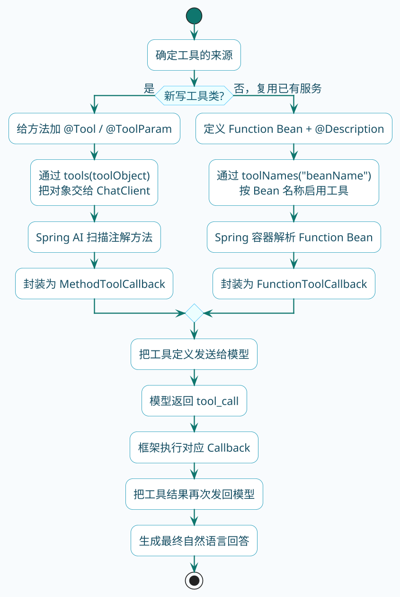

import VipInline from '@site/src/components/VipInline';

# Spring AI工具调用实战

上一节我们搞明白了工具调用是怎么回事。现在的问题是：在Spring AI里，具体怎么把自己的方法变成大模型能调用的工具？

Spring AI给我们提供了两种路子：

1. **注解方式**：用`@Tool`把普通方法变成工具
2. **函数式方式**：定义一个`Function`类型的Bean

两种方式本质上做的是同一件事——告诉Spring AI"这个方法可以被模型调用"，只是写法不同。选哪个主要看你的代码组织偏好。

:::tip 如何选择接入方式
- 新写的工具类 → 用 `@Tool` 注解，更直观
- 复用已有的 Service，不想改动原有代码 → 用 `Function` Bean
:::

如果先从整体上看，Spring AI会把这两条接入路径最终收敛到同一条工具调用闭环里：



## 方式一：用@Tool注解定义工具

先来看最直观的方式。假设我们要实现一个"查询城市当前时间"的功能：

```java
@Component
public class CityTimeTools {

    @Tool(description = "查询指定城市的当前本地时间")
    public String queryCityTime(
            @ToolParam(description = "城市名称，如北京、东京、纽约") String cityName) {
        
        // 模拟根据城市获取时区
        Map<String, String> cityTimezones = Map.of(
            "北京", "Asia/Shanghai",
            "东京", "Asia/Tokyo",
            "纽约", "America/New_York",
            "伦敦", "Europe/London"
        );
        
        String timezone = cityTimezones.getOrDefault(cityName, "Asia/Shanghai");
        ZoneId zoneId = ZoneId.of(timezone);
        ZonedDateTime now = ZonedDateTime.now(zoneId);
        
        DateTimeFormatter formatter = DateTimeFormatter.ofPattern("yyyy-MM-dd HH:mm:ss");
        return cityName + "当前时间：" + now.format(formatter);
    }
}
```

这段代码有几个关键点：

- `@Tool`注解标记这是一个可被调用的工具，`description`告诉模型这个工具是干嘛的
- `@ToolParam`描述参数的用途，帮助模型理解应该传什么值
- 方法本身就是普通的Java代码，返回值会被发送回模型

有了工具类，使用的时候这样写：

```java
@RestController
@RequestMapping("/time")
public class TimeQueryController {

    private final ChatClient chatClient;
    private final CityTimeTools cityTimeTools;

    public TimeQueryController(ChatClient chatClient, CityTimeTools cityTimeTools) {
        this.chatClient = chatClient;
        this.cityTimeTools = cityTimeTools;
    }

    @GetMapping("/ask")
    public Flux<String> askTime(@RequestParam String question) {
        return chatClient.prompt()
                .user(question)
                .tools(cityTimeTools)  // 把工具实例传进去
                .stream()
                .content();
    }
}
```

调用`tools(cityTimeTools)`之后，Spring AI会自动扫描这个对象上所有带`@Tool`注解的方法，生成工具定义发给模型。

:::info @Tool 注解关键点
- `@Tool`：标记可调用工具，`description` 告诉模型工具用途
- `@ToolParam`：描述参数含义，帮助模型理解应该传什么值
- 方法返回值会被直接发送回模型作为工具执行结果
:::

现在你访问`/time/ask?question=东京现在几点了`，模型就会识别出需要调用`queryCityTime`方法，参数是"东京"。

<VipInline />
