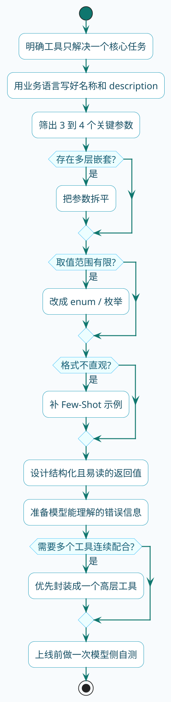

import VipInline from '@site/src/components/VipInline';

# 工具设计原则与最佳实践

前面几节我们学会了怎么定义工具、怎么调用工具。但有个问题还没聊：怎么定义一个**好用**的工具？

这里的"好用"不是指你写代码方便，而是指**模型能不能正确理解和使用**。

:::warning 常见误区
工具定义好了、功能能跑，但模型就是不调或者调错——问题往往出在工具定义不够清晰，模型没看懂这工具是干嘛的。工具的 description 质量直接决定模型使用工具的准确率。
:::

这一节咱们来聊聊怎么设计让模型"看得懂、用得对"的工具。

先给你一条总的检查路径。后面这 8 条原则，其实就是把这条路径一项项展开讲细：



## 原则一：名称和描述要说人话

我们写代码的时候，变量名叫`a`、`b`、`tmp`可能自己能看懂。但给模型用的工具，名称和描述必须清晰明确。

**反面教材**：

```java
@Tool(description = "处理数据")
public String process(@ToolParam(description = "参数") String param) {
    // ...
}
```

这种定义，模型完全搞不懂：处理什么数据？怎么处理？参数是什么东西？

**正确做法**：

```java
@Tool(description = "根据订单编号查询订单的详细信息，包括商品列表、收货地址、支付状态等")
public OrderDetail queryOrderDetail(
        @ToolParam(description = "订单编号，格式如：ORD202503140001") 
        String orderId) {
    // ...
}
```

好的描述应该回答这几个问题：

- 这个工具是干什么的？
- 什么时候应该用它？
- 每个参数是什么意思，应该填什么格式？

:::tip 最佳实践
记住，模型是通过阅读这些文字来理解工具的。描述写得越清楚，模型用起来越准。
:::

<VipInline />
