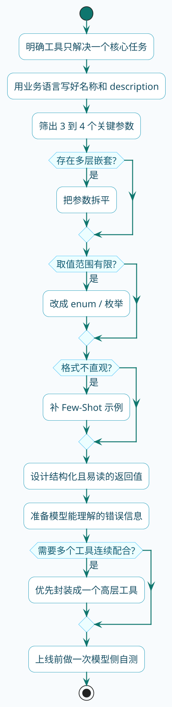
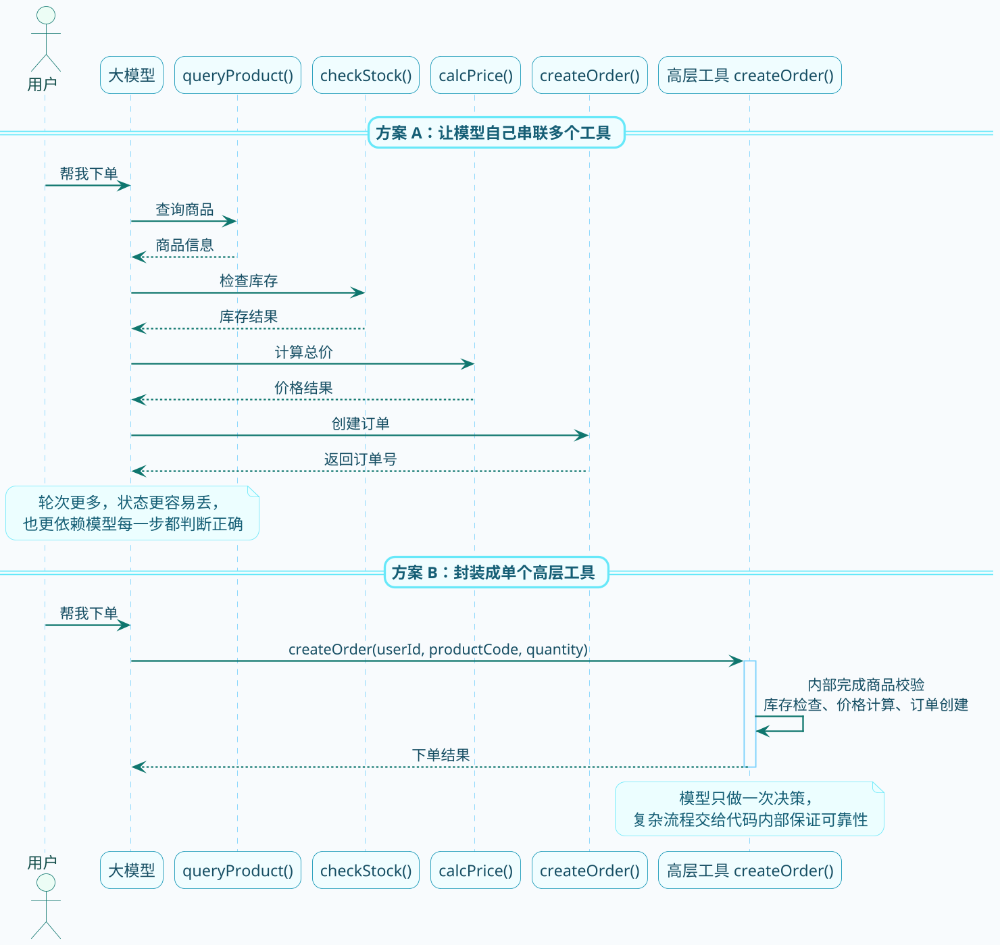

# 工具设计原则与最佳实践

前面几节我们学会了怎么定义工具、怎么调用工具。但有个问题还没聊：怎么定义一个**好用**的工具？

这里的"好用"不是指你写代码方便，而是指**模型能不能正确理解和使用**。

你可能遇到过这种情况：工具定义好了，功能也能跑，但模型就是不调或者调错。问题往往出在工具定义不够清晰——模型没看懂这工具是干嘛的。

这一节咱们来聊聊怎么设计让模型"看得懂、用得对"的工具。

先给你一条总的检查路径。后面这 8 条原则，其实就是把这条路径一项项展开讲细：



## 原则一：名称和描述要说人话

我们写代码的时候，变量名叫`a`、`b`、`tmp`可能自己能看懂。但给模型用的工具，名称和描述必须清晰明确。

**反面教材**：

```java
@Tool(description = "处理数据")
public String process(@ToolParam(description = "参数") String param) {
    // ...
}
```

这种定义，模型完全搞不懂：处理什么数据？怎么处理？参数是什么东西？

**正确做法**：

```java
@Tool(description = "根据订单编号查询订单的详细信息，包括商品列表、收货地址、支付状态等")
public OrderDetail queryOrderDetail(
        @ToolParam(description = "订单编号，格式如：ORD202503140001") 
        String orderId) {
    // ...
}
```

好的描述应该回答这几个问题：

- 这个工具是干什么的？
- 什么时候应该用它？
- 每个参数是什么意思，应该填什么格式？

记住，模型是通过阅读这些文字来理解工具的。描述写得越清楚，模型用起来越准。

## 原则二：参数结构要扁平

模型处理参数是通过JSON来做的。嵌套层级越深，出错概率越大。

**不推荐**：

```java
// 多层嵌套的参数结构
public class OrderQuery {
    private String orderId;
    private UserInfo user;      // 又嵌套了一层
    private AddressInfo address; // 再嵌套一层
}

public class UserInfo {
    private String name;
    private String phone;
}

public class AddressInfo {
    private String province;
    private String city;
    private String detail;
}
```

模型生成参数时可能会搞混层级关系，把`name`放到外层，或者把`city`放错位置。

**推荐**：

```java
@Tool(description = "根据条件搜索订单")
public List<Order> searchOrders(
        @ToolParam(description = "用户手机号，如：13800138000") String phone,
        @ToolParam(description = "省份，如：广东省") String province,
        @ToolParam(description = "城市，如：深圳市") String city,
        @ToolParam(description = "下单开始日期，格式YYYY-MM-DD") String startDate,
        @ToolParam(description = "下单结束日期，格式YYYY-MM-DD") String endDate) {
    // ...
}
```

把参数平铺开，每个参数的含义一目了然，模型处理起来也简单。

## 原则三：控制参数数量

参数扁平化不代表可以无限多。参数太多，模型一是容易漏填，二是容易填错位置。

**实践建议**：

- 核心参数控制在3-4个以内
- 可选参数用默认值处理，不强制要求模型传
- 和当前请求无关的参数（比如鉴权token、请求ID）不要暴露给模型

**反面教材**：

```java
// 参数太多，模型容易懵
@Tool(description = "创建营销活动")
public void createCampaign(
        String name,
        String description,
        String startTime,
        String endTime,
        String targetAudience,
        String budget,
        String channel,
        String createdBy,
        String approvedBy,    // 这个应该后端自动处理
        String requestId,     // 这个是链路追踪用的，不该让模型传
        String accessToken) { // 鉴权信息，更不该让模型传
    // ...
}
```

**改进版本**：

```java
@Tool(description = "创建营销活动")
public void createCampaign(
        @ToolParam(description = "活动名称，如：618大促") String name,
        @ToolParam(description = "活动简介") String description,
        @ToolParam(description = "开始时间，格式YYYY-MM-DD HH:mm") String startTime,
        @ToolParam(description = "结束时间，格式YYYY-MM-DD HH:mm") String endTime) {
    // 其他参数在方法内部从上下文获取
    String operatorId = SecurityContext.getCurrentUser();
    String requestId = TraceContext.getTraceId();
    // ...
}
```

只暴露模型需要决策的参数，其他的自己处理。

## 原则四：用枚举收窄取值范围

有些参数的值是有限的几个选项，这时候要通过枚举明确告诉模型。

比如用户问"帮我找个适合约会的餐厅"，如果你的工具参数是：

```java
@ToolParam(description = "餐厅用途") String purpose
```

模型可能会填`约会`、`romantic`、`date`、`情侣`...各种写法都有可能，你代码怎么处理？

**正确做法**是用枚举限定：

```json
{
  "type": "function",
  "name": "search_restaurants",
  "description": "搜索附近餐厅",
  "parameters": {
    "type": "object",
    "properties": {
      "location": {
        "type": "string",
        "description": "搜索位置，如：北京市朝阳区"
      },
      "purpose": {
        "type": "string",
        "description": "用餐场景",
        "enum": ["family_dinner", "romantic_date", "business_meal", "friends_gathering"]
      }
    },
    "required": ["location"]
  }
}
```

用`enum`把选项固定下来，模型只能从这几个值里选，不会瞎编。

在Spring AI中可以这样定义：

```java
public enum DiningPurpose {
    FAMILY_DINNER,      // 家庭聚餐
    ROMANTIC_DATE,      // 约会
    BUSINESS_MEAL,      // 商务宴请
    FRIENDS_GATHERING   // 朋友聚会
}

@Tool(description = "搜索附近餐厅")
public List<Restaurant> searchRestaurants(
        @ToolParam(description = "搜索位置") String location,
        @ToolParam(description = "用餐场景") DiningPurpose purpose) {
    // ...
}
```

## 原则五：给模型一些示例

如果参数格式比较特殊，光靠描述可能不够，加几个示例更直观。

这其实就是Few-Shot的思路——用例子教模型怎么做。

```java
@Tool(description = """
    解析用户输入的时间表达，转换为标准格式。
    
    示例：
    - 输入："下周三下午三点" → 输出："2025-03-19 15:00"
    - 输入："后天早上9点半" → 输出："2025-03-15 09:30"
    - 输入："这周五晚上8点" → 输出："2025-03-14 20:00"
    """)
public String parseTimeExpression(
        @ToolParam(description = "用户输入的时间表达，如：明天下午两点、下周一上午十点") 
        String expression) {
    // ...
}
```

有了这些示例，模型更容易理解参数应该是什么样子。

## 原则六：返回值要模型能看懂

工具执行完，返回的结果是要发回给模型的。所以返回值的格式也很重要。

**不推荐**：

```java
@Tool(description = "查询用户信息")
public String queryUser(String userId) {
    User user = userService.getById(userId);
    return user.toString();  // 直接toString，可能是内存地址或者乱七八糟的格式
}
```

**推荐**：

```java
@Tool(description = "查询用户信息")
public String queryUser(String userId) {
    User user = userService.getById(userId);
    // 组织成结构化、易读的格式
    return String.format("""
        用户信息：
        - 姓名：%s
        - 手机号：%s
        - 注册时间：%s
        - 会员等级：%s
        """, 
        user.getName(),
        user.getPhone(),
        user.getCreateTime(),
        user.getLevel()
    );
}
```

或者返回一个结构化对象，让Spring AI自动序列化成JSON：

```java
@Tool(description = "查询用户信息")
public UserInfo queryUser(String userId) {
    User user = userService.getById(userId);
    return new UserInfo(user.getName(), user.getPhone(), user.getLevel());
}
```

## 原则七：错误信息要友好

工具执行可能会出错：参数格式不对、资源不存在、权限不足...

这些错误信息也会被发回给模型。如果你只抛一个异常，模型看到的可能是`NullPointerException`或者一堆调用栈——这对它来说毫无意义。

**不推荐**：

```java
@Tool(description = "取消订单")
public String cancelOrder(String orderId) {
    Order order = orderService.getById(orderId);
    if (order == null) {
        throw new RuntimeException("Order not found");  // 模型看不懂
    }
    // ...
}
```

**推荐**：

```java
@Tool(description = "取消订单")
public String cancelOrder(String orderId) {
    Order order = orderService.getById(orderId);
    if (order == null) {
        return "取消失败：订单号" + orderId + "不存在，请确认订单号是否正确";
    }
    if (!order.canCancel()) {
        return "取消失败：该订单状态为" + order.getStatus() + "，已无法取消";
    }
    orderService.cancel(orderId);
    return "订单" + orderId + "已成功取消";
}
```

友好的错误信息让模型能理解发生了什么，甚至可以尝试修正（比如重新询问用户正确的订单号）。

## 原则八：避免复杂的工具调用链

有时候一个任务需要多个步骤，涉及多个工具。比如"帮用户下单"可能需要：

1. 查询商品信息
2. 检查库存
3. 计算价格
4. 创建订单

如果把这些拆成4个独立工具，让模型依次调用，问题就来了：

- 上一步的结果默认不会自动传递到下一步
- 模型可能搞错调用顺序
- 整体流程变得不可靠

这两种做法的差异，用时序图看会更直观：



**更好的做法**是把相关步骤封装成一个工具：

```java
@Tool(description = "为用户创建商品订单，会自动检查库存和计算价格")
public String createOrder(
        @ToolParam(description = "用户ID") String userId,
        @ToolParam(description = "商品编码") String productCode,
        @ToolParam(description = "购买数量") int quantity) {
    
    // 内部串起来执行
    Product product = productService.getByCode(productCode);
    if (product == null) {
        return "下单失败：商品" + productCode + "不存在";
    }
    
    int stock = inventoryService.getStock(productCode);
    if (stock < quantity) {
        return "下单失败：库存不足，当前库存" + stock + "件";
    }
    
    BigDecimal totalPrice = product.getPrice().multiply(BigDecimal.valueOf(quantity));
    
    Order order = orderService.create(userId, productCode, quantity, totalPrice);
    return "下单成功，订单号：" + order.getId() + "，总金额：" + totalPrice + "元";
}
```

对模型来说，只需要调用一个工具，传几个参数，剩下的事情工具内部搞定。

## 设计清单

最后给一个自查清单，定义工具的时候对照着检查：

| 检查项 | 要点 |
|--------|------|
| 名称清晰吗？ | 一看就知道这个工具是干什么的 |
| 描述完整吗？ | 说明了用途、使用场景、注意事项 |
| 参数够扁平吗？ | 避免多层嵌套 |
| 参数数量合理吗？ | 控制在3-4个以内 |
| 有限选项用枚举了吗？ | 避免模型瞎编参数值 |
| 需要示例吗？ | 复杂格式可以加Few-Shot |
| 返回值易读吗？ | 结构化、有含义 |
| 错误信息友好吗？ | 让模型能理解问题所在 |
| 流程够简单吗？ | 复杂任务封装成单个工具 |

遵循这些原则，你定义出来的工具会更容易被模型正确使用。

## 小结

这一节我们总结了工具设计的核心原则：

1. 名称和描述要清晰，让模型能理解
2. 参数结构要扁平，减少嵌套
3. 参数数量要精简，只暴露必要的
4. 有限选项用枚举限定
5. 复杂格式加示例说明
6. 返回值要模型能看懂
7. 错误信息要友好
8. 复杂流程封装成单个工具

下一节我们来做一个实战项目，把前面学的东西串起来用。
