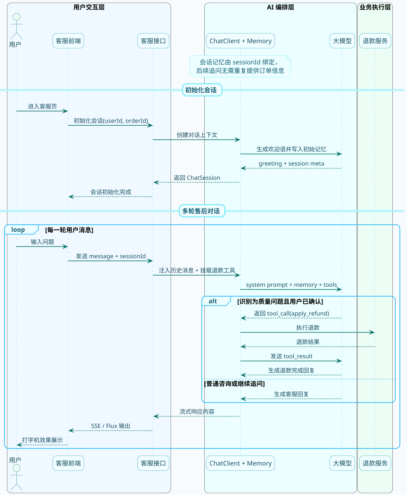
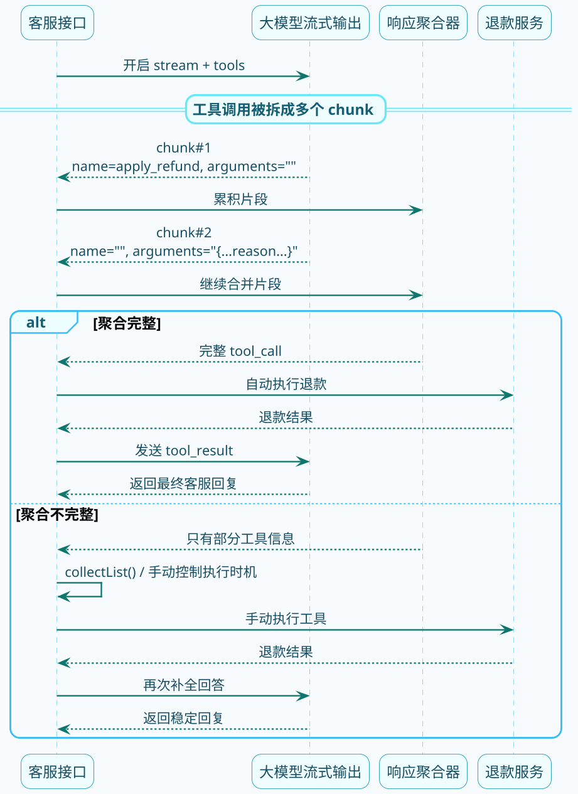

# 智能客服退款实战

**//TODO (待定是否保留)**

## 实战目标

我们来做一个真实场景的项目：**智能售后客服**。

当用户反馈商品有质量问题时，系统自动识别并主动帮用户申请退款。如果是其他类型的问题（比如物流、使用咨询），就正常客服对话处理。

这个项目会用到前面学的所有知识：

- **提示词工程**：定义客服的角色和行为规范
- **工具调用**：当确认需要退款时，调用退款接口
- **对话记忆**：保持多轮对话的上下文连贯性
- **流式输出**：让用户实时看到客服回复
- **结构化输出**：首次对话返回标准化的会话信息

:::info 项目综合技术点
本实战是对前面所有知识的综合运用，建议在完成工具调用基础章节后再来实践，效果更佳。
:::

## 整体架构

先来看看整个系统的交互流程：



## 第一步：设计提示词

提示词是这个系统的"灵魂"，决定了AI客服的行为模式。

```java
@Component
public class CustomerServiceConfig {
    
    public static final String SYSTEM_PROMPT = """
        # 你的身份
        你是一名专业的数码产品售后服务专员，负责处理用户的售后问题。
        你有主动为用户解决问题的意识，尤其是遇到商品质量问题时，会积极帮用户申请退款。
        
        # 你的工作流程
        
        ## 第一步：倾听和确认
        仔细阅读用户的描述，判断是否涉及商品质量问题。
        
        质量问题的典型表现：
        - 收到就是坏的、有明显损伤
        - 无法正常开机或使用
        - 功能缺失或与描述严重不符
        - 存在安全隐患
        
        如果用户描述可能涉及质量问题，用具体的问题向用户确认。
        示例：「收到的耳机完全没有声音是吗？您试过其他设备了吗？」
        
        ## 第二步：判断并执行
        当用户明确确认是质量问题后，直接告知用户你将为其申请退款，不需要用户主动要求。
        
        话术示例：「这确实是产品质量问题，我现在就为您申请退款，预计1-3个工作日到账。」
        
        ## 第三步：收尾
        退款发起后，再次表达歉意，并告知用户无需进行其他操作。
        
        # 注意事项
        - 只有质量问题才走退款流程，不喜欢、尺寸不合适、物流慢等问题不要主动退款
        - 不要向用户索要订单号、手机号等信息，系统已经有了
        - 语气要亲切自然，像真人客服一样
        - 每次回复不要太长，控制在3-4句话
        """;
}
```

这个提示词用到了几个技巧：

- **角色定义**：明确AI是"数码产品售后专员"
- **行为规范**：用流程化的步骤约束行为
- **Few-Shot**：给出具体的话术示例
- **边界限定**：明确哪些情况不退款

:::tip 提示词设计技巧
好的提示词需要同时定义"要做什么"和"不要做什么"。边界限定（只有质量问题才退款）和行为约束（不要向用户索要已有信息）是避免模型过度行动的关键。
:::

## 第二步：定义退款工具

当AI判断需要退款时，会调用这个工具：

```java
@Component
public class RefundTools {

    private final OrderManageService orderManageService;

    public RefundTools(OrderManageService orderManageService) {
        this.orderManageService = orderManageService;
    }

    @Tool(name = "apply_refund", description = "为用户的订单申请退款，仅在确认是商品质量问题后调用")
    public String applyRefund(
            @ToolParam(description = "订单编号") String orderId,
            @ToolParam(description = "商品名称") String productName,
            @ToolParam(description = "退款原因，需要具体描述问题") String reason) {
        
        System.out.println("========== 执行退款 ==========");
        System.out.println("订单号：" + orderId);
        System.out.println("商品：" + productName);
        System.out.println("原因：" + reason);
        
        // 调用实际的退款服务
        String refundNo = orderManageService.refund(orderId, reason);
        
        return String.format("退款申请成功，退款单号：%s，预计1-3个工作日原路退回", refundNo);
    }
}
```

对应的业务服务（模拟实现）：

```java
@Service
public class OrderManageService {

    public String getOrderById(String orderId) {
        // 模拟查询订单
        return "订单号：" + orderId + "，商品：蓝牙耳机Pro，金额：299元";
    }

    public String refund(String orderId, String reason) {
        // 模拟发起退款
        System.out.println("退款处理中...");
        return "RF" + System.currentTimeMillis();
    }
}
```

## 第三步：配置对话记忆

售后对话需要多轮交互，必须保持上下文连贯。

Spring AI提供了`MessageChatMemoryAdvisor`来实现对话记忆：

```java
@Component
public class CustomerServiceChatClient {

    private final ChatClient chatClient;

    public CustomerServiceChatClient(
            ChatModel chatModel, 
            ChatMemory chatMemory) {
        
        this.chatClient = ChatClient.builder(chatModel)
                .defaultSystem(CustomerServiceConfig.SYSTEM_PROMPT)
                .defaultAdvisors(
                        new SimpleLoggerAdvisor(),
                        MessageChatMemoryAdvisor.builder(chatMemory).build()
                )
                .build();
    }

    public ChatClient getChatClient() {
        return chatClient;
    }
}
```

`ChatMemory`是Spring AI的记忆存储接口，默认用内存实现，也可以接Redis等持久化存储。

:::caution 对话记忆的存储选择
默认的内存实现在应用重启后历史记录会丢失。生产环境应替换为 Redis 等持久化存储，以保证用户跨会话的对话连续性。同时注意控制记忆窗口大小（`chat_memory_retrieve_size`），避免历史消息过多导致 Token 费用激增。
:::

## 第四步：实现会话初始化

用户进入客服页面时，先调用初始化接口，创建会话并获取欢迎语。

这里用结构化输出，让返回格式固定：

```java
public record ChatSession(
        @JsonPropertyDescription("订单号") String orderId,
        @JsonPropertyDescription("用户ID") String userId,
        @JsonPropertyDescription("会话ID") String sessionId,
        @JsonPropertyDescription("会话状态") SessionStatus status,
        @JsonPropertyDescription("欢迎语") String greeting
) {}

public enum SessionStatus {
    STARTED,    // 刚开始
    CHATTING,   // 对话中
    RESOLVED,   // 已解决
    CLOSED      // 已关闭
}
```

初始化接口实现：

```java
@RestController
@RequestMapping("/customer-service")
public class CustomerServiceController {

    private final CustomerServiceChatClient chatClientHolder;
    private final RefundTools refundTools;

    @GetMapping("/init")
    public ChatSession initSession(
            @RequestParam String userId,
            @RequestParam String orderId) {
        
        // 生成会话ID
        String sessionId = UUID.randomUUID().toString().replace("-", "").substring(0, 16);

        // 让AI根据订单信息生成个性化欢迎语
        String initPrompt = String.format(
                "用户进入了售后对话，用户ID是%s，订单号是%s，会话ID是%s。" +
                "请生成一句简短的欢迎语，并记住这些信息。状态为%s。",
                userId, orderId, sessionId, SessionStatus.STARTED.name()
        );

        return chatClientHolder.getChatClient()
                .prompt()
                .user(initPrompt)
                .advisors(spec -> spec
                        .param(CONVERSATION_ID, sessionId)
                        .param("chat_memory_retrieve_size", 100)
                )
                .call()
                .entity(ChatSession.class);
    }
}
```

这样前端收到的响应是结构化的JSON：

```json
{
  "orderId": "ORD202503140001",
  "userId": "U10086",
  "sessionId": "a1b2c3d4e5f6g7h8",
  "status": "STARTED",
  "greeting": "您好！我是数码产品售后专员，看到您购买的蓝牙耳机有问题，请问具体是什么情况呢？"
}
```

## 第五步：实现对话接口

用户发送消息后，调用这个接口进行对话：

```java
@GetMapping("/chat")
public Flux<String> chat(
        @RequestParam String message,
        @RequestParam String sessionId,
        HttpServletResponse response) {
    
    response.setCharacterEncoding("UTF-8");

    return chatClientHolder.getChatClient()
            .prompt()
            .user(message)
            .tools(refundTools)  // 挂载退款工具
            .advisors(spec -> spec
                    .param(CONVERSATION_ID, sessionId)
                    .param("chat_memory_retrieve_size", 100)
            )
            .stream()
            .content();
}
```

几个关键点：

- `tools(refundTools)`：让模型知道可以调用退款工具
- `CONVERSATION_ID`：用会话ID作为记忆的key，保证多轮对话上下文连贯
- `stream().content()`：流式输出，前端可以实现打字机效果

## 来看看效果

启动应用后，模拟一次完整的售后对话。

**第一轮：用户进入**

调用 `GET /customer-service/init?userId=U10086&orderId=ORD202503140001`

返回：
```json
{
  "orderId": "ORD202503140001",
  "sessionId": "a1b2c3d4e5f6g7h8",
  "status": "STARTED",
  "greeting": "您好！我是售后专员小智，看到您购买了蓝牙耳机，请问遇到什么问题了呢？"
}
```

**第二轮：用户描述问题**

调用 `GET /customer-service/chat?sessionId=a1b2c3d4e5f6g7h8&message=这个耳机收到就没声音`

AI回复：
```
「收到就没有声音确实很影响使用。我确认一下，您是指左右两边都完全没有声音，
还是某一边有问题呢？另外，您有没有试过连接其他手机或设备？」
```

**第三轮：用户确认**

调用 `GET /customer-service/chat?sessionId=a1b2c3d4e5f6g7h8&message=两边都没声音，换了手机也一样`

AI回复：
```
「这确实是产品本身的质量问题。我现在就为您申请退款，款项会在1-3个工作日内
按原支付方式退回。给您带来这次不好的购物体验，非常抱歉！」
```

同时控制台会打印：
```
========== 执行退款 ==========
订单号：ORD202503140001
商品：蓝牙耳机
原因：产品收到即无法正常发声，左右耳均无声音，更换设备后问题依旧
```

**第四轮：用户追问**

调用 `GET /customer-service/chat?sessionId=a1b2c3d4e5f6g7h8&message=我还需要把耳机寄回去吗`

AI回复（记忆生效）：
```
「不需要您寄回，已申请质量问题免退货退款。如果方便的话，问题产品您可以
自行处理，或者等后续有回收活动时再处理都可以。还有什么我能帮您的吗？」
```

## 一个容易踩的坑

:::warning 流式模式下工具调用可能失败
在做这个项目的时候，我踩了一个坑：**流式输出时工具调用可能出问题**。

有些模型在流式返回的时候，工具调用信息是分多个 chunk 返回的：

- 第一个 chunk：有工具名，没参数
- 第二个 chunk：有参数，没工具名

如果框架没有正确合并这些 chunk，就会导致工具调用失败。
:::

把这个坑拆开看，本质上是"流式 chunk 拼装"和"工具执行时机"没有对齐：



遇到这种情况，有两个解决方案：

**方案一：换模型**

不同模型的流式行为不一样。比如DashScope的模型在这方面处理得比较好，可以优先考虑。

**方案二：关闭自动执行，自己控制**

把`internalToolExecutionEnabled`设为`false`，自己接管工具调用的时机。等模型完整输出后再判断是否需要调用工具：

```java
@GetMapping("/chat-manual")
public Flux<String> chatWithManualControl(String message, String sessionId) {
    
    var options = DashScopeChatOptions.builder()
            .withInternalToolExecutionEnabled(false)
            .build();
    
    // 先收集完整响应
    return chatClient.prompt()
            .user(message)
            .tools(refundTools)
            .options(options)
            .advisors(spec -> spec.param(CONVERSATION_ID, sessionId))
            .stream()
            .chatResponse()
            .collectList()
            .flatMapMany(responses -> {
                // 合并所有chunk后，检查是否有工具调用
                // 如果有，手动执行工具后再次请求模型
                // 具体实现省略...
            });
}
```

这种方式更可控，但代码也更复杂。根据实际情况选择。

## 小结

这个实战项目把前面学的知识点串起来了：

| 技术点 | 在项目中的应用 |
|--------|---------------|
| 提示词工程 | 定义客服角色和行为规范 |
| 工具调用 | 识别质量问题后自动发起退款 |
| 对话记忆 | 多轮对话中保持上下文 |
| 流式输出 | 实时展示客服回复 |
| 结构化输出 | 初始化会话返回标准格式 |

通过这个项目，你应该对工具调用在实际业务中的应用有了更直观的理解。

实际生产中还需要考虑更多问题：异常处理、限流、日志审计、敏感信息脱敏等，这里就不展开了。核心的技术思路掌握后，这些都是工程化的细节。
