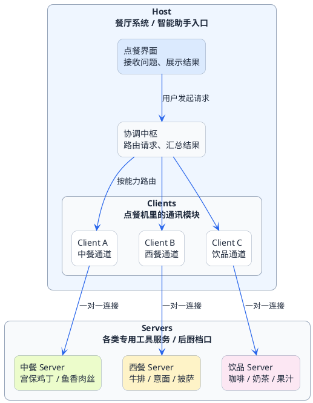
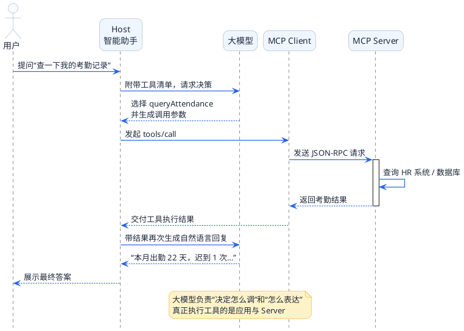

# 揭开MCP协议的面纱

想象一下这样的场景：你问智能助手"帮我订一下明天下午3点的会议室"，它回复道"好的，我已经帮您预订好了"。但当你走到会议室门口，发现根本没有预订记录。为什么会这样？

因为大模型本质上是一个"只会说话的大脑"。它的所有知识都来自训练数据，这些数据在训练完成的那一刻就被冻结了。它没有手、没有脚，无法真正去操作任何系统。当你让它订会议室时，它只能基于它理解的"预订流程"给你一个听起来合理的回答，但实际上什么都没做。

再举个例子：你问"今天股市行情怎么样"，它可能会告诉你一些听起来很专业的分析，但这些数据可能是几个月前的，甚至是它自己编的。因为它根本无法访问实时的股票数据接口。

这就是智能助手面临的核心困境——**它有强大的理解和推理能力，却缺乏与真实世界交互的手段**。

## 让智能助手真正的执行

既然问题是缺乏交互能力，解决方案也很直接：给它提供可以调用的工具。

这个思路早就有了，叫做工具调用（Tool Calling）或者函数调用（Function Calling）。基本原理是这样的：

1. 你告诉大模型"你有一个预订会议室的工具可以用"
2. 用户说"帮我订明天下午3点的会议室"
3. 大模型理解意图后，输出一个结构化的调用指令："调用预订工具，参数是明天下午3点"
4. 你的程序接收到这个指令，真正去执行预订操作
5. 把执行结果告诉大模型，大模型再组织语言回复用户

这套机制本身是没问题的。但当你的智能助手需要的工具越来越多时，麻烦就来了。

比如你做一个企业内部助手，可能需要：查考勤、订会议室、查工资条、提报销、查项目进度、发通知......每一个功能都是一个工具。

问题在于：
- 每个工具都要手写一大段定义描述，告诉大模型这个工具是干嘛的、需要什么参数
- 不同团队用不同语言写的工具，你的系统都要分别对接
- 工具的接口改了，你的定义描述忘了同步，就会出bug
- 新来的同事想知道系统里有哪些工具，只能翻代码一个个找

说白了，**工具调用解决了"怎么调"的问题，但没解决"怎么管"的问题**。

## MCP登场：工具管理的标准化协议

:::info 核心定义
MCP，全称 Model Context Protocol（模型上下文协议），就是为了解决上面这些管理问题而生的。

最简单的理解方式是把它想成一个"标准接口"。就像现在的手机充电线，不管是什么牌子的手机，只要是Type-C接口，用同一根线都能充电。MCP做的事情类似——不管你的工具是用Java写的、Python写的、还是调用的第三方API，只要按照MCP协议来封装，任何支持MCP的智能助手都能直接使用。
:::


:::note 特别说明
这里要澄清一点：**MCP不是一个具体的软件或者框架，而是一套协议规范**。就像HTTP是协议，你可以用Java、Python、Go等任何语言来实现HTTP服务一样，MCP也是协议，你可以用任何语言来实现符合MCP协议的工具服务。
:::

## 用餐厅点餐来理解MCP架构

MCP的架构分为三层：Host、Client、Server。直接看这三个英文词可能有点抽象，我用餐厅点餐的场景来类比。

想象你去一家自助点餐的餐厅：

**Host（宿主）= 整个餐厅系统**

餐厅系统是你作为顾客直接接触的对象。你在点餐机上操作，看到菜品信息，下单付款。在MCP世界里，Host就是用户直接使用的应用程序，比如Claude Desktop、Cursor这样的AI编程工具，或者你自己开发的智能助手。

**Client（客户端）= 点餐机里的通讯模块**

当你在点餐机上选了一份"宫保鸡丁"并点击下单，点餐机需要把这个订单发送给后厨。这个负责和后厨通讯的模块就是Client。在MCP架构里，Client是Host内部的一个组件，专门负责和外部工具服务通信。

一个重要的设计：**一个Client只连接一个Server**。就像点餐机可能有多个通讯模块，一个连接中餐后厨，一个连接西餐后厨，一个连接饮品站。

**Server（服务端）= 各个后厨档口**

中餐档口专门做中餐，西餐档口专门做西餐，饮品站专门做饮料。每个档口都有自己的菜单（工具列表），知道自己能做什么。在MCP世界里，Server就是提供具体工具能力的服务。一个Server可以提供多个相关的工具，比如"HR工具服务"可以同时提供查考勤、查工资、查年假等多个工具。

把这个类比画成图：



## 一次完整的MCP调用：快递配送视角

理解了三层架构，我们来看一次完整的MCP工具调用是怎么进行的。这次我用快递配送来类比。

假设用户问智能助手："查一下我的考勤记录"

**第一步：收件（接收用户请求）**

用户的问题就像一个包裹到达快递站。智能助手（Host）收到这个包裹，需要决定怎么处理。

**第二步：分拣（大模型决策）**

智能助手把用户的问题发给大模型，同时附上一份"派送能力清单"——也就是所有可用工具的说明。大模型看了之后判断："这个问题需要用到查考勤的工具"，然后输出一个"派送单"：

```json
{
  "工具名": "queryAttendance",
  "参数": {
    "employeeId": "当前用户ID",
    "month": "本月"
  }
}
```

**第三步：派送（调用工具）**

智能助手拿到派送单，通过对应的Client把请求发送给HR工具Server。这个过程就像快递员按照地址把包裹送到具体的档口。

**第四步：处理（工具执行）**

HR工具Server收到请求后，执行查询考勤的逻辑（可能是查数据库、调用HR系统API等），得到结果：

```json
{
  "本月出勤": "22天",
  "迟到": "1次",
  "早退": "0次"
}
```

**第五步：回程（返回结果）**

Server把执行结果返回给Client，Client再交给Host。

**第六步：签收（生成回复）**

Host拿到工具执行结果后，再次调用大模型，让它基于这个结果生成一段自然语言回复：

"您本月出勤22天，有1次迟到记录，没有早退。整体考勤情况良好。"

整个流程可以简化成这样：



## MCP提供的三种核心能力

MCP协议定义了三种能力，虽然名字是英文的，但理解起来并不复杂：

### Tools（工具）

这是最核心的能力，也是我们前面一直在说的。工具就是可以执行具体操作的功能，比如查数据、发消息、操作文件等。

工具有几个关键属性：
- **名称**：唯一标识，比如 `queryAttendance`
- **描述**：告诉大模型这个工具是干嘛的，什么时候该用
- **参数定义**：需要传入什么参数，每个参数是什么类型

### Resources（资源）

资源是Server可以暴露给Client读取的数据，比如：
- 配置文件的内容
- 数据库中的某些记录
- 日志文件

和工具的区别是：工具是"执行动作"，资源是"提供数据"。工具可能会改变系统状态（比如发消息会产生新消息），资源通常只是读取不会修改。

### Prompts（提示词模板）

Server可以提供一些预设的提示词模板，Client可以直接使用。比如"代码审查模板"、"文档总结模板"等。这个能力在实际项目中用得相对少一些。

## 工具调用的本质：大模型只动嘴不动手

:::warning 关键认知
这里要特别强调一个容易误解的点：**大模型本身不会执行任何工具**。

很多人刚接触工具调用时会以为，是大模型自己去查数据库、调接口。实际上完全不是。大模型干的事情只有一件：**根据用户的问题和工具说明书，决定该用哪个工具、传什么参数**。
:::

真正执行工具的是你的应用程序。大模型输出的只是一个"调用意图"，类似于：

```
我觉得应该调用 queryAttendance 工具，参数是 {employeeId: "xxx", month: "202503"}
```

你的程序拿到这个意图后，才去真正调用工具、查询数据、执行操作。

所以整个分工是这样的：

| 角色 | 职责 |
|------|------|
| 大模型 | 理解用户意图，决定用哪个工具，组织最终回复 |
| 智能体（Host） | 协调整个流程，管理工具调用 |
| MCP Client | 和Server通信 |
| MCP Server | 提供工具说明，执行具体工具逻辑 |

## MCP解决了什么问题

最后总结一下，MCP到底帮我们解决了什么：

**1. 工具定义标准化**

以前每个工具都要手写一大段JSON描述，现在按照MCP协议，用代码注解就能自动生成，而且格式统一。

**2. 工具发现自动化**

以前要手动维护一份工具清单，新增工具要改配置。现在Client启动时会自动从Server获取工具列表，Server加了新工具，Client重启就能发现。

**3. 跨语言跨平台互通**

以前Java写的工具只能Java调，Python写的只能Python调。现在只要实现MCP协议，任何语言写的Server都能被任何语言写的Client调用。

**4. 工具能力复用**

以前给一个应用写的工具，换个应用就要重新对接。现在一个MCP Server可以被多个Client复用，Claude Desktop能用，Cursor能用，你自己开发的助手也能用。

下一篇我们会看看MCP和其他相关技术（比如传统RPC、智能体通信协议A2A）的关系，帮你在技术选型时做出正确的判断。
