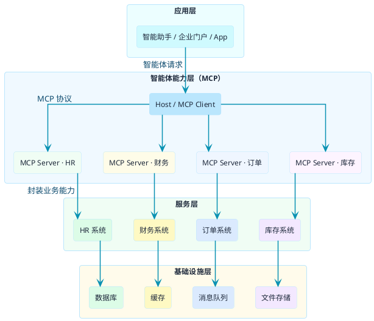

import VipInline from '@site/src/components/VipInline';

# MCP与相关技术的关系

当你开始在项目中引入MCP时，可能会遇到这样的疑问：

- "我们已经有RPC框架了，还需要MCP吗？"
- "MCP和我们现有的微服务架构怎么配合？"
- "听说还有个A2A协议，它和MCP什么关系？"

这些问题的本质是在问：**MCP在技术体系中处于什么位置，和其他技术是什么关系？**

要回答这个问题，我们需要先跳出来，从更宏观的视角看看整个技术图谱。

## 从企业IT架构看技术分层

想象一下一家中型企业的IT系统架构，通常会有这几层：

**基础设施层**：服务器、数据库、消息队列、缓存等

**服务层**：各种业务系统，HR系统、财务系统、订单系统、库存系统等

**集成层**：让各个系统能够互相通信的中间件，比如API网关、ESB（企业服务总线）

**应用层**：面向最终用户的应用，比如企业门户、移动App、智能助手等

现在的问题是：当你要在这个架构里加入一个智能助手，让它能够调用各种后端系统的能力时，该怎么办？

传统做法是在集成层做适配——针对每个系统写一套对接代码。HR系统是HTTP接口就写HTTP调用，财务系统是Dubbo就写Dubbo调用，订单系统是gRPC就写gRPC调用。

:::info MCP 的核心定位
MCP提供了另一种思路：**在服务层和应用层之间加一个"智能体能力层"**。各个后端系统把自己的能力封装成MCP Server，智能助手通过统一的MCP协议来调用，不用再针对每个系统单独适配。
:::

理解了这个定位，我们再来看MCP和其他技术的关系就清楚多了。

<VipInline />
