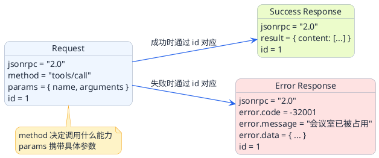
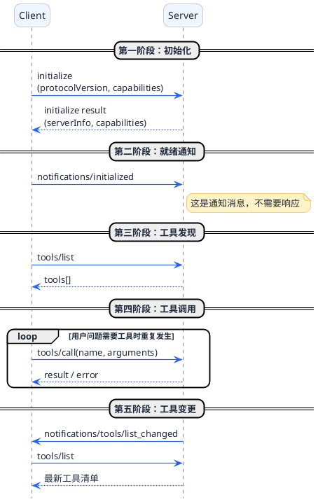

# 深入MCP通信机制

在设计一个通信协议时，有很多选择：RESTful API、GraphQL、gRPC、自定义二进制协议......MCP最终选择了JSON-RPC。这个选择背后有什么考量？

先来看看JSON-RPC的几个特点：

**极简主义**

JSON-RPC的核心理念是"只做一件事"：调用远程方法。不像RESTful API那样需要关心资源路径、HTTP方法（GET/POST/PUT/DELETE）、状态码含义，JSON-RPC就三个要素：方法名、参数、响应。

**语言无关**

JSON是几乎所有编程语言都支持的格式。Java能解析、Python能解析、JavaScript能解析、Go也能解析。这对MCP很重要——它要让各种语言写的工具服务能够互通。

**人类可读**

和二进制协议相比，JSON是文本格式，用眼睛就能看懂。调试的时候，直接看请求响应的JSON内容，比看一堆二进制字节方便太多了。

这几个特点恰好契合MCP的需求：
- 跨语言互通是MCP的核心目标
- 智能体场景下调试很重要，可读性有价值
- MCP不追求极致性能，简单够用就行

## 像对讲机一样理解JSON-RPC

JSON-RPC的通信模式可以用对讲机来类比。

想象两个人用对讲机通话：

**一问一答模式**

甲按下发送键说："小王，仓库还有多少矿泉水？Over。"（请求）

乙收到后按发送键回复："收到，库存还有50箱。Over。"（响应）

每次通话都是独立的，对讲机不记录之前说过什么。这就是JSON-RPC的"无状态"特性。

**统一的沟通格式**

为了高效沟通，他们约定了固定的格式：
- 先说对方名字（方法名）
- 再说具体问题（参数）
- 最后说"Over"表示结束

JSON-RPC也有固定的格式，所有请求和响应都按照约定的结构来。

## JSON-RPC报文结构详解

### 请求报文

当Client想调用Server的某个功能时，发送的请求长这样：

```json
{
  "jsonrpc": "2.0",
  "method": "tools/call",
  "params": {
    "name": "bookMeetingRoom",
    "arguments": {
      "roomId": "A301",
      "date": "2025-03-15",
      "startTime": "14:00",
      "endTime": "16:00"
    }
  },
  "id": 1
}
```

逐个字段解释：

| 字段 | 含义 | 说明 |
|------|------|------|
| jsonrpc | 协议版本 | 固定写"2.0"，表示使用JSON-RPC 2.0版本 |
| method | 方法名 | 想要调用的功能，MCP里常见的有`tools/call`、`tools/list`等 |
| params | 参数 | 调用方法需要的数据，结构根据不同方法而定 |
| id | 请求标识 | 一个唯一编号，用来匹配响应。就像快递单号，发出去之后根据这个号找回复 |

### 响应报文

Server处理完请求后，返回的响应：

```json
{
  "jsonrpc": "2.0",
  "result": {
    "content": [
      {
        "type": "text",
        "text": "会议室A301已预订成功，时间：2025-03-15 14:00-16:00"
      }
    ]
  },
  "id": 1
}
```

注意`id`字段的值是1，和请求的id一样。这样Client收到响应后，就知道这是对哪个请求的回复。

### 错误响应

如果执行失败，返回的结构会不一样：

```json
{
  "jsonrpc": "2.0",
  "error": {
    "code": -32001,
    "message": "会议室已被占用",
    "data": {
      "conflictTime": "14:00-15:00",
      "bookedBy": "张三"
    }
  },
  "id": 1
}
```

错误对象包含：
- `code`：错误码，有一些标准定义的错误码，也可以自定义
- `message`：错误信息，人类可读的描述
- `data`：可选，附加的错误详情

常见的标准错误码：

| 错误码 | 含义 |
|--------|------|
| -32700 | 解析错误，JSON格式不对 |
| -32600 | 无效请求，缺少必要字段 |
| -32601 | 方法不存在 |
| -32602 | 参数错误 |
| -32603 | 内部错误 |



## MCP通信的完整生命周期

了解了基本的报文结构，我们来看MCP Client和Server之间完整的交互流程。可以用"线下会议流程"来类比：

### 第一阶段：签到入场（初始化）

会议开始前，参会者要先签到，确认身份、领取资料。

MCP也一样，Client连接Server后的第一件事就是"初始化"。Client发送初始化请求，告诉Server自己是谁、支持什么能力：

```json
{
  "jsonrpc": "2.0",
  "method": "initialize",
  "params": {
    "protocolVersion": "2024-11-05",
    "clientInfo": {
      "name": "SmartAssistant",
      "version": "1.0.0"
    },
    "capabilities": {
      "roots": { "listChanged": true }
    }
  },
  "id": 1
}
```

Server收到后，返回自己的信息和能力：

```json
{
  "jsonrpc": "2.0",
  "result": {
    "protocolVersion": "2024-11-05",
    "serverInfo": {
      "name": "OfficeTool",
      "version": "2.0.0"
    },
    "capabilities": {
      "tools": { "listChanged": true }
    }
  },
  "id": 1
}
```

这一步双方确认了协议版本、相互知道对方是谁、了解对方支持什么功能。

### 第二阶段：确认就位（就绪通知）

签到完成后，参会者找到座位坐好，向会务组确认"我准备好了"。

MCP里，Client初始化成功后，要发送一个通知告诉Server自己已就绪：

```json
{
  "jsonrpc": "2.0",
  "method": "notifications/initialized"
}
```

注意这个报文没有`id`字段。这是JSON-RPC的"通知"类型——不需要响应，就是单向告知。

**重要提示**：如果跳过这一步，Server会认为Client还没准备好，后续的工具调用请求可能会被拒绝。

:::warning 不要跳过就绪通知
`notifications/initialized` 这条通知没有 `id` 字段，属于单向告知，不需要等待响应。但它是**必须发送的**——跳过这一步会导致后续 `tools/call` 被 Server 拒绝。这是初始化流程中最容易遗漏的一步。
:::

### 第三阶段：索取议程（获取工具列表）

就位之后，参会者会问"今天讨论哪些议题"，拿到会议议程。

Client同样需要知道Server提供了哪些工具，发送工具列表请求：

```json
{
  "jsonrpc": "2.0",
  "method": "tools/list",
  "params": {},
  "id": 2
}
```

Server返回所有可用工具的清单：

```json
{
  "jsonrpc": "2.0",
  "result": {
    "tools": [
      {
        "name": "bookMeetingRoom",
        "description": "预订会议室，支持指定日期和时间段",
        "inputSchema": {
          "type": "object",
          "properties": {
            "roomId": { "type": "string", "description": "会议室编号" },
            "date": { "type": "string", "description": "日期，格式YYYY-MM-DD" },
            "startTime": { "type": "string", "description": "开始时间，格式HH:mm" },
            "endTime": { "type": "string", "description": "结束时间，格式HH:mm" }
          },
          "required": ["roomId", "date", "startTime", "endTime"]
        }
      },
      {
        "name": "queryRoomAvailability",
        "description": "查询会议室在指定日期的空闲时段",
        "inputSchema": {
          "type": "object",
          "properties": {
            "roomId": { "type": "string", "description": "会议室编号" },
            "date": { "type": "string", "description": "日期，格式YYYY-MM-DD" }
          },
          "required": ["roomId", "date"]
        }
      }
    ]
  },
  "id": 2
}
```

每个工具包含：
- `name`：工具的唯一标识
- `description`：功能描述，大模型靠这个理解工具的用途
- `inputSchema`：参数定义，用JSON Schema格式描述需要什么参数

:::info 工具描述的重要性
`description` 字段是大模型判断"该用哪个工具"的核心依据。描述越清晰、越具体，大模型选择工具的准确率越高。这是 MCP Server 开发中最值得认真对待的地方。
:::

这个工具列表会被发送给大模型，让它知道有哪些工具可以用。

### 第四阶段：讨论交流（调用工具）

议程确定后，开始正式讨论。参会者针对每个议题发言、交流观点。

这对应MCP中的工具调用阶段。当大模型决定使用某个工具时，Client发送调用请求：

```json
{
  "jsonrpc": "2.0",
  "method": "tools/call",
  "params": {
    "name": "queryRoomAvailability",
    "arguments": {
      "roomId": "A301",
      "date": "2025-03-15"
    }
  },
  "id": 3
}
```

Server执行工具逻辑，返回结果：

```json
{
  "jsonrpc": "2.0",
  "result": {
    "content": [
      {
        "type": "text",
        "text": "会议室A301在2025-03-15的空闲时段：09:00-10:00, 14:00-16:00, 17:00-18:00"
      }
    ]
  },
  "id": 3
}
```

这个阶段可能会有多次往返——用户提问、调用工具、返回结果、用户追问、再调用工具......

### 第五阶段：散会通知（工具变更）

会议进行中，如果议程有变化（临时增加或取消议题），会务组会通知大家。

MCP也支持工具列表的动态更新。如果Server增加、删除或修改了工具，会发送通知：

```json
{
  "jsonrpc": "2.0",
  "method": "notifications/tools/list_changed",
  "params": {}
}
```

Client收到这个通知后，应该重新调用`tools/list`来获取最新的工具列表。

## 用时序图梳理完整流程

把上面的五个阶段画成时序图：



## Batch批处理：一次发多个请求

JSON-RPC 2.0有一个很实用的特性：Batch批处理。当你需要同时获取多个信息时，不用一个个发请求，可以打包一起发，减少网络往返。

### Batch的基本用法

客户端发送一个Array，里面包含多个Request对象：

```json
[
  {"jsonrpc": "2.0", "method": "tools/list", "id": 1},
  {"jsonrpc": "2.0", "method": "resources/list", "id": 2},
  {"jsonrpc": "2.0", "method": "prompts/list", "id": 3}
]
```

服务端可以并行处理这些请求，然后返回一个Array，包含对应的Response：

```json
[
  {"jsonrpc": "2.0", "result": {"tools": [...]}, "id": 1},
  {"jsonrpc": "2.0", "result": {"resources": [...]}, "id": 2},
  {"jsonrpc": "2.0", "result": {"prompts": [...]}, "id": 3}
]
```

这里有几个重要规则：

- **响应顺序不保证**：Server可以按任意顺序返回响应，Client通过`id`匹配
- **Notification不返回Response**：如果Batch里有没有`id`的请求，那些不会有对应的响应
- **空Array是无效请求**：发`[]`会收到Invalid Request错误

:::caution Batch 使用注意
Batch 中的响应顺序不保证与请求顺序一致，必须通过 `id` 字段匹配请求和响应。另外，发送空数组 `[]` 会触发 `-32600 Invalid Request` 错误。
:::

### 混合Request和Notification

```json
[
  {"jsonrpc": "2.0", "method": "queryStock", "params": {"itemId": "SKU001"}, "id": "1"},
  {"jsonrpc": "2.0", "method": "logAccess", "params": {"action": "view"}},
  {"jsonrpc": "2.0", "method": "queryPrice", "params": {"itemId": "SKU001"}, "id": "2"}
]
```

响应只有两个（因为`logAccess`是Notification，没有id）：

```json
[
  {"jsonrpc": "2.0", "result": {"stock": 100}, "id": "1"},
  {"jsonrpc": "2.0", "result": {"price": 99.9}, "id": "2"}
]
```

### 全是Notification的情况

如果Batch里全是Notification（没有任何id），服务端**不返回JSON-RPC响应**。HTTP场景下通常返回`204 No Content`。


## 错误码分层：协议错误 vs 业务错误

实际项目中，建议把错误码分三层：

| 分层 | 错误码范围 | 使用场景 |
|------|----------|----------|
| 协议层 | -32768 到 -32600 | JSON解析错误、方法不存在、参数无效等 |
| 基础设施层 | -32099 到 -32000 | 数据库连接失败、Redis超时、消息队列异常 |
| 业务层 | 正数，如1000+ | 用户不存在、余额不足、订单已关闭等 |

举个例子：

| 错误码 | 含义 | 层级 |
|--------|------|------|
| -32700 | JSON解析失败 | 协议层 |
| -32601 | 方法不存在 | 协议层 |
| -32602 | 参数无效 | 协议层 |
| -32001 | 数据库连接失败 | 基础设施层 |
| 1001 | 用户不存在 | 业务层 |
| 2001 | 余额不足 | 业务层 |

## 工程落地建议

JSON-RPC只定义了消息格式，实际项目中还需要补齐这些能力：

:::tip 工程落地必备清单
JSON-RPC 本身只负责消息格式，以下几项需要在实际项目中自行补全：超时与重试策略（幂等查询可重试，支付类操作谨慎重试）、基于 `id` 的幂等去重、链路追踪（Trace ID 贯穿全链）、协议层 + 业务层两层输入校验。
:::

### 超时与重试

**客户端策略**：
- 设置合理的超时时间，不要无限等待
- **幂等方法可以重试**（如查询），非幂等方法谨慎（如创建、支付）
- 重试用**指数退避**（第一次等1秒，第二次2秒，第三次4秒）
- 重试时**保持相同的id**，方便服务端去重

:::warning 非幂等操作不能随意重试
创建、支付、预订等非幂等操作重试时务必配合服务端去重。重试时保持相同的 `id`，让服务端通过缓存检查是否已处理过，防止重复执行。
:::

**服务端策略**：
- 设置方法执行超时，防止慢查询拖垮服务
- 超时后返回`-32000 Server error`或自定义错误码

### 幂等与去重

客户端重试时，服务端可能收到重复请求。可以根据`id`字段做去重：

```java
String requestId = request.getString("id");
if (cache.has(requestId)) {
    return cache.get(requestId); // 返回缓存的响应
}
Response response = executeMethod(request);
cache.set(requestId, response, 300); // 缓存5分钟
return response;
```

### 日志与链路追踪

建议记录每次调用的关键信息：
- 请求ID、方法名、参数（敏感信息脱敏）
- 响应结果或错误、执行耗时
- Trace ID（用于跨服务关联日志）

```java
logger.info("JSON-RPC: traceId={}, id={}, method={}, duration={}ms",
    traceId, request.get("id"), request.get("method"), duration);
```

### 输入校验

分两层校验：

**协议层校验**：
- `jsonrpc`是否存在且等于`"2.0"`
- `method`是否是String
- `params`是否为Object或Array

**业务层校验**：
- 参数类型、范围是否合法
- 必填参数是否存在
- 参数长度限制（防止超大JSON攻击）

## 实战：抓包看真实的MCP通信

理论说完了，来点实际的。如果你想亲眼看到MCP的JSON-RPC通信内容，可以用日志或抓包工具。

假设你有一个运行中的MCP Server（HTTP模式），用浏览器的开发者工具或者Postman就能看到请求和响应。

**初始化请求示例**

```http
POST /mcp HTTP/1.1
Host: localhost:8080
Content-Type: application/json
Accept: application/json, text/event-stream

{
  "jsonrpc": "2.0",
  "method": "initialize",
  "params": {
    "protocolVersion": "2024-11-05",
    "clientInfo": {
      "name": "TestClient",
      "version": "1.0.0"
    },
    "capabilities": {}
  },
  "id": 1
}
```

**工具调用请求示例**

```http
POST /mcp HTTP/1.1
Host: localhost:8080
Content-Type: application/json
Accept: application/json, text/event-stream
Mcp-Session-Id: a1b2c3d4-e5f6-7890-abcd-ef1234567890

{
  "jsonrpc": "2.0",
  "method": "tools/call",
  "params": {
    "name": "checkAttendance",
    "arguments": {
      "employeeId": "E12345",
      "month": "2025-03"
    }
  },
  "id": 5
}
```

注意请求头里多了一个`Mcp-Session-Id`，这是Streamable HTTP模式下用来关联会话的。

## 常见问题与排查

### 问题一：初始化后工具调用失败

**现象**：Client发送`tools/call`请求，Server返回错误。

**可能原因**：漏发了`notifications/initialized`通知。Server认为Client还没准备好，拒绝处理请求。

**解决**：确保初始化流程完整，收到initialize响应后发送initialized通知。

### 问题二：id不匹配导致响应处理错误

**现象**：发了多个请求，响应处理混乱。

**可能原因**：请求id重复或者没有正确匹配。

**解决**：每个请求使用唯一的id（可以用递增数字或UUID），收到响应后根据id匹配对应的请求。

### 问题三：解析错误-32700

**现象**：Server返回`{"error": {"code": -32700, "message": "Parse error"}}`

**可能原因**：发送的JSON格式有问题，比如少了逗号、引号不配对等。

**解决**：用JSON校验工具检查请求内容的格式是否正确。

## 小结

这一篇我们深入了解了MCP底层的JSON-RPC通信机制：

1. **为什么选JSON-RPC**：简单、跨语言、可读性好
2. **报文结构**：请求包含jsonrpc、method、params、id；响应包含result或error
3. **完整生命周期**：初始化→就绪通知→获取工具列表→调用工具→处理变更通知
4. **实战调试**：通过HTTP抓包可以直观看到通信内容

理解了数据层（JSON-RPC）怎么工作，下一篇我们来看传输层——MCP支持的三种传输模式（Stdio、SSE、Streamable HTTP）各有什么特点，该怎么选择。
